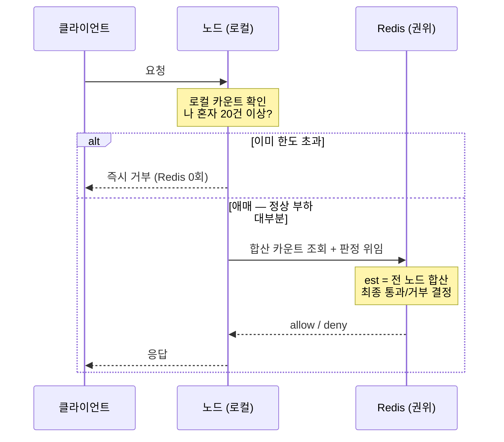
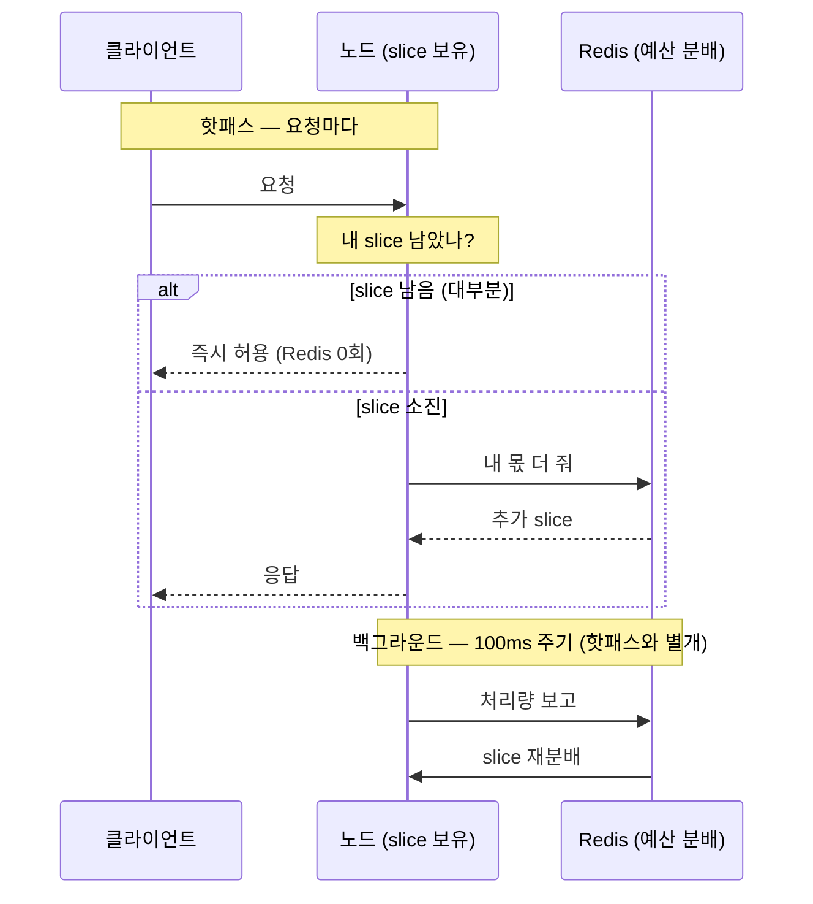

### 어떠한 처리율 제한 알고리즘을 사용할 것인가 ?

- 토큰 버킷 알고리즘과 이동 윈도우 카운터 알고리즘에 대해서 고민
- 토큰 버킷 알고리즘에서 토큰 버킷이란 지정된 용량을 갖는 컨테이너다.  각 요청이 처리될 때마다, 하나의 토큰을 사용한다. 요청이 도착하면, 충분한 토큰이 있으면 시스템에 전달하고, 충분한 토큰이 없으면, 버려지게 되는 경우.
- 토큰 버킷 알고리즘은 2개의 인자를 받는다.
    - 버킷 크기 : 버킷에 담을 수 있는 토큰의 최대 개수
    - 토큰 공급률 : 초당 몇개의 토큰이 버킷에 공급되는 가?
- 장점 - 구현이 쉽고, 메모리 사용 측면에서 효율적

- 이동 윈도우 카운터 알고리즘.
- 현재 1초간의 요청 수 + 직전 1초간의 요청 수 *이동 윈도와 직전 1초가 겹치는 비율
- 짧은 시간에 몰리는 트래픽에도 잘 대응한다.
- 직전 시간대에 도착한 요청이 균등하게 분포되어 있다고 가정한 상태에서, 추정치를 계산하기 때문에  느슨하다고 생각이 들지만, 시스템의 실제 상태와 맞지 않게  허용되거나 버려진 요청은 0.03%
- 이동 윈도우 카운터 알고리즘이 낫다고 느낌. 대규모 시스템이므로, 토큰에서 발생할 수 있는 최대 (  버킷 크기 + 토큰 공급률 ) 이 작다고 느껴질 수도 있지만, 이게 여럿이 모이면, 서버에 큰 부하가 될 수 도 있다고 생각함.

### 여러 서버로 처리되는 경우에 따른 동시성 이슈

- Redis 의 중앙 저장소를 만들고,
- LuaScript 또는 Sorted Set 을  이용하여 해결

---

### 정말로 이게 최선인가 ?

- Rate Limiter 에서 중요한 것은 무엇인가 ?
- 실제로 정의한 그만큼만 들어오는 게 중요한 것인 가?
- API Gateway 에서 정체 없이 빠르게 처리되는 게 더 중요한 것인가 ?
- 도메인에 따라서 나뉘지 않을까 싶다.

### Local + Global 2계층 — 정확히 어떻게 계산하나

> 로컬은 "이 노드 한 대가 본 요청"만 안다. 글로벌은 "전 노드 합산"을 안다.
로컬은 빠르지만 부분만 보고, 글로벌은 전체를 보지만 느리다. 2계층은 이 둘을 어떻게 조합하느냐의 문제다.
>

## 모델 A - "일단 Redis에 물어보되, 명백한 초과만 미리 쳐낸다"

요청이 들어오면 노드는 먼저 **자기 로컬 카운트만** 본다. 여기서 내릴 수 있는 판단은 단 하나: *"나 이 노드 혼자서 이미 전체 한도(20)를 넘겼나?"*

- 넘겼으면 → **즉시 거부**. Redis 안 간다.
- 안 넘겼으면(정상 상황에선 거의 다 여기) → **Redis로 위임**.

그리고 진짜 통과/거부 판정은 **항상 Redis가** 내린다. Redis는 전 노드가 올린 카운트를 합산한 값(슬라이딩 윈도우 추정 `est`)으로 최종 결정하니까 이게 **권위**다.

→ 즉 로컬은 그냥 **거름망**이다. "누가 봐도 초과인 트래픽"만 걸러서 Redis를 보호할 뿐, 실제 판단은 안 한다. 그래서 **정확하지만(오버슈트 거의 0) 정상 부하에서도 거의 매 요청이 Redis를 친다** → RTT를 못 없앤다.

> 정상 트래픽은 거의 다 아래 `else`로 빠져 **매번 Redis를 친다** → 이게 "느린 이유".
>

## 모델 B - "내 몫 안이면 Redis한테 안 물어본다"

중앙이 한도 20을 노드들에게 **미리 쪼개서 나눠준다** (slice, 예: 3노드면 각자 6~7장).

요청이 들어오면 노드는 **자기 slice가 남았는지만** 본다.

- 남았으면 → **즉시 허용**. Redis 안 간다.
- 다 썼으면 → 그때 Redis에 "내 몫 더 줘" 요청.

노드들은 별도로 **주기적으로(100ms마다 등)** 자기가 처리한 수를 Redis에 보고하고, Redis는 그걸 합산해서 **남은 예산을 바쁜 노드에 재분배**한다.

→ 핫패스에서 **Redis를 아예 안 친다** → 빠름. 대신 노드가 들고 있는 정보가 "살짝 과거"라 **오버슈트(한도 초과)가 생길 수 있다** (오버슈트 폭 ≈ 동기화 주기 × 노드 수). 그리고 LB가 불균등하면 한 노드만 slice 소진하고 나머진 노는 사태가 나서 → **동적 재분배가 필수**다.

> 핫패스(요청마다)에선 Redis 화살표가 거의 안 생기고, Redis 통신은 백그라운드로 분리된다 → "빠르지만 정보가 살짝 과거 → 오버슈트".
>

## 비유로 한 방에

- **모델 A** = 매번 본사에 전화해서 승인받는 방식. 단, "이미 내 책상에 쌓인 게 한도 넘으면" 전화 안 하고 바로 반려. → 정확하지만 전화를 계속 함.
- **모델 B** = 본사가 아침에 "넌 오늘 6건까지 OK" 쿠폰을 미리 나눠줌. 쿠폰 있으면 본사 안 물어보고 바로 처리, 떨어지면 그때 더 달라고 전화. 본사는 가끔 누가 많이 썼나 보고 쿠폰을 다시 분배. → 빠르지만 정보가 약간 늦어서 살짝 넘칠 수 있음.

> **핵심 한 줄**: A는 Redis가 매번 답하니 정확하지만 느리고, B는 Redis를 가끔만 부르니 빠르지만 근사다.
한도를 빡빡하게 지켜야 하면 A, 정상 부하 보호가 목적이면 B.
>

---