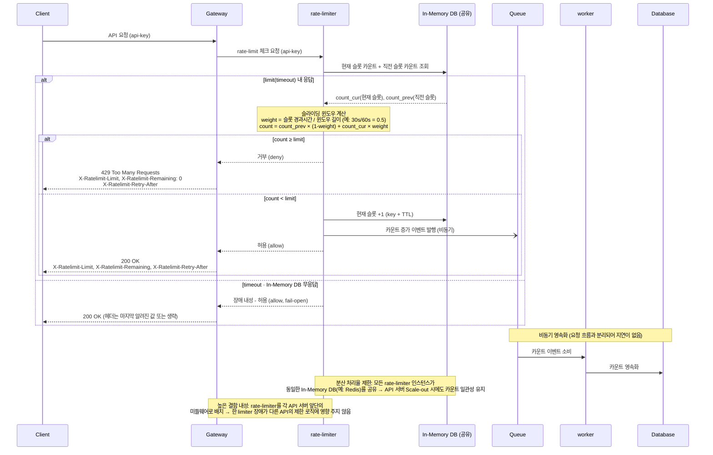

## 2차 설계 보완
> 설정된 처리율을 초과하는 요청은 정확하게 제한한다.  
> 낮은 응답시간: 이 처리율 제한 장치는 HTTP 응답시간에 나쁜 영향을 주어서는 곤란하다.  
> 가능한 한 적은 메모리를 써야 한다.  
> 분산형 처리율 제한: 하나의 처리율 제한 장치를 여러 서버나 프로세스에서 공유할 수 있어야 한다.  
> 예외 처리: 요청이 제한되었을 대는 그 사실을 사용자에게 분명하게 보여주어야 한다.  
> 높은 결함 내성: 제한 장치에 장애가 생기더라도 전체 시스템에 영향을 주어서는 안 된다.  

### 요청 제한에 대해 사용자에게 가시적으로 안내
- X-Ratelimit-Remaining: 윈도우 내 잔여 요청 수
- X-Ratelimit-limit: 매 윈도우 마다 클라이언트가 전송할 수 있는 요청의 수
- X-Ratelimit-Retry-After: 한도 제한에 걸리지 않으려면 몇 초 뒤에 요청을 다시 보내야 하는지 알림
### 슬라이딩 윈도우
가정: 제한이 Limit 1분

기존: 요청을 수집하여 현재 요청이 들어오는 시점 기준으로 1분 내 토큰의 수를 카운팅하여 요청의 허용 여부를 결정
책에서 제한 하는 방법: 1분이라는 슬롯 기준으로 현재 슬롯의 요청횟수와 직전 슬롯의 요청 횟수를 비율로 계산하여 횟수를 결정
1분의 1/2이지난(1:30 시점)에서는 직전 1분의 뒤에 30초 내 요청수 * 0.5 + 현재 요청수 * 0.5로 하여 비율 계산

### 높은 결함 내성
MSA 환경에서 rate limiter의 장애로 다른 모든 API에 대한 Rate Limit이 동작하지 않으면 안되기 때문에 middle ware로 api서버 별로 앞단에 위치시키는 것이 적합해보인다

### 분산형 처리율 제한
in-memory DB를 활용하여 하나의 DB를 rate limiter 들이 공유하여 사용하게하면 MSA 환경에서 Scale Out 시에도 문제 없음

## Sequence Diagram

