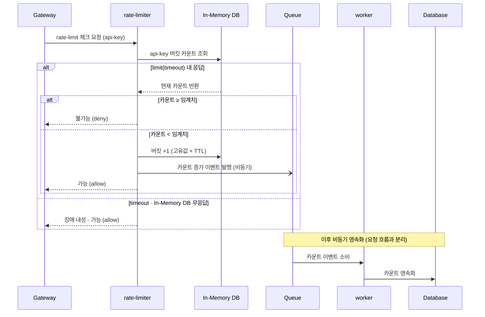

## 요구사항
> 설정된 처리율을 초과하는 요청은 정확하게 제한한다.  
> 낮은 응답시간: 이 처리율 제한 장치는 HTTP 응답시간에 나쁜 영향을 주어서는 곤란하다.  
> 가능한 한 적은 메모리를 써야 한다.  
> 분산형 처리율 제한: 하나의 처리율 제한 장치를 여러 서버나 프로세스에서 공유할 수 있어야 한다.  
> 예외 처리: 요청이 제한되었을 대는 그 사실을 사용자에게 분명하게 보여주어야 한다.  
> 높은 결함 내성: 제한 장치에 장애가 생기더라도 전체 시스템에 영향을 주어서는 안 된다.  

## 설계

## Sequence Diagram

## 설계 이유
- in-memory 사용으로 접근 속도 보장
- message queue를 활용하여 사용자의 접근 결과를 비동기적으로 영속화
- gateway에서 rate-limiter에 요청과 응답 사이에 요청 대기 시간 제한으로 서비스에 영향 최소화(rate-limiter 실패 시에는 원래 api 그대로 호출 서비스 가용성 보장)
