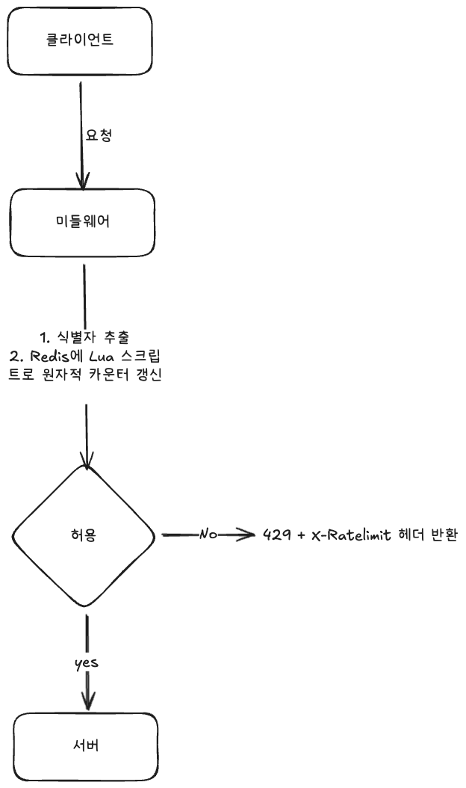

# 처리율 제한 장치(Rate Limiter) 설계

## 0. 요구사항 정리

| # | 요구사항       | 기준                                               |
|---|------------|--------------------------------------------------|
| 1 | 정확한 제한     | 설정된 처리율을 초과하는 요청은 정확히 차단                         |
| 2 | 빠른 응답 시간   | 제한 검사가 HTTP 응답 지연에 거의 영향을 주지 않아야 함 (p99 추가 지연 최소) |
| 3 | 적은 메모리 사용량 | 사용자·규칙 수가 많아도 메모리 사용량이 작아야 함                     |
| 4 | 분산형 제한     | 여러 서버·프로세스가 하나의 제한 상태를 공유                        |
| 5 | 예외 처리      | 제한 시 사용자에게 명확히 통지                    |
| 6 | 높은 결함 감내성  | 제한 장치 장애가 전체 시스템으로 번지지 않아야 함                     |

---

## 1. 설계 방향: 요구사항별 핵심 기법

| 요구사항 | 핵심 기법 |
|---|---|
| 1 정확한 제한 | 처리율 제한 알고리즘 선택(토큰 버킷 / 이동 윈도) |
| 2 낮은 응답 시간 | 인메모리 캐시(Redis), 미들웨어 단계에서 조기 차단 |
| 3 적은 메모리 | 카운터 기반 알고리즘 + TTL 자동 만료 |
| 4 분산형 제한 | 중앙 집중식 저장소(Redis) + 원자적 연산(Lua/INCR) |
| 5 예외 처리 | `429 Too Many Requests` + `X-Ratelimit-*` 헤더 |
| 6 결함 감내성 | Fail-open 정책, Redis 다중화 |

---

## 2. 어디에 둘 것인가 - 배치 위치

| 선택지 | 내용                                              |
|---|-------------------------------------------------|
| 클라이언트 측 | 위·변조가 쉬워 신뢰 불가 -> x                             |
| 서버 측 | 비즈니스 로직에 결합되고, 서버마다 중복 구현                       |
| **API Gateway / 미들웨어** | **요청이 비즈니스 로직에 닿기 전 차단 -> 요구사항 2(빠른 응답 시간) 유리** |

| 항목 | 내용                                                                                                        |
|---|-----------------------------------------------------------------------------------------------------------|
| **선택지** | 애플리케이션 내부 vs **독립 미들웨어**                                                                                  |
| **고른 것** | **독립 미들웨어**                                                                                               |
| **포기한 것** | 애플리케이션이 가진 풍부한 컨텍스트(세분화된 비즈니스 규칙)                                                                         |
| **근거** | 게이트웨이에서 끊으면 모든 서비스가 공유하고, 차단된 요청이 백엔드 자원을 소모하지 않기 때문에 **지연, 부하 모두 이득**이다. 단, 인증과 사용자 식별이 게이트웨이에서 가능해야 한다. |

---

## 3. 알고리즘 선택

### 후보 비교

| 알고리즘 | 동작 | 장점 | 단점                                     |
|---|---|---|----------------------------------------|
| **토큰 버킷** | 버킷에 일정 속도로 토큰 충전, 요청마다 토큰 소비 | 짧은 버스트 허용, 구현 단순, 메모리 적음 | 버킷 크기, 충전율 튜닝 필요                       |
| 누출 버킷 | 고정 속도로 큐에서 요청 처리 | 처리율 안정적(일정 유출) | 버스트 흡수 어려움, 큐가 오래된 요청으로 채워질 수 있음       |
| 고정 윈도 카운터 | 시간 창마다 카운트 | 구현 매우 단순, 메모리 적음 | **경계(boundary)에서 최대 2배 트래픽 허용**        |
| 이동 윈도 로그 | 요청 타임스탬프 전부 기록 | 정확함 | **메모리 다량 소모**(거부된 요청도 기록) -> 요구사항 3 위배 |
| **이동 윈도 카운터** | 현재 창 + 직전 창 가중 평균 | 경계 문제 완화, 메모리 적음 | 근사치(완벽히 정확하진 않음)                       |

### 결정

| 항목 | 내용 |
|---|---|
| **선택지** | 토큰 버킷 vs 이동 윈도 카운터 (이동 윈도 로그는 메모리 때문에 제외) |
| **고른 것** | **토큰 버킷** (기본), 정밀 경계 제어가 필요한 규칙엔 이동 윈도 카운터 |
| **포기한 것** | 이동 윈도 로그의 완전한 정확성 |
| **근거** | **요구사항 3(적은 메모리)** 탓에 요청 단위로 로그를 남기는 방식은 탈락했다. 토큰 버킷은 사용자당 `토큰 수 + 마지막 갱신 시각` 두 값만 저장하므로 메모리가 최소다. 버스트 허용도 실서비스에 자연스럽다. 고정 윈도의 경계 폭증이 문제 되는 규칙만 이동 윈도 카운터로 보완한다. |

---

## 4. 분산 환경 - 상태 공유 (요구사항 4)

**문제**: 서버가 여러 대면 각자 로컬 카운터를 쓸 수 없다. 각 서버가 한도를 따로 계산해 전체 한도가 N배 초과되기 때문이다.

**해결**: 중앙 집중식 인메모리 저장소 **Redis**.
- `INCR` + `EXPIRE`로 카운터를 관리하고 TTL로 자동 만료시키면 **요구사항 3(메모리)** 도 함께 충족한다.
- 토큰 버킷, 이동 윈도 갱신은 **읽기→계산→쓰기**가 여러 단계라 race condition이 생긴다.

### Race Condition 처리

| 선택지 | 내용                                        |
|---|-------------------------------------------|
| Lock | 정확하지만 지연 증가 -> 요구사항 2 위배                  |
| **Lua 스크립트(서버 측 원자 실행)** | Redis가 단일 스레드로 스크립트를 원자 실행 -> 락 없이 원자성 지원 |
| INCR 단순 활용(고정 윈도) | 가장 가벼움, 단 토큰 버킷 같은 복합 연산엔 부족              |

| 항목 | 내용                                                                                                    |
|---|-------------------------------------------------------------------------------------------------------|
| **고른 것** | **Redis + Lua 스크립트**                                                                                  |
| **포기한 것** | 구현 단순함(스크립트 관리 부담)                                                                                    |
| **근거** | 분산 락은 네트워크 왕복 때문에 **지연(요구사항 2)** 이 커진다. Lua 스크립트는 한 번의 왕복으로 원자적으로 갱신해 정확성(1)·지연(2)·분산(4)을 한꺼번에 만족시킨다. |

---

## 5. 예외 처리 - 사용자 통지 (요구사항 5)

- 제한 초과 시 HTTP **`429 Too Many Requests`** 반환.
- 응답 헤더로 상태 노출:

| 헤더 | 의미 |
|---|---|
| `X-Ratelimit-Limit` | 시간당 허용 요청 수 |
| `X-Ratelimit-Remaining` | 남은 허용 요청 수 |
| `X-Ratelimit-Retry-After` | 몇 초 뒤 재시도 가능한지 |

- 초과 요청을 **메시지 큐에 적재한 뒤 지연 처리**하는 방법도 있다. 다만 본 설계는 "정확히 제한"이 우선이므로 기본은 즉시 거부로 둔다.

---

## 6. 결함 감내성 (요구사항 6)

| 위험 | 대응 |
|---|---|
| Redis 장애로 제한 검사 불가 | **Fail-open**: 제한 장치가 죽으면 요청을 통과시켜 전체 서비스 마비 방지 |
| Redis 단일 장애점(SPOF) | 마스터-복제(Replication) + Sentinel/Cluster로 다중화 |
| Redis 지연으로 응답 시간 악화 | 타임아웃 짧게 + 로컬 캐시(근사 제한)로 폴백 |

| 항목 | 내용                                                                                                                                                                          |
|---|-----------------------------------------------------------------------------------------------------------------------------------------------------------------------------|
| **선택지** | Fail-open vs Fail-closed                                                                                                                                                    |
| **고른 것** | **Fail-open**                                                                                                                                                               |
| **포기한 것** | 장애 순간의 엄격한 제한 정확성                                                                                                                                                           |
| **근거** | **요구사항 6(결함 감내성)** 의 핵심은 "제한 장치 장애 != 전체 장애"다. 제한은 보호 장치이지 서비스 본체가 아니므로, 장애 때 잠깐 한도를 넘기더라도 **요청을 통과**시키는 쪽이 안전하다. (단, 결제·인증처럼 남용 위험이 큰 엔드포인트는 예외적으로 fail-closed를 고려할 수 있다.) |

---

## 7. 처리율 제한 규칙(Rule) 관리

- 규칙은 설정 파일·DB에 정의해 디스크에 저장하고, 워커가 주기적으로 캐시에 로드한다.
- 식별 단위는 IP, 사용자 ID, API 키, 엔드포인트 등을 조합할 수 있다.

---

## 8. 전체 흐름

Redis 장애 시 → 미들웨어는 타임아웃 후 **통과(fail-open)** + 알람.

---

## 9. 요구사항 충족 요약

| # | 요구사항 | 충족 방법 |
|---|---|---|
| 1 | 정확한 제한 | 토큰 버킷/이동 윈도 + Redis 원자 연산 |
| 2 | 낮은 응답 시간 | 인메모리 Redis, 게이트웨이 조기 차단, Lua 단일 왕복 |
| 3 | 적은 메모리 | 카운터 2~3개 값만 저장 + TTL 자동 만료 |
| 4 | 분산형 제한 | 중앙 Redis로 상태 공유, Lua로 경쟁 조건 제거 |
| 5 | 예외 처리 | `429` + `X-Ratelimit-*` 헤더 |
| 6 | 결함 감내성 | Fail-open + Redis 다중화 |

---

## 10. 토론 질문

1. Fail-open은 장애 때 남용에 노출된다. 엔드포인트별로 open/closed 정책을 다르게 가져가는 게 맞을까?
2. 이동 윈도 로그는 메모리 때문에 제외했지만 "정확히 제한(요구사항 1)"과 부딪치는 면이 있다. 근사치 알고리즘을 어디까지 허용할 것인가?
