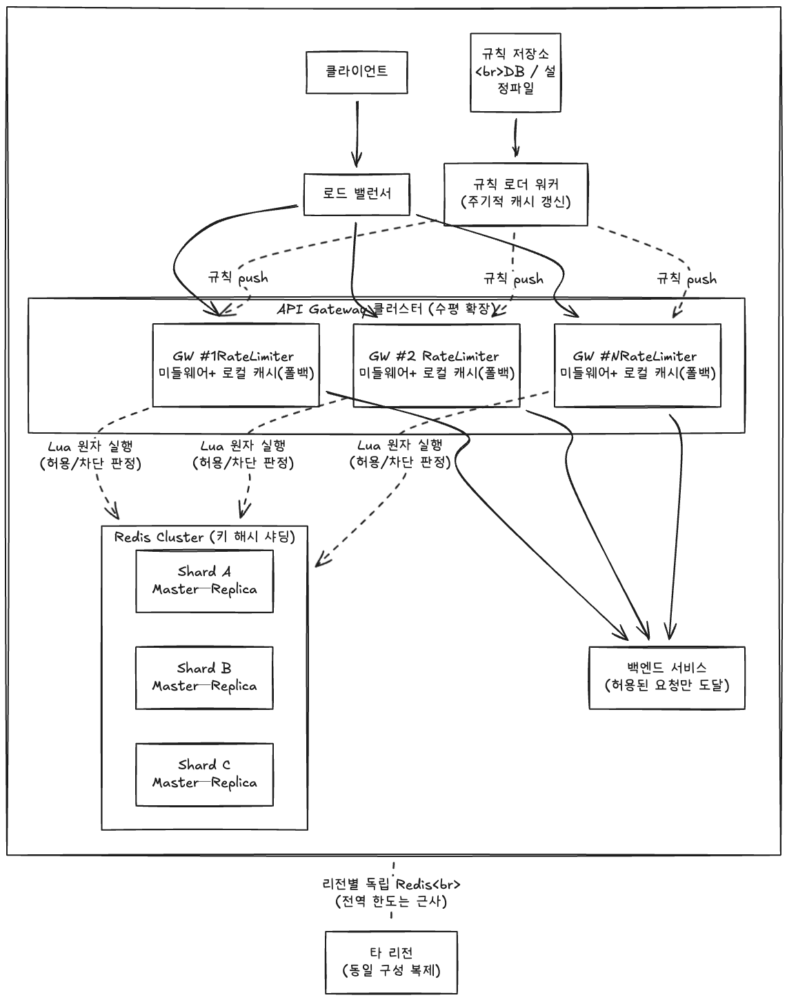

# 처리율 제한 장치(Rate Limiter) 상세 설계 - 2주차 보완

> 1주차([week1-initial-design.md](week1-initial-design.md))에서 정한 방향
> (게이트웨이 배치 · 토큰 버킷 · Redis+Lua · Fail-open)을 전제로,
> 상세 설계 구체화, 규모 추정, 운영·모니터링 보강

---

## 1. 고민포인트

### Q1. Fail-open은 장애 때 남용에 노출되는데, 엔드포인트별로 open/closed 정책을 다르게 가져가는 게 맞을까?

**결론: yes. 단일 정책이 아니라 엔드포인트 위험도에 따른 2단계 정책으로 간다.**

| 등급 | 대상 엔드포인트       | 장애 시 정책 | 근거 |
|---|----------------|---|---|
| 일반 | 조회/검색 등 멱등, 읽기 | **Fail-open** | 남용돼도 데이터 무결성 손상 없음. 가용성 우선 |
| 민감 | 로그인/결제/회원가입 등  | **Fail-closed(+ 로컬 폴백)** | 남용 비용이 큼. 차라리 막는 게 안전 |

| 항목 | 내용                                                                                                                                                                                                                                                                                                      |
|---|---------------------------------------------------------------------------------------------------------------------------------------------------------------------------------------------------------------------------------------------------------------------------------------------------------|
| **선택지** | 전역 단일 정책 vs **엔드포인트 등급별 정책**                                                                                                                                                                                                                                                                            |
| **고른 것** | **등급별 정책** — 규칙에 `fail_mode: open\|closed` 필드를 둬 규칙 단위로 선언                                                                                                                                                                                                                                              |
| **포기한 것** | 정책의 단순함                                                                                                                                                                                                                                                                                                 |
| **근거** | Fail-open의 본래 의도는 "제한 장치 장애가 전체 장애가 되지 않게" 하는 것이지만 결제, 인증은 남용 자체가 사고다. **위험도가 비용을 결정**하므로 정책도 위험도를 따라가야 한다. 다만 fail-closed라고 해서 Redis가 죽는 순간 모든 요청을 막아버리면 안 된다. 그래서 민감한 엔드포인트는 **각 게이트웨이 서버가 자기 메모리로 횟수를 세는 임시 제한**을 폴백으로 둔다. 서버끼리 공유를 못 해 정확하진 않지만, 한도를 서버 수로 나눠 보수적으로 잡으면 Redis 없이도 느슨하게라도 동작시킬 수 있다. |

### Q2. 이동 윈도 로그는 메모리 때문에 제외했지만 "요청 수를 정확히 제한한다"는 요구사항과 상충한다. 근사치 알고리즘을 어디까지 허용해야할까?

**결론: "정확히 제한"의 의미를 재정의한다. '절대적인 정확성'이 아니라 '허용 오차 내 제한'으로 요청 수를 정확히 제한한다.**

| 관점 | 내용                                                            |
|---|---------------------------------------------------------------|
| 오차의 정체 | 이동 윈도 카운터의 오차는 직전 윈도우 트래픽을 **균등 분포로 가정**하는 데서 온다. |
| 비즈니스 허용선 | 한도 100req/min에서 순간적으로 103~105가 통과해도 시스템 보호 목적은 달성됨            |
| 정확성이 꼭 필요한 곳 | 과금·쿼터처럼 **돈/계약과 직결**되는 한도                                     |

| 항목 | 내용                                                                                                                                                           |
|---|--------------------------------------------------------------------------------------------------------------------------------------------------------------|
| **선택지** | 전 규칙 정확(로그) vs **기본 근사(윈도 카운터) + 정밀 필요 규칙만 정확**                                                                                                              |
| **고른 것** | **기본 근사**. 과금·쿼터성 규칙에 한해 `precision: exact` 플래그로 이동 윈도 로그(또는 정렬셋 기반) 적용                                                                                      |
| **포기한 것** | 전 구간 단건 정확성                                                                                                                                                  |
| **근거** | 정확성은 공짜가 아니라 **메모리와 지연을 투입**해서 얻을 수 있다. 보호용 제한은 ±수 % 오차가 무해하므로 근사로 충분하고, 그 비용을 정밀함이 꼭 필요한 소수의 규칙에만 집중 투자한다. **"얼마나 정확해야 하는가"를 규칙이 선언**하게 만들어 정책을 데이터로 외부화한다. |

---

## 2. 상세 설계 구체화

### 2.1 Redis 키 구조

| 알고리즘 | 키 패턴 | 자료구조 | 값 | TTL |
|---|---|---|---|---|
| 토큰 버킷 | `rl:tb:{rule_id}:{dimension}` | Hash | `tokens`(잔여 토큰), `ts`(마지막 갱신 ms) | 버킷이 가득 차는 시간 × 2 |
| 이동 윈도 카운터 | `rl:swc:{rule_id}:{dimension}:{window}` | String(INCR) | 카운트 | 윈도 길이 × 2 |
| 이동 윈도 로그(정밀) | `rl:swl:{rule_id}:{dimension}` | Sorted Set | member=요청ID, score=ts | 윈도 길이 |

- `dimension` = 식별 단위 조합 해시(예: `uid:123`, `ip:1.2.3.4`, `apikey:abc#ep:/pay`).
- TTL을 윈도/충전 주기의 2배로 둬서 비활성 키가 자동 소멸하면서도 경계에서 조기 만료로 카운트가 리셋되는 일을 막는다 -> 적은 메모리 사용.

### 2.2 토큰 버킷 Lua 스크립트

```lua
-- KEYS[1] = rl:tb:{rule_id}:{dimension}
-- ARGV[1] = capacity(버킷 크기)
-- ARGV[2] = refill_rate(초당 충전 토큰)
-- ARGV[3] = now_ms(호출 시각)
-- ARGV[4] = requested(소비 토큰, 보통 1)

local bucket   = redis.call('HMGET', KEYS[1], 'tokens', 'ts')
local tokens   = tonumber(bucket[1])
local last_ts  = tonumber(bucket[2])
local capacity = tonumber(ARGV[1])
local rate     = tonumber(ARGV[2])
local now      = tonumber(ARGV[3])
local need     = tonumber(ARGV[4])

if tokens == nil then        -- 최초 요청: 버킷 가득 채워 시작
  tokens  = capacity
  last_ts = now
end

-- 경과한 시간만큼 토큰 충전
local delta   = math.max(0, now - last_ts) / 1000
tokens        = math.min(capacity, tokens + delta * rate)
last_ts       = now

local allowed = tokens >= need
if allowed then
  tokens = tokens - need
end

redis.call('HSET', KEYS[1], 'tokens', tokens, 'ts', last_ts)
redis.call('PEXPIRE', KEYS[1], math.ceil(capacity / rate * 1000) * 2)

-- allowed(1/0), 잔여 토큰, 재시도까지 ms
local retry_ms = allowed and 0 or math.ceil((need - tokens) / rate * 1000)
return { allowed and 1 or 0, tokens, retry_ms }
```

핵심: **읽기→충전 계산→차감→쓰기**를 한 번의 왕복에서 원자 실행 → 락 없이 race condition 제거.

### 2.3 규칙 스키마

```yaml
- rule_id: login_per_ip
  match:                      # 어떤 요청에 적용되는가
    endpoint: "POST /login"
    dimension: ["ip"]         # 식별 단위 조합
  algorithm: token_bucket
  capacity: 5                 # 버스트 5회
  refill_rate: 0.0833         # 분당 5회 = 초당 5/60
  fail_mode: closed           # 실패시 모드
  precision: approximate      # 근사치 허용 여부

- rule_id: billing_quota
  match:
    endpoint: "POST /charge"
    dimension: ["apikey"]
  algorithm: sliding_window_log
  limit: 1000
  window_sec: 86400
  fail_mode: closed
  precision: exact
```

- 규칙은 DB/설정파일에 저장 → 워커가 주기적으로 캐시에 로드.
- 한 요청에 여러 규칙이 매칭되면 **가장 엄격한 규칙이 우선**.

### 2.4 분산 아키텍처



**판정 흐름**

1. `LB`가 요청을 게이트웨이 인스턴스 중 하나로 분배.
2. 미들웨어가 매칭 규칙의 키(`rl:tb:{rule_id}:{dimension}`)로 `Redis Cluster`에 **Lua 스크립트 1회 왕복** → 허용/차단 판정.
3. 차단이면 `429` 즉시 반환(백엔드 미도달). 허용이면 백엔드로 전달.
4. **Redis 장애 시**: 규칙의 `fail_mode`에 따라 — 일반은 통과(fail-open), 민감은 **로컬 캐시 근사 제한**으로 폴백(fail-closed 효과).
5. `규칙 로더 워커`가 규칙 저장소를 주기적으로 읽어 각 게이트웨이의 로컬 규칙 캐시를 갱신(재배포 불필요).

---

## 3. 규모 추정

가정: 일일 활성 사용자 **1,000만**, 1인당 평균 **50 요청/일**, 게이트웨이가 전 요청을 검사.

| 항목 | 계산 | 결과                                           |
|---|---|----------------------------------------------|
| 평균 QPS | 1,000만 × 50 ÷ 86,400 | **≈ 5,800 QPS**                              |
| 피크 QPS | 평균 × 4(피크 계수) | **≈ 23,000 QPS**                             |
| Redis 요청 | 요청당 Lua 1회(=명령 1회 취급) | 피크 **≈ 23,000 ops/s**                        |
| 키당 메모리 | Hash(tokens+ts) + 오버헤드 | **≈ 100 B/key**                              |
| 동시 활성 키 | 활성 사용자 × 평균 규칙 3개 | 약 1,000만 × 3 = **3,000만 키**                  |
| 메모리 총량 | 3,000만 × 100 B | **≈ 3 GB** (TTL로 비활성 키 소멸 시 실제론 더 작을 것으로 예상) |

| 항목 | 결론                                                                                    |
|---|---------------------------------------------------------------------------------------|
| 단일 Redis 처리량 | 단일 노드도 ~10만 ops/s 처리 가능 → **처리량은 1노드로도 여유**                                           |
| 병목 | 처리량이 아니라 **가용성(SPOF)과 메모리**                                                           |
| 구성 | 마스터-복제 + Cluster. 메모리/내결함을 위해 샤딩은 **키 해시 기반 Cluster**로 수평 확장                          |
| 지연 예산 | 게이트웨이 ↔ Redis 동일 AZ RTT **< 1 ms**, Lua 실행 < 0.1 ms → **p99 추가 지연 목표 < 2 ms**(요구사항 2) |

---

## 4. 운영, 모니터링

### 4.1 메트릭

| 메트릭 | 의미 | 용도 |
|---|---|---|
| `ratelimit_decision_total{result=allow\|block}` | 허용/차단 건수 | 차단율 추이, 규칙 튜닝 |
| `ratelimit_redis_latency_ms` | Lua 호출 지연 | 요구사항 2 SLO 감시 |
| `ratelimit_fail_open_total` | Redis 장애로 통과시킨 건수 | 장애 노출 시간 정량화 |
| `ratelimit_rule_match_total{rule_id}` | 규칙별 적중 | 사문화된 규칙 탐지 |

### 4.2 알람

| 조건 | 의미 | 대응                 |
|---|---|--------------------|
| `fail_open_total > 0` (1분 지속) | Redis 장애 중 무방비 통과 | 온콜 호출, Redis 상태 점검 |
| `redis_latency_ms p99 > 5ms` | 지연 예산 초과 | 핫키/네트워크 점검         |
| 특정 dimension 차단율 급증 | 공격 또는 오설정 | 규칙, 트래픽 출처 확인      |