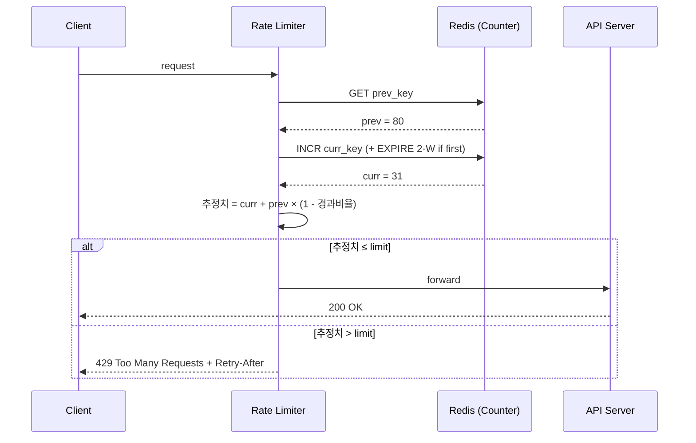
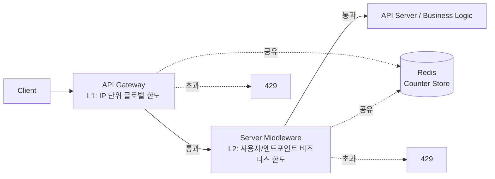

# [4장] 처리율 제한 장치 설계 — 1차 설계안 (Week 1)

> 책 해설(2단계 이후)을 보기 전에, 문제와 요구사항만 보고 직접 설계한다.
> 목적은 완성도가 아니라 **"왜 이렇게 설계했는지 설명할 수 있는 상태"**.
>
> - 작성자:
> - 작성일:

---

## 1차 설계 결정 요약

| 결정 축      | 선택                                                           | 근거 (요구사항 매핑)            |
| --------- | ------------------------------------------------------------ | ----------------------- |
| **알고리즘**  | 이동 윈도우 카운터 (Sliding Window Counter)                          | 요구사항 1(정확성) + 3(메모리) 균형 |
| **배치 위치** | API Gateway(L1) + Server Middleware(L2) 2층                   | 요구사항 6(결함 감내) 다층 방어     |
| **저장소**   | Redis + 윈도우당 키 + `INCR`/`EXPIRE` + TTL `2·W`                 | 요구사항 4(분산) + INCR 활용    |
| **응답 규약** | `429 Too Many Requests` + `Retry-After` + `X-RateLimit-*` 헤더 | 요구사항 5(사용자 알림)          |
| **장애 정책** | Fail-open 기본 + 보안 엔드포인트만 Fail-close, Sentinel + 로컬 fallback  | 요구사항 6(결함 감내) 정직 충족     |

---

## 1. 요구사항 정리

> 4장 요구사항을 내 말로 다시 해석해본다. 무엇을 중요하게 봤는지 표시.

1. **설정된 처리율을 초과하는 요청은 정확하게 제한한다.**
   - 클라이언트에서 서버로 넘어오는 일정량 이상의 요청들을 제한한다.
   - 분산 환경에서도 "정확하게" 보장되어야 한다 → 카운팅 정합성 문제로 직결됨.
2. **낮은 응답시간**: 이 처리율 제한 장치는 HTTP 응답시간에 나쁜 영향을 주어서는 곤란하다.
   - 일정량의 요청에 대해서도 응답이 빨라야 한다.
   - 제한 판단 로직 자체가 요청 경로상 최소 오버헤드여야 한다.
1. **가능한 적은 메모리.**
   - 분산되어있는 시스템을 제어하는 중앙 시스템으로 레디스 같은 인프라를 활용하는 경우, 가능한 적은 메모리로 처리율을 제한할 수 있어야 한다.
4. **분산형 처리율 제한** — 하나의 처리율 제한 장치를 여러 서버나 프로세스에서 공유할 수 있어야 한다.
   - 여러 서버·프로세스들이 공유할 수 있는 중앙 저장소로 **레디스를 활용** (`INCR`로 카운팅).
5. **예외 처리** — 요청이 제한되었을 때는 그 사실을 사용자에게 분명하게 보여주어야 한다.
   - 정확하고 설득력 있는 친절한 안내로 사용자 경험을 떨어뜨리지 않는다.
   - HTTP 표준(`429` + `Retry-After`)으로 클라이언트 프로그램도 자동 재시도할 수 있게 한다.
6. **높은 결함 감내성** — 제한 장치에 장애가 생기더라도 전체 시스템에 영향을 주어서는 안 된다.
   - 제한 장치에 장애가 나더라도 fallback 전략으로 다른 장치가 막을 수 있도록 한다.
   - 인프라 레벨에서 제한이 걸리면 애플리케이션 소스코드 레벨에서 해결하는 방안으로 **최소 2~3중화** 설계 방식을 고수한다.

### 기능 요구사항

- [x] 설정된 처리율을 초과하는 요청은 정확히 제한한다.
- [x] 요청이 제한되면 사용자에게 명확히 알린다 (HTTP 429 + Retry-After + X-RateLimit-* 헤더).
- [x] 다양한 throttling rule을 정의할 수 있다 (엔드포인트별 정책 테이블).

### 비기능 요구사항

- [x] 낮은 응답시간 (HTTP 응답에 영향 최소화)
- [x] 적은 메모리 사용
- [x] 분산 환경 지원 (여러 서버/프로세스가 제한 상태 공유)
- [x] 높은 결함 감내성 (제한 장치 장애가 전체 시스템에 전파되지 않음)

### 내가 추가로 정한 가정 / 범위

| 항목              | 가정                                                                                            |
| --------------- | --------------------------------------------------------------------------------------------- |
| **제한 기준 (식별자)** | L1 Gateway는 **IP**, L2 Middleware는 **userId + endpoint**, 특수 케이스(예: 계정 생성)는 **IP + endpoint** |
| **제한 단위 (W)**   | 엔드포인트별 정책 (초·분·시·일 자유롭게).                                                                     |
| **배치 형태**       | API Gateway + Server Middleware **2층 구조** (독립 서비스 X)                                          |
| **저장소**         | Redis (단일 → 운영 시 Sentinel 확장)                                                                 |
| **장애 정책**       | Fail-open 기본, 보안·비용 민감 엔드포인트만 Fail-close                                                      |
| **알고리즘**        | 이동 윈도우 카운터 (단일 종류로 전 엔드포인트 적용)                                                                |

---

## 2. 핵심 API / 기능 흐름

> 요청이 들어와서 통과/차단되기까지의 흐름.

### 선택 알고리즘: **이동 윈도우 카운터 (Sliding Window Counter)**

- 선택 이유: 요구사항 1(정확한 제한)을 가장 정직하게 충족하면서 메모리/응답시간 부담이 적음.
- 추정 수식:
  ```
  추정치 = 현재_윈도우_카운트
        + 직전_윈도우_카운트 × (1 - 현재 윈도우 경과 비율)
  ```


#### 한 줄 결정 논리

> **고정 윈도우의 단순함**과 **이동 윈도우 로그의 정확성** 사이에서, 둘을 절충한 **이동 윈도우 카운터**를 골랐다. 토큰/누출 버킷은 quest04.md 사례에 맞지 않는 강점을 가진 알고리즘이라 후보에서 일찍 빠진다.

### 처리 흐름

1. 요청 도착 시 식별자(IP 또는 userId+endpoint)로 **카운터 키** 두 개를 만든다 — 직전 윈도우(`prev`), 현재 윈도우(`curr`).
2. `prev`는 `GET`으로 읽고, `curr`는 `INCR`로 증가시킨다 (첫 증가 시 `EXPIRE 2·W` 부여).
3. 현재 시각 기준 **경과 비율**을 계산해 가중치를 만들고, `추정치 = curr + prev × (1 - 경과 비율)` 을 구한다.
4. **임계치 이내**: 그대로 통과 (이미 INCR된 상태).
5. **임계치 초과**: `429 Too Many Requests` 반환. 



---


## 3. 전체 아키텍처

> 처리율 제한 장치를 어디에 둘 것인가? (클라이언트 / 서버 / 미들웨어·API 게이트웨이)

- 배치 위치: **2층 구조 — API Gateway(거친 1차) + 서버 미들웨어(정밀 2차)**, 카운터는 공유 Redis에 저장
- 선택 이유:
  - 한쪽 레이어가 죽어도 다른 한쪽이 살아 있어 **요구사항 6(결함 감내)** 충족 (다층 방어 발상과 일치)
  - Gateway는 IP 단위 DoS 방어처럼 **거친 글로벌 규칙**, 미들웨어는 사용자·엔드포인트 단위 **비즈니스 규칙** — 책임 분리
  - 두 레이어가 동일 Redis 카운터를 공유해 **요구사항 4(분산 공유)** 충족
  - 독립 서비스 방식은 매 요청 추가 hop이 들어 **요구사항 2(낮은 응답시간)** 와 충돌 — 1차 설계에선 보류

### 두 레이어의 역할 분리

| 레이어 | 제한 기준 | 예시 규칙 | 알고리즘 |
|--------|----------|----------|----------|
| **L1: API Gateway** | IP 단위 글로벌 한도 | "한 IP당 전체 API 분당 1000회" | 이동 윈도우 카운터 |
| **L2: 서버 미들웨어** | 사용자·엔드포인트별 비즈니스 한도 | "글쓰기 초당 2회", "계정 생성 IP당 일당 10회" | 이동 윈도우 카운터 |



> Gateway에서 막힌 요청은 비즈니스 로직에 도달조차 못 하므로 다운스트림 보호 효과까지 챙김. 미들웨어 단계는 인증 후 사용자 식별이 가능해야 동작하므로 자연스럽게 인증 직후에 배치한다.

/ 레디스 장애시 ? / 

---

## 5. 병목 / 장애 가능 지점

> 트래픽이 10배 늘면? 분산 환경에서 깨지는 부분은? 단일 장애 지점은?

### 병목 지점

| 위치                      | 영향                         | 완화책                                        |
| ----------------------- | -------------------------- | ------------------------------------------ |
| Redis 인스턴스 (전체 카운팅의 통로) | 처리율 제한 전체 마비               | **Redis Sentinel** 자동 페일오버 (대규모 시 Cluster) |
| Gateway 인스턴스            | 모든 트래픽 차단                  | 다중 인스턴스 + 로드밸런서                            |
| 인기 엔드포인트 카운터 키 (핫 키)    | 특정 키에 쓰기 집중 → Redis CPU 폭증 | 해시 태그로 샤딩 (Cluster), 키 분할                  |
| Redis 메모리 폭증            | OOM으로 페일오버                 | TTL 강제 + 키 카디널리티 모니터링 + maxmemory-policy   |

### 단일 장애 지점(SPOF) — 다층 방어로 해소

- **인프라 다층화**: Redis Sentinel (마스터 죽으면 자동 페일오버)
- **레이어 다층화**: Gateway(L1) ↔ Middleware(L2). 한쪽 죽어도 다른 쪽이 살아 있음
- **저장소 다층화**: Redis 호출 실패 시 **미들웨어 로컬 인메모리 카운터로 fallback** (프로세스 단위, 고정 윈도우 단순 구현)
  → 전역 정합성은 떨어지나 "전혀 안 막는 것"보다 훨씬 안전. Redis 복구 시 자동 복귀.

### 장애 정책: **Fail-Open 기본 + 보안 민감 엔드포인트는 Fail-Close**

- **Fail-open (기본)**: Redis 호출 실패 시 통과. 요구사항 6("제한 장치 장애가 전체 시스템에 영향 X")을 정직하게 충족.
- **Fail-close (선택적)**: `account-create`, `payment` 같은 보안·비용 민감 엔드포인트는 차단으로 fallback. 정책 테이블로 엔드포인트별 지정.

### 동시성 문제

- **선-INCR 후-판정의 미세 race**: 동시 요청이 동시에 INCR하면 추정치가 살짝 부풀어 보수적으로 막힘. "정확한 통과"보다 "보수적 차단"이라 1차 설계 허용.
- **엄격 모드**: 정확성이 매우 중요한 엔드포인트는 Lua 스크립트로 `읽기 + 판정 + INCR` 원자화. 응답시간 약간 손해.

---

## 6. 이 구조를 선택한 이유

> 다른 대안과 비교했을 때 왜 이 구조인가.

| 요구사항       | 설계 결정                                                         | 왜 이게 답인가                                |
| ---------- | ------------------------------------------------------------- | --------------------------------------- |
| 1. 정확한 제한  | **이동 윈도우 카운터**                                                | 고정 윈도우의 경계 폭주 문제 없음, 이동 윈도우 로그보다 훨씬 가벼움 |
| 2. 낮은 응답시간 | Redis 명령 2~3회로 끝, 미들웨어가 같은 프로세스 안에서 판정                        | 독립 서비스 방식 대비 추가 hop 없음                  |
| 3. 적은 메모리  | 윈도우당 키 + TTL                                                  | 윈도우 종료 시 자동 회수, 식별자당 활성 키 2개 상수         |
| 4. 분산 공유   | Redis를 공유 저장소로 두고 Gateway·Middleware가 동일 카운터 참조               | "INCR 중앙 저장" 그대로                        |
| 5. 사용자 알림  | HTTP 429 + Retry-After + X-RateLimit-* 헤더                     | 사용자도, 클라이언트 프로그램도 자동 재시도 가능             |
| 6. 결함 감내   | Gateway+Middleware 2층 + Sentinel + 로컬 fallback + Fail-open 기본 | "다층 방어" 발상을 인프라·레이어·저장소 세 축에 모두 반영      |


---

## 7. 고민한 트레이드오프

> 무엇을 얻고 무엇을 포기했는가.

| 선택                                 | 장점                                 | 포기/한계                                                      |
| ---------------------------------- | ---------------------------------- | ---------------------------------------------------------- |
| 이동 윈도우 카운터                         | 정확성·메모리·응답속도 균형                    | 버스트 허용 표현 불가, 균등 분포 가정에 따른 미세 근사 오차                        |
| Gateway + Middleware 2층            | 다층 방어, 책임 분리, 한쪽 장애 시 다른 쪽 살아있음    | 운영 복잡도 ↑, 두 번 검사 latency 약간 추가                             |
| 윈도우당 키 + INCR + TTL                | 단순, 자동 회수                          | 선-INCR 후-판정 race (보수적 차단으로 수용)                             |
| Fail-open 기본 + 보안 엔드포인트 Fail-close | 가용성 우선, 정상 사용자 영향 X (요구사항 6 정직 충족) | Redis 장애 시간 동안 글로벌 한도 일시 무력화 (그래서 Sentinel·로컬 fallback 추가) |
| Redis Sentinel                     | SPOF 해소, 자동 페일오버                   | 페일오버 수 초 동안은 fail-open으로 처리                                |
| 로컬 인메모리 fallback                   | 인프라 장애 시에도 최소한의 제한 유지              | 프로세스마다 따로 카운팅 → 전역 정합성 저하                                  |

---

