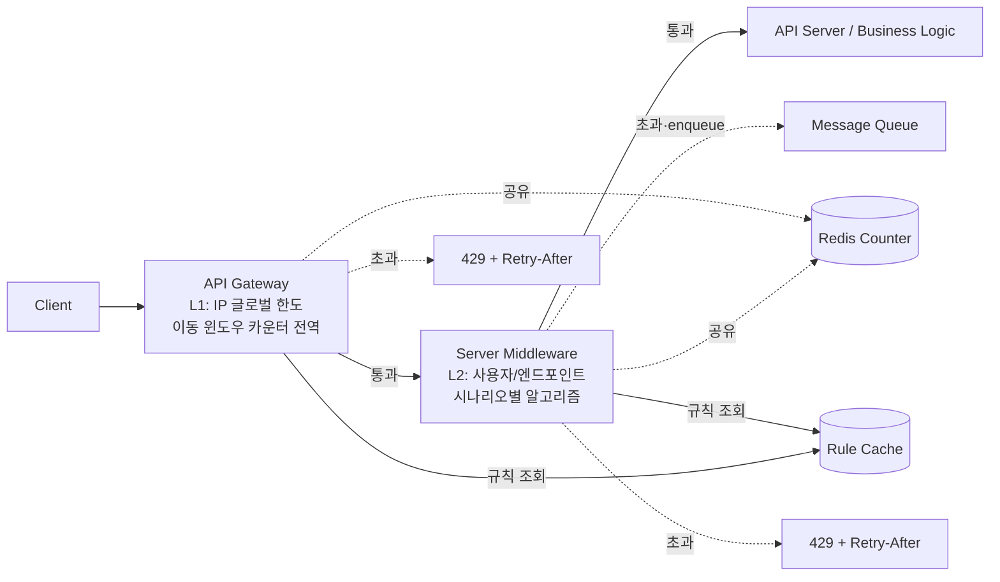
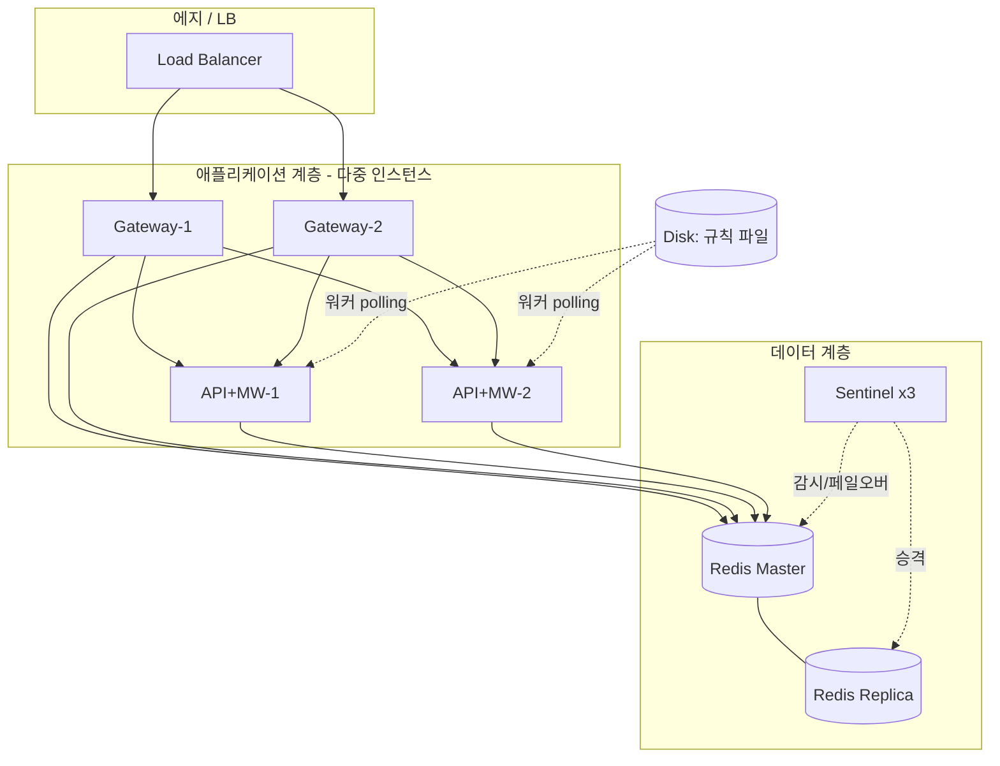
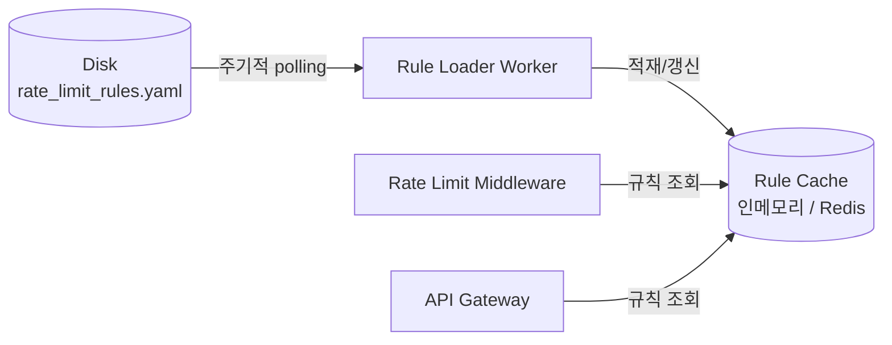

# [4장] 처리율 제한 장치 설계 — 2차 수정·보완 설계안 (Week 2)

## 🧭 보완 출발점 — 1차를 읽으며 떠올린 질문들 (2026-06-23 메모 정리)

> 1차 설계를 다시 읽으며 "여기는 더 채워야 한다"고 느낀 지점들을 주제별로 묶었다.
> 아래 질문들이 이번 2차 보완의 출발점이며, 각 항목이 어느 절에서 해소되는지 표기했다.

**① 알고리즘 — 어떤 시나리오를 어떤 알고리즘으로 막을 것인가?**
- 비즈니스 규칙마다 미들웨어 층에서 어떤 알고리즘으로 대비할지 정하지 못했다.
- Redis 자료구조 학습 필요: `INCR`, `Sorted Set` 등 알고리즘별로 무엇을 쓰는가? 
- Lua 스크립트는 왜·어떻게 쓰는가?

**② 아키텍처 — 내 구성도는 결국 어떻게 생겼나?**
- 논리 흐름도만 있고 인프라 구성도가 없다. 인프라 구성도를 그려야 한다.

**③ 장애 대응 — Redis가 SPOF인데 죽으면?**
- 미들웨어·API 게이트웨이 모두 Redis를 바라본다. Redis 장애 시 어떻게 버티는가?

**④ 규칙 관리 — 제한 규칙은 어떻게 만들어지고 어디에 사는가?**
- 처리율 제한 규칙의 생성·저장 위치가 미정이다.
- 규칙은 디스크에 두고, 워커 프로세스가 수시로 디스크에서 읽어 캐시에 적재 → 캐시에서 조회하는 구조.

**⑤ 제한된 요청 처리·사용자 알림**
- 한도를 넘긴 요청은 어떻게 처리되는가(드롭? 큐 보관?)?
- 사용자에게 `429`와 함께, 몇 초 뒤 재요청하면 되는지(`Retry-After`) 알려야 한다.

**⑥ 동시성 — 경쟁 조건과 동기화**
- 경쟁 조건(race condition): 락으로 풀 수 있지만 락은 성능을 크게 떨어뜨린다.
  - 락 대신 → **Lua 스크립트 / Sorted Set**으로 원자적 처리.
- 여러 인스턴스 간 카운터 동기화는 어떻게?

**⑦ 더 파고들 거리
- 분산 환경 합의(consensus) 알고리즘 — Sentinel 페일오버의 배경 개념.

---

## 📌 수정·보완 이력 (2026-06-23)

> 1차 설계 대비 이번에 수정·보완한 사항 요약. 상세 내용은 각 절(§) 참고.

- **미들웨어 알고리즘 세분화** — L1 게이트웨이는 **전역 이동 윈도우 카운터를 그대로 유지**(1차 결정). L2 미들웨어만 "전 규칙 이동 윈도우 카운터 단일 적용" → **시나리오별 알고리즘 매핑**으로 세분화 (글쓰기=이동윈도카운터 / 계정생성=고정윈도 / 로그인=이동윈도로그 / 주문=누출버킷 / 버스트 허용=토큰버킷).
- ** 규칙 생성·저장·로딩 추가** — 디스크 설정파일(YAML) → 워커가 주기적으로 캐시에 적재 → 미들웨어가 캐시에서 조회.
- **제한된 요청 처리·알림 구체화** — `drop`/`enqueue` 분기, `429` + `Retry-After` 산출 근거 명시.
- **Redis 자료구조·경쟁 조건·루아 정리** — `INCR`/`EXPIRE` + **Sorted Set** 정리, 락→루아 스크립트로 **경쟁 조건 원자적 해결**.
- **동기화 결정** — 고정 세션 기각, **중앙 집중 Redis** 채택 근거 명시.
- **아키텍처·인프라 구성도 추가** — 논리 흐름도 + 다중화 인프라 구성도(LB·다중 인스턴스·Sentinel).
- **Redis 장애 대응 채움** — 1차의 `/레디스 장애시?/` 빈칸을 **3단 fallback**(Sentinel → 로컬 카운터 → Fail 정책)으로 해소.

---

> 1차 설계를 [20260623 보완 설계 메모](20260623%20보완%20설계%20메모.md)에 비추어 수정·보완한다.
> 1차 설계의 골격(2층 배치 + Redis 공유 + 429 규약 + Fail-open)은 유지하되, **메모에서 비워둔 11개 항목**을 채우고 일부 결정을 교정한다.
>
> - 작성일: 2026-06-23

---

## 0. 1차 → 2차 변경 요약 (무엇을 고쳤나)

| #   | 메모 항목                        | 1차 상태                                                      | 2차 보완                                                                                                                            |
| --- | ---------------------------- | ---------------------------------------------------------- | -------------------------------------------------------------------------------------------------------------------------------- |
| 1   | 비즈니스 규칙별 알고리즘                | L1 게이트웨이=전역 이동 윈도우 카운터 / **L2 미들웨어=전 규칙 이동 윈도우 카운터 단일 적용** | L1 **유지**, **L2 미들웨어만 시나리오별 알고리즘 매핑**으로 세분화 (글쓰기=이동윈도카운터 / 계정생성=고정윈도 / 로그인=이동윈도로그 / 주문=누출버킷 / 버스트허용=토큰버킷) — 각 시나리오는 위협 유형의 대표 사례 |
| 2   | 아키텍처/인프라 구성도                 | 논리 흐름도만 존재                                                 | **인프라 구성도 + 규칙 로딩 경로** 추가                                                                                                        |
| 3   | Redis 장애 시 (`/레디스 장애시?/` 빈칸) | 빈칸                                                         | **3단 fallback** 구체화 (Sentinel→로컬 카운터→Fail정책)                                                                                     |
| 4   | Redis 자료구조                   | `INCR`만 언급                                                 | `INCR`/`EXPIRE` + **Sorted Set**(이동 윈도우 로그)까지 정리                                                                                 |
| 5   | 루아 스크립트                      | "엄격 모드" 한 줄                                                | **원자적 read+judge+incr 스크립트**로 경쟁조건 정식 해결                                                                                         |
| 6·9 | 규칙 생성/저장/로딩                  | 미정                                                         | **디스크 설정파일 → 워커가 주기적으로 캐시 적재**                                                                                                   |
| 7   | 제한된 요청 처리                    | 429 반환만                                                    | **드롭 / 메시지 큐 보관** 분기                                                                                                             |
| 8   | 사용자 알림                       | 헤더 명시됨                                                     | 유지 + `Retry-After` 계산 근거 명확화                                                                                                     |
| 10  | 경쟁 조건                        | "미세 race 허용"                                               | **락 → 성능 저하 → 루아/정렬집합** 결정 경로로 정식화                                                                                               |
| 11  | 동기화                          | 미정                                                         | **중앙 집중 Redis 채택, 고정 세션 기각** 근거 명시                                                                                               |

---

## 1. 요구사항 (1차 유지)

| #   | 요구사항                | 2차에서 강조점                                |
| --- | ------------------- | --------------------------------------- |
| 1   | 설정된 처리율을 **정확히** 제한 | 분산 정합성 = 경쟁 조건/동기화 문제로 직결               |
| 2   | 낮은 응답시간             | 판정은 Redis 명령 2~3회 이내, 미들웨어 인프로세스 처리     |
| 3   | 적은 메모리              | 윈도우당 키 + TTL 자동 회수, 식별자당 활성 키 상수        |
| 4   | 분산형 제한              | 중앙 Redis 공유                             |
| 5   | 예외 처리(사용자 알림)       | `429` + `Retry-After` + `X-RateLimit-*` |
| 6   | 높은 결함 감내            | 다층 방어(레이어·인프라·저장소) + Fail 정책 (§9)       |

---

## 2. 결정 요약 (2차)

| 결정 축         | 1차 선택                            | 2차 선택                                         |
| ------------ | -------------------------------- | --------------------------------------------- |
| **알고리즘**     | 전 계층 이동 윈도우 카운터                  | **L1 게이트웨이=이동 윈도우 카운터 유지 / L2 미들웨어=시나리오별 매핑** |
| **배치 위치**    | API Gateway(L1) + Middleware(L2) | 동일 유지                                         |
| **규칙 저장**    | 미정                               | **디스크 설정파일 + 워커가 캐시 적재**                      |
| **저장소/자료구조** | Redis + `INCR`/`EXPIRE`          | + 정밀 엔드포인트는 **Sorted Set**                    |
| **경쟁조건**     | 보수적 차단 허용                        | **루아 스크립트로 원자화**                              |
| **동기화**      | 미정                               | **중앙 집중 Redis** (고정 세션 기각)                    |
| **제한 요청 처리** | 429                              | **드롭 또는 큐 보관**                                |
| **장애 정책**    | Fail-open + 부분 Fail-close        | **3단 fallback + 엔드포인트별 Fail 정책**              |


---

## 3. 아키텍처 & 인프라 구성도

> 전체 구조를 먼저 조망하고, 이후 §4~§9에서 각 구성요소(알고리즘·규칙·저장소·장애 대응)를 상세화한다.

### 3-1. 논리 아키텍처 (요청 흐름)



### 3-2. 인프라 구성도 (가용성·다중화)



> 멀티 데이터센터/지연시간 최적화는 책의 에지 서버 + 최종 일관성(eventual consistency) 모델을 따른다. 1차 설계 범위에선 단일 리전 + Sentinel로 한정하고, 확장 시 Cluster·에지로 확대.

### 3-3. Redis 다중화: 왜 Cluster가 아니라 Sentinel인가

> 데이터 계층을 다중화하는 두 방식의 **목적이 다르다.** 둘 다 "여러 대"지만 해결하는 문제가 다르다.

| 구분 | **Sentinel (채택)** | **Cluster** |
| --- | --- | --- |
| 1차 목적 | **가용성(HA)** — 자동 페일오버 | **수평 확장(샤딩)** — 데이터 분산 |
| 데이터 배치 | **마스터 1대에 전체 데이터**, Replica는 복사본 | **여러 마스터에 키를 쪼개(16384 슬롯)** 분산 |
| 쓰기 처리량 | 마스터 **1대 상한** | 마스터 수만큼 **선형 확장** |
| 메모리 한계 | 단일 노드 용량 | 노드 추가로 **수평 확장** |
| 역할 | Sentinel은 **감시·페일오버 지휘**(데이터 X) | 각 마스터가 데이터 보유 + 자체 Replica |
| 복잡도 | 낮음 (클라이언트 단순) | 높음 (슬롯·리샤딩·cluster-aware 클라이언트) |

**왜 이 설계는 Sentinel로 충분한가 (채택 이유)**

1. **데이터가 작다** — 처리율 제한 카운터는 `키 + TTL`뿐(상수 메모리, §1 요구3). 단일 마스터 용량/처리량으로 현재 규모를 감당. *아직 샤딩이 필요 없다.*
2. **Lua 원자성을 자유롭게 쓸 수 있다** — Lua는 이동 윈도우에서 **여러 키(curr·prev)를 한 스크립트로** 다룬다. **Cluster는 한 스크립트가 같은 슬롯의 키만** 건드릴 수 있어 hash-tag로 키 슬롯을 맞추는 작업이 필요하다. 단일 마스터(Sentinel)면 이 제약이 없다.
3. **요구는 "SPOF 제거"지 "확장"이 아니다** — §9의 목표는 *Redis가 단일 장애점이 되지 않게*다. Sentinel의 자동 페일오버가 이 가용성 요구를 **불필요한 샤딩 복잡도 없이** 충족한다.

**트레이드오프 (Sentinel 선택의 대가)**

| | 내용 |
| --- | --- |
| ✅ 단순성 | 슬롯·리샤딩 없음, 표준 클라이언트로 충분, 운영 부담 낮음 |
| ✅ Lua/멀티키 자유 | 키 슬롯 제약 없이 원자 스크립트 사용 (§7-3) |
| ⚠️ **확장 상한** | 쓰기·메모리가 **단일 마스터에 묶임**. 핫 키·트래픽 급증 시 그 마스터가 병목 (§7-3 핫 키 직렬화 · §10 병목과 직결) |
| ⚠️ 페일오버 공백 | 승격까지 **수 초** 동안 쓰기 불가 → §9 2단 로컬 fallback으로 완충 |
| ⚠️ 이행 비용 | 규모가 한계에 닿으면 **Cluster로 전환** 필요 → 그때 hash-tag로 키 슬롯 정렬 작업 발생 (§10 확장 경로) |

> **한 줄: "지금 필요한 건 확장이 아니라 가용성"이라 Sentinel을 골랐다.** 단일 마스터 한계에 부딪히면(핫 키·고RPS) Cluster로 확장하며, 그 시점엔 Lua 멀티키를 hash-tag로 같은 슬롯에 묶는 작업이 따라온다.

---

## 4. 레이어별 알고리즘 전략

> **1차 구조 유지**: L1 게이트웨이는 **전역 이동 윈도우 카운터**(IP 단위 글로벌 한도)를 그대로 둔다.
> **2차 보완 지점**: L1과 달리 1차에서 **L2 이번에 미들웨어에 **시나리오별 알고리즘 매핑**으로 세분화한다.
> 판단 기준 두 축: **(a) 버스트를 허용할 것인가 / 깎을 것인가, (b) 윈도우 경계 정밀도(정확성)가 얼마나 중요한가.** → 시나리오가 막으려는 위협의 성격이 이 두 축의 값을 결정한다.

### L1: API Gateway — 전역 (1차 유지)

| 시나리오(예시 규칙)                              | 식별자 | 알고리즘                | 이유                                        |
| ---------------------------------------- | --- | ------------------- | ----------------------------------------- |
| **IP당 전체 API 분당 1000회** (DoS 1차 방어, 글로벌) | IP  | **이동 윈도우 카운터 (전역)** | 1차 결정 유지. 거친 글로벌 한도를 경계 폭주 없이·저메모리로 일관 적용 |

### L2: Server Middleware — 시나리오별 (2차 세분화)

> 5개 시나리오는 임의 선택이 아니라 **처리율 제한이 다루는 위협 유형을 하나씩 대표**하도록 골랐다 (남용 방지 · 비용 방어 · 보안 · 백엔드 보호 · 버스트 수용). 위협의 성격이 곧 알고리즘 선택 기준을 결정한다.

| 시나리오(예시 규칙)           | 식별자             | 선정 이유(어떤 위협의 대표 사례인가)                                     | 선택 알고리즘        | 알고리즘 이유                          |
| --------------------- | --------------- | --------------------------------------------------------- | -------------- | -------------------------------- |
| **글쓰기 2회/초**          | userId+endpoint | **남용 방지** — 도배·스팸. "사람이라면 초당 2번 이상 글을 쓸 일이 없다"는 가장 직관적 사례 | **이동 윈도우 카운터** | 초 경계 폭주 방지 + 저메모리 → **미들웨어 기본값** |
| **계정 생성 5회/시간**       | IP              | **비용 방어** — 봇의 대량 가짜계정. 가입 1건마다 인증메일·저장공간 등 실제 비용 발생      | **고정 윈도우**     | 긴 윈도우라 경계 문제 영향 작음, 구현·메모리 최소    |
| **로그인 5회/분**          | userId          | **보안** — 무차별 대입·크리덴셜 스터핑. 한도가 한 번이라도 새면 계정 탈취로 직결         | **이동 윈도우 로그**  | 타임스탬프 저장으로 경계 우회 차단(엄격 정확성)      |
| **주문·결제 10회/초**       | userId+endpoint | **백엔드 보호** — 결제 PG·재고 등 느린 다운스트림을 일정 속도로 보호               | **누출 버킷**      | 고정 출력률, 초과분은 큐에 적재               |
| **버스트 허용 API**(조회·검색) | endpoint        | **버스트 수용** — 깜짝세일·푸시 직후 순간 폭주가 정상인 트래픽. 막지 말고 흡수          | **토큰 버킷**      | 버킷 잔량만큼 짧은 폭주 허용                 |

> - **L1 게이트웨이**: 알고리즘 고정(전역 이동 윈도우 카운터). 비즈니스 맥락 없이 IP 단위 거친 방어만 담당.
> - **L2 미들웨어**: **기본값은 이동 윈도우 카운터**, 위 특수 시나리오만 정책 테이블에서 알고리즘을 오버라이드. → 알고리즘 다양성과 운영 복잡도의 절충.

---

## 5. 처리율 제한 규칙 — 생성·저장·로딩

> 책: 리프트(Lyft)식 설정파일 규칙. 규칙은 **디스크에 보관**, 작업 프로세스(workers)가 수시로 읽어 **캐시에 적재**, 미들웨어는 캐시에서 꺼내 쓴다.

### 규칙 스키마 (설정파일, 디스크)

```yaml
# rate_limit_rules.yaml  (디스크 보관, 버전관리 대상)
domain: auth
descriptors:
  - key: auth_type
    value: login
    layer: middleware
    identifier: userId            # 제한 기준 식별자
    algorithm: sliding_window_log # 시나리오별 오버라이드 (§4)
    rate_limit:
      unit: minute
      requests_per_unit: 5
    on_exceed: drop               # drop | enqueue (§6)
    fail_policy: fail_close       # 보안 민감 → fail-close
---
domain: account
descriptors:
  - key: action
    value: create
    layer: middleware
    identifier: ip+endpoint
    algorithm: fixed_window
    rate_limit: { unit: day, requests_per_unit: 10 }
    on_exceed: drop
    fail_policy: fail_close
```

### 로딩 경로



- 워커가 N초마다 디스크 파일을 읽어 캐시에 반영 → **무중단 규칙 변경**.
- 미들웨어/게이트웨이는 매 요청마다 디스크를 읽지 않고 **캐시 hit**으로 처리 → 요구사항 2(낮은 응답시간).

---

## 6. 제한된 요청 처리 & 사용자 알림

### 초과 트래픽 처리 분기 (메모 #7)

> **분기 기준은 "지연 허용 여부"가 아니라 "손실 허용 여부".** 버려도 되는 요청은 `drop`, 버리면 비즈니스 손해가 큰 요청은 `enqueue`로 받아둔다.

| `on_exceed` | 동작                 | 적용 기준 / 시나리오                                                          |
| ----------- | ------------------ | -------------------------------------------------------------------- |
| **drop**    | 즉시 `429` 반환, 요청 폐기 | **버려도 되는 요청** — 재요청이 쉽고 즉시 응답이 본질. 글쓰기·로그인·계정 생성·조회                    |
| **enqueue** | 메시지 큐에 보관 후 비동기 처리 | **버리면 안 되는 요청** — 손실 시 매출·신뢰 손해. 약간의 지연은 허용. 주문·결제(책의 주문 예시) — *즉시성이 낮아서가 아니라, 한도 초과로 폐기하면 매출이 사라지므로 큐에 받아 곧 처리* |

### 응답 규약

한도 초과 시 `429 Too Many Requests` + 헤더:

| 헤더 | 의미 | 산출 방법 |
| ---- | ---- | --------- |
| `X-RateLimit-Limit` | 윈도우당 허용 요청 수 | 규칙의 `requests_per_unit` |
| `X-RateLimit-Remaining` | 윈도우 내 남은 요청 수 | `limit - 현재 추정치` (음수는 0) |
| `Retry-After` / `X-RateLimit-Retry-After` | 몇 초 뒤 재시도 가능한가 | **현재 윈도우 종료까지 남은 시간**(고정/이동 카운터) 또는 가장 오래된 로그 만료까지(이동 로그) |

> `Retry-After`를 정확히 주면 클라이언트가 백오프(back-off) 재시도로 무의미한 재요청을 줄인다 → 다운스트림 보호.

---

## 7. 저장소 자료구조 & 경쟁 조건 해결

### 7-1. 자료구조 선택

| 알고리즘 | Redis 자료구조 / 명령 | 비고 |
| -------- | --------------------- | ---- |
| 고정/이동 윈도우 카운터 | 윈도우 키 + `INCR` / `EXPIRE` | 키 1~2개 상수 메모리, TTL 자동 회수 |
| 이동 윈도우 로그 | **Sorted Set** (`ZADD` score=timestamp / `ZREMRANGEBYSCORE` / `ZCARD`) | 만료 타임스탬프 제거 + 로그 크기 판정. 메모리 더 씀 |
| 토큰/누출 버킷 | Hash(토큰 수 + 마지막 보충 시각) + Lua | 보충량 = 경과시간 × refill rate |

### 7-2. 경쟁 조건 (왜 카운트가 실제보다 작아지나)

**한 줄 요약**: `읽기 → 판정 → 쓰기` 세 동작 사이에 다른 요청이 끼어들면, **이미 일어난 증가가 덮어쓰여 사라진다(lost update)**. 그래서 카운터가 실제 요청 수보다 **작게** 찍히고, 결국 **한도를 넘은 요청이 통과**한다.

**구체적으로 (한도=4, 현재 카운터=3인 순간 요청 A·B가 동시에 도착)**:

| 시각 | 요청 A | 요청 B | Redis 카운터 |
| -- | ---------------- | ---------------- | ------- |
| t1 | GET → **3** 읽음 |                  | 3 |
| t2 |                  | GET → **3** 읽음 (A가 아직 안 씀) | 3 |
| t3 | 판정: 3<4 → 통과 |                  | 3 |
| t4 |                  | 판정: 3<4 → 통과 | 3 |
| t5 | SET **4** 씀 |                  | 4 |
| t6 |                  | SET **4** 씀 (3+1, A의 증가를 못 봄) | **4** |

→ 실제로는 두 요청이 들어왔으니 **5**가 찍혀 B가 차단됐어야 한다. 그런데 B가 A보다 먼저 값을 읽어버려서, A의 증가가 **덮어써져 사라지고** 카운터는 4에 머문다. **두 요청 다 통과 = 한도 초과 누수.** 동시 요청이 많을수록 누수도 커진다.

> 핵심은 "세 동작이 따로 노는 것". 읽기와 쓰기 사이의 틈에 남이 끼어들 수 있으면, 그 사이에 일어난 변화를 못 보고 옛 값 위에 덮어쓴다.

**해결 경로**:

| 방법 | 원리 | 평가 |
| --- | --- | --- |
| **① 락(lock)** | 키를 잠그고 한 요청씩 read+judge+write | 직관적이나 **분산 락 = 획득·해제 추가 왕복 + 경합 + 데드락/만료 관리** → 성능 급락. ❌ 기각 |
| **② 루아 스크립트** | read+judge+incr 세 동작을 **Redis 안에서 한 덩어리로** 실행 | 락 없이 원자성 확보 + 왕복 1회. ✅ **채택** |
| **③ 정렬 집합(Sorted Set)** | 이동 윈도우 로그에서 `ZREMRANGEBYSCORE`+`ZCARD`+`ZADD`를 묶어 원자 처리 | 로그 계열에서 동일 효과 (정밀 EP) |

### 7-3. 루아 스크립트 — 어떻게·왜 해결되나

**왜 Lua가 경쟁 조건을 없애나**: Redis는 **명령을 한 번에 하나씩 처리하는 단일 스레드**이고, 스크립트(`EVAL`)는 **그 자체가 하나의 명령으로 취급되어 도중에 다른 명령이 끼어들 수 없다.** 즉 위 표의 `읽기→판정→쓰기`가 **쪼개지지 않는 한 덩어리**로 돌아간다.

→ 요청 A의 스크립트가 **완전히 끝난 뒤에야** B의 스크립트가 시작된다. 그래서 **B는 반드시 A가 쓴 4를 읽고** 5로 올리며 판정한다 → 한도 초과 정확히 차단. "끼어들 틈" 자체가 사라지는 것이 해결의 본질이다.

**원자화 예시 (이동 윈도우 카운터)**:

```lua
-- KEYS[1]=curr_key, KEYS[2]=prev_key
-- ARGV[1]=limit, ARGV[2]=weight(직전 윈도우 가중치), ARGV[3]=ttl(2·W)
local curr = tonumber(redis.call('GET', KEYS[1]) or '0')
local prev = tonumber(redis.call('GET', KEYS[2]) or '0')
local estimated = curr + prev * tonumber(ARGV[2])
if estimated >= tonumber(ARGV[1]) then
  return -1                                  -- 한도 초과 → 차단
end
local n = redis.call('INCR', KEYS[1])        -- 통과 시에만 증가
if n == 1 then redis.call('EXPIRE', KEYS[1], ARGV[3]) end
return n                                       -- 통과
```

> 1차 설계의 "선-INCR 후-판정 미세 race"를 **판정과 증가를 한 원자 블록**으로 묶어 제거.

**Lua 채택의 트레이드오프 (얻는 것 ↔ 치르는 대가)**:

| 측면 | 내용 |
| --- | --- |
| ✅ 원자성 | 락 없이 read+judge+incr 보장. 경쟁 조건 원천 제거 |
| ✅ 성능 | 여러 명령을 **왕복 1회**로 처리(락의 추가 왕복·경합 없음) |
| ⚠️ **전역 블로킹** | 단일 스레드라 **스크립트 실행 중 Redis 전체가 멈춤**. 스크립트가 무겁거나 느리면 *다른 모든 클라이언트가 지연* → 스크립트는 **짧고 가볍게** 유지해야 |
| ⚠️ **핫 키 직렬화** | 같은 키에 요청이 몰리면 결국 한 줄로 직렬 처리 → 그 키의 **처리량 상한**이 생김 (§10 키 샤딩으로 완화) |
| ⚠️ 운영 부담 | Lua 코드 별도 관리·테스트·디버깅 어려움. 복제/AOF 안전을 위해 **결정적(non-random·시간 의존 X)** 으로 작성해야 |
| ⚠️ 적용 범위 | 위 비용 때문에 **전 엔드포인트엔 과함** → 정밀이 필요한 EP(로그인·결제)에만 적용, 그 외는 단순 `INCR`로 충분 |

> 한 줄: **"락의 분산 조율 비용"을 "Redis 단일 스레드의 직렬 실행"으로 바꾼 것.** 원자성은 싸게 얻지만, 그 대가로 스크립트는 짧아야 하고 핫 키는 직렬 병목이 된다.

---

## 8. 동기화

다수 제한 장치 서버를 두면 카운터 상태를 공유해야 한다.

| 방안                                                 | 평가                    | 채택   |
| -------------------------------------------------- | --------------------- | ---- |
| **고정 세션(sticky session)** — 같은 클라이언트를 항상 같은 제한 장치로 | 확장성·유연성 떨어짐(책도 비추천)   | ❌ 기각 |
| **중앙 집중 데이터 저장소(Redis)** — 모든 제한 장치가 동일 Redis 참조   | 무상태 웹 계층과 잘 맞음, 확장 용이 | ✅ 채택 |

→ 1차의 "Redis 공유" 결정을 동기화 관점에서 정식 근거화. L1 Gateway와 L2 Middleware가 **동일 카운터 키**를 보므로 레이어 간에도 일관.

---

## 9. Redis 장애 대응 — 3단 Fallback

> 1차의 `/ 레디스 장애시 ? /` 빈칸을 채운다. 게이트웨이·미들웨어가 **모두 Redis 단일 의존**이므로 Redis가 SPOF가 되지 않게 한다.

| 단계 | 트리거 | 동작 |
| ---- | ------ | ---- |
| **1단: 인프라 다중화** | Master 다운 | **Sentinel 자동 페일오버**로 Replica 승격. 페일오버 수 초 동안은 2단으로 임시 처리 |
| **2단: 로컬 fallback** | Redis 호출 실패/타임아웃 | 미들웨어 **프로세스 로컬 인메모리 카운터**(고정 윈도우 단순 구현)로 임시 제한. 전역 정합성은 떨어지나 "전혀 안 막힘"보다 안전. Redis 복구 시 자동 복귀 |
| **3단: Fail 정책** | 로컬도 불가/판정 불능 | **엔드포인트별 정책**으로 결정 (아래) |

### Fail 정책 (엔드포인트별)

- **Fail-open (기본)**: 통과시킴. 요구사항 6("제한 장치 장애가 전체 시스템에 영향 X")을 정직하게 충족 — 일반 엔드포인트.
- **Fail-close (선택)**: `login`, `account-create`, `payment` 등 보안·비용 민감 엔드포인트는 **차단**으로 fallback. 규칙의 `fail_policy: fail_close`로 지정.

---

## 10. 병목 / 단일 장애 지점 (1차 유지 + 보강)

| 위치 | 영향 | 완화책 |
| ---- | ---- | ------ |
| Redis (카운팅 통로) | 처리율 제한 마비 | Sentinel 페일오버 → 로컬 fallback → Fail 정책 (§9) |
| 핫 키(인기 엔드포인트) | 특정 키 쓰기 집중 → CPU 폭증 | 해시 태그 샤딩(Cluster), 키 분할 |
| Redis 메모리 폭증 | OOM | TTL 강제 + 키 카디널리티 모니터링 + `maxmemory-policy` |
| Gateway 인스턴스 | 전체 차단 | 다중 인스턴스 + LB |

---

## 11. 모니터링 

- **알고리즘 효과성**: 규칙이 의도대로 동작하는지(유효 요청이 과도하게 버려지는가).
- **규칙 적정성**: 너무 빡빡하면 완화, 깜짝 세일 등 급증 패턴엔 **토큰 버킷으로 전환** 검토.
- 지표: 엔드포인트별 429율, Redis 지연·메모리, fallback 발동 횟수, 페일오버 이벤트.

---

