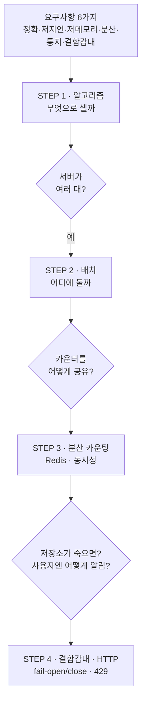

# 처리율 제한 장치 — 왜 / 무엇 / 어떻게

> STEP 노트로 들어가기 **전에** 큰 그림을 잡는 도입 문서.
> "왜 필요한가 → 무엇을 만족해야 하는가 → 그래서 어떻게 풀어가는가" 를 한 흐름으로 정리한다.
> 알고리즘·Redis 같은 **세부 결정은 STEP 1~4** 에서 다루고, 여기서는 **그 결정들이 왜 필요해지는지** 만 본다.

---

## 한 장 요약

| 질문 | 답 | 더 보기 |
| --- | --- | --- |
| **왜?** | DoS 방어·비용 절감·과부하 차단 — 즉 **서비스를 지키기 위해** | [아래 1장](#1-왜-필요한가--rate-limiter가-막아주는-것) |
| **무엇을?** | 정확·저지연·저메모리·분산·예외통지·결함감내 **6대 요구사항** | [아래 2장](#2-무엇이-필요한가--요구사항-6가지를-해독한다) |
| **어떻게?** | 알고리즘(STEP1) → 배치(STEP2) → 분산 카운팅(STEP3) → 결함·통지(STEP4) | [아래 3장](#3-그래서-어떻게-푸는가--결정-4단계) |

> **한 문장:** 트래픽을 지키려고(왜) 6가지 품질을 만족하는(무엇) 장치를, 4개의 설계 결정으로(어떻게) 만든다.

---

## 1. 왜 필요한가 — Rate Limiter가 막아주는 것

처리율 제한 장치(rate limiter)는 **"특정 기간 내 요청 횟수가 임계치를 넘으면 추가 요청을 차단"** 하는 장치다.
없어도 서비스는 "동작" 하지만, 아래 세 가지 위험에 **무방비** 가 된다.

| 막는 것 | 시나리오 | 없으면 생기는 일 | 실제 사례 |
| --- | --- | --- | --- |
| **자원 고갈 (DoS 방어)** | 악의적/오작동 클라이언트가 초당 수천 요청 | 서버 CPU·커넥션·DB가 고갈돼 **정상 사용자까지 장애** | 트위터: 3시간당 트윗 300개 제한 |
| **비용 폭증** | 호출량에 비례해 과금되는 구조 | 서버 증설 비용 + **유료 3rd-party API 호출료** 가 무한정 증가 | 결제·신용조회·헬스체크 등 횟수 과금 API |
| **서버 과부하** | 봇 트래픽, 잘못된 재시도 루프 | 비정상 패턴이 정상 트래픽을 밀어내 **응답 지연·타임아웃** | 구글 독스 API: 사용자당 분당 read 300회 |

> 핵심: rate limiter는 기능이 아니라 **보호 장치(가드레일)** 다.
> "잘 되게 하는 것" 이 아니라 **"나빠지지 않게 막는 것"** 이 목적이다.

### 왜 "그냥 카운터 하나" 로 끝나지 않는가

가장 단순한 구현은 메모리 변수 하나로 세는 것이다 — `if (count > limit) reject;`.
**단일 서버·단일 프로세스** 라면 충분하다. 문제는 이 구조가 4장 요구사항을 **하나도** 만족하지 못한다는 점이다.

| 부딪히는 벽 | 무엇이 막히나 | 충돌하는 요구사항 |
| --- | --- | --- |
| **정확성** | 단순 카운터는 윈도우 경계에서 **2배 폭주** 허점 | "정확하게 제한" ❌ |
| **분산** | 서버가 여러 대면 카운터가 **각자 따로** 놀아 전체 제한 불가 | "분산형 처리율 제한" ❌ |
| **동시성** | 동시 요청이 read→check→write 틈에 끼어 **카운트 누락** | "정확하게 제한" ❌ |
| **장애** | 카운터 저장소가 죽으면 제한 로직 **전체 정지** | "높은 결함 감내성" ❌ |

> 이 4개의 벽이 그대로 **STEP 1~4** 가 푸는 문제로 이어진다. → [3장](#3-그래서-어떻게-푸는가--결정-4단계)

---

## 2. 무엇이 필요한가 — 요구사항 6가지를 해독한다

면접관과의 문답에서 확정된 요구사항은 6가지다. 각각이 **왜 까다로운지**, 그리고 **어느 STEP이 책임지는지** 를 함께 본다.

| # | 요구사항 | 진짜 의미 | 왜 어려운가 | 책임 STEP |
| --- | --- | --- | --- | --- |
| ① | **정확한 제한** | 임계치 초과를 빠짐없이 차단 | 알고리즘 허점(경계 폭주)·동시성 누락 | STEP 1·3 |
| ② | **낮은 응답시간** | 제한 로직이 HTTP 지연을 늘리면 안 됨 | 매 요청마다 저장소 조회 → 지연 추가 위험 | STEP 2·3 |
| ③ | **적은 메모리** | 키(사용자/IP)마다 상태를 저장 | 키가 수백만 개면 상태 1개 크기가 곧 비용 | STEP 1·3 |
| ④ | **분산 제한** | 여러 서버·프로세스가 **하나의** 제한을 공유 | 카운터를 어디에 두고 어떻게 동기화? | STEP 2·3 |
| ⑤ | **예외(차단) 통지** | 차단 사실을 사용자에게 분명히 | 단순 거절이 아니라 **상태코드·헤더 규약** 필요 | STEP 4 |
| ⑥ | **높은 결함 감내성** | 제한 장치가 죽어도 전체 시스템은 산다 | 저장소 장애 시 통과? 차단? (SPOF 제거) | STEP 4 |

> 요구사항을 읽는 법: ①③은 **알고리즘 선택**, ②④는 **저장·배치 구조**, ⑤⑥은 **장애·규약** 으로 갈라진다.
> 즉 6개 요구사항이 자연스럽게 4개의 설계 결정으로 묶인다.

### 추가로 확정된 설계 범위 (문답에서)

- **서버 측** 제한 장치 (클라이언트 측 아님)
- **유연한 제어 규칙** — IP / userId / API Key 등 다양한 기준 지원
- **대규모 + 분산 환경** 가정
- 독립 서비스 vs 앱 내장 — **설계자가 결정** (→ STEP 2)
- 차단 시 **사용자에게 통지** (→ STEP 4)

---

## 3. 그래서 어떻게 푸는가 — 결정 4단계

각 STEP은 *기능 추가* 가 아니라 **"앞 단계가 만든 문제를 푸는 다음 결정"** 이다.

### 결정의 연쇄 — 왜 이 순서인가

| 순서 | 결정 | 직전 단계가 남긴 질문 | 핵심 키워드 |
| :---: | --- | --- | --- |
| **STEP 1** | 무엇을 기준으로 셀까 | (출발점) 임계치를 어떤 모델로 측정? | 토큰/누출 버킷, 고정·이동 윈도우 |
| **STEP 2** | 제한 장치를 어디에 둘까 | 알고리즘이 정해졌으니, 요청 경로 어디서 검사? | 클라이언트 vs 서버 vs 미들웨어, API Gateway |
| **STEP 3** | 카운터를 어떻게 공유·동기화할까 | 서버가 여러 대면 상태를 어디에? | Redis, INCR, TTL, 경쟁 조건, Lua |
| **STEP 4** | 장애와 통지를 어떻게 다룰까 | 공유 저장소가 죽으면? 차단을 어떻게 알림? | fail-open/close, 429, Retry-After |

> 각 화살표는 "**앞 결정이 새 문제를 만들고, 다음 STEP이 그걸 받는다**" 는 뜻이다.
> STEP 1이 알고리즘을 정하면 → "그 상태를 어디 둘까(STEP 2)" 가 생기고 →
> "여러 서버가 공유하려면(STEP 3)" 이 생기고 → "그 공유 저장소가 죽으면(STEP 4)" 으로 이어진다.

---

## 4. 요구사항 → STEP 빠른 매핑

어느 요구사항이 막히면 어느 STEP을 다시 봐야 하는지.

| 요구사항 | 1차 방어 STEP | 보조 STEP |
| --- | --- | --- |
| ① 정확한 제한 | STEP 1 (알고리즘 허점) | STEP 3 (동시성 누락) |
| ② 낮은 응답시간 | STEP 3 (저장소 지연) | STEP 2 (배치 위치) |
| ③ 적은 메모리 | STEP 1 (상태 크기) | STEP 3 (TTL·만료) |
| ④ 분산 제한 | STEP 3 (공유 카운터) | STEP 2 (배치) |
| ⑤ 예외 통지 | STEP 4 (429·헤더) | — |
| ⑥ 결함 감내성 | STEP 4 (fail-open/close) | STEP 3 (복제·SPOF) |

---

## 5. 다음 단계

이 도입 문서로 **큰 그림** 을 잡았다면, 이제 결정의 세부로 들어간다.

1. **[00_인덱스](00_인덱스.md)** — STEP별 상세 목차 & 1차 설계 항목 매핑
2. **[STEP 1](01_STEP1_처리율제한_알고리즘.md)** — 5가지 알고리즘 비교 (가장 많이 투자할 곳)
3. **[STEP 2](02_STEP2_제한장치_배치_아키텍처.md)** — 배치 위치와 아키텍처
4. **[STEP 3](03_STEP3_분산카운팅_Redis_동시성.md)** — 분산 카운팅 + 동시성 (분산 요구사항의 본체)
5. **[STEP 4](04_STEP4_결함감내_HTTP규약.md)** — 결함 감내 & HTTP 통지 규약

> **복습 4문장:** 트래픽을 지키려고(왜) · 6가지 품질을 만족하며(무엇) ·
> 무엇으로 셀지(STEP1) → 어디에 둘지(STEP2) → 어떻게 공유할지(STEP3) → 장애·통지(STEP4)를 정하면(어떻게) ·
> 처리율 제한 장치가 완성된다.
