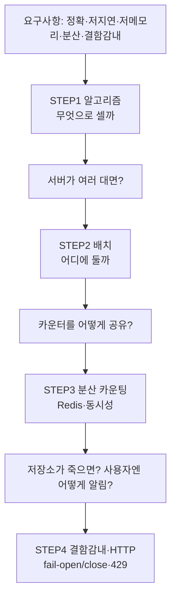

# 처리율 제한 장치 설계 — STEP별 정리 노트

> 『가상 면접 사례로 배우는 대규모 시스템 설계 기초』 4장 학습 노트
> 1차 설계를 시작하기 전에 알아야 할 개념을 STEP 순서대로 정리한다.

---

## 이 노트의 목적

처리율 제한 장치(rate limiter)는 **"임계치를 넘는 요청을 막는다"** 는 단순한 한 줄짜리 요구지만,
이것을 **정확하게 + 빠르게 + 적은 메모리로 + 분산 환경에서 + 장애에도 견디게** 만들려는 순간
아래 개념들이 줄줄이 필요해진다.

각 STEP은 *기능 추가*가 아니라 **"앞 단계가 만든 문제를 푸는 다음 결정"** 이다.

> 📌 STEP으로 들어가기 전에 **"왜 / 무엇을 / 그래서 어떻게"** 큰 그림이 필요하면
> 먼저 **[00_왜_무엇_어떻게](00_왜_무엇_어떻게.md)** 를 읽고 오자.

---

## 왜 "카운터 하나" 로 끝나지 않는가

가장 단순한 구현은 **메모리 변수 하나로 요청 수를 세는 것**이다.
`if (count > limit) reject;` — 단일 서버, 단일 프로세스라면 이걸로 충분하다.

문제는 이 구조가 4장 요구사항을 **하나도 만족하지 못한다**는 점이다.

| 벽 | 무엇이 막히나 | 요구사항과 충돌 |
| --- | --- | --- |
| **정확성** | 단순 카운터는 **윈도우 경계에서 2배 폭주** 등 허점이 있음 | "정확하게 제한한다" ❌ |
| **분산** | 서버가 여러 대면 **각자 카운터가 따로 놀아** 전체 제한이 안 됨 | "분산형 처리율 제한" ❌ |
| **동시성** | 동시 요청이 read→check→write 사이에 끼어들어 **카운트 누락** | "정확하게 제한한다" ❌ |
| **장애** | 카운터 저장소가 죽으면 제한 로직 전체가 멈춤 | "높은 결함 감내성" ❌ |

> 그래서 **어떤 알고리즘으로(STEP1) → 어디에 두고(STEP2) → 어떻게 공유·동기화하고(STEP3) → 장애와 사용자 통지를 어떻게(STEP4)** 라는 4개의 결정이 이어진다.

---

## 설계 로드맵

---

## STEP 목록

| STEP | 주제 | 핵심 키워드 | 푸는 문제 |
|:---:|------|-----------|----------|
| [STEP 1](01_STEP1_처리율제한_알고리즘.md) | 제한 알고리즘 | 토큰/누출 버킷, 고정·이동 윈도우 | 무엇을 기준으로 셀까 |
| [STEP 2](02_STEP2_제한장치_배치_아키텍처.md) | 배치 / 아키텍처 | 클라이언트 vs 서버 vs 미들웨어, API Gateway | 제한 장치를 어디에 둘까 |
| [STEP 3](03_STEP3_분산카운팅_Redis_동시성.md) | 분산 카운팅 | Redis, INCR, TTL, 경쟁 조건, Lua | 여러 서버가 카운터를 어떻게 공유하나 |
| [STEP 4](04_STEP4_결함감내_HTTP규약.md) | 결함 감내 · 통지 | fail-open/close, 429, Retry-After | 장애와 사용자 알림을 어떻게 |

### 각 STEP에서 깊게 다루는 것

| STEP | 세부 내용 |
| --- | --- |
| STEP 1 | 5가지 알고리즘을 **동작 원리 → 수식 → 의사코드 → 수치 예시 → Redis 구현 → 장단점** 으로. 토큰 버킷 lazy refill, 고정 윈도우 경계 폭주, 이동 윈도우 카운터 가중 합산 수식, 의사결정 플로우차트 |
| STEP 2 | 요청 경로상 배치 지점(엣지/게이트웨이/앱), 클라이언트 측이 안 되는 이유, 코드 내장 vs 미들웨어, API Gateway 기능, 분리/내장 판단 기준 6축, 제어 규칙 YAML, 제한 기준(IP/userId/API Key) 비교 |
| STEP 3 | 로컬 변수 한계, Redis vs RDB, 명령어/자료구조, **INCR↔EXPIRE 틈 버그**, 경쟁 조건 해결책 4종, **Lua 스크립트 실제 코드**, 복제·클러스터·핫키·정확도 vs 성능 |
| STEP 4 | fail-open/close 선택 기준·하이브리드, 타임아웃/서킷 브레이커, SPOF 제거, 429 + 헤더 응답 예시, 초과 처리 전략, 모니터링 지표 |

---

## STEP ↔ 1차 설계 항목 매핑

정리노트를 다 보면 `week1-initial-design.md`의 7개 항목을 모두 채울 수 있다.

| 1차 설계 항목 | 주로 참고할 STEP |
| --- | --- |
| ① 요구사항 정리 | (전체) |
| ② 핵심 API / 기능 흐름 | STEP 1, STEP 4 |
| ③ 데이터 저장 구조 | STEP 3 |
| ④ 전체 아키텍처 | STEP 2 |
| ⑤ 병목 / 장애 가능 지점 | STEP 3, STEP 4 |
| ⑥ 이 구조를 선택한 이유 | STEP 2 |
| ⑦ 고민한 트레이드오프 | STEP 1, STEP 3, STEP 4 |

---

## 학습 우선순위

1. **가장 많이 투자**: STEP 1(알고리즘). 5가지 비교(동작·메모리·정확도·버스트)는 설계와 면접의 핵심이다.
2. **그다음**: STEP 3(분산 카운팅 + 동시성). "분산형 제한" 요구사항의 본체.
3. STEP 2·4는 트레이드오프를 **말로 설명**할 수 있으면 충분.
4. 레퍼런스:
   - **Redis** — `INCR`/`EXPIRE`/Sorted Set, 카운팅 저장소의 사실상 표준
   - **API Gateway** (Nginx, Kong, Spring Cloud Gateway) — 제한 장치 배치 위치
   - 클라우드 사례 — AWS API Gateway / Cloudflare Rate Limiting

---

## 빠른 복습 — 4문장 요약

> **무엇으로 셀지**(STEP1: 토큰 버킷·이동 윈도우 등)를 정하고,
> **어디에 둘지**(STEP2: API Gateway/미들웨어)를 정한 뒤,
> 여러 서버가 **카운터를 공유**(STEP3: Redis + Lua 원자 연산)하게 만들고,
> 장애·통지(STEP4: fail-open + 429)까지 처리하면 처리율 제한 장치가 완성된다.
