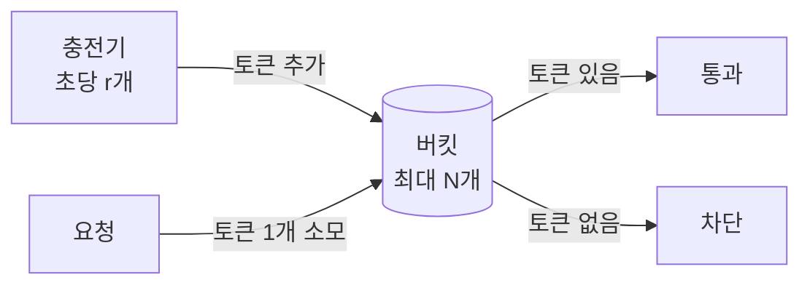
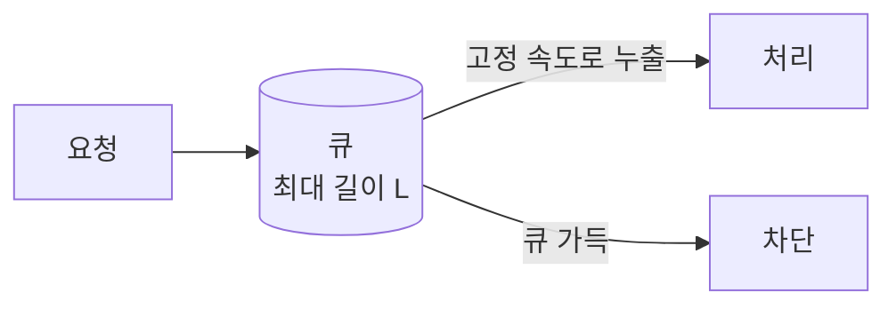
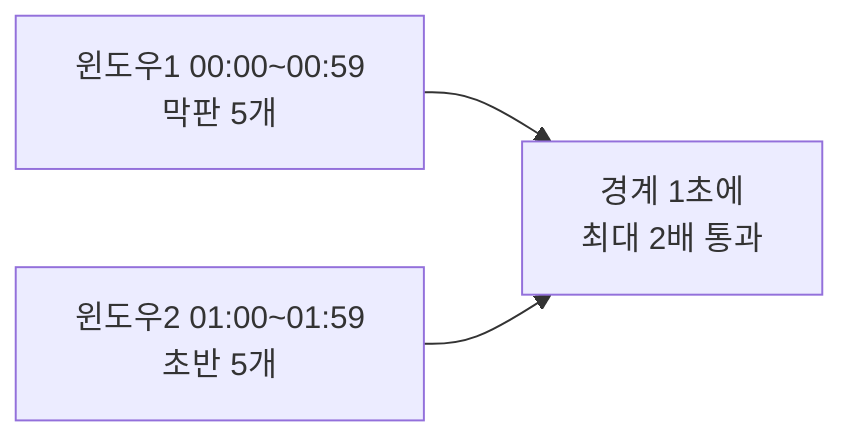
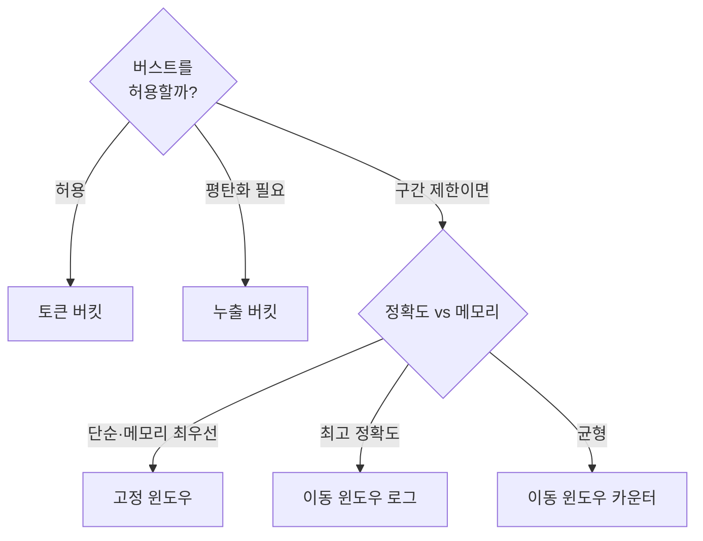

# STEP 1. 처리율 제한 알고리즘 — 무엇을 기준으로 셀까

> 설계의 출발점. 어떤 알고리즘을 고르느냐가 **메모리·정확도·버스트 허용** 트레이드오프를 결정한다.
> 이 노트는 5가지 알고리즘을 **동작 원리 → 수식 → 의사코드 → 수치 예시 → Redis 구현 → 장단점** 순으로 깊게 본다.

---

## 0. 먼저: "처리율 제한"의 두 축

모든 알고리즘은 결국 아래 두 질문에 답하는 방식이 다를 뿐이다.

1. **무엇을 세는가** — 요청 개수? 토큰 잔량? 큐 길이?
2. **시간을 어떻게 다루는가** — 딱 끊어진 구간(고정 윈도우)? 흘러가는 구간(이동 윈도우)? 연속 충전(버킷)?

| 분류     | 알고리즘                          | 시간 모델                    |
| ------ | ----------------------------- | ------------------------ |
| 버킷 계열  | 토큰 버킷, 누출 버킷                  | 연속(시간에 비례해 토큰 충전 / 큐 누출) |
| 윈도우 계열 | 고정 윈도우, 이동 윈도우 로그, 이동 윈도우 카운터 | 구간 기반                    |

---

## 1. 5가지 알고리즘 한눈에

| 알고리즘       | 핵심 동작                      | 버스트 |   메모리    |  정확도   | 약점           |
| ---------- | -------------------------- | :-: | :------: | :----: | ------------ |
| 토큰 버킷      | 토큰을 일정 속도로 채우고, 요청마다 1개 소모 | 허용  | 적음(값 2개) |   높음   | 파라미터 튜닝      |
| 누출 버킷      | 큐에 담아 **고정 속도**로 처리        | 억제  | 적음(큐+값)  |   높음   | 최신 요청이 밀림    |
| 고정 윈도우 카운터 | 단위 시간마다 카운트 리셋             |  —  | 적음(값 1개) |   낮음   | **경계 2배 폭주** |
| 이동 윈도우 로그  | 요청 타임스탬프를 전부 저장            |  —  |  **큼**   | **최고** | 메모리 비쌈       |
| 이동 윈도우 카운터 | 로그 + 고정 윈도우의 절충(근사)        |  —  | 중간(값 2개) |   높음   | 근사 오차        |

---

## 2. 토큰 버킷 (Token Bucket)

### 동작 원리
- 용량 **N** 개짜리 버킷이 있고, 토큰이 **초당 r개** 속도로 채워진다(가득 차면 넘침=버림).
- 요청이 오면 토큰 1개를 소모. 토큰이 있으면 **통과**, 없으면 **차단**.



### 파라미터의 의미
- **버킷 크기 N** = 한 번에 허용하는 **최대 버스트**(순간 폭주 허용량).
- **충전율 r** = 장기적으로 허용하는 **평균 처리율**.
- 예: `N=10, r=2/s` → 평소엔 초당 2개지만, 토큰이 쌓여 있으면 한 번에 최대 10개까지 몰아서 통과 가능.

### 의사코드 (지연 충전 lazy refill 방식)
```text
state: tokens, last_refill_time   # 키마다 저장

on_request(now):
    elapsed = now - last_refill_time
    tokens = min(N, tokens + elapsed * r)   # 흐른 시간만큼 충전
    last_refill_time = now
    if tokens >= 1:
        tokens -= 1
        return ALLOW
    else:
        return REJECT
```
> 백그라운드 타이머로 채우지 않고, **요청이 올 때 "그동안 흘렀어야 할 토큰"을 계산**하는 게 실무 구현(저장값 2개면 끝).

### 수치 예시 (N=4, r=1/s)
| 시각 | 사건 | 충전 후 토큰 | 결과 |
| --- | --- | --- | --- |
| 0s | 버킷 가득 | 4 | — |
| 0s | 요청 4개 연속 | 4→0 | 4개 통과(버스트) |
| 0s | 5번째 요청 | 0 | 차단 |
| 2s | 요청 | 0+2=2 | 통과(1 소모→1) |

### 장단점
- ✅ 버스트 허용 + 평균 제한을 **동시에** 표현. 메모리 적음(값 2개). 가장 범용적.
- ❌ N·r 튜닝 감각이 필요. 분산 환경에선 토큰 갱신의 원자성 주의(STEP 3).
- 🏢 Amazon, Stripe 등 다수가 채택.

---

## 3. 누출 버킷 (Leaky Bucket)

### 동작 원리
- 요청을 **FIFO 큐**에 담고, **고정 속도**로 하나씩 꺼내 처리. 큐가 가득 차면 새 요청을 버린다.
- "물이 일정 속도로 새는 양동이" 비유. 출력 속도가 **항상 일정**.



### 파라미터
- **큐 크기 L** = 버퍼링 가능한 요청 수.
- **누출 속도** = 처리율(예: 초당 2건).

### 토큰 버킷과의 핵심 차이
| | 토큰 버킷 | 누출 버킷 |
| --- | --- | --- |
| 버스트 | **허용**(토큰 쌓이면 몰아 통과) | **억제**(항상 고정 속도) |
| 출력 패턴 | 들쭉날쭉 가능 | **평탄** |
| 목적 | 사용자 한도 | 다운스트림 보호 |

### 장단점
- ✅ 출력이 일정해 **다운스트림(DB·외부 API)을 안정적으로 보호**.
- ❌ 버스트 흡수 불가, 큐가 길면 **오래된 요청이 늦게 처리**되어 최신성 저하. 큐 메모리 필요.

---

## 4. 고정 윈도우 카운터 (Fixed Window Counter)

### 동작 원리
- 시간을 **고정 구간**(예: 1분)으로 끊고, 구간마다 카운터를 0으로 리셋. 구간 내 카운트가 limit을 넘으면 차단.

```text
[00:00 ~ 00:59]  count: 0 → limit   → 01:00에 0으로 리셋
```

### 의사코드
```text
key = target + ":" + floor(now / window)   # 분 단위 버킷 키
count = INCR(key)
if count == 1: EXPIRE(key, window)
return count <= limit ? ALLOW : REJECT
```

### ⚠️ 치명적 허점 — 경계 폭주(boundary burst)
limit=5, 윈도우=1분일 때:
- `00:00:59`에 5개 + `01:00:00`에 5개 → **약 1초 사이에 10개**가 통과.
- 즉 **순간 처리율이 한도의 2배**까지 샐 수 있다.



### 장단점
- ✅ 구현 **가장 단순**, 메모리 최소(키당 정수 1개), Redis `INCR`+`EXPIRE`로 끝.
- ❌ 경계 폭주로 **정확도 낮음**. 엄격한 제한이 필요한 곳엔 부적합.

---

## 5. 이동 윈도우 로그 (Sliding Window Log)

### 동작 원리
- 요청이 올 때마다 **타임스탬프를 저장**. "지금부터 과거 윈도우(예: 1분)" 안에 있는 타임스탬프 개수만 센다.
- 윈도우를 벗어난 오래된 타임스탬프는 제거.

### 의사코드 (Redis Sorted Set)
```text
on_request(now):
    ZREMRANGEBYSCORE(key, 0, now - window)   # 만료 타임스탬프 제거
    count = ZCARD(key)                       # 현재 윈도우 내 개수
    if count < limit:
        ZADD(key, now, now)                  # 통과 시 기록
        EXPIRE(key, window)
        return ALLOW
    else:
        return REJECT
```

### 수치 예시 (limit=3, window=60s)
| 시각 | 윈도우(과거 60s) 내 기록 | 개수 | 결과 |
| --- | --- | --- | --- |
| 10s | [10] | 1 | 통과 |
| 20s | [10,20] | 2 | 통과 |
| 30s | [10,20,30] | 3 | 통과 |
| 40s | [10,20,30] (40은 거부, 보통 미기록) | 3 | 차단 |
| 71s | [20,30] (10 만료) | 2 | 통과 |

### 장단점
- ✅ 경계 폭주 없음, **가장 정확**(어떤 60초 구간을 잡아도 limit 보장).
- ❌ 요청마다 타임스탬프 저장 → **메모리 사용 큼**. 트래픽이 많을수록 저장량 폭증(거부된 요청까지 기록하면 더 나쁨).

---

## 6. 이동 윈도우 카운터 (Sliding Window Counter)

### 동작 원리
- 고정 윈도우의 단순함 + 이동 윈도우의 정확성을 **절충**. 현재 윈도우와 **직전 윈도우 카운트를 겹친 비율로 가중 합산**해 근사한다.

### 수식
```text
추정치 = 현재_윈도우_요청수
       + 직전_윈도우_요청수 × (현재 윈도우에서 직전 윈도우가 겹치는 비율)
```

### 수치 예시
- 윈도우=1분, limit=100. 직전 1분에 80개, 현재 1분에 30개.
- 현재 시각이 새 윈도우 시작 후 **30초(=50% 지점)** 라면 직전 윈도우와 50% 겹침:
```text
추정치 = 30 + 80 × (1 - 0.5) = 30 + 40 = 70  ≤ 100 → 통과
```
> 직전 윈도우 트래픽을 "시간이 지난 만큼 비례해 점점 잊는" 방식. 경계 폭주가 매끄럽게 완화된다.

### 장단점
- ✅ 로그보다 **메모리 훨씬 적음**(윈도우당 카운트 2개), 고정 윈도우의 경계 폭주를 **완화**. 정확도/비용 균형이 좋아 실무 인기(예: Cloudflare).
- ❌ "요청이 윈도우 내 균등 분포"라는 **가정에 기반한 근사** → 약간의 오차. 단, 실측상 오차는 작은 편(클라우드플레어 보고 ~0.003% 수준).

---

## 7. 어떤 걸 고를까 (4장 요구사항 매핑)

| 요구사항             | 유리한 선택                   | 이유         |
| ---------------- | ------------------------ | ---------- |
| 적은 메모리           | 토큰/누출 버킷, 고정 윈도우         | 키당 값 1~2개  |
| 정확한 제한           | 이동 윈도우 로그 > 카운터 > 고정 윈도우 | 경계 폭주 유무   |
| 버스트 허용           | 토큰 버킷                    | 토큰 잔량으로 흡수 |
| 출력 평탄화(다운스트림 보호) | 누출 버킷                    | 고정 누출 속도   |
| 메모리·정확도 균형       | 이동 윈도우 카운터               | 근사로 둘 다 챙김 |

### 의사결정 가이드


> **실무 기본값**: 범용 사용자 한도는 **토큰 버킷**, 정확/메모리 균형이 필요하면 **이동 윈도우 카운터**.
> 1차 설계에선 "왜 이걸 골랐고 무엇을 포기했는지"를 말할 수 있으면 충분하다.

---

## 8. 알고리즘 ↔ Redis 자료구조 요약

| 알고리즘 | Redis 구현 | 핵심 명령 |
| --- | --- | --- |
| 고정 윈도우 | 문자열 카운터 | `INCR` + `EXPIRE` |
| 토큰 버킷 | Hash(tokens, ts) + Lua | `HGET/HSET` 원자 갱신 |
| 이동 윈도우 로그 | Sorted Set | `ZADD`/`ZREMRANGEBYSCORE`/`ZCARD` |
| 이동 윈도우 카운터 | Hash(직전·현재 카운트) | `HINCRBY` + 계산 |

> 동시성/원자성(경쟁 조건) 처리는 STEP 3에서 상세히 다룬다.

---

## ✅ STEP 1 체크리스트

- [ ] 5가지 알고리즘의 동작을 각각 한 줄로 설명할 수 있다
- [ ] 토큰 버킷의 파라미터(N, r)가 각각 무엇을 의미하는지 안다
- [ ] 토큰 버킷과 누출 버킷의 차이(버스트 허용 vs 평탄화)를 안다
- [ ] 고정 윈도우의 "경계 2배 폭주"를 수치 예시로 설명할 수 있다
- [ ] 이동 윈도우 로그가 정확하지만 메모리가 큰 이유를 안다
- [ ] 이동 윈도우 카운터의 가중 합산 수식을 직접 계산할 수 있다
- [ ] 내 설계가 어떤 알고리즘을 왜 골랐는지 요구사항과 연결해 말할 수 있다

---

## 💬 예상 면접 질문

**Q1. 토큰 버킷의 두 파라미터는 무엇을 의미하나?**
> 버킷 크기 N = **최대 버스트 허용량**, 충전율 r = **평균 허용 처리율**. 토큰이 쌓여 있으면 순간적으로 N개까지 몰아 통과시키되, 장기적으론 r로 수렴한다.

**Q2. 토큰 버킷과 누출 버킷의 차이는?**
> 토큰 버킷은 토큰이 쌓이면 **버스트를 허용**한다. 누출 버킷은 큐에서 **고정 속도로** 빼내 출력을 평탄화한다. 다운스트림 보호가 중요하면 누출, 순간 트래픽을 허용하고 싶으면 토큰.

**Q3. 고정 윈도우 카운터의 문제와 해결책은?**
> 윈도우 **경계에서 최대 2배**가 통과한다(앞 윈도우 막판 5개 + 뒤 윈도우 초반 5개 = 1초에 10개). 이동 윈도우 로그(정확/메모리 큼) 또는 이동 윈도우 카운터(가중 근사)로 완화한다.

**Q4. 이동 윈도우 로그가 가장 정확한데 왜 항상 쓰지 않나?**
> 요청마다 타임스탬프를 저장해 **메모리 비용이 크다**. 트래픽이 많으면 저장량이 폭증하고, 거부된 요청까지 기록하면 더 나쁘다. 그래서 메모리 제약이 있으면 이동 윈도우 카운터로 근사한다.

**Q5. 이동 윈도우 카운터는 어떻게 근사하나? 정확한가?**
> 현재 윈도우 카운트 + 직전 윈도우 카운트 × 겹치는 비율로 추정한다. "균등 분포" 가정 기반의 근사라 오차가 있지만, 실측상 매우 작아(클라우드플레어 기준 0.003%대) 실무에서 널리 쓴다.

**Q6. 메모리가 중요한 요구사항이면 어떤 알고리즘을 쓰겠나?**
> 토큰 버킷(키당 값 2개)이나 고정/이동 윈도우 카운터. 정확도가 더 중요하면 카운터, 버스트 허용·단순함이 중요하면 토큰 버킷.

➡️ 다음: [STEP 2 — 제한 장치를 어디에 둘까](02_STEP2_제한장치_배치_아키텍처.md)
