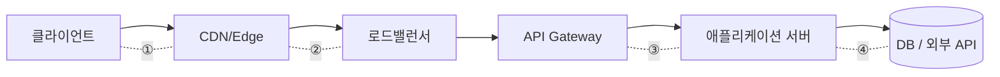
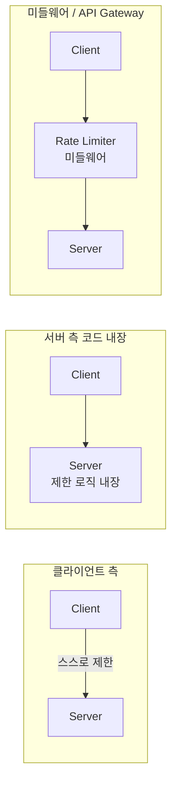
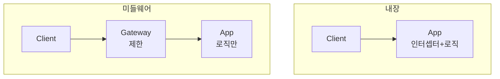
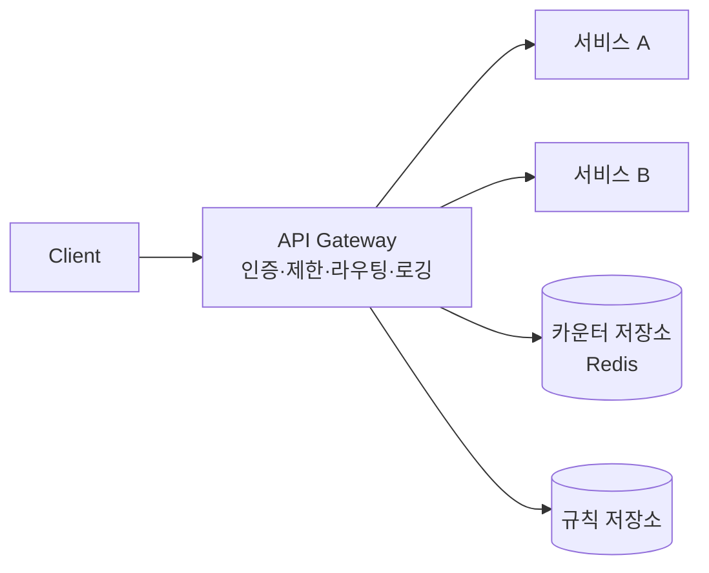
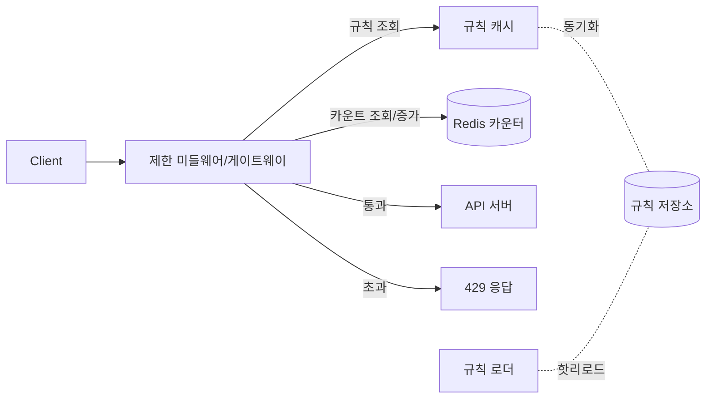

# STEP 2. 제한 장치를 어디에 둘까 — 배치 / 아키텍처

> 알고리즘을 정했으면, 그 로직이 **요청 경로의 어디에서** 실행될지 정해야 한다.
> 이 노트는 배치 위치 3가지 → API Gateway → 분리 vs 내장 판단 → 규칙 설계 → 전체 컴포넌트를 깊게 본다.

---

## 0. 요청 경로 위에서 "어디에 끼울까"

요청은 보통 이 경로를 지난다. 제한 장치는 이 중 한 지점(또는 여러 지점)에 끼운다.



| 지점 | 배치 의미 | 특징 |
| --- | --- | --- |
| ① 클라이언트 | 클라이언트 측 제한 | 강제력 없음(보조) |
| ② CDN/Edge | 엣지 제한 | 사용자와 가장 가까움, DDoS 1차 방어 |
| ③ Gateway/미들웨어 | 서버 진입 공통 제한 | **가장 일반적** |
| ④ 앱 내부 | 코드 내장 제한 | 비즈니스 컨텍스트 풍부 |

> "한 곳"이 아니라 **계층 방어(defense in depth)** 로 여러 지점에 둘 수도 있다(엣지=거친 DDoS 차단, 게이트웨이=정밀 사용자 한도).

---

## 1. 세 가지 핵심 배치 위치 비교



| 위치 | 장점 | 단점 |
| --- | --- | --- |
| **클라이언트 측** | 서버 부하 없음, 빠른 UX 피드백 | **신뢰 불가** — 위조/우회 가능. 강제력 없음 |
| **서버 측(코드 내장)** | 제어 쉬움, 컨텍스트 풍부, 인프라 단순 | 서비스마다 중복 구현, 언어/프레임워크 종속 |
| **미들웨어 / API Gateway** | 서비스와 **분리**, 공통 적용, 언어 무관 | 인프라 1계층 추가, 게이트웨이가 병목/SPOF |

> **결론**: 강제력이 필요하므로 클라이언트 측은 보조일 뿐. 일반적으로 **API Gateway / 미들웨어**에 두어 모든 서비스에 공통 적용. (4장 면접에서도 "서버 측" 가정)

---

## 2. 왜 클라이언트 측만으로는 안 되는가 (상세)

- 클라이언트 코드(JS, 모바일 앱)는 **사용자가 변조 가능** → 제한 우회.
- API를 직접 호출하는 **서드파티/봇**은 클라이언트 제한 로직을 아예 안 거침.
- 위조된 요청·헤더를 신뢰할 수 없음.

➡️ 클라이언트 측 제한의 **유일한 정당한 용도**: UX 개선(요청 보내기 전에 버튼 비활성화 등). **강제는 항상 서버에서.**

---

## 3. 서버 측: 코드 내장 vs 미들웨어 — 같은 "서버 측" 안의 두 갈래

### 3-1. 코드 내장 (애플리케이션 인터셉터/필터)
- 예: Spring `HandlerInterceptor`, Express 미들웨어 함수, 데코레이터.
- **장점**: 사용자 등급·요청 본문 등 **풍부한 비즈니스 컨텍스트**에 접근. 별도 인프라 불필요.
- **단점**: 서비스마다 재구현, 언어 종속, 정책 변경 시 각 서비스 배포.

### 3-2. 미들웨어 / 리버스 프록시 / API Gateway
- 요청이 앱에 닿기 **전에** 별도 계층에서 차단.
- **장점**: 한 곳에서 모든 서비스 보호, 언어 무관, 앱은 비즈니스 로직만.
- **단점**: 계층 추가, 게이트웨이 운영·이중화 필요.



---

## 4. API Gateway 깊게 보기

### 정의
- 클라이언트와 백엔드 서비스 **앞단**에서 모든 요청을 받는 단일 진입점(프록시 계층).

### 담당 기능 (제한은 그중 하나)
| 기능 | 설명 |
| --- | --- |
| 처리율 제한 | 본 주제 |
| 인증/인가 | 토큰 검증, API Key 확인 |
| SSL 종료 | TLS 복호화 |
| 라우팅 | 경로별 백엔드 분배 |
| 로깅/모니터링 | 요청 기록, 메트릭 |
| 화이트/블랙리스트 | IP 필터링 |



### 대표 제품
- **Nginx**(limit_req 모듈), **Kong**, **Envoy**, **Spring Cloud Gateway**, **AWS API Gateway**, **Cloudflare**, **Apigee**.

### 마이크로서비스에서 특히 유리
- 서비스가 수십 개면 각자 제한을 구현하는 건 비효율 → 게이트웨이에서 **횡단 관심사(cross-cutting concern)** 로 일괄 처리.

---

## 5. 독립 서비스 vs 코드 내장 — 판단 기준

4장 대화에서 면접관은 **"본인이 결정하라"** 고 한다. 정답이 아니라 **기준을 대는 것**이 핵심.

| 고려 요소 | 코드 내장 유리 | 별도 서비스/게이트웨이 유리 |
| --- | --- | --- |
| 서비스 수 | 적음(1~2개) | 많음(공통 적용 필요) |
| 기술 스택 | 단일 언어 | 다양(언어 무관 필요) |
| 운영 역량 | 게이트웨이 운영 부담 큼 | 인프라/플랫폼 팀 보유 |
| 커스텀 규칙 | 단순 | 유연한 규칙 엔진 필요 |
| 지연 민감도 | 추가 홉 없음(약간 유리) | 네트워크 홉 1개 추가 |
| 회사 규모 | 스타트업 | 대규모 트래픽 기업 |

> 4장은 "다양한 형태의 제어 규칙을 정의하는 **유연한 시스템**" + "대규모 요청" + "분산" 을 요구 → **별도 미들웨어/게이트웨이 + 규칙 저장소 + Redis** 방향이 자연스럽다.

---

## 6. 제어 규칙(throttling rule) 설계

"무엇을, 누구에게, 얼마나" 를 **코드가 아니라 데이터**로 표현해야 유연하다.

### 규칙의 구성 요소
- **제한 대상(누구)**: userId / IP / API Key / 테넌트(서비스)
- **제한 차원(무엇)**: 전체 요청 / 특정 엔드포인트 / 쓰기 요청만
- **한도(얼마나)**: 단위 시간당 요청 수 (초·분·시간)
- **초과 시 동작**: 거부(429) / 큐잉 / 지연

```yaml
# 규칙 예시 (Lyft ratelimit 스타일)
- domain: messaging
  descriptors:
    - key: user_id
      rate_limit:
        unit: minute
        requests_per_unit: 60
    - key: api_endpoint
      value: /upload
      rate_limit:
        unit: hour
        requests_per_unit: 100
```

### 규칙 저장·갱신
- 규칙은 **설정 파일/DB**에 두고 메모리에 캐시, **핫리로드**로 코드 배포 없이 정책 변경.
- 자주 읽으므로 캐시(작업 서버 메모리)에 올리고 주기적 동기화.

---

## 7. 제한 기준(키) 선택 — 무엇으로 식별할까

| 기준 | 장점 | 단점 |
| --- | --- | --- |
| **IP 주소** | 인증 전에도 적용, 간단 | NAT/공유 IP면 여러 사용자 묶임, IPv6 남용 |
| **User ID** | 사용자 단위 정확 | 로그인 필요(인증 후) |
| **API Key** | 서드파티/플랜별 차등 | 키 발급 체계 필요 |
| **디바이스 ID** | 비로그인 식별 | 위조 가능 |

> 실무에선 **여러 기준을 조합**(예: 비로그인=IP, 로그인=userId, 외부=API Key). 4장 사례의 "IP당 하루 10계정", "디바이스당 주 5회 리워드"가 바로 기준이 다른 예시다.

---

## 8. 전체 컴포넌트 구성 (배치 종합)



- **제한 미들웨어**: 알고리즘 실행 + 통과/차단 결정
- **규칙 저장소 + 캐시**: 유연한 정책 관리(STEP2 핵심)
- **Redis**: 카운터 공유(STEP3에서 상세)
- 초과 시 429 반환(STEP4)

---

## ✅ STEP 2 체크리스트

- [ ] 요청 경로에서 제한 장치를 끼울 수 있는 지점들을 나열할 수 있다
- [ ] 클라이언트/서버/미들웨어 배치의 장단점을 비교할 수 있다
- [ ] 왜 클라이언트 측 제한만으로는 안 되는지 구체적으로 설명할 수 있다
- [ ] 코드 내장 vs 미들웨어의 판단 기준을 5개 이상 댈 수 있다
- [ ] API Gateway의 역할과 제한 장치를 거기 두는 이점을 안다
- [ ] 제어 규칙을 데이터로 분리하는 이유(유연성)를 안다
- [ ] 제한 기준(IP/userId/API Key)의 트레이드오프를 안다

---

## 💬 예상 면접 질문

**Q1. 처리율 제한을 클라이언트 측에 두면 안 되는 이유는?**
> 클라이언트는 **신뢰할 수 없다**. JS/앱 코드는 변조 가능하고, API를 직접 호출하는 봇·서드파티는 클라이언트 로직을 안 거친다. 클라이언트 제한은 UX 보조(선제 차단)로만 쓰고, 강제는 서버/게이트웨이에서 한다.

**Q2. 코드 내장과 미들웨어, 둘 다 "서버 측"인데 어떻게 다른가?**
> 코드 내장은 앱 안 인터셉터에서 실행 — 비즈니스 컨텍스트가 풍부하지만 서비스마다 중복. 미들웨어는 앱 도달 전 별도 계층에서 차단 — 언어 무관·공통 적용이지만 계층 추가·이중화 필요.

**Q3. 제한 로직을 API Gateway에 두는 장단점은?**
> 장점: 모든 서비스에 **공통 적용**, 언어 무관, 인증·로깅 등과 함께 횡단 관심사로 처리, 앱은 비즈니스 로직 집중. 단점: 인프라 계층 추가, 게이트웨이가 병목/SPOF가 될 수 있어 **이중화** 필요, 네트워크 홉 1개 추가.

**Q4. 별도 서비스로 만들지, 코드에 넣을지 어떻게 정하나?**
> 서비스 수·기술 스택 다양성·운영 역량·규칙 복잡도·지연 민감도로 판단. 서비스가 많고 다양한 규칙·언어가 섞이면 **별도 미들웨어 + 규칙 저장소**, 단순한 단일 서비스면 코드 내장.

**Q5. 무엇을 기준으로 제한할 것인가? IP면 충분한가?**
> IP는 인증 전에도 쓸 수 있지만 NAT/공유 IP에서 여러 사용자가 묶이는 문제가 있다. 보통 비로그인=IP, 로그인=userId, 외부 연동=API Key로 **기준을 조합**한다.

**Q6. 유연한 규칙 시스템은 어떻게 만드나?**
> 제한 규칙을 코드가 아니라 **데이터(설정/DB)** 로 표현하고, 메모리에 캐시 + 핫리로드해서 배포 없이 정책을 바꾼다. 대상·차원·한도·초과 동작을 규칙 스키마로 정의한다.

➡️ 다음: [STEP 3 — 분산 카운팅(Redis·동시성)](03_STEP3_분산카운팅_Redis_동시성.md)
