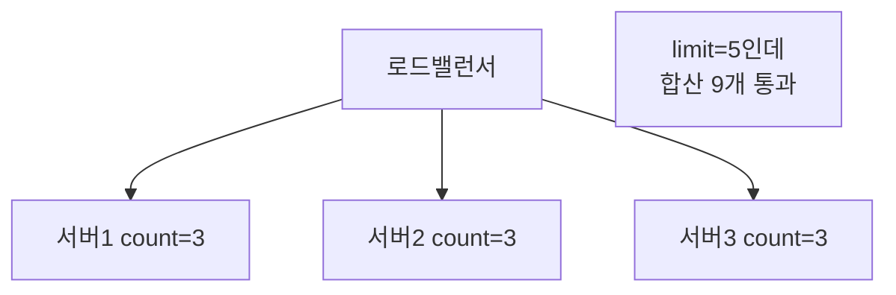
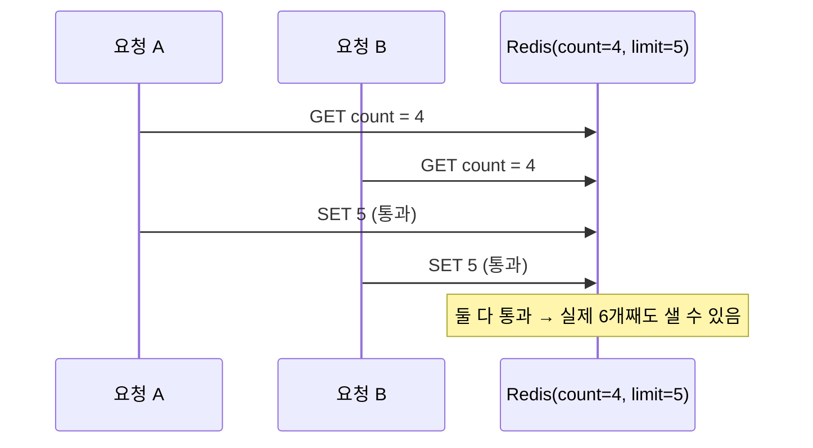

# STEP 3. 분산 카운팅 — Redis · 동시성

> "분산형 처리율 제한" 요구사항의 본체. 여러 서버가 **하나의 카운터를 공유**해야 한다.
> 이 노트는 왜 공유 저장소가 필요한지 → 왜 Redis인지 → 명령어/구현 → 경쟁 조건 → Lua → 확장/병목까지 깊게 본다.

---

## 0. 분산이 만드는 문제의 본질

처리율 제한은 결국 **"카운터를 읽고-검사하고-갱신"** 하는 일이다.
서버가 한 대일 땐 메모리 변수로 충분하지만, 분산되면 두 가지가 동시에 깨진다.

1. **상태 분산** — 카운터가 서버마다 따로 존재 → 전체 한도가 안 맞음
2. **동시성** — 여러 요청이 같은 카운터를 동시에 건드림 → 경쟁 조건

> 이 STEP은 1번을 **공유 저장소(Redis)** 로, 2번을 **원자적 연산/Lua** 로 푼다.

---

## 1. 왜 로컬 메모리 변수로는 안 되는가

서버가 여러 대면 각 서버의 로컬 카운터가 **따로 논다**.



### 임시방편과 그 한계
| 방편 | 내용 | 한계 |
| --- | --- | --- |
| 고정 세션(sticky session) | 같은 사용자를 항상 같은 서버로 | LB 유연성 상실, 서버 죽으면 상태 소실, 확장 어려움 |
| 서버 간 카운터 동기화(브로드캐스트) | 서로 카운트를 전파 | 노드 수²의 통신, 지연·복잡도 폭증 |
| **중앙 공유 저장소** | 모두가 같은 저장소를 봄 | ✅ 사실상 표준 해법 |

➡️ **모든 제한 장치가 공유하는 중앙 저장소**가 필요하다. 그 표준이 **Redis**.

---

## 2. 왜 Redis 인가 (RDB가 아니라)

| 요구사항 | Redis가 맞는 이유 |
| --- | --- |
| 낮은 응답시간 | **인메모리** → 마이크로초 단위 read/write |
| 적은 메모리 / 자동 정리 | **TTL(EXPIRE)** 로 윈도우 지나면 자동 삭제 |
| 정확한 카운팅 | `INCR`, `EXPIRE`, Lua 등 **원자적 연산** 제공 |
| 분산 공유 | 모든 제한 장치 노드가 같은 Redis를 바라봄 |
| 고빈도 쓰기 | 카운터는 매 요청 갱신 → 쓰기 부하에 강함 |

- 디스크 기반 RDB는 매 요청 read/write 하기엔 **너무 느려** HTTP 지연 요구를 깬다.
- 또 RDB는 만료 데이터를 직접 청소해야 하지만 Redis는 **TTL로 자동 정리** → 메모리 요구사항에 부합.

---

## 3. 핵심 명령어와 자료구조

```text
INCR key            # 카운터 +1 (원자적), 없으면 0에서 시작
INCRBY key n        # n만큼 증가
EXPIRE key 60       # 60초 후 자동 삭제 → 윈도우 리셋
SET key v EX 60 NX  # 없을 때만 TTL과 함께 생성
TTL key             # 남은 만료 시간
```

| 알고리즘 | Redis 자료구조 | 사용 명령 |
| --- | --- | --- |
| 고정 윈도우 | String 카운터 | `INCR` + `EXPIRE` |
| 토큰 버킷 | Hash(tokens, ts) | `HGET/HSET` (+ Lua) |
| 이동 윈도우 로그 | Sorted Set | `ZADD`/`ZREMRANGEBYSCORE`/`ZCARD` |
| 이동 윈도우 카운터 | Hash(직전·현재) | `HINCRBY` + 계산 |

### 키 설계
```text
rate:{대상}:{윈도우}
예) rate:user:1234:1718700000     (분 단위 epoch)
    rate:ip:203.0.113.5:1718700000
```
- 키에 윈도우(시간 버킷)를 넣으면 윈도우가 바뀔 때 **자연스럽게 새 키** → 리셋 불필요.

---

## 4. 고정 윈도우 구현 — 그리고 숨은 버그

### 순진한 구현
```text
count = INCR(key)
if count == 1: EXPIRE(key, window)   # 첫 요청에만 TTL
if count > limit: reject(429)
else: allow
```

### ⚠️ 숨은 버그: INCR과 EXPIRE 사이의 틈
- `INCR`로 count=1을 만든 직후, `EXPIRE`를 걸기 **전에** 프로세스가 죽거나 지연되면
  → 그 키는 **TTL 없이 영원히 남아** 사용자가 영구 차단될 수 있다.
- 해결: **Lua 스크립트**로 `INCR + EXPIRE`를 한 원자 단위로 실행(§6) 또는 `SET ... EX NX`로 초기화.

---

## 5. 경쟁 조건 (Race Condition) — 가장 중요한 함정

`read → check → write` 를 **따로** 하면 동시 요청 사이에 끼어들어 카운트가 틀어진다.



> 핵심 원인: **검사(check)와 갱신(write)이 분리**되어 그 사이에 다른 요청이 끼어든다.

### 해결책 비교
| 방법 | 설명 | 정확도 | 성능 | 평가 |
| --- | --- | :---: | :---: | --- |
| **원자적 INCR** | read-modify-write를 한 명령으로 | 높음 | 최고 | 단순 카운트엔 최선 |
| **Lua 스크립트** | "검사+증가+TTL"을 **하나의 원자 단위**로 실행 | 높음 | 높음 | 복잡한 로직(이동 윈도우, 토큰 버킷) 권장 |
| **Redis 트랜잭션** (`MULTI/EXEC` + `WATCH`) | 낙관적 락 | 높음 | 중간 | 충돌 시 재시도 필요 |
| **분산 락** (Redlock 등) | 키를 잠그고 처리 | 높음 | **낮음** | 지연↑·처리량↓ → 보통 회피 |

> 락은 정확하지만 **느리다**. 처리율 제한은 빨라야 하므로 **원자적 연산/Lua**로 푸는 게 정석.

---

## 6. Lua 스크립트 — 원자성의 표준 해법

Redis는 Lua 스크립트를 **단일 스레드에서 원자적으로** 실행한다(중간에 다른 명령이 끼어들지 못함).

### 고정 윈도우 (검사+증가+TTL을 원자화)
```lua
-- KEYS[1]=키, ARGV[1]=limit, ARGV[2]=window(초)
local count = redis.call("INCR", KEYS[1])
if count == 1 then
    redis.call("EXPIRE", KEYS[1], ARGV[2])
end
if count > tonumber(ARGV[1]) then
    return 0   -- 차단
end
return 1       -- 통과
```

### 이동 윈도우 로그 (Sorted Set)
```lua
-- KEYS[1]=키, ARGV[1]=now, ARGV[2]=window, ARGV[3]=limit
redis.call("ZREMRANGEBYSCORE", KEYS[1], 0, ARGV[1] - ARGV[2])  -- 만료 제거
local count = redis.call("ZCARD", KEYS[1])
if count < tonumber(ARGV[3]) then
    redis.call("ZADD", KEYS[1], ARGV[1], ARGV[1])
    redis.call("EXPIRE", KEYS[1], ARGV[2])
    return 1   -- 통과
end
return 0       -- 차단
```

> 이 한 덩어리가 통째로 원자 실행되므로 §5의 경쟁 조건이 원천 차단된다.

---

## 7. 규모가 커지면 — Redis 자체의 확장/병목

단일 Redis도 SPOF·병목이 될 수 있다.

| 문제 | 해법 | 트레이드오프 |
| --- | --- | --- |
| 읽기 부하 | **복제(replica)** 로 읽기 분산 | 복제 지연으로 약간의 부정확 |
| 단일 노드 용량/처리량 | **클러스터(샤딩)** — 키 해시로 분배 | Lua의 멀티키 제약(같은 슬롯 필요) |
| 단일 장애점 | 복제 + 자동 failover(Sentinel/Cluster) | 페일오버 순간 카운트 유실 가능 |
| 글로벌(다중 리전) | 리전별 카운터 분리 | 전역 정확도 약간 포기 |

### 핫키(hot key) 문제
- 특정 사용자/IP에 트래픽이 집중되면 그 키가 있는 **샤드 한 곳에 부하 집중**.
- 완화: 키를 잘게 쪼개(샤드별 부분 카운터) 합산하거나, 로컬 캐시로 1차 흡수.

### 정확도 vs 성능 트레이드오프 (분산의 현실)
- 완벽한 전역 정확도를 고집하면 **모든 요청이 중앙 Redis를 거쳐** 지연·병목.
- 대규모에선 **로컬 카운터로 근사 + 주기적 동기화**(약간 초과 허용)를 택하기도 한다.

---

## 8. 동기화 문제 (여러 제한 장치 노드)

- 제한 장치 인스턴스가 여러 대여도 **상태는 Redis에 중앙화**되어 있으므로 노드 간 직접 동기화는 불필요.
- 단, 각 노드가 **규칙·일부 카운트를 로컬 캐시**한다면 그 캐시 동기화 주기가 정확도에 영향.

---

## ✅ STEP 3 체크리스트

- [ ] 로컬 메모리 카운터가 분산 환경에서 깨지는 이유를 설명할 수 있다
- [ ] 고정 세션이 왜 좋은 해법이 아닌지 안다
- [ ] 왜 RDB가 아니라 Redis인지(인메모리·TTL·원자성) 말할 수 있다
- [ ] `INCR` + `EXPIRE`의 숨은 버그(틈)와 해결책을 안다
- [ ] 경쟁 조건이 무엇이고 왜 생기는지 시퀀스로 설명할 수 있다
- [ ] 원자적 연산/Lua vs 트랜잭션 vs 분산 락의 트레이드오프를 안다
- [ ] Redis가 병목/SPOF일 때 복제·클러스터·핫키 대응을 안다

---

## 💬 예상 면접 질문

**Q1. 분산 환경에서 카운트 정합성은 어떻게 보장하나?**
> 모든 제한 장치가 **공유 Redis**를 바라보고, `INCR`(원자적) 또는 **Lua 스크립트**로 "검사+증가+TTL"을 한 번에 처리해 경쟁 조건을 없앤다.

**Q2. 왜 Redis를 쓰나? DB로는 안 되나?**
> 매 요청 read/write 하는데 RDB는 디스크 기반이라 **너무 느려** 지연 요구를 깬다. Redis는 인메모리라 빠르고, **TTL로 윈도우 만료를 자동 처리**하며 `INCR` 같은 원자 연산을 제공한다.

**Q3. 동시 요청이 몰리면 어떤 문제가 생기나?**
> read-check-write가 분리되면 여러 요청이 같은 값을 읽고 동시에 통과시켜 **카운트가 새는** 경쟁 조건이 발생. 원자적 연산이나 Lua로 묶어 해결한다.

**Q4. 락으로 풀면 안 되나?**
> 정확하지만 락 획득/해제가 **지연을 키우고 처리량을 떨어뜨려** 제한 장치의 "낮은 응답시간" 목표와 충돌한다. 그래서 원자적 연산/Lua를 선호한다.

**Q5. `INCR` 다음에 `EXPIRE`를 거는 코드의 문제는?**
> 둘 사이에 프로세스가 죽으면 키에 **TTL이 안 걸려 영구 잔존** → 사용자가 영영 차단될 수 있다. Lua로 둘을 원자화하거나 `SET ... EX NX`로 초기화한다.

**Q6. Redis가 병목/장애가 되면?**
> 복제로 읽기 분산, 클러스터로 키 샤딩, Sentinel/Cluster로 자동 failover. 핫키는 부분 카운터로 분산. 글로벌 규모에선 리전별 카운터로 나누고 **약간의 부정확성**을 트레이드오프로 수용한다.

**Q7. 완벽한 정확도와 성능 중 무엇을 택하나?**
> 전역 완벽 정확도는 모든 요청이 중앙 Redis를 거쳐 병목을 만든다. 대규모에선 **로컬 근사 + 주기 동기화**로 약간의 초과를 허용하고 성능을 얻는 트레이드오프가 흔하다.

➡️ 다음: [STEP 4 — 결함 감내 · HTTP 규약](04_STEP4_결함감내_HTTP규약.md)
