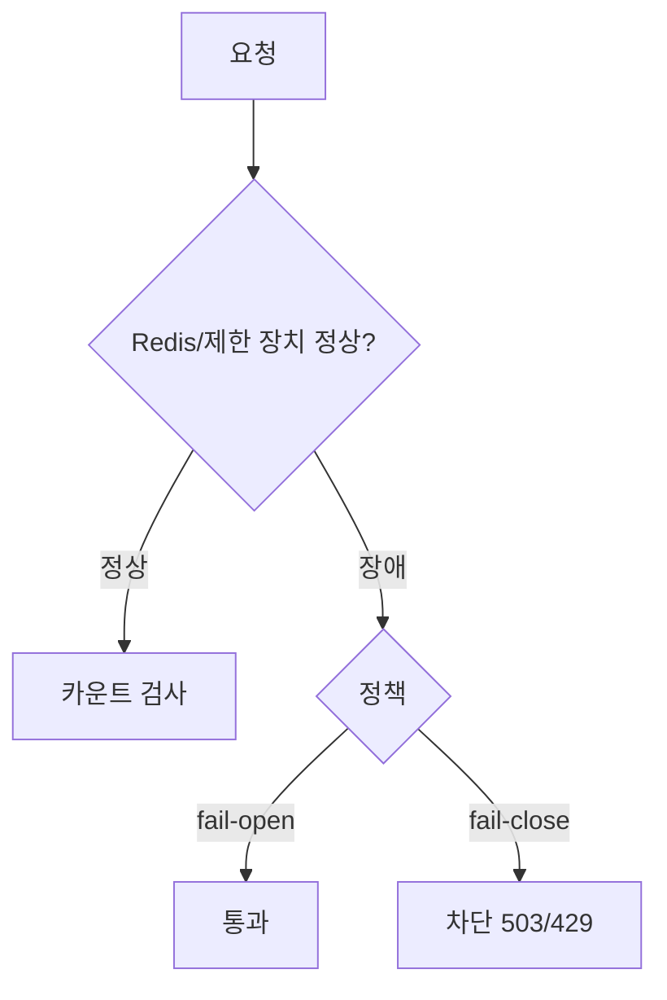
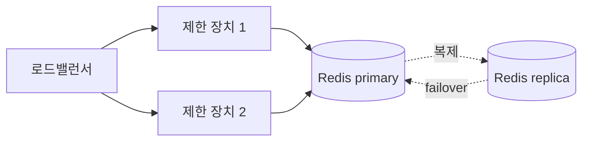
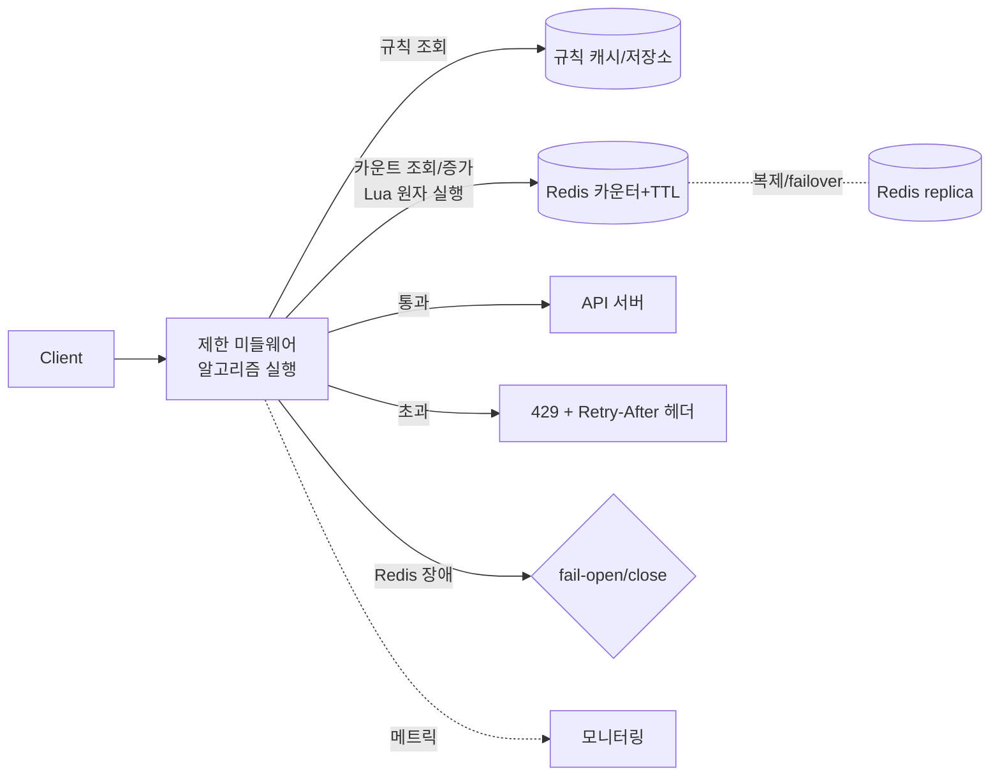

# STEP 4. 결함 감내 · 사용자 통지 (HTTP 규약)

> "제한 장치가 죽어도 전체 시스템은 살아야 한다" + "제한된 사실을 사용자에게 알려야 한다"
> 이 노트는 결함 감내(fail-open/close) → SPOF 제거 → HTTP 규약(429/헤더) → 초과 처리 전략 → 모니터링 → 전체 종합을 다룬다.

---

## 0. 두 요구사항을 다시 분리

4장 요구사항 중 이 STEP이 책임지는 둘:

| 요구사항 | 이 STEP의 답 |
| --- | --- |
| 높은 결함 감내성 — 제한 장치 장애가 전체에 전파되면 안 됨 | fail-open/close 정책 + 이중화 |
| 예외 처리 — 제한된 사실을 사용자에게 분명히 | HTTP 429 + 한도 안내 헤더 |

---

## 1. 결함 감내성 (Fault Tolerance)

처리율 제한의 카운터 저장소(Redis)나 미들웨어가 죽으면? 두 가지 정책이 있다.

| 정책 | 동작 | 위험 | 적합 |
| --- | --- | --- | --- |
| **fail-open** | 장애 시 **요청을 그냥 통과** | 과부하/남용에 무방비 | 가용성 최우선(대부분의 웹 서비스) |
| **fail-close** | 장애 시 **요청을 차단** | 정상 사용자도 막힘(서비스 중단) | 보안·과금이 치명적인 경우 |



### 어떻게 고를까
- **fail-open 기본**: "제한 장치 장애가 전체 시스템에 영향 X"라는 4장 요구사항에 부합. 제한은 본래 **보호 장치**이지 핵심 경로가 아니므로, 죽었다고 서비스 전체를 막는 건 과하다.
- **fail-close가 맞는 경우**: 로그인 시도(브루트포스 방어), 결제·과금 API, 무료 체험 남용 차단 — 통과시키면 **돈/보안 손실**이 큰 곳.
- **하이브리드**: 일반 경로는 fail-open, 민감 경로만 fail-close. → "선택과 이유를 말할 수 있는 게 핵심."

### 타임아웃·서킷 브레이커
- Redis 호출에 **짧은 타임아웃**(예: 수 ms)을 둬, 느려질 때 요청 전체가 지연되지 않게 한다.
- 연속 실패 시 **서킷 브레이커**로 Redis 호출을 잠시 끊고 fail-open으로 흐른 뒤 회복을 탐지.

---

## 2. SPOF(단일 장애점) 제거



| 컴포넌트 | SPOF 위험 | 대응 |
| --- | --- | --- |
| 제한 미들웨어 | 인스턴스 1개면 죽으면 전체 | **다중 인스턴스 + LB** |
| Redis | 단일 노드 죽으면 카운터 소실 | **복제 + Sentinel/Cluster failover** |
| 규칙 저장소 | 규칙 못 읽으면 정책 적용 불가 | 로컬 캐시(이전 규칙으로 버팀) |

---

## 3. 사용자 통지 — HTTP 규약

요청이 막혔다는 사실을 **명확히** 전달해야 한다.

### 상태 코드
- **429 Too Many Requests** — 처리율 초과의 표준 응답.
- (참고) 401/403은 인증·인가 실패용으로 의미가 다름. 제한은 429.

### 응답 헤더 (남은 한도 안내)
| 헤더 | 의미 |
| --- | --- |
| `X-RateLimit-Limit` | 윈도우당 허용 최대 요청 수 |
| `X-RateLimit-Remaining` | 현재 윈도우의 남은 허용 수 |
| `X-RateLimit-Reset` | 한도가 리셋되는 시각(또는 남은 초) |
| `Retry-After` | 몇 초/언제 뒤 재시도하면 되는지 |

```http
HTTP/1.1 429 Too Many Requests
Content-Type: application/json
X-RateLimit-Limit: 60
X-RateLimit-Remaining: 0
X-RateLimit-Reset: 1718700060
Retry-After: 30

{ "error": "rate_limit_exceeded", "message": "요청이 너무 많습니다. 30초 후 다시 시도하세요." }
```

> 헤더로 남은 한도를 알려주면 **클라이언트가 스스로 속도를 조절**(선제적 백오프)해 서버 부하도 준다. 표준화 흐름으로 `RateLimit-Limit/Remaining/Reset`(접두사 없는) 헤더도 있다.

---

## 4. 초과 요청 처리 전략

429로 즉시 거부 외에도 상황에 따라:

| 전략 | 설명 | 적합 |
| --- | --- | --- |
| **버리기(drop)** | 그냥 429 | 가장 단순, 대부분의 API |
| **큐잉/지연(throttle)** | 나중에 처리(누출 버킷 성향) | 중요한 비동기 작업, 메시지 처리 |
| **우선순위 처리** | 중요 요청 통과, 낮은 우선순위만 제한 | 등급제 서비스 |
| **샤드별 차등** | 무료/유료 플랜별 다른 한도 | SaaS 멀티테넌트 |

---

## 5. 모니터링 — 제한이 잘 동작하는지

- **지표**: 차단율(429 비율), 통과/차단 수, 알고리즘별 효과, Redis 지연.
- **검증 포인트**:
  - 한도가 너무 빡빡 → 정상 사용자가 차단(false positive) → 한도/알고리즘 조정.
  - 한도가 너무 느슨 → 버스트가 다 통과 → 알고리즘 변경(고정 윈도우→이동 윈도우).
- 규칙 변경은 핫리로드(STEP2)로 배포 없이 즉시 반영하고 지표로 효과 확인.

---

## 6. 전체 아키텍처 종합



### 요청 처리 흐름 (종합)
1. 요청 도착 → 미들웨어가 **규칙 조회**(대상·한도) — STEP2
2. **알고리즘** 적용해 Redis 카운터를 **Lua로 원자 증가/검사** — STEP1·3
3. 한도 이내 → 통과 / 초과 → **429 + 헤더** — STEP4
4. Redis 장애 → **타임아웃 후 fail-open/close** 정책대로 — STEP4
5. 모든 결과를 **모니터링**으로 관측, 규칙 핫리로드로 조정

---

## ✅ STEP 4 체크리스트

- [ ] fail-open과 fail-close의 차이·위험·적합 상황을 안다
- [ ] 내 설계가 어떤 정책을 왜 택했는지 말할 수 있다
- [ ] 타임아웃/서킷 브레이커가 왜 필요한지 안다
- [ ] 제한 장치와 Redis의 SPOF를 각각 어떻게 없애는지 안다
- [ ] 429와 `Retry-After`/`X-RateLimit-*` 헤더의 역할을 안다
- [ ] 초과 요청 처리 전략(거부/큐잉/우선순위)을 비교할 수 있다
- [ ] 제한이 잘 동작하는지 어떤 지표로 검증하는지 안다
- [ ] 전체 흐름을 한 장의 그림으로 설명할 수 있다

---

## 💬 예상 면접 질문

**Q1. Redis(카운터 저장소)가 죽으면 제한 정책은 어떻게 동작하나?**
> **fail-open / fail-close** 중 선택. 가용성 우선 서비스는 fail-open(통과)으로 전체 장애 전파를 막고, 보안·과금이 치명적이면 fail-close(차단). 보통 fail-open을 기본으로 하되 민감 경로만 fail-close를 섞는다. 추가로 Redis 호출에 **타임아웃**을 둬 느려질 때 요청 전체가 지연되지 않게 한다.

**Q2. fail-open이 위험하지 않나?**
> 장애 동안 남용·과부하에 무방비라는 위험이 있다. 하지만 제한 장치는 본래 보호 장치이지 핵심 경로가 아니므로, 그게 죽었다고 서비스 전체를 막는 fail-close가 오히려 더 큰 피해일 수 있다. 그래서 일반 경로는 fail-open, 결제·로그인 같은 민감 경로만 fail-close로 한다.

**Q3. 사용자에게 제한 사실을 어떻게 알리나?**
> **HTTP 429**와 함께 `Retry-After`(언제 재시도), `X-RateLimit-Limit/Remaining/Reset` 헤더를 준다. 클라이언트가 선제적으로 백오프할 수 있어 서버 부하도 준다.

**Q4. 이 구조의 단일 장애 지점은? 어떻게 없애나?**
> 카운터 저장소(Redis)와 제한 미들웨어. Redis는 **복제+클러스터+자동 failover**, 미들웨어는 **다중 인스턴스 + 로드밸런싱**으로 이중화한다.

**Q5. 초과한 요청을 무조건 버려야 하나?**
> 아니다. 즉시 429(drop)가 단순하지만, 중요한 비동기 작업은 **큐잉/지연 처리**하거나 **우선순위**를 두어 중요한 요청만 통과시킬 수 있다.

**Q6. 제한 정책이 적절한지 어떻게 확인하나?**
> 차단율(429 비율)·통과/차단 수를 모니터링한다. 정상 사용자가 막히면(false positive) 한도를 올리거나 알고리즘을 바꾸고, 버스트가 다 새면 고정 윈도우를 이동 윈도우로 교체한다. 규칙은 핫리로드로 즉시 반영해 효과를 본다.

---

🎯 **마무리** — 이 4개 STEP을 다 엮으면 1차 설계안(`week1-initial-design.md`)의
7개 항목(요구사항·흐름·저장구조·아키텍처·병목·선택이유·트레이드오프)을 모두 채울 수 있다.

| STEP | 1차 설계 항목과의 연결 |
| --- | --- |
| STEP 1 알고리즘 | ②흐름, ⑦트레이드오프 |
| STEP 2 배치 | ④아키텍처, ⑥선택이유 |
| STEP 3 분산 카운팅 | ③저장구조, ⑤병목 |
| STEP 4 결함감내·HTTP | ②흐름, ⑤병목, ⑦트레이드오프 |

⬅️ 처음으로: [00 인덱스](00_인덱스.md)
