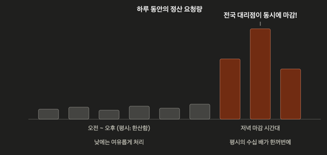
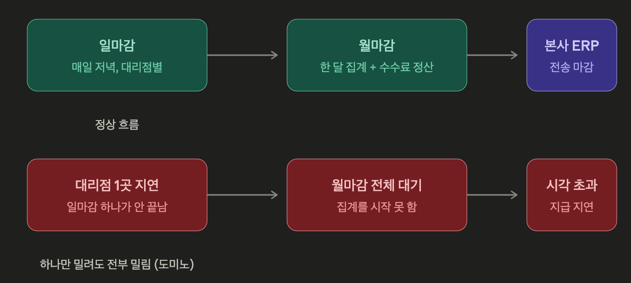
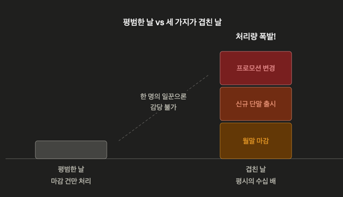

# 5장. 안정 해시 — 회사 시스템 적용 분석

> 팀 비즈니스 구조를 기반으로 우리 시스템에서 안정 해시가 필요한 지점을 분석.
> 구조: **현황 분석 → 적용 지점 도출 → 확인 체크리스트**

---

## 전제: 우리 팀 시스템 현황

| 항목 | 내용 |
|------|------|
| 도메인 | 이동통신사 백오피스 |
| 팀 모듈 | 판매 / 재고 / 정산 / 기준정보(사용자관리) / RM(여신) / IF |
| 담당 파트 | **정산** — 대리점 퇴근 시 일일 정산, 관리자용 백오피스 운영/유지보수 |
| 인프라 | Redis(캐시), RabbitMQ(배치 트리거, 알림 방송, 주문 이벤트) |
| 사용자 | 대리점/상담원/내부 관리자 (일반 대중 트래픽 아님) |
| 순서 보장 요구 | 휴대폰 판매 시 **같은 주문의 이벤트는 순서대로** 처리되어야 함 |

**트래픽 특성** (백오피스 + 정산 도메인)




```
사용자 = 전국 대리점 + 상담원 + 내부 관리자 → 동시 사용자 수천 명 수준
캐시 조회: 수백 ~ 수천 QPS 수준

정산 도메인의 특성:
  평시에는 트래픽 낮음
  대리점 퇴근/마감 시간대에 전국 대리점의 정산 요청이 "동시에" 몰림
  → 시간대 집중형(peak-concentrated) 트래픽

판매 도메인의 특성:
  평시 낮음, 신규 단말 출시일에 주문 이벤트 수십 배 폭증 가능
```



**정산 업무 흐름 (비즈니스 관점)**

```
일마감: 대리점 퇴근 시
  당일 판매 건 대사 → 수납/입금 확인 → 재고 이동 반영 → 일마감 확정

월마감: 월말
  일마감 데이터 집계 → 판매 수수료(리베이트) 정산 → 본사 지급 확정
  → 일마감이 하나라도 밀리면 월마감 전체가 지연되는 종속 구조

후속 연계 (IF):
  마감 확정 데이터는 본사 ERP 일배치로 전송
  → 배치 cut-off 시각 전에 마감이 끝나야 함 (사실상의 SLA)
```



**피크가 겹치는 최악 시나리오**

```
월말 마감 + 신규 단말 출시일 + 프로모션(보조금 정책) 변경일이 겹치는 날
  → 판매 폭증 → 마감 대상 건수 폭증 → 마감 시간대 처리량이 평시의 수십 배
  → 단일 워커 구조의 한계가 드러나는 지점
```

---

## 분석 1: Redis 캐시 — 안정 해시가 필요 없는 지점

### 분석

**Standalone 또는 Sentinel(HA용) 구성으로 판단. 키 분배 자체가 없으므로 안정 해시 미사용.**

### 근거

1차 문서의 선택 트리에 대입:

```
노드가 동적으로 추가/제거되는가?
  → NO (단일 노드로 충분한 규모)
  → hash % N조차 필요 없음. 분배 문제 자체가 없음
```

- 캐시 대상이 요금제, 단말기 정보, 기준정보(코드성 데이터) 등 → 단일 노드 메모리를 넘을 이유가 없음
- 백오피스 QPS 수준에서 수평 샤딩의 동기가 없음
- 필요한 것은 분배가 아니라 **가용성** → Sentinel로 해결

### 확장 시나리오 (만약 커진다면)

- 캐시 데이터가 단일 노드 메모리 초과 시 → **Redis Cluster (고정 해시 슬롯)** 선택이 자연스러움
- 안정 해시를 직접 구현할 일은 없음 (1차 문서: Redis Cluster는 안정 해시가 아니라 CRC16 % 16384 고정 슬롯)

---

## 분석 2: RabbitMQ 배치 트리거 / 알림 방송 — 분배가 아니라 전달

### 분석

**direct(배치 트리거) + fanout(알림 방송) exchange로 판단. 안정 해시와 무관.**

### 근거

| 용도 | 패턴 | 필요한 것 |
|------|------|----------|
| 배치 트리거 (정산 배치 등) | 지정된 워커에게 전달 | direct exchange |
| 알림 방송 | 구독자 전원에게 전달 | fanout exchange |

- 메시지를 여러 노드에 "나눠서(partition)" 처리할 필요가 없음
- "지정된 곳" 또는 "전부"에게 보내는 패턴 → 해시 기반 분배의 문제의식 자체가 없음

---

## 분석 3: 판매 주문 이벤트 — ★ 안정 해시 도입 포인트 (1)

### 현재 구조

**주문 큐 1개 + 컨슈머 1개 (또는 prefetch=1 단일 처리)로 판단.**

- 백오피스 평시 트래픽이면 단일 컨슈머로 충분
- 큐 1개 + 컨슈머 1개 = 전역 순서 보장이 공짜로 됨 → 안정 해시가 필요 없었음

### 문제 시나리오: 신규 단말 출시일

```
아이폰 발매일: 평시 주문 대비 수십 배 폭증
    │
    ▼
컨슈머 1개로 처리 지연 → 개통 대기 적체
    │
    ▼
컨슈머를 3개로 늘리면? (competing consumers)

  주문A-접수  →  컨슈머1
  주문A-개통  →  컨슈머2    ← 접수 처리 전에 개통이 먼저 끝날 수 있음
  주문A-완료  →  컨슈머3

  → 같은 주문의 순서 깨짐 ✗
```

**딜레마**: 처리량을 늘리려면 컨슈머를 늘려야 하는데, 늘리는 순간 순서가 깨진다.

### 해결: Consistent Hash Exchange (`x-consistent-hash`)

RabbitMQ 공식 플러그인 `rabbitmq-consistent-hash-exchange` 사용.

```
                      x-consistent-hash exchange
                    (routing key = 주문번호 해싱)
                               │
              ┌────────────────┼────────────────┐
              ▼                ▼                ▼
           큐 Q1            큐 Q2            큐 Q3
         (컨슈머1)         (컨슈머2)         (컨슈머3)

  주문A의 모든 이벤트 → hash(주문A) → 항상 Q2 → 항상 컨슈머2
  주문B의 모든 이벤트 → hash(주문B) → 항상 Q1 → 항상 컨슈머1

  → 주문 간 병렬 처리 ✓ + 주문 내 순서 보장 ✓
```

**1차 문서 개념과의 매핑**

| 1차 문서 개념 | RabbitMQ에서의 대응 |
|--------------|---------------------|
| 링 위의 서버 노드 | 바인딩된 큐 |
| 데이터 키 | routing key (주문번호) |
| 가상 노드 개수 | 바인딩 키의 숫자 (가중치) |
| 노드 추가/제거 시 k/n만 재배치 | 큐 추가/제거 시 일부 주문번호만 다른 큐로 이동 |

- 큐를 늘리거나 줄일 때 **일부 라우팅 키만 재배치** → 안정 해시의 핵심 이점 그대로
- Kafka의 파티션 키(`hash(key) % partitions`)와 동일한 문제의식의 RabbitMQ 버전

---

## 분석 4: 정산 마감 처리 — ★ 안정 해시 도입 포인트 (2, 담당 파트)

### 정산 도메인의 순서 보장 요구

정산은 대리점 단위로 **선행 처리가 끝나야 다음 단계가 가능한** 흐름이다.

```
대리점 X의 마감 흐름 (예시):

  판매 내역 집계 → 재고 차감 반영 → 여신(RM) 한도 정산 → 정산 마감 확정

  → 같은 대리점의 정산 이벤트는 순서대로 처리되어야 함
  → 서로 다른 대리점끼리는 순서 무관 (병렬 처리 가능)
```

### 순서가 깨지면 생기는 비즈니스 사고

| 순서 위반 | 비즈니스 결과 |
|-----------|--------------|
| 판매 집계 전에 마감 확정 | 마감 금액 ≠ 실제 판매액 → **수수료 오지급** → 재정산 + 대리점 클레임 |
| 재고 차감 전에 마감 확정 | 장부 재고 ≠ 실물 재고 → 재고 실사 불일치, 익일 판매 가능 수량 오류 |
| 여신 정산 전에 추가 판매 승인 | 여신 한도 초과 판매 → **미수금 리스크** (RM 통제 무력화) |
| 일마감 지연 → ERP cut-off 초과 | 본사 회계 반영 누락 → 월마감 지연, 재무 보고 차질 |

> 순서 보장은 기술 요구사항이기 전에 **돈이 걸린 정합성 요구사항**이다.
> 백오피스는 트래픽은 작아도 건당 금액 정확성의 무게가 크다.

### 문제 시나리오: 마감 시간대 집중

```
전국 대리점이 퇴근 시간대에 동시에 정산 요청
    │
    ▼
정산 처리 워커 1개 → 마감 시간대에 처리 적체
    │
    ▼
워커를 늘리면 같은 대리점의 정산 단계가 뒤섞일 위험
    → 판매 주문 이벤트와 완전히 동일한 딜레마
```

### 해결: routing key = 대리점 코드

```
                x-consistent-hash exchange
              (routing key = 대리점 코드 해싱)
                           │
          ┌────────────────┼────────────────┐
          ▼                ▼                ▼
       정산워커1         정산워커2         정산워커3

  대리점 X의 모든 정산 이벤트 → 항상 워커2 → 단계 순서 보장 ✓
  대리점 간에는 병렬 처리 → 마감 시간대 처리량 확보 ✓
```

- 분석 3과 같은 패턴, 키만 다름 (주문번호 → 대리점 코드)
- **마감 시간대에만 워커를 늘리고 이후 줄이는 운영**도 가능
  → 워커 증감 시 일부 대리점만 재배치되는 안정 해시의 이점이 그대로 적용됨

### 주의점 (모의면접 대비)

```
[1] 재배치 순간의 순서 보장
    큐 추가 시 이동하는 키(주문번호/대리점 코드)에 in-flight 메시지가 있으면
    잠깐 순서가 어긋날 수 있음 → 배포 타이밍 조절 or 드레인 후 확장

[2] 큐:컨슈머 = 1:1 유지 필요
    한 큐에 컨슈머 여러 개 붙이면 순서 보장이 다시 깨짐

[3] 핫스팟
    대형 대리점(판매량 많은 지점)의 이벤트가 몰려도 대리점 단위로는 분산 불가
    → 키 단위 순서 보장이 필요한 이상 감수해야 하는 트레이드오프
    → 1차 문서의 "핫스팟 키 문제"가 실무에서 나타나는 형태
```

---

## 분석 5: 다른 모듈로의 확장 — 순서 보장 단위와 키 후보

같은 패턴(키 단위 순서 보장 + 병렬 처리)이 팀 내 다른 모듈에도 그대로 적용된다.
핵심은 **"무엇 단위로 순서를 보장해야 하는가" = routing key 선정**이다.

| 모듈 | 순서 보장 단위 | routing key 후보 | 순서 위반 시 사고 |
|------|---------------|-----------------|------------------|
| 판매 | 주문 | 주문번호 | 접수 전 개통 처리 등 상태 꼬임 |
| 정산 | 대리점 | 대리점 코드 | 수수료 오지급, 마감 금액 불일치 |
| 재고 | 단말 1대 | IMEI(시리얼) | 입고 전 판매, 이중 판매, 이동 이력 꼬임 |
| RM(여신) | 대리점 | 대리점 코드 | 한도 차감/복원 순서 꼬임 → 한도 초과 판매 |
| IF | 대상 외부 시스템 | 시스템 코드 (또는 전문 순번) | 외부 시스템에 역순 전문 도달 → 재전송 협의 비용 |

**키 선정의 원칙** (1차 문서와 연결)

```
키 범위가 좁을수록 (IMEI > 주문번호 > 대리점 코드)
  → 병렬성 ↑, 핫스팟 위험 ↓
키 범위가 넓을수록 (대리점 코드)
  → 순서 보장 범위 ↑, 대형 대리점 핫스팟 위험 ↑

→ "순서를 보장해야 하는 최소 단위"를 키로 잡는 것이 원칙
  (예: 정산은 대리점 간 순서가 무관하므로 대리점 코드면 충분)
```

---

## 도입 판단 기준 — 언제 도입할 것인가

지금 당장 도입하지 않는 이유와, 도입을 트리거할 지표를 함께 정의한다.

**지금 도입하지 않는 이유 (비용 관점)**

- 단일 컨슈머로 SLA(ERP cut-off 전 마감 완료)를 지키고 있다면, 플러그인 도입·큐 토폴로지 변경·운영 러닝커브는 순수 비용
- 순서 보장이 "구조적으로 공짜"인 현재 방식(단일 큐)이 가장 단순하고 사고 확률이 낮음

**도입 트리거 지표 (운영 중 모니터링 대상)**

```
[1] 마감 완료 시각이 ERP cut-off에 근접 (여유 시간 지속 감소 추세)
[2] 마감 시간대 큐 적체(depth) 증가 추세 / 처리 지연 민원 발생
[3] 출시일·월말에 마감 지연 이력 발생
[4] 대리점 수 증가 계획 (신규 채널 확대 등) → 마감 대상 자체가 증가

→ [1]~[2]가 관측되는 시점 = x-consistent-hash 도입 검토 시작점
```

**내가 생각한 모의면접 예상 질문..? -> "그 정도면 Kafka로 가야 하지 않나?"**

```
답변 포인트:
  - Kafka 파티션 키도 동일한 문제의식 (키 단위 순서 + 파티션 병렬)
  - 그러나 우리 트래픽은 백오피스 규모 → Kafka 클러스터 신규 운영 비용이 과함
  - 이미 운영 중인 RabbitMQ에 플러그인 하나로 동일 효과
  → "기술 선택은 문제 크기에 비례해야 한다"는 트레이드오프 논리
```

---

## 종합: 선택 트리 대입 결과

| 시스템 | 분배 필요? | 현재 방식 | 안정 해시 관련성 |
|--------|-----------|----------|-----------------|
| Redis 캐시 | ✗ | Standalone/Sentinel | 불필요 (규모 미달) |
| MQ 배치/방송 | ✗ | direct/fanout | 무관 (분배 아닌 전달) |
| MQ 판매 주문 이벤트 | 현재 ✗ → 확장 시 ✓ | 단일 큐+단일 컨슈머 | 확장 시 x-consistent-hash (키=주문번호) |
| 정산 마감 처리 | 현재 ✗ → 확장 시 ✓ | 단일 워커 | 확장 시 x-consistent-hash (키=대리점 코드) |

**결론**: 현재 우리 시스템은 안정 해시가 필요 없는 규모다.
단, "키 단위 순서 보장 + 병렬 처리"를 동시에 만족해야 하는 두 지점 —
판매 주문 이벤트(출시일 폭증)와 정산 마감 처리(마감 시간대 집중) — 에서
컨슈머/워커를 확장하는 순간 안정 해시(x-consistent-hash)가 필요해진다.
그리고 그 확장의 트리거는 기술 지표가 아니라 **비즈니스 지표**(ERP cut-off 여유 감소,
마감 지연 이력, 대리점 수 증가)로 판단한다.

---

## 확인 체크리스트 (실제 시스템에서 무엇을 확인했는지)

- [ ] `redis-cli cluster info` → cluster_enabled 확인
- [ ] 앱 설정에서 Redis 연결 방식 확인 (standalone / sentinel / cluster)
- [ ] `rabbitmq-plugins list | grep consistent` → 플러그인 여부
- [ ] Management UI에서 exchange 타입 전수 확인
- [ ] 주문 이벤트 큐의 컨슈머 수, prefetch 설정 확인
- [ ] 정산 배치/이벤트의 처리 구조 확인 (단일 워커인지, 대리점 단위 병렬인지)
- [ ] 출시일/마감 시간대 처리 지연 이력 확인 (있었다면 도입 근거 강화)
- [ ] ERP 일배치 cut-off 시각과 실제 마감 완료 시각의 여유(gap) 확인 → 도입 트리거 지표 [1]
- [ ] 수수료 재정산/마감 정정 건 발생 이력 확인 (순서·정합성 사고의 실측 근거)
