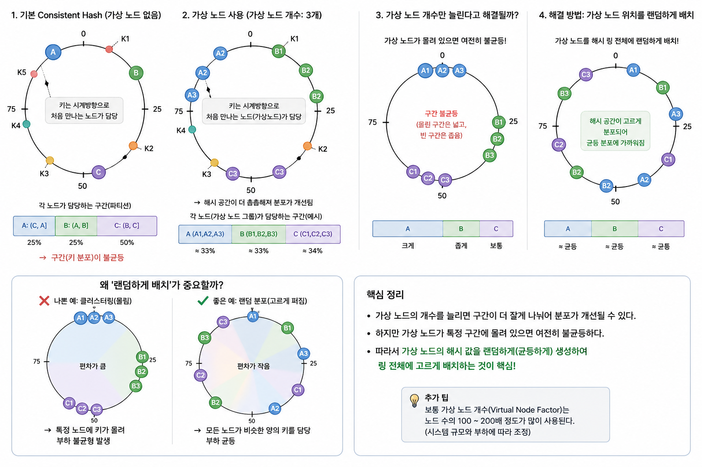
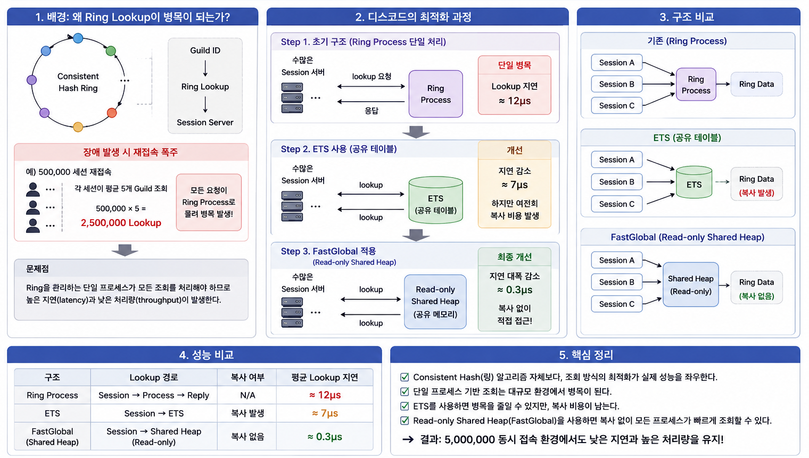

# 안정해시(Consistent Hashing)

###  1. 일반 해시의 문제점
* 분산 환경에서 서버가 추가되거나 기존 서버 삭제 시 대부분의 캐시 키 재배치 -> 캐시 미스 대량 발생 -> thundering herd 유발 가능

### 2. 안정해시에 여전히 존재하는 문제점과 해결법
* 노드가 해시 공간에 불균등하게 배치 -> 해시 공간 불균형 -> 키 분포 불균형 -> 파티션 크기 불균형 
=> `virtual node`로 해시 공간 균등화

### 3. 안정해시로도 풀리지 않는 문제점과 해결법
* `hot key` 
=> replica 
=> cache 
=> key sharding 
=> rebalancing 
=> 요청 자체 줄이기 
    * local cache
    * cdn
    * single flight
    * rate limiting

### 4. 새롭게 알게 된 점
* 안정 해시는 모듈로 연산을 하지 않는다. 안정해시는 노드 개수와 무관하게 키의 위치를 결정하기 때문에 노드가 추가/삭제되어도 키의 해시값은 변하지 않고 **시계 방향으로 가장 먼저 만나는 노드**만 변함.

### 5. 어려웠던/궁금했던 점
* 가상 노드 개수만 늘린다고 균등 분포가 되는 것은 아니지 않나? -> **가상 노드 위치를 랜덤하게 배치**하는 것이 중요하다. 
 

### 6. 추가로 조사한 부분 
* **_디스코드 채팅 어플리케이션_**
  * 안정해시 알고리즘이 좋은 건 알겠어. 근데 "링 자체 조회 속도를 어떻게 줄이지?"
    * **Ring Lookup 하는 과정 자체가 병목**이 될 수 있다.
    * 디스코드는 공유 메모리(Read-only Shared Heap)를 이용해 Lookup 비용을 최적화했다.
 

#### reference
1) https://discord.com/blog/how-discord-scaled-elixir-to-5-000-000-concurrent-users