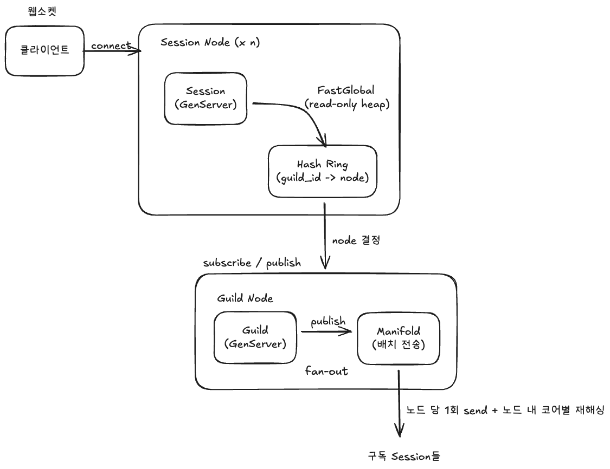

# 디스코드 안정해시 아키텍처 설계

**TLDR;**:  디스코드에서 안정해시는 "길드가 어느 노드에 있는지"를 라우팅하는 데에 쓰인다. 실제 운영 시에는 링 데이터를 read-only 공유 힙에 상주시켜서 조회 방식을 직접 메모리 읽기로 바꾼 것이었다.

---

## 1. 조사: 디스코드는 안정해시를 어디에 쓰나

디스코드는 Elixir/Erlang 기반 실시간 채팅 백엔드에서 안정해시를 **엔티티 -> 노드 라우팅**에 쓴다.

| 구성요소 | 정체                            | 역할                                    |
|---|-------------------------------|---------------------------------------|
| `Session` | 유저 WebSocket 1개당 뜨는 GenServer | 클라이언트와 연결 유지, 관심 길드의 이벤트를 구독, 전달      |
| `Guild` | 디스코드 서버(길드) 1개당 뜨는 GenServer  | 그 길드의 메시지, 상태를 들고 있고, 구독자에게 이벤트 발행    |
| **Hash Ring** | `guild_id -> 물리 노드` 매핑 링      | 세션이 "내 길드가 어느 노드에 해당하는지"를 조회          |
| `FastGlobal` | mochiglobal 포팅                | 링 데이터를 **read-only 공유 힙**에 올려 조회 비용 제거 |
| `Manifold` | 배치 메시지 전송기                    | 팬아웃을 노드 수만큼으로 줄이고 노드 안에서 코어별로 재분산     |

### 왜 안정해시인가
- 길드/노드가 수천 개. 노드 추가, 삭제 때 **모듈로였다면 대부분의 길드가 재배치** -> 재접속 폭풍(thundering herd)
- 안정해시는 노드 개수와 무관하게 키 위치가 정해지므로, 노드 변동 시 **인접 구간 길드만** 이동

### 병목 구간과 해결 방법
- **초기 설계**: 링을 단일 프로세스가 관리. 모든 조회가 그 프로세스 **mailbox로 직렬화**
- **문제**: 재접속 폭주 시 유저 1명이 가입 길드 수만큼 조회 -> 조회 요청이 링 프로세스에 쌓여 병목
- **해결**: 링을 순수 Elixir(`ex_hash_ring`)로 재작성 + **FastGlobal**로 링을 모듈 상수처럼 컴파일해 공유 힙에 상주
  -> 조회가 프로세스 메시지 왕복 없이 **직접 메모리 읽기**가 되어 **7 마이크로세컨 -> 0.3 마이크로 세컨으로 개선**

> 즉 "안정해시 알고리즘"보다 "링 조회 자체를 어떻게 병목 없이 만드느냐"가 포인트!

---

## 2. 도메인, 요구사항

* 실시간 채팅. 유저는 WebSocket으로 접속하고 여러 길드를 구독한다.

| 구분 | 요구사항                                        |
|---|---------------------------------------------|
| 기능 | 유저가 구독한 모든 길드의 이벤트를 실시간 수신                  |
| 기능 | 길드에 메시지 발행 시 구독 세션 전체에 팬아웃                  |
| 비기능 | 노드 추가, 삭제 시 **재배치 최소화** (안정해시 사용)           |
| 비기능 | 재접속 폭주(수백만 동시 재연결)에도 **조회가 병목이 되지 않아야 함**   |
| 비기능 | 링 변경 중에도 **조회 결과가 흔들리지 않음**(순간적 라우팅 오류 최소화) |

---

## 3. 아키텍처 설계

### 3.1 전체 구조

### 3.2 링 설계 `guild_id -> node`

`ex_hash_ring` 방식 그대로

| 항목 | 설계                                       | 근거                                                |
|---|------------------------------------------|---------------------------------------------------|
| 키 | `guild_id`                               | 라우팅 단위가 길드                                        |
| 값(노드) | 물리 Erlang 노드 이름                          | 그 길드의 `Guild` 프로세스가 사는 곳                          |
| 가상 노드 | 노드당 **512 replica**                      | 해시 공간 균등화 -> 파티션 불균형,핫 노드 방지                      |
| 조회 | `find_node(ring, guild_id)` -> 시계방향 첫 노드 | "모듈로 없이" 위치 고정                                    |
| 세대 | `depth`만큼 이전 링 버전 보관 + 지연 GC             | 노드 추가/삭제 직후에도 **직전 링으로 안정 조회** |
| 오버라이드 | 특정 `guild_id`를 특정 노드에 핀 고정               | 초대형 길드(핫 키)를 지정 노드로 격리                            |

### 3.3 조회 최적화 `read-only 공유 힙`

- 링은 **자주 안 바뀌고 매우 자주 읽힘** -> 따라서 read-only 공유 데이터에 최적
- 링 갱신 시에만 FastGlobal이 새 링을 재컴파일해 교체(=쓰기), 조회는 항상 락, 메시지 없이 읽기

### 3.4 팬아웃 `Manifold 2단계 해싱`

길드 메시지를 수많은 세션에 뿌릴 때 세션 수만큼 `send`를 호출하게 되면...

| 단계 | 동작 | 해싱 사용처 |
|---|---|---|
| 1단 | 구독 세션 PID들을 **원격 노드별로 그룹핑**, 노드당 딱 1번만 전송 | 노드 그룹핑 |
| 2단 | 각 노드의 `Manifold.Partitioner`가 PID를 `:erlang.phash2/2`로 해싱해 **코어 수만큼 워커에 재분산** | 코어 부하 분산 |

- 발행 프로세스의 `send` 호출 수 = **관여 원격 노드 수**로 상한 -> 팬아웃 비용 O(세션 수) -> O(노드 수)
- 여기서도 해싱은 안정해시 링과는 별개의 2차 해싱으로, "부하를 균등 분산"하는 도구로 재등장함

---

## 4. 동작 흐름

**구독**
1. 클라이언트가 Session 노드에 WebSocket 접속 -> `Session` GenServer 생성
2. 세션이 관심 길드마다 `find_node(ring, guild_id)`로 노드 조회 (FastGlobal 직접 읽기)
3. 해당 노드의 `Guild` 프로세스에 구독 등록

**발행(메시지)**
1. 어떤 길드에 메시지 발생 -> 그 `Guild` 프로세스가 구독 세션 목록 확보
2. `Manifold`로 넘김 -> 노드별 그룹핑 후 노드당 1회 전송
3. 각 노드의 Partitioner가 `phash2`로 코어별 워커에 분배 -> 세션에 이벤트 도착 -> 클라이언트로 push

**노드 추가/삭제 (안정해시 이점)**
1. 링에 노드 add/remove -> 신규 세대 링 생성, FastGlobal 교체
2. **인접 구간 길드만** 새 노드로 이동, 나머지는 그대로 -> 재구독 폭풍 회피
3. 직전 세대 링을 `gc_delay` 동안 보관 -> 전환 중 진행 중 조회는 예전 링으로 안정적 응답

---

## 5. 운영, 장애 고려 사항

| 시나리오 | 위험                  | 대응                                       |
|---|---------------------|------------------------------------------|
| 재접속 폭주 | 유저 x 가입길드 수만큼 조회 폭증 | 링을 FastGlobal 공유 힙 조회로 -> 조회가 병목이 안 됨    |
| 링 변경 중 조회 | 순간 라우팅 오류 발생 가능     | 세대 링 다중 보관 + 지연 GC           |
| 초대형 길드(핫 키) | 특정 노드 과부하           | 링 오버라이드로 지정 노드 격리 (+ 1주차의 replica/샤딩 전략) |
| 노드 장애 | 그 노드 길드만 영향         | 안정해시라 **영향 범위가 인접 구간으로 국소화**             |
| 팬아웃 폭발 | send 호출 O(세션 수)     | Manifold로 노드당 1회 + 코어 재해싱                |

---

## 6. 설계 결정 요약

| 항목 | 선택                        | 포기한 것              | 근거                          |
|---|---------------------------|--------------------|-----------------------------|
| 라우팅 | `guild_id -> node` 안정해시 링 | 중앙 디렉터리 서버         | 노드 변동 시 재배치 국소화, 중앙 SPOF 제거 |
| 링 조회 | FastGlobal read-only 공유 힙 | 단일 프로세스 관리의 단순함    | 조회 폭주 시 mailbox 직렬화 병목 제거   |
| 링 안정성 | 세대 + 지연 GC    | 메모리(이전 세대 링 보관 비용) | 링 전환 중 라우팅 오류 최소화           |
| 균등 분포 | 가상 노드 512 replica         | 링 메모리 증가           | 파티션, 핫 노드 불균형 방지            |
| 팬아웃 | Manifold 2단 해싱            | 세션 단위 직접 send      | 전송 호출을 노드 수로 상한             |

---

#### reference
1) [How Discord Scaled Elixir to 5,000,000 Concurrent Users](https://discord.com/blog/how-discord-scaled-elixir-to-5-000-000-concurrent-users)
2) [discord/ex_hash_ring — 안정해시 링 구현체](https://github.com/discord/ex_hash_ring)
3) [discord/manifold — 노드 간 배치 메시지 전송](https://github.com/discord/manifold)
