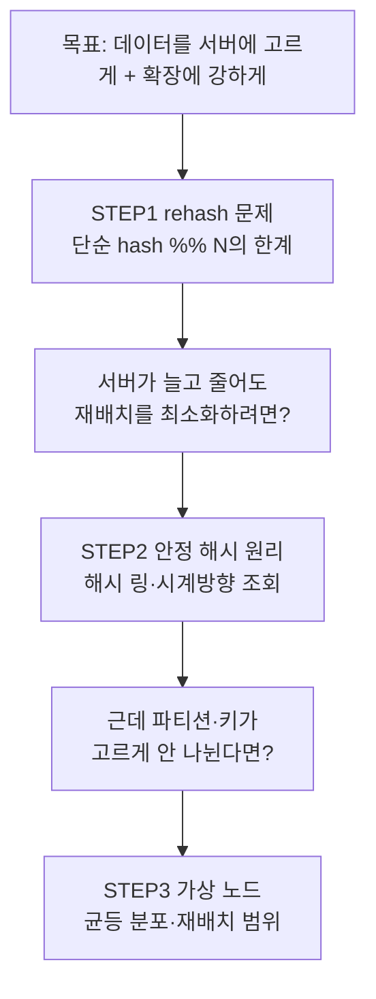

# 안정 해시 설계 — STEP별 정리 노트

> 『가상 면접 사례로 배우는 대규모 시스템 설계 기초』 5장 학습 노트
> 설계를 시작하기 전에 알아야 할 개념을 STEP 순서대로 정리한다.

---

## 이 노트의 목적

안정 해시(consistent hashing)는 **"요청·데이터를 여러 서버에 고르게 나눈다"** 는
한 줄짜리 목표를 위한 기술이다. 하지만 이 목표를 **서버가 수시로 늘고 줄어드는(수평 확장)**
환경에서도 지키려는 순간, 단순한 해시로는 무너진다.

각 STEP은 *기능 추가*가 아니라 **"앞 단계가 만든 문제를 푸는 다음 결정"** 이다.

> 📌 이 장은 6장(키-값 저장소)의 데이터 분산에서도 그대로 쓰인다.
> 6장 노트 [STEP2 — 데이터 분산](../../06-키값저장소설계/정리노트/02_STEP2_데이터분산_안정해시.md) 과 함께 보면 좋다.

---

## 왜 "hash % N" 으로 끝나지 않는가

N개의 서버에 부하를 나누는 가장 단순한 방법은 나머지 연산이다.

```
serverIndex = hash(key) % N     (N = 서버 개수)
```

서버 수가 **고정**이고 데이터가 균등하면 이걸로 충분하다.
문제는 이 구조가 **서버가 늘거나 줄면 곧바로 무너진다**는 점이다.

| 벽 | 무엇이 막히나 | 결과 |
| --- | --- | --- |
| **재배치 폭발** | 서버 1대만 죽어도 `% N`의 N이 바뀌어 **거의 모든 키**의 서버 인덱스가 달라짐 | 대규모 캐시 미스 → 시스템 마비 |
| **파티션 불균등** | 서버를 링에 그냥 올리면 담당 해시 공간 크기가 제각각 | 특정 서버 과부하 |
| **키 쏠림(hotspot)** | 키가 특정 서버에 몰림 | 부하 불균형·확장 무의미 |

> 그래서 **왜 단순 해시가 안 되는가(STEP1) → 해시 링으로 어떻게 푸는가(STEP2) → 균등 분포를 어떻게 보장하는가(STEP3, 가상 노드)** 라는 결정이 이어진다.

---

## 설계 로드맵



---

## STEP 목록

| STEP | 주제 | 핵심 키워드 | 푸는 문제 |
|:---:|------|-----------|----------|
| [STEP 1](01_STEP1_rehash문제_단순해시의한계.md) | 재배치(rehash) 문제 | `hash % N`, 경계 재계산, 캐시 미스 | 단순 해시는 왜 확장에 실패하나 |
| [STEP 2](02_STEP2_안정해시_원리_해시링.md) | 안정 해시 원리 | 해시 공간·해시 링, 시계방향 조회, k/n | 서버가 변해도 이동을 어떻게 최소화하나 |
| [STEP 3](03_STEP3_가상노드_균등분포.md) | 가상 노드 · 균등 분포 | 파티션/키 불균등, virtual node, 표준편차, 재배치 범위 | 데이터를 어떻게 고르게 나누나 |
| [흐름 통합](04_흐름통합_데이터분산부터_벡터시계.md) | 분산 저장 → 벡터 시계 | 복제 N, 정족수 W·R, 벡터 시계 | 5장 파티션이 6장 데이터 흐름으로 어떻게 확장되나 |

### 각 STEP에서 깊게 다루는 것

| STEP | 세부 내용 |
| --- | --- |
| STEP 1 | `hash % N` 동작, 서버 4→3 변동 시 **표 5-1/5-2 재계산 실측**, 왜 캐시 미스 폭풍이 나는지, "안정 해시" 정의(k/n) |
| STEP 2 | SHA-1 해시 공간(0 ~ 2¹⁶⁰-1) → 해시 링, 서버·키를 **modulo 없이** 링에 매핑, 시계방향 최초 서버 조회, 서버 **추가/삭제 시 영향 범위** |
| STEP 3 | 기본 구현의 두 문제(파티션·키 불균등), **가상 노드(replica)**, 가상 노드 수 ↔ 표준편차 트레이드오프, 재배치할 키의 범위 결정, 실사용처 |

---

## 학습 우선순위

1. **핵심**: STEP 2(해시 링 원리)와 STEP 3(가상 노드). 이 장의 본체이자 면접 단골.
2. **먼저 잡을 것**: STEP 1의 `hash % N` 재배치 문제 — "왜 안정 해시가 필요한가"의 근거.
3. **말로 설명 가능해야**: 서버 추가/삭제 시 **k/n 개만 이동**한다는 것, 가상 노드가 푸는 **두 문제**.
4. 레퍼런스 시스템(모두 안정 해시 채택):
   - **아마존 다이나모(DynamoDB)**, **아파치 카산드라** — 데이터 파티셔닝
   - **디스코드(Discord)** — 대규모 동시 접속 채팅
   - **아카마이(Akamai) CDN**, **매그레브(Maglev)** — 부하 분산

---

## 빠른 복습 — 3문장 요약

> 단순 `hash % N`은 서버가 하나만 변해도 **거의 모든 키를 재배치**해 확장이 불가능하다(STEP1).
> 서버와 키를 **같은 해시 링**에 올리고 시계방향 첫 서버에 저장하면, 서버 변동 시 **인접 구간(k/n)만** 이동한다(STEP2).
> 남은 불균등(파티션·키 쏠림)은 서버 하나를 링의 **여러 지점(가상 노드)** 에 올려 해소한다(STEP3).
