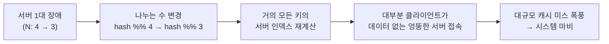

# STEP 1. 재배치(rehash) 문제 — 단순 해시는 왜 확장에 실패하나

> 안정 해시가 **왜 필요한지**를 만드는 출발점.
> `hash(key) % N` 은 서버 수가 고정일 땐 완벽하지만, 서버가 하나만 변해도 **거의 모든 키가 이동**한다.

---

## 0. 먼저: 우리가 풀려는 것

수평 확장(horizontal scaling)의 핵심은 **요청·데이터를 여러 서버에 고르게 나누는 것**이다.
그래서 필요한 건 딱 하나 — "이 키는 어느 서버가 담당하는가?"를 정하는 규칙(**키 → 서버 매핑**).

가장 흔한 규칙이 나머지 연산이다.

```
serverIndex = hash(key) % N        (N = 서버 개수)
```

- 키를 해시해서 큰 정수로 만들고, 서버 수 N으로 나눈 **나머지**를 서버 번호로 쓴다.
- 서버가 4대면 모든 키는 0~3 중 하나에 결정적으로 매핑된다.

> 핵심: 이 방식은 **N이 절대 안 변할 때만** 안전하다.

---

## 1. 단순 해시가 잘 도는 경우 (N=4)

키 8개를 4대 서버에 `hash % 4` 로 나눈 예시(원문 표 5-1).

| 키   | 해시     | 해시 % 4 (서버 인덱스) |
| ---- | -------- | :-------------------: |
| key0 | 18358617 | 1 |
| key1 | 26143584 | 0 |
| key2 | 18131146 | 2 |
| key3 | 35863496 | 0 |
| key4 | 34085809 | 1 |
| key5 | 27581703 | 3 |
| key6 | 38164978 | 2 |
| key7 | 22530351 | 3 |

```
서버0: key1, key3      서버1: key0, key4
서버2: key2, key6      서버3: key5, key7
```

> 서버 풀 크기가 **고정**이고 데이터 분포가 균등하면 이걸로 충분히 잘 동작한다.

---

## 2. ⚠️ 서버 하나가 죽으면 — 재배치 폭발

서버 1번이 장애로 빠져 **N이 4 → 3** 으로 바뀌면, 해시 값은 그대로여도 **나누는 수가 바뀌어** 서버 인덱스가 재계산된다(원문 표 5-2, `hash % 3`).

| 키   | 해시     | %4 (이전) | %3 (이후) | 이동? |
| ---- | -------- | :-------: | :-------: | :---: |
| key0 | 18358617 | 1 | **0** | ✅ |
| key1 | 26143584 | 0 | 0 | — |
| key2 | 18131146 | 2 | **1** | ✅ |
| key3 | 35863496 | 0 | **2** | ✅ |
| key4 | 34085809 | 1 | 1 | — |
| key5 | 27581703 | 3 | **0** | ✅ |
| key6 | 38164978 | 2 | **1** | ✅ |
| key7 | 22530351 | 3 | **0** | ✅ |

**8개 중 6개**의 위치가 바뀌었다. 죽은 서버(1번)에 있던 키뿐 아니라 **멀쩡한 서버의 키까지** 대부분 재배치된다.



> 핵심: `% N` 은 **N에 전역적으로 의존**하기 때문에, N이 1만 변해도 매핑 전체가 흔들린다.

---

## 3. 그래서 필요한 성질 — "안정" 해시

원하는 것은 **서버가 변해도 최소한의 키만 움직이는** 매핑이다. 위키피디아의 정의:

> 안정 해시는 해시 테이블 크기가 조정될 때 평균적으로 **오직 k/n 개의 키만 재배치**하는 해시 기술이다.
> (k = 키의 개수, n = 슬롯(서버)의 개수)

| | 단순 해시 (`% N`) | 안정 해시 |
| --- | --- | --- |
| 서버 변동 시 이동량 | **거의 전부** (≈ k) | 평균 **k/n** |
| N에 대한 의존 | 전역 의존 | 국소적(인접 구간만) |
| 확장성 | ❌ 사실상 불가 | ✅ 무중단 확장 |

> 즉, 전통적 해시 테이블은 슬롯 수가 바뀌면 대부분 키를 옮기지만, 안정 해시는 **평균 k/n 개만** 옮긴다.
> "어떻게 그게 가능한가"가 STEP 2다.

---

## ✅ STEP 1 체크리스트

- [ ] `serverIndex = hash(key) % N` 이 무엇을 하는지 한 줄로 설명할 수 있다
- [ ] 단순 해시가 **언제** 잘 동작하는지(고정 N·균등 분포) 안다
- [ ] 서버 4→3 변동 시 **왜 대부분 키가 이동**하는지 표로 설명할 수 있다
- [ ] 재배치가 왜 "대규모 캐시 미스"로 이어지는지 안다
- [ ] 안정 해시의 정의(**평균 k/n 개만 이동**)를 말할 수 있다

---

## 💬 예상 면접 질문

**Q1. `hash(key) % N` 방식의 문제는 무엇인가?**
> 서버 수 N이 바뀌면(추가/장애) 나누는 수가 달라져 **거의 모든 키의 서버 인덱스가 재계산**된다. 대부분의 클라이언트가 데이터 없는 서버로 접속해 대규모 캐시 미스가 발생하고, 사실상 확장이 불가능하다.

**Q2. 왜 죽지 않은 서버의 키까지 이동하나?**
> `% N`은 **N에 전역적으로 의존**한다. N이 4→3으로 바뀌면 나머지 값 자체가 달라지므로, 장애 서버와 무관한 키도 새 서버 인덱스로 재계산된다. 예시(표 5-1→5-2)에선 8개 중 6개가 이동한다.

**Q3. "안정 해시"의 정의를 말해달라.**
> 해시 테이블(서버) 크기가 조정될 때 **평균적으로 k/n 개의 키만 재배치**하는 해시 기술이다(k=키 수, n=서버 수). 전통적 해시가 슬롯 변경 시 거의 전부를 옮기는 것과 대비된다.

➡️ 다음: [STEP 2 — 안정 해시 원리(해시 링)](02_STEP2_안정해시_원리_해시링.md)
