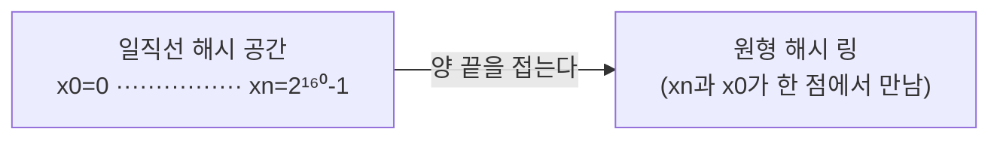
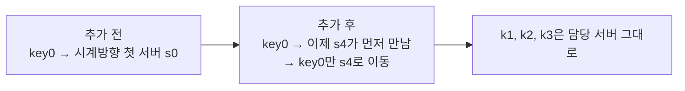
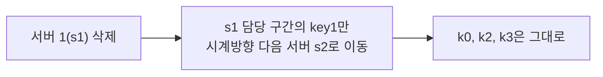

# STEP 2. 안정 해시 원리 — 해시 링으로 어떻게 이동을 최소화하나

> STEP1의 답: 서버 수 N에 의존하는 `% N`을 버리고, **서버와 키를 같은 원(해시 링)** 위에 올린다.
> 그러면 서버가 변해도 **인접 구간의 키(평균 k/n)만** 이동한다.

---

## 0. 먼저: 핵심 전환 — "나눗셈"에서 "링 위의 위치"로

단순 해시는 `hash(key) % N` 처럼 **N으로 나눈다**. 그래서 N이 흔들리면 전부 흔들렸다.
안정 해시는 나머지 연산을 **쓰지 않는다.** 대신 서버도 키도 링 위의 **한 점**으로 보고,
"이 키에서 가장 가까운(시계방향) 서버는 누구인가"라는 **국소적 질문**으로 바꾼다.

> 핵심: 매핑을 **전역(N에 의존)** 에서 **국소(이웃 서버에만 의존)** 로 바꾼 것이 안정 해시의 전부다.

---

## 1. 해시 공간과 해시 링

- 해시 함수 f로 **SHA-1**을 쓴다고 하자. 출력 범위(해시 공간)는 **0 ~ 2¹⁶⁰ - 1**.
- 이 일직선 공간의 **양 끝(0과 2¹⁶⁰-1)을 구부려 맞붙이면** 원형의 **해시 링(hash ring)** 이 된다.

> 링에는 시작도 끝도 없다. 시계방향으로 돌면 값이 커지다가 최대값 다음 0으로 돌아온다.

---

## 2. 서버와 키를 링에 올린다 (modulo 없음)

- **서버**: 서버의 IP나 이름을 해시 f에 넣어 나온 값 → 링 위의 위치. (예: 서버 0~3 → s0, s1, s2, s3)
- **키**: 같은 방식으로 키도 링 위의 한 점. (예: key0~3 → k0, k1, k2, k3)

> ⚠️ 여기 쓰는 해시 함수는 STEP1의 함수와 **다르며, 나머지 연산 %를 쓰지 않는다.** 서버와 키를 같은 링 위에 "그냥 뿌린다".

---

## 3. 서버 조회 — 시계방향 최초 서버 규칙

키가 저장되는 서버는, **그 키의 위치에서 시계방향으로 링을 돌다 처음 만나는 서버**다.

원문 그림 5-7 예시(서버 s0~s3, 키 k0~k3가 번갈아 배치):

| 키 | 시계방향 첫 서버 | 저장 위치 |
| --- | --- | --- |
| key0 | s0 | 서버 0 |
| key1 | s1 | 서버 1 |
| key2 | s2 | 서버 2 |
| key3 | s3 | 서버 3 |

> 핵심: 담당 서버를 찾는 데 **N이 등장하지 않는다.** "내 위치에서 시계방향 이웃"만 보면 된다.

---

## 4. 서버 추가 — 영향받는 키는 국소적

새 서버를 링에 올리면, **그 서버와 반시계 방향 직전 서버 사이 구간의 키만** 새 서버로 이동한다. 나머지는 그대로.

원문 그림 5-8: 서버 4(s4)가 **s0과 k0 사이**에 추가되는 경우.

- 추가 전 key0은 서버 0에 있었지만, s4가 k0 바로 뒤(시계방향)에 끼어들면서 **key0만** s4로 재배치.
- 다른 키들은 자기 시계방향 첫 서버가 그대로라 **이동 없음**.

---

## 5. 서버 제거 — 역시 국소적

서버 하나가 빠지면, **그 서버가 담당하던 구간의 키만** 시계방향 다음 서버로 넘어간다.

원문 그림 5-9: 서버 1(s1)이 삭제되는 경우.

- s1이 담당하던 key1만 시계방향 다음 서버인 **서버 2로 재배치**.
- 나머지 키(key0, key2, key3)는 영향 없음.

> 핵심: 추가든 삭제든 **바뀌는 건 인접한 한 구간뿐.** 평균 이동량이 **k/n** 인 이유가 여기 있다.

---

## 6. 단순 해시 vs 안정 해시 — 서버 변동 대응

| 상황 | 단순 해시 (`% N`) | 안정 해시 (해시 링) |
| --- | --- | --- |
| 서버 추가 | 거의 모든 키 재계산 | 새 서버~직전 서버 **구간의 키만** |
| 서버 삭제 | 거의 모든 키 재계산 | 삭제 서버 담당 **구간의 키만** |
| 평균 이동량 | ≈ k (전부) | **k/n** |
| 담당 서버 계산 | N에 의존 | 링 위 시계방향 이웃 |

> 이것만으로 "서버가 변할 때 이동 최소화" 요구는 해결됐다.
> 하지만 아직 **"고르게 나뉜다"** 는 보장은 없다 — 그게 STEP 3.

---

## ✅ STEP 2 체크리스트

- [ ] 해시 공간(0 ~ 2¹⁶⁰-1)을 링으로 만드는 과정을 설명할 수 있다
- [ ] 안정 해시는 **나머지 연산 %를 쓰지 않는다**는 점을 안다
- [ ] 키의 담당 서버를 찾는 규칙(**시계방향 최초 서버**)을 말할 수 있다
- [ ] 서버 추가 시 **key0만 이동**하는 그림 5-8을 설명할 수 있다
- [ ] 서버 삭제 시 **key1만 이동**하는 그림 5-9를 설명할 수 있다
- [ ] 평균 이동량이 **k/n** 인 이유(인접 구간만 변함)를 안다

---

## 💬 예상 면접 질문

**Q1. 안정 해시는 키가 저장될 서버를 어떻게 정하나?**
> 서버와 키를 같은 **해시 링** 위에 매핑하고, 키 위치에서 **시계방향으로 돌다 처음 만나는 서버**에 저장한다. 나머지 연산 없이 링 위의 이웃 관계만 본다.

**Q2. 단순 해시와 달리 왜 재배치가 적은가?**
> 담당 서버가 **N이 아니라 링 위 인접 이웃**에만 의존하기 때문이다. 서버를 추가/삭제해도 변하는 건 그 서버에 인접한 한 구간뿐이라, 평균 **k/n 개**만 이동한다.

**Q3. 서버를 추가할 때 정확히 어떤 키가 이동하나?**
> 새 서버 위치에서 **반시계 방향으로 직전 서버까지의 구간**에 있던 키들만 새 서버로 넘어간다. 그림 5-8에선 s4가 s0 앞에 끼면서 그 구간의 key0만 이동하고 나머지는 그대로다.

**Q4. 여기서 SHA-1을 쓰는 이유와 해시 공간 크기는?**
> 출력이 **0 ~ 2¹⁶⁰-1** 로 매우 넓어 서버·키를 링 위에 충돌 없이 고르게 흩뿌리기 좋다. 이 공간의 양 끝을 이어 원형 링으로 사용한다.

➡️ 이전: [STEP 1 — rehash 문제](01_STEP1_rehash문제_단순해시의한계.md) | 다음: [STEP 3 — 가상 노드](03_STEP3_가상노드_균등분포.md)
