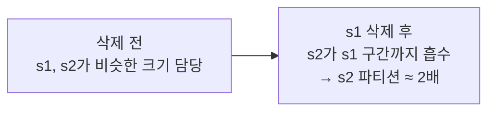
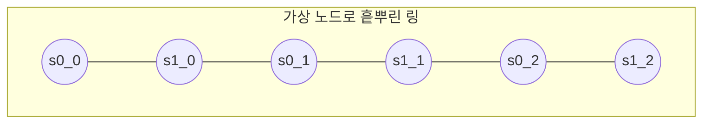
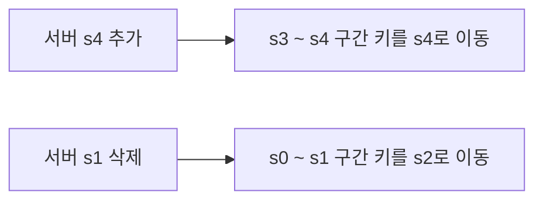

# STEP 3. 가상 노드 · 균등 분포 — 데이터를 어떻게 고르게 나누나

> STEP2의 해시 링은 "이동 최소화"는 풀었지만 **"고르게 나뉜다"** 는 보장이 없다.
> 기본 구현엔 두 가지 불균등 문제가 있고, 이를 **가상 노드(virtual node)** 로 해결한다.

---

## 0. 먼저: 기본 안정 해시의 절차와 그 한계

기본 안정 해시(MIT에서 처음 제안)의 절차는 단순하다.

1. 서버와 키를 균등 분포 해시 함수로 링에 배치한다.
2. 키에서 시계방향으로 탐색해 만나는 최초의 서버가 담당 서버다.

문제는 이 "링에 그냥 올린다"가 **고른 분포를 보장하지 않는다**는 점이다.

---

## 1. 기본 구현의 두 가지 문제

| # | 문제 | 무엇이 잘못되나 | 결과 |
| :-: | --- | --- | --- |
| 1 | **파티션 크기 불균등** | 인접 서버 사이 해시 공간(=파티션)이 제각각. 서버 삭제 시 특히 심해짐 | 어떤 서버는 아주 좁은 구간, 어떤 서버는 아주 넓은 구간 담당 |
| 2 | **키 분포 불균등** | 서버들이 링 한쪽에 몰리면 키도 한 서버에 쏠림 | 특정 서버 과부하(hotspot), 어떤 서버는 데이터 0 |

> **파티션(partition)** = 링에서 인접한 두 서버 사이의 해시 공간 = 한 서버가 담당하는 구간.

### 문제 1 — 삭제로 파티션이 2배가 되는 예 (그림 5-10)

s1이 삭제되면 s1이 담당하던 구간이 시계방향 다음 서버 s2에 흡수되어, **s2의 파티션이 다른 서버 대비 약 2배**로 커진다.

### 문제 2 — 키가 한 서버에 쏠리는 예 (그림 5-11)

서버들이 링의 한쪽에 몰려 배치되면, 서버 1·3은 데이터가 거의 없고 **대부분의 키가 서버 2에 보관**된다.

> 핵심: 서버 "1개 = 링 위 점 1개" 라면, 그 점들이 우연히 몰릴 때 분포가 무너진다.

---

## 2. 해결: 가상 노드 (Virtual Node / Replica)

**아이디어**: 서버 하나를 링 위 **한 점이 아니라 여러 점**으로 올린다.

- 서버 0을 배치할 때 s0 하나 대신 **s0_0, s0_1, s0_2** 처럼 여러 가상 노드를 쓴다.
- 서버 1도 s1_0, s1_1, s1_2 … (원문 예시는 서버당 3개지만, 실제로는 훨씬 큰 값).
- 따라서 각 서버는 **하나가 아닌 여러 개의 파티션**을 담당한다.

- 키 조회 규칙은 동일: 키에서 시계방향으로 만나는 **최초의 가상 노드**가 나타내는 실제 서버가 담당.
- 예(그림 5-13): k0에서 시계방향 첫 가상 노드가 **s1_1** → 실제로는 **서버 1**에 저장.

> 한 서버가 링 곳곳에 여러 점으로 흩어지니, 담당 구간이 링 전체에 골고루 퍼져 **몰림·불균등이 완화**된다.

---

## 3. 가상 노드 수 ↔ 균등도 (트레이드오프)

가상 노드를 늘릴수록 키 분포가 고르게 되고 **표준 편차(standard deviation)** 가 작아진다.
(표준 편차 = 데이터가 얼마나 퍼져 있는지의 척도 → 작을수록 고르게 분포)

| 가상 노드 수 (서버당) | 표준 편차 (평균 대비) |
| :-: | :-: |
| 100개 | 약 **10%** |
| 200개 | 약 **5%** |
| 더 늘리면 | 더 작아짐 |

- ✅ 가상 노드가 많을수록 분포가 균등해진다.
- ❌ 대신 가상 노드 위치 데이터를 저장할 **공간이 더 필요**하다.
- ➡️ **타협(tradeoff)** 이 필요 — 시스템 요구사항에 맞게 적절히 조정한다.

> 🏢 부수 효과: 성능 좋은 **이기종 서버**엔 가상 노드를 더 많이 할당해 부하 비중을 키울 수도 있다.

---

## 4. 재배치할 키의 범위 결정

서버가 추가/삭제되면 **어느 범위의 키만** 옮기면 되는지가 명확하다.

| 이벤트 | 재배치 대상 범위 | 원문 |
| --- | --- | --- |
| **서버 추가** | 새 노드(s4)부터 **반시계 방향 첫 서버(s3)까지** 구간의 키 → 새 노드로 | 그림 5-14 |
| **서버 삭제** | 삭제 노드(s1)부터 **반시계 방향 첫 서버(s0)까지** 구간의 키 → 시계방향 다음 서버(s2)로 | 그림 5-15 |

> 핵심: 재배치는 항상 **인접한 한 구간**에 국한된다 → 평균 k/n.

---

## 5. 안정 해시의 이점 정리 (마치며)

| 이점 | 설명 |
| --- | --- |
| **재배치 최소화** | 서버 추가/삭제 시 이동하는 키 수가 **최소화**(평균 k/n) |
| **수평 확장 용이** | 데이터가 고르게 분포 → 서버 증설로 규모 확장 쉬움 |
| **핫스팟(hotspot) 완화** | 특정 샤드에 몰리는 유명인 데이터(케이티 페리·저스틴 비버 등) 예시처럼, 데이터를 고르게 분배해 과부하 가능성을 줄임 |

### 🏢 실제 사용처

- **아마존 다이나모(DynamoDB)** — 파티셔닝 컴포넌트
- **아파치 카산드라(Apache Cassandra)** — 클러스터 데이터 파티셔닝
- **디스코드(Discord)** — 채팅 애플리케이션
- **아카마이(Akamai) CDN**
- **매그레브(Maglev)** — 네트워크 부하 분산기

> ⚠️ 주의: 안정 해시 + 가상 노드는 핫스팟을 **완화**할 뿐 완전히 없애지는 못한다. 극단적으로 한 키에 트래픽이 몰리면 별도 대책(캐싱·복제 등)이 필요하다.

---

## ✅ STEP 3 체크리스트

- [ ] 기본 안정 해시의 두 문제(파티션 불균등·키 불균등)를 설명할 수 있다
- [ ] 서버 삭제 시 파티션이 2배가 되는 상황(그림 5-10)을 안다
- [ ] 가상 노드가 무엇이고 왜 분포를 고르게 하는지 말할 수 있다
- [ ] 가상 노드 수와 표준 편차의 관계(많을수록 ↓, 100→10%·200→5%)를 안다
- [ ] 가상 노드의 트레이드오프(균등도 ↔ 저장 공간)를 설명할 수 있다
- [ ] 서버 추가/삭제 시 재배치되는 키의 **범위**를 그림으로 설명할 수 있다

---

## 💬 예상 면접 질문

**Q1. 기본 안정 해시에는 어떤 문제가 있나?**
> 두 가지다. ① 인접 서버 사이 **파티션 크기가 불균등**해 어떤 서버는 넓고 어떤 서버는 좁은 구간을 담당한다(삭제 시 특히 심함). ② 서버가 링 한쪽에 몰리면 **키가 특정 서버에 쏠린다(hotspot)**.

**Q2. 가상 노드(virtual node)는 무엇이고 왜 쓰나?**
> 서버 하나를 링 위 **여러 지점**으로 매핑한 것이다(s0 → s0_0, s0_1, s0_2 …). 한 서버가 링 곳곳에 흩어져 담당 구간이 골고루 퍼지므로, 파티션·키 불균등이 완화된다.

**Q3. 가상 노드 수는 많을수록 좋은가?**
> 많을수록 표준 편차가 작아져 분포가 고르게 된다(서버당 100개면 평균의 ~10%, 200개면 ~5%). 하지만 가상 노드 정보를 저장할 **공간이 더 든다.** 요구사항에 맞춰 균등도와 메모리 사이에서 **타협**해야 한다.

**Q4. 서버를 추가/삭제할 때 어떤 키를 옮기나?**
> 추가 시엔 새 노드부터 **반시계 방향 직전 서버까지** 구간의 키를 새 노드로, 삭제 시엔 삭제 노드부터 **반시계 방향 직전 서버까지** 구간의 키를 시계방향 다음 서버로 옮긴다. 항상 인접 구간에만 국한된다.

**Q5. 안정 해시가 핫스팟을 완전히 해결하나?**
> 아니다. 데이터를 고르게 분배해 **가능성을 줄일** 뿐이다. 특정 유명인 데이터처럼 한 지점에 트래픽이 극단적으로 몰리면 캐싱·추가 복제 등 별도 대책이 필요하다.

**Q6. 성능이 다른 이기종 서버는 어떻게 다루나?**
> 성능 좋은 서버에 **가상 노드를 더 많이 할당**하면 담당 키 비중이 커진다. 가상 노드 구조의 부수적 이점이다.

➡️ 이전: [STEP 2 — 안정 해시 원리](02_STEP2_안정해시_원리_해시링.md) | 처음: [00 인덱스](00_인덱스.md)
