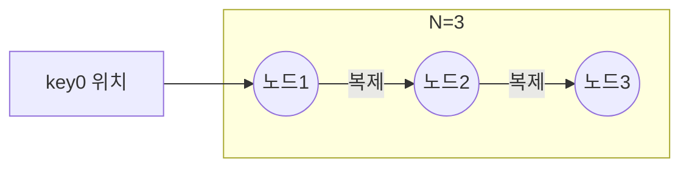
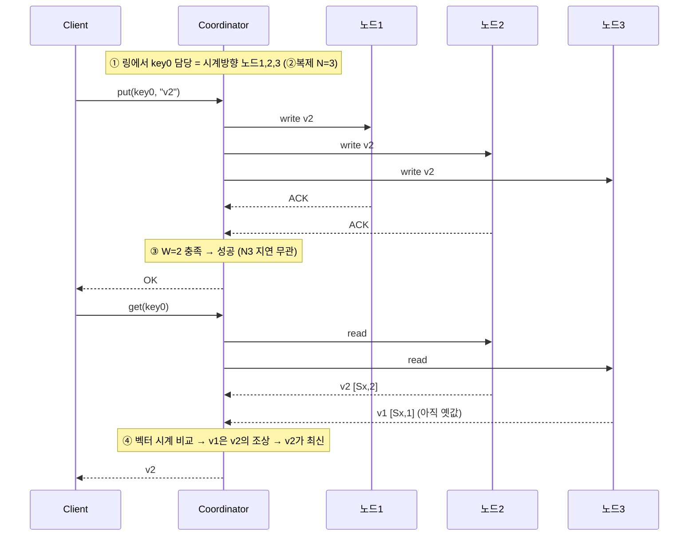

# 흐름 통합 — 데이터 분산 저장부터 벡터 시계까지

> **5장 안정 해시(분산 저장)** 가 **6장 키-값 저장소(복제·정족수·충돌 해소)** 로 어떻게 확장되는지
> 하나의 데이터 흐름으로 꿰는 다리(bridge) 노트.
> 각 단계의 상세는 6장 STEP 노트로 링크한다. 여기서는 **"왜 이 순서로 이어지는가"** 를 본다.

---

## 0. 큰 그림 — 같은 해시 링 위에 4층이 쌓인다


> 핵심: 네 단계 모두 **5장이 정의한 해시 링을 그대로 재사용**한다. 5장은 "링 위 위치로 담당 노드를 정하는 규칙"만 주고, 6장은 그 규칙을 반복 적용해 복제·정족수·충돌 해소를 얹는다.

---

## 1. 왜 이 흐름인가 — 문제의 사슬

각 단계는 *기능 추가*가 아니라 **앞 단계가 만든 문제를 푸는 다음 결정**이다.

| 단계 | 앞 단계가 남긴 문제 | 이 단계의 답 | 새로 생기는 문제 |
| --- | --- | --- | --- |
| ① 분산 저장 | `hash % N`은 서버 변동 시 전부 재배치 | 안정 해시 링 (담당 노드 = 시계방향 첫 노드) | 담당 노드 1곳이 죽으면 그 데이터 조각 소실 |
| ② 복제 N | 노드 하나 죽으면 데이터 유실 | 시계방향 **N개 노드**에 복제 | 복제본이 여러 개 → "어느 게 최신?" |
| ③ 정족수 W·R | 어느 복제본이 최신인지 모호 | **W개에 쓰고 R개를 읽어** `W+R>N`이면 최신 보장 | W를 느슨히 두면 동시 쓰기로 값이 갈라짐 |
| ④ 벡터 시계 | 갈라진 버전 중 뭐가 맞나 | `[서버:카운터]`로 **조상/충돌 판별** 후 병합 | 목록 길이·클라이언트 복잡도 (완화책 존재) |

---

## 2. ① 데이터 분산 저장 (파티션 / 안정 해시) — 5장

### ❓ 먼저 짚기: 파티션은 "분산 저장"인가, "마스터 저장 후 복제"인가?

> **답: 데이터 분산 저장(샤딩)이다. 마스터-복제가 아니다.**

안정 해시가 답하는 질문은 딱 하나 — **"이 키는 어느 노드가 담당(소유)하는가?"** 즉 **어디에 둘지**만 정한다. 복사본을 만드는 일(복제)과는 **완전히 별개의 축**이다.

| | 안정 해시 파티션 (5장) | 마스터-복제 방식 |
| --- | --- | --- |
| 저장 위치 | 키마다 **담당 노드가 다름** (링 위치로 결정) | 모든 쓰기가 **하나의 마스터**로 |
| 성격 | **분산(수평 분할)** | **복제(같은 데이터 복사)** |
| 구조 | **탈중앙** — 단일 마스터 없음 | 중앙 마스터 존재 |

- 안정 해시는 **탈중앙(decentralized)**: key0은 노드0이, key1은 노드1이 담당하는 식으로 **키마다 담당 노드가 흩어진다.** "모두 마스터에 넣고 복제"하는 구조가 아니다.
- "담당 노드"를 그 키의 **primary(주 사본)** 라 부를 수는 있지만, 이건 **키마다 다른** primary이지 **전역 단일 마스터가 아니다.**
- 복제(마스터-복제가 아니라 "시계방향 N개 복사")는 **이 위에 얹는 별개 단계** → 아래 ②.

### 파티션 자체 정리

- **파티션** = 링에서 인접한 두 노드 사이의 해시 공간 = 한 노드가 담당하는 키 구간.
- 키는 **시계방향 첫 노드 한 곳**에 저장 (이 단계엔 복제도 마스터도 없음 — 순수 "어디에 둘지").
- 서버 추가/삭제 시 **인접 구간의 키(평균 k/n)만** 이동 → 무중단 확장.

> 📎 상세: [5장 STEP2 해시 링 원리](02_STEP2_안정해시_원리_해시링.md) · [5장 STEP3 가상 노드](03_STEP3_가상노드_균등분포.md)

---

## 3. ② 복제 계수 N — 6장 STEP3

담당 노드에서 멈추지 않고, **링을 시계방향으로 계속 돌며 N개 노드**에 같은 데이터를 복제한다.

- **N = 복제 계수** (보통 3). key0 담당이 노드1이면 → 노드1·2·3에 저장.
- ⚠️ **가상 노드 함정**: 시계방향 N개의 *가상* 노드가 같은 *물리* 서버일 수 있음 → **이미 만난 물리 노드는 건너뛰고** 서로 다른 물리 노드 N개를 고른다.
- **멀티 DC**: 복제본을 서로 다른 데이터 센터에 분산 → DC 하나가 통째로 죽어도 보존.



> 📎 상세: [6장 STEP3 데이터 복제](../../06-키값저장소설계/정리노트/03_STEP3_데이터복제.md)

---

## 4. ③ 정족수 W·R — 6장 STEP4

복제본이 N개가 되면 "어느 게 최신?" 문제가 생긴다. 세 숫자로 일관성↔지연을 조율한다.

| 기호 | 의미 |
|:---:|---|
| **N** | 복제본 개수 |
| **W** | 쓰기 정족수 — W개 노드의 ACK를 받아야 "썼다" |
| **R** | 읽기 정족수 — R개 노드에서 응답을 받아야 "읽었다" |

**핵심 공식:**
```
W + R > N  ⟹  쓰기 집합 ∩ 읽기 집합 ≠ ∅  ⟹  항상 최신값 (강한 일관성)
```

| 설정 (N=3) | 성격 | W+R>N? |
| --- | --- | :---: |
| W=3, R=1 | 쓰기 느림 / 읽기 빠름 | ✅ |
| W=1, R=3 | 쓰기 빠름 / 읽기 느림 | ✅ |
| **W=2, R=2** | **균형 (흔한 선택)** | ✅ |
| W=1, R=1 | 둘 다 빠름 | ❌ (최종 일관성) |

- **코디네이터(coordinator)**: 클라이언트와 복제 노드 사이의 프록시. 링을 보고 담당 N개를 찾아 쓰기/읽기를 전파하고, W개/R개 응답을 모아 결과를 돌려준다.

> 📎 상세: [6장 STEP4 일관성·정족수](../../06-키값저장소설계/정리노트/04_STEP4_일관성_정족수.md)

---

## 5. ④ 충돌 해소 (벡터 시계) — 6장 STEP5

W를 느슨하게 두거나 네트워크 분할이 있으면 **동시 쓰기로 같은 키에 갈라진 버전**이 생긴다.

- **왜 타임스탬프(LWW) 안 되나**: 서버 간 시계 어긋남(clock skew)으로 나중 쓴 값이 버려질 수 있음 → **인과관계** 추적 필요.
- **벡터 시계**: 버전마다 `[서버:카운터]` 목록. 서버 Si가 쓰면 `[Si,c]` 있으면 +1, 없으면 `[Si,1]` 추가.

**충돌 판정:**

| 관계 | 판정 | 처리 |
| --- | --- | --- |
| X의 모든 카운터 ≤ Y | X는 Y의 **조상** | Y로 자동 덮어씀 |
| 서로 ≤ 불성립 | **충돌** (형제 버전) | **클라이언트가 병합** |

- 저장소는 충돌을 **감지·보존**만, 병합 책임은 **클라이언트**. (예: 아마존 장바구니 → 두 버전 **합집합**)

> 📎 상세: [6장 STEP5 충돌 해소·벡터 시계](../../06-키값저장소설계/정리노트/05_STEP5_충돌해소_벡터시계.md)

---

## 6. 한 번에 따라가기 — key0 하나의 일생 (N=3, W=2, R=2)



- **①②**: 안정 해시로 담당 3개 노드 결정 → 복제.
- **③**: 쓰기 집합 {N1,N2}, 읽기 집합 {N2,N3} → 교집합 **{N2}** 보장(`W+R=4>3`) → 읽기는 반드시 v2를 봄.
- **④**: N3가 옛값 v1을 줘도 벡터 시계로 **v1 ⊂ v2 (조상)** 판정 → v2 채택. 만약 두 값이 서로 조상이 아니면 **충돌**로 보존 후 클라이언트 병합.

---

## 7. 용어 한 장 정리

| 용어 | 한 줄 정의 | 소속 |
| --- | --- | --- |
| 파티션 | 링에서 한 노드가 담당하는 키 구간 | 5장 |
| 가상 노드 | 서버 하나를 링 위 여러 점으로 올린 것 | 5장 |
| 복제 계수 N | 같은 데이터를 저장하는 노드 수 | 6장 |
| W / R | 쓰기 / 읽기 정족수 | 6장 |
| W+R>N | 쓰기·읽기 집합이 겹쳐 강한 일관성 보장 | 6장 |
| 코디네이터 | 쓰기/읽기를 복제본에 전파·수집하는 프록시 | 6장 |
| 벡터 시계 | `[서버:카운터]`로 버전 인과관계 추적 | 6장 |
| 조상/형제 | 덮어쓰기 가능 / 충돌(병합 필요) | 6장 |

---

## ✅ 통합 체크리스트

- [ ] 파티션(분산 저장)과 복제가 **다른 축**임을 설명할 수 있다
- [ ] 복제본 N개를 안정 해시 링에서 고르는 규칙(시계방향, 물리 노드 중복 제외)을 안다
- [ ] `W+R>N`이 왜 강한 일관성을 보장하는지(집합 교집합) 말할 수 있다
- [ ] 느슨한 정족수가 동시 쓰기 충돌을 낳음을 안다
- [ ] 벡터 시계로 조상/충돌을 판정하고 충돌은 클라이언트가 병합함을 안다
- [ ] key 하나의 put→복제→정족수 read→버전 판정 흐름을 그림 없이 설명할 수 있다

---

## 💬 예상 면접 질문 (통합)

**Q0. 안정 해시의 파티션은 데이터 분산 저장인가, 마스터에 저장 후 복제하는 것인가?**
> **분산 저장(샤딩)이다.** 안정 해시는 "이 키를 어느 노드가 담당하는가(어디에 둘지)"만 정하고, 키마다 담당 노드가 흩어지는 **탈중앙 구조**다. 단일 마스터에 모아 복제하는 방식이 아니다. 복제는 이 위에 얹는 별개 축(②)이다.

**Q1. 안정 해시(파티션)와 복제는 어떻게 결합되나?**
> 안정 해시로 키의 담당 노드(시계방향 첫 노드)를 정한 뒤, **거기서 시계방향으로 이어지는 서로 다른 물리 노드 N개**에 복제한다. 파티션은 "어디에", 복제는 "몇 벌"을 담당하는 별개 축이지만 같은 링을 공유한다.

**Q2. N=3에서 강한 일관성과 빠른 응답을 각각 어떻게 얻나?**
> 강한 일관성은 `W+R>N`을 만족하도록(예: W=2,R=2) 잡는다. 쓰기·읽기 집합이 겹쳐 항상 최신값을 본다. 빠른 응답이 우선이면 W=1,R=1처럼 느슨히 둔다(최종 일관성).

**Q3. 정족수를 느슨히 두면 무슨 문제가 생기고 어떻게 푸나?**
> 동시 쓰기로 같은 키에 갈라진 버전이 생긴다. **벡터 시계**로 버전 간 조상/충돌을 판별해, 조상 관계면 자동 덮어쓰고 충돌(형제)이면 저장소가 보존한 뒤 **클라이언트가 병합**(예: 장바구니 합집합)한다.

**Q4. 이 흐름 전체를 한 문장으로 요약하면?**
> 안정 해시로 **나누고(파티션)**, 시계방향 N개에 **복제하고(N)**, W·R로 **일관성을 조율하고(정족수)**, 갈라지면 **벡터 시계로 판별·병합(충돌 해소)** 한다.

---

➡️ 관련: [5장 인덱스](00_인덱스.md) · [6장 인덱스](../../06-키값저장소설계/정리노트/00_인덱스.md) · 다음 흐름 [6장 STEP6 장애 처리](../../06-키값저장소설계/정리노트/06_STEP6_장애처리.md)
