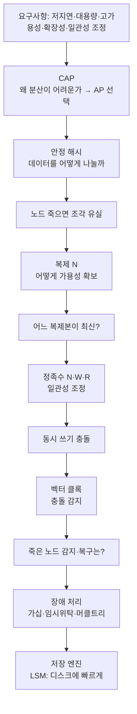
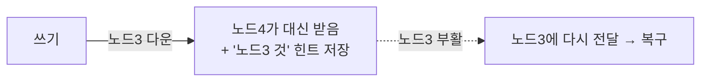
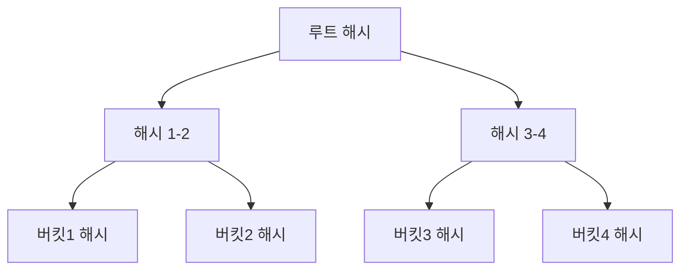
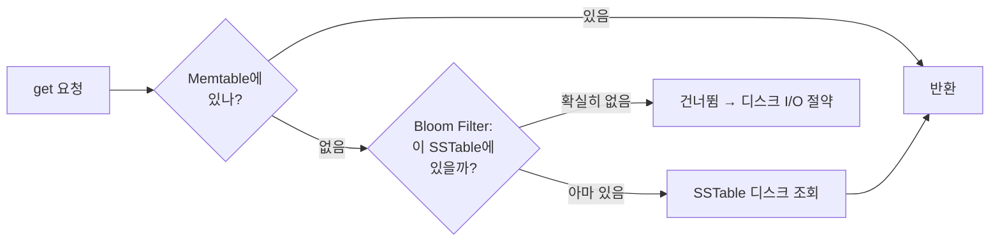
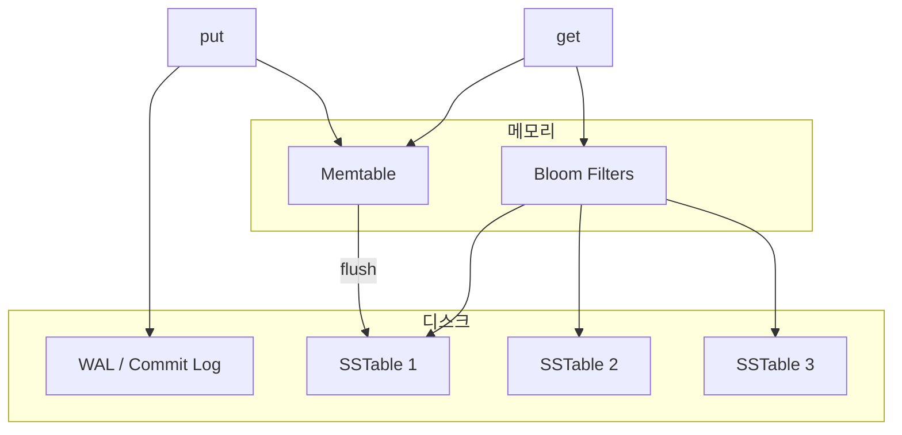

# 분산 키-값 저장소 (Distributed Key-Value Store) 통합 설계서

> **과제**: 가상 면접 사례로 배우는 대규모 시스템 설계 기초 — 6장 키-값 저장소 설계
> **문서 성격**: 요구사항 정의부터 저장 엔진까지를 하나로 통합한 제출용 설계서
> **설계 원칙**: 가용성(A) + 파티션 허용성(P) 우선, 일관성 수준은 조정 가능 (Dynamo 스타일 AP 시스템)
> **레퍼런스 시스템**: Amazon Dynamo, Apache Cassandra, Riak

---

## 0. 문서 개요

### 0.1 한 줄 요약

`put(key, value)` / `get(key)` 두 연산만 지원하지만, **대용량·고가용성·고확장성·저지연**을 동시에 만족해야 하는 분산 키-값 저장소를 설계한다. 단일 서버로는 어느 것도 만족할 수 없으므로 **수평 확장(분산 + 복제)** 을 택하고, 그 결과 따라오는 문제들(분산·일관성·충돌·장애·저장)을 단계별로 해결한다.

### 0.2 설계 흐름 (요구사항 → 결정)



### 0.3 목차

|  장  | 제목                           | 핵심 내용                                          |
| :-: | ---------------------------- | ---------------------------------------------- |
|  1  | [요구사항 정의](#1-요구사항-정의)        | 기능/비기능 요구사항, 제약, CAP 선택                        |
|  2  | [시스템 아키텍처](#2-시스템-아키텍처)      | 전체 구조, 계층별 컴포넌트, 데이터 흐름                        |
|  3  | [데이터 모델](#3-데이터-모델)          | 키/값/메타데이터, 저장 계층별 표현, 생명주기                     |
|  4  | [API 명세](#4-api-명세)          | REST API, 일관성 헤더, 에러 코드                        |
|  5  | [파티셔닝 전략](#5-파티셔닝-전략)        | 안정 해시, 가상 노드, 핫스팟 방지                           |
|  6  | [복제 전략](#6-복제-전략)            | N/W/R, 복제본 배치, Read Repair, Anti-Entropy       |
|  7  | [일관성 모델](#7-일관성-모델)          | 일관성 수준, 버전 관리, 충돌 해결                           |
|  8  | [장애 처리](#8-장애-처리)            | 가십, 느슨한 정족수, 임시 위탁, 머클 트리                      |
|  9  | [저장 엔진](#9-저장-엔진)            | LSM Tree, WAL, Memtable, SSTable, Bloom Filter |
| 10  | [종합 설계 요약](#10-종합-설계-요약)     | 요구사항-해결 매핑, 설계 파라미터, 트레이드오프                    |
| 부록  | [면접 대비 Q&A](#부록-핵심-개념-점검-qa) | 단계별 핵심 질문과 답                                   |

---

## 1. 요구사항 정의

### 1.1 개요

키-값 저장소(Key-Value Store)는 고유한 키(Key)와 그에 대응하는 값(Value)을 쌍으로 저장하는 비관계형(Non-relational) 데이터베이스이다. (예: Redis, Memcached, DynamoDB, etcd)

| 용어               | 설명                                                                     |
| ---------------- | ---------------------------------------------------------------------- |
| **키 (Key)**      | 값에 접근하기 위한 고유 식별자. 텍스트 또는 해시 값 형태 (예: `last_logged_in_at`, `253DDEC4`) |
| **값 (Value)**    | 키에 연결된 데이터. 문자열, 리스트, 객체 등 다양한 형태 가능                                   |
| **키-값 쌍 (Pair)** | 키와 값의 연결 관계 단위                                                         |

> 성능 최적화를 위해 키는 짧을수록 유리하다.

### 1.2 기능적 요구사항

시스템은 다음 두 가지 핵심 연산을 반드시 지원한다.

| 연산 | 시그니처 | 설명 |
|------|----------|------|
| **저장** | `put(key, value)` | 키-값 쌍을 저장소에 저장한다 (동일 키면 덮어쓰기) |
| **조회** | `get(key)` | 주어진 키에 해당하는 값을 반환한다 |

- 키는 저장소 내에서 **유일(Unique)** 하며, 값은 반드시 **키를 통해서만** 접근 가능하다 (범위 쿼리 미지원).
- 값의 형태에 제한을 두지 않는다 (문자열, 리스트, 객체 등). 저장소는 값의 내부 구조를 해석하지 않는다 (**Opaque Value**).

### 1.3 비기능적 요구사항

| 요구사항 | 내용 | 목표 |
|---------|------|------|
| **대용량 저장** | 단일 서버 용량을 초과하는 데이터를 여러 서버에 수평 분산 | — |
| **고가용성** | 일부 장애가 있어도 서비스 지속 및 빠른 응답 | 99.9% 이상 |
| **고확장성** | 트래픽에 따라 서버 자동 증설/제거 (무중단 스케일 아웃/인) | — |
| **일관성 조정** | 사용 목적에 따라 일관성 수준을 조정 가능 | 강한/최종/약한 |
| **저지연** | 읽기/쓰기 모두 낮은 응답 지연 유지 | p99 10ms 이하 (단순 get/put) |

### 1.4 제약 조건

| 항목 | 제약 내용 |
|------|-----------|
| **키-값 크기** | 하나의 키-값 쌍은 10KB(10,240 bytes)를 초과할 수 없음 |
| **키 유일성** | 동일한 키는 저장소 내에서 하나만 존재 가능 |
| **값 접근 방식** | 값은 반드시 키를 통해서만 접근 가능 (범위 쿼리·전체 스캔 미지원) |

### 1.5 핵심 설계 선택 — CAP 이론 기반 AP

> CAP 이론: 분산 시스템에서 네트워크 파티션(P) 발생 시 **일관성(C)** 과 **가용성(A)** 중 하나를 포기해야 한다.

본 시스템은 **가용성(A) + 파티션 허용성(P)** 을 우선시하되, 일관성 수준은 **사용자가 조정 가능**하도록 설계한다.

```
이유:
  - "장애가 있더라도 빨리 응답" → 가용성 우선
  - "데이터 일관성 수준은 조정 가능" → 유연성 확보
  - 모든 서비스가 강한 일관성을 필요로 하지는 않음
```

CAP의 상세 논의와 일관성 수준별 동작은 [7장 일관성 모델](#7-일관성-모델)에서 다룬다.

### 1.6 요구사항 우선순위

| 우선순위 | 요구사항                   | 중요도    |
| ---- | ---------------------- | ------ |
| 1    | `put` / `get` 기본 연산 지원 | 🔴 필수  |
| 2    | 키-값 쌍 크기 10KB 이하 제한    | 🔴 필수  |
| 3    | 짧은 응답 지연시간             | 🔴 필수  |
| 4    | 고가용성 (장애 시에도 응답)       | 🔴 필수  |
| 5    | 대용량 데이터 저장             | 🟠 중요  |
| 6    | 수평 규모 확장성              | 🟠 중요  |
| 7    | 데이터 일관성 수준 조정          | 🟡 선택적 |

---

## 2. 시스템 아키텍처

### 2.1 설계 목표 → 아키텍처 결정 매핑

| 요구사항 | 아키텍처 결정 | 상세 |
|---------|-------------|------|
| 대용량 데이터 저장 | 데이터를 여러 노드에 수평 분산 (파티셔닝) | [5장](#5-파티셔닝-전략) |
| 고가용성 (99.9%) | 모든 데이터를 N개 노드에 복제 | [6장](#6-복제-전략) |
| 낮은 응답 지연 | 인메모리 버퍼 + 블룸 필터로 읽기 최적화 | [9장](#9-저장-엔진) |
| 규모 확장성 | 안정 해시로 서버 추가/제거 시 재배치 최소화 | [5장](#5-파티셔닝-전략) |
| 일관성 조정 | W / R / N 쿼럼 값으로 일관성 수준 제어 | [7장](#7-일관성-모델) |
| 장애 감지·복구 | 가십 프로토콜 + 임시 위탁 + 머클 트리 | [8장](#8-장애-처리) |

### 2.2 전체 아키텍처 구성도

```
┌─────────────────────────────────────────────────────────┐
│                      클라이언트 계층                       │
│              put(key, value) / get(key)                  │
└─────────────────────────┬───────────────────────────────┘
                          │
┌─────────────────────────▼───────────────────────────────┐
│                    코디네이터 계층                          │
│  ┌──────────────────────────────────────────────────┐   │
│  │            코디네이터 노드 (Coordinator)            │   │
│  │  • 요청 수신 및 라우팅                              │   │
│  │  • 안정 해시로 담당 노드 결정                        │   │
│  │  • 쿼럼(W/R/N) 조율                               │   │
│  └──────────────────────────────────────────────────┘   │
└──────────┬────────────────────┬────────────────┬────────┘
           │                    │                │
┌──────────▼──────┐  ┌──────────▼──────┐  ┌─────▼───────────┐
│   스토리지 노드  │  │   스토리지 노드  │  │  스토리지 노드   │
│    Node A       │  │    Node B       │  │    Node C        │
│  ┌───────────┐  │  │  ┌───────────┐  │  │  ┌───────────┐  │
│  │ 메모리 버퍼│  │  │  │ 메모리 버퍼│  │  │  │ 메모리 버퍼│  │
│  │ (Memtable)│  │  │  │ (Memtable)│  │  │  │ (Memtable)│  │
│  ├───────────┤  │  │  ├───────────┤  │  │  ├───────────┤  │
│  │ 블룸 필터 │  │  │  │ 블룸 필터 │  │  │  │ 블룸 필터 │  │
│  ├───────────┤  │  │  ├───────────┤  │  │  ├───────────┤  │
│  │ SSTable   │  │  │  │ SSTable   │  │  │  │ SSTable   │  │
│  │  (Disk)   │  │  │  │  (Disk)   │  │  │  │  (Disk)   │  │
│  └───────────┘  │  │  └───────────┘  │  │  └───────────┘  │
└─────────────────┘  └─────────────────┘  └─────────────────┘
           │                    │                │
           └────────────────────┴────────────────┘
                    가십 프로토콜 (Gossip Protocol)
                    노드 간 상태 정보 교환
```

이 시스템은 중앙 단일 장애점(SPOF)이 없는 **피어-투-피어(P2P)** 구조다. 모든 노드는 동일한 구조를 가지며, 어떤 노드든 코디네이터 역할을 수행할 수 있다.

### 2.3 클라이언트 계층

클라이언트는 `put` / `get` API로 코디네이터에 요청만 보내며, 내부 구현을 알 필요가 없다.

| 알아야 하는 것 | 알 필요 없는 것 |
|---------------|----------------|
| 코디네이터 엔드포인트 주소 | 데이터가 실제로 저장된 노드 |
| 원하는 일관성 수준 (선택적) | 복제 구조, 파티셔닝 로직 |

### 2.4 코디네이터 계층

클라이언트 요청을 받아 적절한 스토리지 노드로 라우팅하는 중간 계층이다. 상태를 저장하지 않으며(Stateless), 어떤 노드든 이 역할을 수행할 수 있다.

| 역할 | 설명 |
|------|------|
| **요청 수신** | 클라이언트로부터 put / get 요청 수신 |
| **노드 결정** | 안정 해시를 통해 담당 스토리지 노드 선택 ([5장](#5-파티셔닝-전략)) |
| **쿼럼 조율** | W / R 값에 따라 필요한 노드 수만큼 요청 분배 및 응답 수집 ([6장](#6-복제-전략)) |
| **장애 감지** | 멤버십 정보로 현재 활성 노드 목록 파악 ([8장](#8-장애-처리)) |
| **응답 반환** | 수집된 응답 중 최신 버전을 클라이언트에 전달 |

### 2.5 스토리지 노드 계층

실제 데이터를 저장하고 반환하는 계층이다. 각 노드는 LSM Tree 기반 저장 엔진([9장](#9-저장-엔진))을 가진다.

| 컴포넌트 | 역할 | 특성 |
|---------|------|------|
| **WAL** (Write-Ahead Log / Commit Log) | 쓰기 내구성 보장 | 순차 기록, 빠른 쓰기 |
| **Memtable** | 인메모리 쓰기 버퍼 | 정렬된 트리 구조 (Red-Black Tree / Skip List) |
| **SSTable** | 디스크 영구 저장소 | 불변(Immutable), 정렬 상태 유지 |
| **블룸 필터** | 키 존재 여부 빠른 판별 | 확률적 자료구조, False Positive 허용 |
| **Compaction** | SSTable 병합 및 정리 | 삭제된 키 제거, 읽기 성능 향상 |

### 2.6 데이터 흐름

#### 쓰기 흐름 (put)

```
① 클라이언트가 put(key, value) 요청
② 코디네이터가 안정 해시로 담당 노드(Primary) 결정
③ 코디네이터가 Primary + Replica 노드들에 동시 쓰기 요청
④ 각 노드: WAL 기록 → Memtable 저장
⑤ W개 노드로부터 성공 응답 수신
⑥ 클라이언트에 성공 응답 반환
```

#### 읽기 흐름 (get)

```
① 클라이언트가 get(key) 요청
② 코디네이터가 안정 해시로 담당 노드 결정
③ 코디네이터가 R개 노드에 동시 읽기 요청
④ 각 노드: 블룸 필터 → Memtable → SSTable 순서로 탐색
⑤ R개 응답 수집 후 가장 최신 버전 선택 (버전 비교)
⑥ 클라이언트에 값 반환
⑦ (선택) Read Repair: 오래된 복제본에 최신 값 동기화
```

### 2.7 컴포넌트 책임 요약

| 컴포넌트 | 담당 요구사항 | 핵심 기술 |
|---------|------------|---------|
| 코디네이터 | 요청 라우팅, 일관성 조율 | 안정 해시, 쿼럼 |
| 스토리지 노드 | 데이터 저장 및 반환 | Memtable, SSTable, WAL |
| 블룸 필터 | 읽기 지연시간 최소화 | 확률적 자료구조 |
| 가십 프로토콜 | 장애 감지 및 멤버십 관리 | 분산 상태 전파 |
| 안정 해시 | 데이터 파티셔닝 | 해시 링, 가상 노드 |
| 복제 | 고가용성 보장 | N개 복제본, Read Repair |
| Hinted Handoff | 장애 노드 데이터 보전 | 임시 저장 및 복구 후 전달 |
| Compaction | 디스크 효율화 | SSTable 병합 |

### 2.8 핵심 아키텍처 트레이드오프

| 결정 | 선택 | 이유 |
|------|------|------|
| 중앙 집중식 vs **P2P** | P2P | 단일 장애점 제거, 높은 확장성·가용성 |
| 메모리 vs 디스크 우선 | **메모리 우선 + WAL 보완** | 쓰기 속도 확보, 내구성은 WAL로 보장 |
| 일관성 vs 가용성 | **가용성 우선(AP)** | 단, W+R>N 설정으로 강한 일관성도 대응 |

---

## 3. 데이터 모델

### 3.1 데이터 단위 — 키-값 쌍 (Entry)

저장과 조회의 기본 단위는 키-값 쌍이며, 내부적으로는 관리용 메타데이터를 함께 보관한다.

```
┌─────────────────────────────────────────────────────┐
│                    키-값 쌍 (Entry)                   │
│  ┌─────────────┐        ┌──────────────────────┐    │
│  │    Key      │ ──────▶│       Value          │    │
│  │  (식별자)   │        │      (데이터)         │    │
│  └─────────────┘        └──────────────────────┘    │
│  + Metadata (내부 관리용)                             │
│    - version    : 버전 번호 (충돌 해결용)              │
│    - timestamp  : 마지막 쓰기 시각                    │
│    - ttl        : 만료 시각 (선택)                    │
│    - tombstone  : 삭제 여부 마커                      │
└─────────────────────────────────────────────────────┘
```

### 3.2 키 (Key) 모델

키는 바이트 배열로 취급하며, 형태에 제한은 없으나 가독성·성능을 위해 네임스페이스 형식을 권장한다.

```
권장 키 형식:  {namespace}:{entity}:{id}

예시:
  user:profile:1001       → 사용자 1001의 프로필
  session:token:abc123    → 세션 토큰
  product:stock:item-99   → 상품 재고
  cache:result:253DDEC4   → 해시 기반 캐시 키
```

| 항목 | 규칙 |
|------|------|
| **유일성** | 저장소 전체에서 반드시 고유 |
| **형태** | 일반 텍스트 또는 해시 값 모두 허용 |
| **최대 크기** | 키 + 값 합산 10KB 이하 (키는 가능한 짧게) |
| **문자 제한** | 제어 문자(null, newline 등) 포함 불가 |
| **대소문자** | 구분함 (`User:1` ≠ `user:1`) |
| **접근 방식** | 키를 통해서만 접근. 범위 쿼리 미지원 |

### 3.3 값 (Value) 모델

저장소는 값의 내부 구조를 해석하지 않는다 (Opaque Value). 저장소에게 값은 단순 바이트 배열이며, 아는 것은 **크기**와 **버전**뿐이다.

| 타입 | 예시 | 비고 |
|------|------|------|
| 문자열 | `"Alice"` | 가장 단순한 형태 |
| 정수 / 실수 | `42`, `3.14` | 문자열로 직렬화 |
| JSON 객체 | `{"name":"Alice","age":30}` | 구조화 데이터 |
| 리스트 | `["read","write","admin"]` | JSON 배열로 직렬화 |
| 바이너리 | `\x89PNG...` | 이미지, 파일 등 |

**값 크기 제약 (10KB 초과 시 분할 저장):**

```
키 크기 + 값 크기 ≤ 10KB (10,240 bytes)

큰 데이터 분할 저장 패턴:
  file:chunk:abc123:0  →  [0~10KB 데이터]
  file:chunk:abc123:1  →  [10~20KB 데이터]
  file:chunk:abc123:2  →  [20~30KB 데이터]
  file:meta:abc123     →  { "chunks": 3, "size": 28500 }
```

### 3.4 메타데이터 (Metadata) 모델

클라이언트에게는 보이지 않지만, 내부적으로 각 키-값 쌍은 메타데이터와 함께 저장된다.

```
내부 저장 단위 (Internal Entry)

┌──────────────────────────────────────────────────┐
│  key        : bytes      키 원본                  │
│  value      : bytes      값 원본                  │
│  version    : int64      단조 증가 버전 번호        │
│  timestamp  : int64      Unix 타임스탬프 (ms)      │
│  ttl        : int64      만료 시각 (0 = 영구 보존) │
│  tombstone  : bool       삭제 마커 (true = 삭제됨) │
│  checksum   : uint32     데이터 무결성 검증용 CRC32 │
└──────────────────────────────────────────────────┘
```

| 필드 | 역할 |
|------|------|
| **version** | 복제본 간 최신 값 판별 기준 (높을수록 최신). 상세 → [7장](#7-일관성-모델) |
| **tombstone** | 삭제를 논리적으로 표시. 물리 제거는 Compaction 시 ([9장](#9-저장-엔진)) |
| **ttl** | 만료 시각 설정. 만료 후 get()은 "없음" 반환 (세션·캐시 활용) |
| **checksum** | 쓰기 시 CRC32 계산·저장, 읽기 시 재계산·비교 → 손상(bit rot) 감지 |

```
delete("user:1001") 호출 시:
  value: (비어있음), tombstone: true, version: 8
  → Compaction 전까지 디스크에 존재하나 get() 시 "없음"으로 응답

put("session:abc123", ..., ttl=3600):
  → 현재 시각 + 3600초 후 자동 만료 → 이후 get()은 null
```

### 3.5 저장소 계층별 데이터 표현

본 절의 자료구조는 [9장 저장 엔진](#9-저장-엔진)에서 동작 흐름과 함께 상세히 다룬다.

#### Memtable (메모리) — 정렬된 트리

```
  "product:stock:item-10"  →  { value: "50",  version: 3 }
  "product:stock:item-99"  →  { value: "120", version: 1 }
  "session:abc123"         →  { value: "user:1001", version: 2, ttl: 1719820800 }
  "user:profile:1001"      →  { value: "{...}", version: 7 }
```

정렬 유지 이유: SSTable로 플러시할 때 순서대로 기록하면 **디스크 순차 쓰기**가 가능해 성능이 좋다.

#### SSTable (디스크) — 정렬된 불변 파일

```
┌──────────────────────────────────────┐
│            인덱스 블록                │  ← 각 키의 파일 내 오프셋 저장
│  "product:stock:item-10" → offset: 0 │
│  "user:profile:1001"     → offset:150│
├──────────────────────────────────────┤
│            데이터 블록                │  ← 실제 키-값 + 메타데이터
│  [key_len][key][value_len][value]     │
│  [version][timestamp][ttl][tombstone] │
│  [checksum]                           │
├──────────────────────────────────────┤
│           푸터 (Footer)              │  ← 인덱스 블록 시작 오프셋
└──────────────────────────────────────┘
```

#### WAL (Write-Ahead Log) — 순차 기록 로그

```
WAL 레코드 형식 (한 줄 = 한 쓰기 요청)
  [seq_no] [timestamp] [op] [key] [value] [checksum]

예시:
  0001  1719820000  PUT  user:profile:1001  {...}      A3F2
  0002  1719820001  PUT  session:abc123     user:1001  B1C4
  0003  1719820005  DEL  session:xyz999     -          D9E1
```

### 3.6 데이터 생명주기

```
생성  put(key, value)
   │
   ▼
활성 상태  get으로 조회 가능, put으로 버전 증가하며 갱신
   │
   ├──── ttl 만료 ────────▶ 만료 상태 (get → null, tombstone 처리)
   │
   ├──── delete(key) ─────▶ 삭제 마킹 (Tombstone, 논리적 삭제)
   │
   ▼
Compaction  오래된 버전 / tombstone / 만료 항목 물리 제거, SSTable 병합·최적화
```

### 3.7 데이터 모델 제약 요약

| 항목 | 규칙 |
|------|------|
| 키-값 쌍 최대 크기 | 10KB 이하 |
| 키 유일성 | 전역 유일 |
| 값 타입 제한 | 없음 (Opaque Bytes) |
| 범위 쿼리 | 미지원 (단건 접근만) |
| 삭제 방식 | 논리적 삭제(Tombstone) → Compaction 시 물리 제거 |
| 버전 관리 | 단조 증가 버전 번호 (int64) |
| 무결성 검증 | CRC32 체크섬 |
| 만료 정책 | TTL 지원 (선택적) |

---

## 4. API 명세

> **통신 방식**: HTTP/1.1 REST API · **기본 URL**: `http://{coordinator-host}:{port}/v1` · **인코딩**: UTF-8 (키는 URL 인코딩)

### 4.1 공통 규약

#### 요청 헤더

| 헤더 | 필수 | 설명 | 예시 |
|------|------|------|------|
| `Content-Type` | 본문 있을 때 | 요청 본문 형식 | `application/json` |
| `X-Consistency-Level` | 선택 | 일관성 수준 지정 | `strong` / `eventual` / `weak` |
| `X-Request-Id` | 선택 | 요청 추적용 고유 ID | `req-550e8400-e29b` |
| `X-Min-Version` | 선택 | 이 버전 이상의 값만 읽기 (Read-Your-Writes, [7.8](#78-쓰기-후-읽기-일관성-read-your-writes)) | `7` |

#### 일관성 수준 (X-Consistency-Level)

쿼럼(N/W/R) 설정과 매핑된다 (N=3 기준). 상세 동작은 [7장](#7-일관성-모델)·[6장](#6-복제-전략) 참조.

| 값 | W | R | 특성 |
|----|---|---|------|
| `strong` | 3 | 3 | 모든 노드 동의 후 응답. 항상 최신 값, 가장 느림 |
| `eventual` (권장 기본) | 2 | 2 | 균형. W+R>N으로 사실상 최신 보장 |
| `weak` | 1 | 1 | 최고 성능, 일시적으로 오래된 값 가능 |

> 헤더 생략 시 시스템 기본값 `eventual`(W=2, R=2)이 적용된다.

#### 응답 헤더

| 헤더 | 설명 |
|------|------|
| `X-Request-Id` | 요청 추적 ID (요청 값 그대로 반환) |
| `X-Version` | 해당 키-값의 현재 버전 번호 |
| `X-Node-Id` | 응답을 처리한 스토리지 노드 ID |

#### 에러 응답 형식 및 코드

```json
{
  "error": {
    "code": "KEY_NOT_FOUND",
    "message": "The requested key does not exist.",
    "request_id": "req-550e8400-e29b"
  }
}
```

| HTTP | error.code | 설명 |
|------|-----------|------|
| `400` | `INVALID_KEY` | 키 형식 오류 (제어 문자 포함 등) |
| `400` | `PAYLOAD_TOO_LARGE` | 키+값 크기 10KB 초과 |
| `400` | `INVALID_TTL` | TTL 값이 음수이거나 형식 오류 |
| `404` | `KEY_NOT_FOUND` | 해당 키 없음 |
| `408` | `REQUEST_TIMEOUT` | 쿼럼 응답 대기 시간 초과 |
| `429` | `RATE_LIMITED` | 요청 한도 초과 |
| `500` | `INTERNAL_ERROR` | 서버 내부 오류 |
| `503` | `QUORUM_UNAVAILABLE` | 가용 노드 수가 쿼럼 미달 |

### 4.2 API 목록

| 메서드 | 경로 | 설명 |
|--------|------|------|
| `PUT` | `/v1/keys/{key}` | 키-값 저장 (생성 또는 덮어쓰기) |
| `GET` | `/v1/keys/{key}` | 키로 값 조회 |
| `DELETE` | `/v1/keys/{key}` | 키-값 삭제 (tombstone) |
| `PUT` | `/v1/keys` | 여러 키-값 일괄 저장 (batch) |
| `GET` | `/v1/keys` | 여러 키 일괄 조회 (batch) |
| `GET` | `/v1/health` | 시스템 상태 확인 |

### 4.3 PUT /v1/keys/{key} — 키-값 저장

```
PUT /v1/keys/user%3Aprofile%3A1001 HTTP/1.1
Content-Type: application/json
X-Consistency-Level: eventual
X-Request-Id: req-550e8400-e29b

{ "value": "{\"name\": \"Alice\", \"age\": 30}", "ttl": 3600 }
```

| 위치 | 이름 | 타입 | 필수 | 설명 |
|------|------|------|------|------|
| Path | `key` | string | ✅ | 저장할 키 (URL 인코딩) |
| Body | `value` | string | ✅ | 저장할 값 (직렬화된 문자열) |
| Body | `ttl` | integer | ❌ | 만료 시간(초). 생략 시 영구 보존 |

**응답** — 새로 생성 `201 Created`, 덮어쓰기 `200 OK`:

```json
{ "key": "user:profile:1001", "version": 1, "expires_at": "2026-07-03T12:00:00Z" }
```

**실패 예시** — `400 Bad Request`:

```json
{ "error": { "code": "PAYLOAD_TOO_LARGE",
  "message": "Key-value pair size 12345 bytes exceeds the 10240 byte limit.",
  "request_id": "req-550e8400-e29b" } }
```

### 4.4 GET /v1/keys/{key} — 값 조회

```
GET /v1/keys/user%3Aprofile%3A1001 HTTP/1.1
X-Consistency-Level: strong
```

**응답** — `200 OK`:

```json
{
  "key": "user:profile:1001",
  "value": "{\"name\": \"Alice\", \"age\": 30}",
  "version": 7,
  "created_at": "2026-06-01T09:00:00Z",
  "updated_at": "2026-06-03T14:22:00Z",
  "expires_at": null
}
```

**키 없음** — `404 Not Found`:

```json
{ "error": { "code": "KEY_NOT_FOUND",
  "message": "The requested key 'user:profile:1001' does not exist.",
  "request_id": "req-7a0c1234-b3d8" } }
```

### 4.5 DELETE /v1/keys/{key} — 키-값 삭제

내부적으로 tombstone 마킹(논리적 삭제)이며, 물리 제거는 Compaction 시 수행된다.

```
DELETE /v1/keys/session%3Aabc123 HTTP/1.1
```

**응답** — `200 OK`:

```json
{ "key": "session:abc123", "deleted": true, "version": 8 }
```

### 4.6 배치(Batch) API

단건 반복 호출의 네트워크 오버헤드를 줄이기 위한 일괄 처리. 각 항목은 독립 처리되며 일부 실패해도 나머지는 처리된다 (Partial Success). **한 번에 최대 100개**.

**PUT /v1/keys** — 일괄 저장, `207 Multi-Status`:

```json
// 요청
{ "entries": [
  { "key": "user:profile:1001", "value": "{\"name\": \"Alice\"}", "ttl": null },
  { "key": "user:profile:2345", "value": "{\"name\": \"Bob\"}",   "ttl": 86400 },
  { "key": "session:abc123",    "value": "user:1001",            "ttl": 3600 }
] }

// 응답
{ "results": [
    { "key": "user:profile:1001", "status": 201, "version": 1 },
    { "key": "user:profile:2345", "status": 200, "version": 4 },
    { "key": "session:abc123", "status": 400,
      "error": { "code": "INVALID_KEY", "message": "Key contains invalid characters." } }
  ],
  "summary": { "total": 3, "succeeded": 2, "failed": 1 } }
```

**GET /v1/keys?keys=k1,k2,...** — 일괄 조회, 존재하지 않는 키도 `found: false`로 포함:

```json
{ "results": [
    { "key": "user:profile:1001", "found": true, "value": "{\"name\": \"Alice\"}", "version": 1, "expires_at": null },
    { "key": "user:profile:2345", "found": true, "value": "{\"name\": \"Bob\"}", "version": 4, "expires_at": "2026-06-04T12:00:00Z" },
    { "key": "session:abc123", "found": false }
  ],
  "summary": { "total": 3, "found": 2, "not_found": 1 } }
```

### 4.7 GET /v1/health — 헬스 체크

로드 밸런서의 헬스 체크 엔드포인트로 활용한다.

```json
// 정상 200 OK
{
  "status": "healthy",
  "coordinator": "node-coordinator-1",
  "timestamp": "2026-06-03T14:00:00Z",
  "nodes": { "total": 3, "healthy": 3, "unhealthy": 0, "detail": [
    { "id": "node-a", "status": "healthy", "latency_ms": 1 },
    { "id": "node-b", "status": "healthy", "latency_ms": 2 },
    { "id": "node-c", "status": "healthy", "latency_ms": 1 } ] },
  "quorum": { "N": 3, "W": 2, "R": 2, "available": true }
}

// 쿼럼 미달 503 Service Unavailable
{ "status": "degraded", ...,
  "nodes": { "total": 3, "healthy": 1, "unhealthy": 2, ... },
  "quorum": { "N": 3, "W": 2, "R": 2, "available": false } }
```

### 4.8 전체 흐름 예시 — 세션 저장 → 조회 → 만료 → 삭제

```
1. PUT /v1/keys/session%3Aabc123  Body:{ "value":"user:1001","ttl":3600 }
   → 201 Created, version: 1
2. GET /v1/keys/session%3Aabc123  (TTL 유효)
   → 200 OK { "value":"user:1001", "version":1, "expires_at":"2026-06-03T15:00:00Z" }
3. GET /v1/keys/session%3Aabc123  (TTL 만료 후)
   → 404 Not Found { "error": { "code":"KEY_NOT_FOUND", ... } }
4. DELETE /v1/keys/session%3Aabc123
   → 200 OK, deleted: true, version: 2  (내부적으로 tombstone)
```

### 4.9 API 제약 및 한계

| 항목 | 제약 |
|------|------|
| 키-값 크기 | 키 + 값 합산 10KB 이하 |
| 배치 최대 항목 수 | 100개 |
| 범위 쿼리 | 미지원 (키 기반 단건/배치만) |
| 트랜잭션 | 미지원 (다중 키 원자적 연산 불가) |
| 키 목록 조회 | 미지원 (전체 스캔 불가) |
| 값 부분 업데이트 | 미지원 (항상 전체 덮어쓰기) |

---

## 5. 파티셔닝 전략

> **핵심 결정**: 안정 해시(Consistent Hashing) + 가상 노드(Virtual Node)

### 5.1 파티셔닝이 필요한 이유

단일 서버의 메모리·디스크 용량은 한계가 있다. 파티셔닝은 전체 데이터를 여러 노드에 나눠 저장하여 이 한계를 극복하고, 노드 추가로 수평 확장을 가능하게 한다.

### 5.2 전략 비교 — 단순 해시 vs 안정 해시

**단순 해시 (Modular Hashing)** — `담당 노드 = hash(key) % 노드 수`:

```
노드 3개 → 4개로 증설 시
  hash("user:1001") % 3 = 2 → Node C  (기존)
  hash("user:1001") % 4 = 1 → Node B  (변경) ← 담당 노드가 바뀜!
→ 전체 키의 약 75%가 재배치 → 대규모 데이터 이동 → 서비스 지연
```

**안정 해시 (Consistent Hashing) ← 채택** — 노드와 키를 동일한 해시 링에 배치하고, 키는 링에서 **시계 방향으로 가장 가까운 노드**가 담당:

| 기준 | 단순 해시 | 안정 해시 |
|------|---------|---------|
| 노드 추가/제거 시 재배치 비용 | 전체의 ~(N-1)/N | **전체의 ~1/N** |
| 부하 균등성 | 높음 | 기본은 낮음 → 가상 노드로 보완 |
| 구현 복잡도 | 낮음 | 중간 |

### 5.3 안정 해시 상세

해시 함수는 **MurmurHash3 (32-bit)** 를 사용한다. 출력 범위 0 ~ 2³²-1을 원형 링으로 구성한다.

```
해시 링 (0 ~ 2³²-1 을 원으로 표현)

                    0
                   ───
          270     / N \     90
               A │     │ B
                  \   /
                   ───
                   180

키 배치 규칙: hash(key)를 계산 → 링에서 시계 방향으로 가장 먼저 만나는 노드가 담당

  hash("user:1001") = 25%  → Node B 담당
  hash("session:x") = 80%  → Node A 담당 (링을 한 바퀴 돌아 A)
```

**노드 추가 시** (Node D를 50% 위치에 추가): 기존 Node C 담당 구간 `(33.3%~66.7%]` 중 `(50%~66.7%]` 키만 Node D로 이동, 나머지 노드는 영향 없음. → 재배치는 전체의 약 1/N.

**노드 제거 시** (Node B 제거): Node B 구간을 시계 방향 다음 노드(Node C)가 흡수, 나머지 노드는 영향 없음.

### 5.4 가상 노드 (Virtual Node)

기본 안정 해시는 노드 수가 적을 때 부하가 불균등해진다 (운 나쁘면 한 노드가 55%, 다른 노드가 3% 담당). 이를 해결하기 위해 **물리 노드 하나가 링 위에 여러 개의 가상 위치**를 갖게 한다.

```
가상 노드 수 = 물리 노드당 V개 (본 설계: V = 150)
물리 노드 3개 → 링 위의 가상 노드 450개

  Node A의 가상 노드: hash("node-a#0")=2.1%, hash("node-a#1")=14.3%, ... (150개)
  Node B의 가상 노드: hash("node-b#0")=5.7%, hash("node-b#1")=18.2%, ... (150개)
  Node C의 가상 노드: hash("node-c#0")=1.3%, hash("node-c#1")=9.6%,  ... (150개)

→ 가상 노드가 링 전체에 고르게 퍼져 각 물리 노드가 약 33.3% ± 2% 담당
```

**가상 노드 수(V) 결정:**

| V 값 | 부하 균등성 | 메모리 | 비고 |
|------|-----------|--------|------|
| 10 | 낮음 (±15%) | 매우 낮음 | |
| 50 | 중간 (±8%) | 낮음 | |
| **150** | **높음 (±2%)** | **중간** | **채택** — 균등성·오버헤드·재배치 비용 균형 |
| 500 | 매우 높음 (±1%) | 높음 | 과함 |

**링 테이블 자료구조** — 코디네이터는 가상 노드 목록을 해시값 기준 정렬 배열로 유지:

```
키 배치 알고리즘:
  target = hash(key)
  index  = 이진 탐색(링 테이블, target)   → O(log(V·N))
  node   = 링 테이블[index].물리노드
```

### 5.5 노드 추가/제거 절차

**추가 (무중단):**

```
① 새 노드(D) 시작 → ② 가십 프로토콜로 클러스터 참여 알림
③ 링 테이블에 D의 가상 노드 150개 삽입 → ④ D가 담당하게 된 구간 계산
⑤ 해당 구간 키를 기존 노드에서 D로 스트리밍 이전 (이전 중에는 기존 노드가 계속 서비스)
⑥ 이전 완료 후 D를 정식 서비스 노드로 등록 → ⑦ 기존 노드의 해당 데이터 삭제
```

**계획적 제거 (Draining):** 제거 대상을 드레이닝 상태로 표시 → 담당 구간을 인접 노드로 이전 → 링 테이블에서 가상 노드 제거 → 가십으로 전파.

**장애 시 (비계획적):** 가십이 장애 감지 → 코디네이터가 "장애" 표시 → 요청을 복제본 노드로 즉시 우회 (Hinted Handoff, [8장](#8-장애-처리)) → 복구 후 동기화.

### 5.6 핫스팟(Hotspot) 방지

**① 키 접미사 분산 (Key Suffix Sharding)** — 특정 키에 요청 집중 시:

```
"ranking:global" 에 초당 수만 건 집중
→ "ranking:global:shard-0..N" 으로 분산 (쓰기: 랜덤 접미사, 읽기: 모든 샤드 집계)
```

**② 가상 노드 수 동적 조정** — 특정 노드 부하 집중 시 해당 노드의 V를 줄이고 다른 노드의 V를 늘려 재분산.

### 5.7 파티셔닝 파라미터 요약

| 파라미터 | 값 | 근거 |
|---------|-----|------|
| 해시 함수 | MurmurHash3 (32-bit) | 빠름, 균등 분포, 암호화 불필요 |
| 해시 공간 | 0 ~ 2³²-1 | 충분한 분산 정밀도 |
| 가상 노드 수(V) | 노드당 150개 | 편차 ±2% 균등성 |
| 링 테이블 | 정렬 배열 | 이진 탐색 O(log N) |
| 링 갱신 | 가십 프로토콜 전파 | 중앙 집중 없이 자율 갱신 |
| 노드 추가 시 재배치 | 전체의 약 1/N | 안정 해시 특성 |
| 핫스팟 대응 | 키 접미사 샤딩 + V 동적 조정 | |

---

## 6. 복제 전략

> **핵심 결정**: 비동기 병렬 복제 + 쿼럼(N/W/R) 기반 일관성 수준 조정

### 6.1 복제가 필요한 이유

파티셔닝만으로는 고가용성을 보장할 수 없다. 데이터가 한 노드에만 있으면 그 노드 장애 시 데이터를 잃는다. 동일 데이터를 **N개 노드에 복제**하면 일부 노드가 죽어도 다른 복제본으로 서비스를 유지한다.

### 6.2 N / W / R 쿼럼

| 파라미터  | 의미               | 기본값 |
| ----- | ---------------- | --- |
| **N** | 복제본 총 수          | 3   |
| **W** | 쓰기 성공 인정 최소 응답 수 | 2   |
| **R** | 읽기 성공 인정 최소 응답 수 | 2   |

**N=3, W=2, R=2가 기본값인 이유:**

```
W + R = 4 > N = 3
→ 읽기 집합과 쓰기 집합이 반드시 1개 이상 겹침
→ 항상 최신 데이터를 포함한 노드가 읽기에 참여
→ 노드 1개 장애·지연을 허용하면서 강한 일관성에 가까운 동작 보장
```

쿼럼 조합별 특성과 일관성 의미는 [7장](#7-일관성-모델)에서 상세히 다룬다.

### 6.3 복제본 배치 전략

#### 해시 링 기반 위치 결정

키의 Primary 노드로부터 **시계 방향으로 N-1개의 다음 노드**가 복제본을 담당한다 (파티셔닝과 동일한 링 사용).

```
링 위 노드 순서(시계 방향): Node A → B → C → D → (다시 A)
put("user:1001") → 해시 → Node B가 Primary

복제본 배치 (N=3):
  Node B: Primary   (1번째)
  Node C: Replica 1 (2번째)
  Node D: Replica 2 (3번째)
```

#### 물리 노드 중복 방지

가상 노드 환경에서 시계 방향 탐색 시 **이미 선택된 물리 노드는 건너뜀**으로써 복제본이 서로 다른 물리 노드에 배치되도록 보장한다.

```
  vNode-B#12 → Node B  ← Primary
  vNode-B#43 → Node B  ← 이미 선택됨, 건너뜀
  vNode-C#7  → Node C  ← Replica 1
  vNode-D#31 → Node D  ← Replica 2
```

#### 랙(Rack) 인식 배치

같은 랙의 서버는 전원·스위치를 공유해 동시 장애 위험이 있다. 복제본을 서로 다른 랙에 배치한다.

```
Rack 1: A,B / Rack 2: C,D / Rack 3: E,F
N=3 배치: Primary(Rack1 A) → Replica1(Rack2 C) → Replica2(Rack3 E)
→ 랙 하나가 통째로 죽어도 나머지 2개 복제본으로 서비스 유지
```

### 6.4 쓰기 복제 흐름

#### 정상 (W=2, N=3)

```
① 클라이언트 → 코디네이터: PUT user:1001 = "Alice"
② 코디네이터: 담당 노드 결정 (Primary=B, Replica=C,D)
③ 코디네이터 → B, C, D 동시(병렬) 쓰기 요청
④ 각 노드: WAL 기록 → Memtable 저장 → 성공 응답
⑤ 코디네이터: W=2개 응답 시점에 클라이언트에 성공 반환 (3번째는 백그라운드)

타임라인:
  t=0ms  B,C,D 동시 요청
  t=3ms  B 성공 (1/2)
  t=5ms  C 성공 (2/2) ← W=2 충족, 클라이언트 응답
  t=8ms  D 성공 (백그라운드)
```

일부 노드(D)가 느려도(예: t=300ms) 클라이언트는 5ms 시점에 응답받는다 → **느린 노드가 응답 시간에 영향 없음**.

#### 노드 장애 시 (Hinted Handoff)

```
Node D 장애 상태에서 쓰기:
① 코디네이터 → B, C 성공 (W=2 충족)
② D 쓰기 실패
③ 코디네이터가 D 대신 다음 건강한 노드 E에 "힌트"와 함께 임시 저장:
   { intended_node:"D", key:"user:1001", value:"Alice", version:5, stored_at:... }
④ 가십이 D 복구 감지 → ⑤ E → D 힌트 데이터 전달 → ⑥ D 저장 완료 후 E의 힌트 삭제
```

힌트 보존 기간: 최대 **24시간**. 이후에도 미복구면 힌트 폐기, Anti-Entropy([6.7](#67-anti-entropy-백그라운드-동기화))로 보완. 임시 위탁의 상세는 [8장](#8-장애-처리)에서 다룬다.

### 6.5 읽기 복제 흐름

#### 정상 (R=2, N=3)

```
① 클라이언트 → 코디네이터: GET user:1001
② 담당 노드(B,C,D) 결정 → ③ 동시 읽기 요청
④ 각 노드: 블룸 필터 → Memtable → SSTable 탐색, 값 + version 반환
⑤ 코디네이터: R=2개 응답 수신, version이 가장 높은 값 선택
⑥ 클라이언트에 반환
```

#### 복제본 간 값 불일치 → Read Repair

```
Node B: "Alice", version=5  (최신)
Node C: "Anna",  version=3  (오래됨)
→ 코디네이터: version 5인 "Alice" 반환
  ↓ 백그라운드 Read Repair
→ Node C에 version=5 "Alice" 동기화 요청 → 이후 읽기에서도 "Alice"
```

### 6.6 Read Repair (읽기 시 복구)

읽기 응답 수집 중 복제본 간 불일치를 감지하고 자동 수정한다.

```
max_version = 응답 중 가장 높은 version
for each node in responses:
  if node.version < max_version:
    백그라운드로 해당 노드에 최신 값 동기화 (클라이언트 응답 지연 없음)
```

| 일관성 수준 | Read Repair |
|-----------|------------|
| `strong` | ✅ 항상 (동기) |
| `eventual` | ✅ 적용 (비동기) |
| `weak` | ❌ 미적용 (성능 우선) |

### 6.7 Anti-Entropy (백그라운드 동기화)

Read Repair는 읽힌 데이터의 불일치만 고친다. 오래 읽히지 않는 데이터는 Anti-Entropy가 주기적으로 동기화한다. 효율적 비교를 위해 **머클 트리(Merkle Tree)** 를 사용한다 (상세 → [8.3](#83-영구적-장애--머클-트리-anti-entropy)).

| 항목 | 값 |
|------|-----|
| 실행 주기 | 1시간마다 (백그라운드) |
| 비교 단위 | 노드 쌍 (Primary ↔ 각 Replica) |
| 불일치 해결 | 더 높은 version의 값으로 덮어씀 |
| 실행 시간대 | 트래픽이 적은 새벽 집중 |

### 6.8 복제 지연 모니터링

| 지표 | 설명 | 경보 기준 |
|------|------|---------|
| 복제 지연 (Replication Lag) | Primary 쓰기 후 Replica 반영까지 시간 | 평균 500ms 초과 |
| 불일치 키 수 | Anti-Entropy 발견 불일치 키 개수 | 1,000개 초과 |
| Hinted Handoff 대기 수 | 미전달 힌트 데이터 개수 | 10,000개 초과 |
| Read Repair 발생율 | 전체 읽기 중 Read Repair 비율 | 5% 초과 |

### 6.9 복제 파라미터 요약

| 파라미터 | 값 | 근거 |
|---------|-----|------|
| N (복제본 수) | 3 | 노드 1개 장애에도 과반수(2개) 유지 |
| W / R (기본) | 2 / 2 | W+R>N 충족하면서 성능 확보 |
| 복제 방식 | 비동기 병렬 | 응답 지연 최소화 |
| 복제본 위치 | 해시 링 시계 방향 N개 | 파티셔닝과 일관 |
| 랙 인식 배치 | 서로 다른 랙에 분산 | 랙 단위 장애 대응 |
| Hinted Handoff 보존 | 최대 24시간 | 단기 장애 복구 |
| Read Repair | 비동기 (weak 제외) | 응답 지연 없이 동기화 |
| Anti-Entropy 주기 | 1시간 | 장기 불일치 감지 |
| 불일치 비교 | Merkle Tree | O(log N) 효율 비교 |
| 충돌 해결 기본 | Last-Write-Wins (version) | 단순성·성능 |

---

## 7. 일관성 모델

> **핵심 결정**: 기본값은 최종 일관성(Eventual), 쿼럼 설정으로 강한 일관성까지 조정 가능

### 7.1 일관성 문제가 발생하는 이유

복제 환경에서는 복제본이 여러 노드에 퍼져 있어 쓰기와 읽기 사이에 시간 간격이 생긴다.

```
N=3 환경에서 put("balance","1000") 직후 get("balance")
  t=0ms  put 시작
  t=2ms  Node B 저장 (Primary)
  t=3ms  Node C 저장 (Replica1) ← W=2 충족, 쓰기 성공 응답
  t=5ms  클라이언트 B: get → Node D(Replica2)에서 읽기
  t=8ms  Node D 저장 완료
  문제: t=5ms에 D는 아직 "1000" 미반영 → 이전 값을 읽을 수 있음 (일관성 문제)
```

일관성은 결국 **"얼마나 최신 데이터를 보장하느냐"** 의 문제다.

### 7.2 CAP 이론과 본 시스템의 선택

```
          일관성 (C)
              ▲
              │  CP            CA
              │  (일관성 우선)  (단일 서버)
              └─────────────────▶ 가용성 (A)
             /
            /  AP
           /   (가용성 우선)
          ▼
   파티션 허용성 (P)
```

| 선택     | 특성                     | 대표 시스템                        |
| ------ | ---------------------- | ----------------------------- |
| **CP** | 파티션 시 일부 요청 거부, 정합성 보장 | HBase, Zookeeper, etcd        |
| **AP** | 파티션 시에도 응답, 일시적 불일치 허용 | **Cassandra, DynamoDB, Riak** |
| **CA** | 파티션 허용성 포기 (단일 서버만 가능) | 전통적 RDBMS                     |

> 본 시스템은 **AP 기반**(가용성+파티션 허용성)이며, 쿼럼(W/R/N) 조정으로 CP에 가까운 동작도 가능하다.

#### 파티션이 실제로 발생하면 — CP vs AP의 행동 차이

복제본 n1, n2, n3 중 **n3에 장애가 생겨 n1·n2와 통신이 끊긴 상황**(네트워크 파티션)을 가정한다.

```
   [n1] ── [n2]      ✗      [n3]   ← 파티션: n3가 격리됨
   └─ 클라이언트 쓰기가 도달 ─┘      └ n1·n2와 단절
```

- n1·n2에 기록된 최신 데이터는 **n3에 전달되지 않는다.**
- n3에 먼저 기록됐던 데이터가 있다면, n1·n2는 **오래된 사본**을 들고 있게 된다.

이때 시스템의 선택에 따라 행동이 갈린다.

| 선택 | 파티션 중 동작 | 대가 |
|------|--------------|------|
| **CP (일관성 우선)** | 정합성이 깨질 수 있으므로 n1·n2의 **쓰기 연산을 차단**하고 `503 QUORUM_UNAVAILABLE` 류의 **오류를 반환**한다. 파티션이 해소될 때까지 대기. | 가용성 희생 (은행 잔액·결제처럼 정합성이 양보 불가한 경우) |
| **AP (가용성 우선) ← 본 시스템** | 낡은 값을 반환할 위험을 감수하고 **읽기·쓰기를 계속 허용**한다. 파티션이 해소되면 그동안의 변경분을 **n3에 전파**해 최종적으로 수렴시킨다. | 일시적 불일치 (대신 무중단 응답) |

> 본 시스템은 AP를 기본으로 하되, **느슨한 정족수 + 임시 위탁**([8.2](#82-일시적-장애--느슨한-정족수--임시-위탁-hinted-handoff))으로 파티션 중에도 쓰기를 받아두고, 복구 후 **Read Repair·Anti-Entropy**([6.6](#66-read-repair-읽기-시-복구)·[6.7](#67-anti-entropy-백그라운드-동기화))로 n3까지 동기화한다. 정합성이 필수인 요청만 `strong`(W=N, R=N)을 지정해 위 표의 CP 동작을 끌어쓴다.

### 7.3 일관성 수준 정의 (3단계)

클라이언트는 요청마다 `X-Consistency-Level` 헤더로 수준을 선택한다 (N=3 기준).

#### 강한 일관성 (Strong) — W=3, R=3

```
- 쓰기: N개 노드 전부 저장 후 성공 / 읽기: N개 전부 조회 후 최신 값
- W+R = 6 > 3 → 쓰기·읽기 집합이 전부 겹침 → 항상 최신 값
  ✅ 항상 최신, 충돌 불가   ❌ 가장 느림, 노드 1개라도 장애 시 쓰기 불가(가용성 저하)
적합: 금융 잔액, 결제, 재고 수량, 분산 락
```

#### 최종 일관성 (Eventual) — W=2, R=2 ← 기본값

```
- 쓰기: W개 저장 후 성공 / 읽기: R개 조회 후 최신 버전 선택
- W+R = 4 > 3 → 집합이 최소 1개 겹침 → 사실상 최신 보장, 단 노드 1개 지연 허용
  ✅ 강한 일관성과 유사 보장 + 빠름   ⚠️ 이론상 극히 드물게 오래된 값
적합: 사용자 프로필, 상품 정보, 일반 설정값
```

#### 약한 일관성 (Weak) — W=1, R=1

```
- 쓰기: 1개 저장 즉시 성공 / 읽기: 1개에서 즉시 반환 (최신 보장 없음)
- W+R = 2 ≤ 3 → 집합이 안 겹칠 수 있음 → 최신 값 없는 노드가 읽기에 참여 가능
  ✅ 가장 빠름, 노드 2개 장애에도 서비스   ❌ 오래된 값 가능, 데이터 손실 가능성
적합: 세션 캐시, 임시 토큰, 실시간 게임 상태, 로그 수집
```

#### 세 수준 비교

```
                  약한(W1R1)   최종(W2R2)   강한(W3R3)
응답 속도        ████████     █████        ███
쓰기 가용성      ████████     █████        ███
읽기 최신성      ███          █████        ████████
충돌 가능성      높음          낮음          없음
노드 장애 허용   N-1개         N/2개         0개
```

### 7.4 버전 관리와 충돌 감지

#### 단조 증가 버전 번호

모든 쓰기는 버전을 1씩 증가시킨다. 복제본 간 최신 값 판별 기준이며, version이 높은 쪽이 최신이다.

#### 충돌이 발생하는 조건 — 동시 쓰기

단순 버전 번호만으로는 **동시 쓰기(Concurrent Write)** 를 판별할 수 없다.

```
파티션 발생: [B,C] | [D] 분리
  클라이언트 X → B,C: put("counter","10") version:5
  클라이언트 Y → D:   put("counter","20") version:5
파티션 복구 후:
  B:"10"(v5), C:"10"(v5), D:"20"(v5)
→ version이 같음 → 어느 것이 최신인지 알 수 없음 → 충돌
```

### 7.5 충돌 해결 전략

#### Last-Write-Wins (LWW) — 기본 정책

타임스탬프(또는 버전)가 더 늦은 쓰기를 채택.

```
B:"10"(v5, ts=1000ms) vs D:"20"(v5, ts=1003ms) → "20" 채택, "10" 폐기
  ✅ 단순, 메타데이터 적음, 오버헤드 없음
  ❌ 클럭 동기화(NTP 오차) 의존, 동시 쓰기 시 한쪽 데이터 유실
적합: 캐시·세션·로그 등 유실 허용 데이터 / weak 수준
```

#### 벡터 클록 (Vector Clock) — 충돌 추적 정책

노드별 쓰기 횟수를 배열 `{노드ID: 횟수}`로 추적하여 인과 관계를 파악한다.

```
순차 수정 (인과 관계 명확):
  Node A: "Alice2", vc={A:2}   ← A:2 > A:1 → A가 최신

동시 쓰기 (인과 관계 불명확):
  클라이언트 X → A: vc={A:2, B:0}
  클라이언트 Y → B: vc={A:0, B:1}
  비교: A:2>A:0 이지만 B:0<B:1 → 어느 쪽도 상대를 포함 못 함 → 충돌 확정

판별 알고리즘 isDescendant(vc_a, vc_b):
  모든 노드 n에 대해 vc_a[n] >= vc_b[n] 이면 vc_a가 vc_b의 후손(최신)
  - isDescendant(a,b)=true → a 최신
  - isDescendant(b,a)=true → b 최신
  - 둘 다 false → 동시 쓰기(충돌)

충돌 해결: ① 두 값 모두 클라이언트에 전달 → 앱 레벨 결정  ② LWW 폴백
```

> **버저닝의 전제 — 불변 버전(Immutable Version):** 데이터를 변경할 때마다 기존 값을 덮어쓰는 게 아니라 **새로운 버전을 생성**하며, 각 버전은 **변경 불가능(immutable)** 하다. 그래서 충돌이 나도 두 버전이 모두 보존되어 사후 해소가 가능하다.

#### 벡터 클록의 한계 — 그리고 본 시스템이 LWW를 기본으로 두는 이유

벡터 클록은 동시 쓰기를 **정확히 판별**할 수 있는 반면, 두 가지 실무적 비용이 있다.

| 한계 | 내용 |
|------|------|
| **클라이언트 복잡도** | 충돌 감지·해소 로직을 클라이언트(앱)가 직접 구현해야 한다. |
| **메타데이터 무한 증가** | 쓰기를 처리한 노드가 많아질수록 `{노드ID: 횟수}` 쌍이 계속 늘어난다. 이를 막으려 **임계치를 두고 오래된 쌍부터 제거**하면, 버전 간 선후 관계가 **부정확**해져 충돌 해소 효율이 떨어진다. |

> 다만 **아마존 Dynamo 문헌에 따르면 실제 서비스에서 이 메타데이터 폭증 문제가 벌어진 적은 없다**고 한다. 즉 벡터 클록은 대부분의 서비스에서 충분히 실용적이다.
>
> **본 시스템의 선택:** 그럼에도 기본 충돌 해결은 **LWW**로 둔다. ① 레퍼런스인 **Cassandra가 벡터 클록 대신 LWW(타임스탬프 최신값 승리)** 를 채택했고, ② 본 저장소의 주 사용처(캐시·세션·프로필 등)는 동시 쓰기 충돌 빈도가 낮아 LWW의 단순성·낮은 오버헤드 이점이 더 크기 때문이다. 동시 쓰기 손실을 반드시 추적해야 하는 워크로드(장바구니 병합 등)에 한해 **벡터 클록을 선택적으로 활성화**한다. (Dynamo·Riak 계열 동작)

#### 일관성 수준별 충돌 해결 매핑

| 일관성 수준 | 충돌 해결 | 이유 |
|-----------|---------|------|
| `strong` | 충돌 자체가 발생하지 않음 | 쿼럼(W=N,R=N)으로 동시 쓰기 차단 |
| `eventual` | LWW (버전 번호 기준) + Read Repair | 실용적 균형 |
| `weak` | LWW (타임스탬프 기준) | 성능 우선, 단순 처리 |

### 7.6 일관성 수준별 시나리오

```
[은행 잔액 차감] balance=1000, A가 -200, B가 -300 동시 시도 (기대값 500)
  weak/eventual:  최종 700 또는 800 → 500 아님 ❌
  strong:         직렬화로 500에 근접하나, 진정한 원자성은 별도 트랜잭션 필요 ⚠️
  → 금융은 strong + 애플리케이션 레벨 낙관적 잠금 병행 권장

[사용자 프로필 업데이트]
  weak: 잠시 옛 값 ⚠️ / eventual: 거의 즉시 최신 ✅ / strong: 과함
  → eventual 권장

[세션 토큰 저장]
  weak: 일부 노드 미반영 시 재로그인 가능 ⚠️ / eventual: 충분히 빠름 ✅ / strong: 과함
  → weak 또는 eventual 권장
```

### 7.7 단조 읽기 보장 (Monotonic Read)

같은 클라이언트가 연속 읽을 때 시간이 거꾸로 가는 현상을 방지한다.

```
문제: t1에 Node B에서 version=5 읽음 → t2에 Node C에서 version=3 읽힘 (역행!)
해결: 클라이언트가 읽은 version을 기억 → 응답 version이 더 낮으면 재요청/대기
      (응답 헤더 X-Version 추적으로 구현)
```

### 7.8 쓰기 후 읽기 일관성 (Read-Your-Writes)

자신이 방금 쓴 값을 즉시 읽을 수 있어야 한다.

```
문제: A가 put 후 곧바로 get을 다른(미복제) 노드에서 하면 옛 값을 읽음
해결: ① strong 사용  ② Sticky Session  ③ version 전달
본 시스템 구현 (③):
  PUT 응답의 X-Version: 7 을, 후속 GET에 X-Min-Version: 7 헤더로 전달
  → 코디네이터가 version ≥ 7인 노드에서만 읽기 수행
```

### 7.9 일관성 수준 선택 가이드

```
데이터 손실 절대 불가?            → strong
동시 수정 + 손실 불가?            → strong
동시 수정 + 손실 허용?            → eventual
방금 쓴 값 즉시 읽기?             → strong 또는 X-Min-Version
일시적 옛 값 허용 + 성능 중요?    → weak
일반적인 경우?                    → eventual
캐시·세션·임시 데이터?            → weak
```

### 7.10 일관성 파라미터 요약

| 파라미터 | 값 | 근거 |
|---------|-----|------|
| 기본 일관성 수준 | `eventual` (W=2, R=2) | 성능과 일관성 균형 |
| 강한 일관성 | W=3, R=3 | 충돌 원천 차단 |
| 약한 일관성 | W=1, R=1 | 최고 성능, 손실 허용 |
| 버전 관리 | 단조 증가 int64 | 단순, 비교 비용 없음 |
| 충돌 감지 | 벡터 클록 | 동시 쓰기 정확 판별 |
| 기본 충돌 해결 | LWW (버전 번호) | 단순성·성능 |
| 단조 읽기 | X-Version 헤더 추적 | 클라이언트 측 구현 |
| 쓰기 후 읽기 | X-Min-Version 헤더 | 선택적 적용 |

---

## 8. 장애 처리

> **세 가지 도구**: 가십 프로토콜(감지) · 느슨한 정족수 + 임시 위탁(일시 장애) · 머클 트리(영구 장애)
> 전제: 노드는 반드시 죽는다. 죽은 것을 어떻게 알고(감지), 어떻게 복구하나.

### 8.1 장애 감지 — 가십 프로토콜 (Gossip Protocol)

#### 단순 방법이 안 되는 이유

- 한 서버가 "쟤 죽었다"고 단독 판단 → **오판 위험**.
- 모든 서버가 모든 서버를 직접 핑(ping) → **트래픽 폭발(O(N²))**.

#### 가십 방식 — 소문 퍼뜨리듯 상태 전파


- 각 노드는 **멤버십 목록**(노드ID, heartbeat 카운터, 마지막 갱신 시각)을 가진다.
- 주기적으로 **무작위 노드 k개**에게 자기 목록을 전달 → 받은 노드는 자기 것과 병합.
- 어떤 노드의 heartbeat가 **정해진 시간 동안 안 늘면** → 그 노드를 **장애로 표시**.
- 여러 노드가 합의하면 다운 확정 → **분산 합의로 오판 방지**.

```
예: 매 초 각 노드가 랜덤 노드에 멤버십 전파
  A → C: "나는 살아있고, B는 v12, C는 v15 상태야"
  B → A: "B는 오랫동안 heartbeat 갱신 없음 → 장애로 판단"
```

**멤버십 목록 예시 (node s0이 보유):** 각 노드는 주기적으로 자신의 heartbeat 카운터를 올리고, 받은 목록을 자기 것과 병합해 더 큰 카운터로 갱신한다.

| Member ID | Heartbeat counter | Last update |
|:--:|:--:|:--:|
| 0 (self) | 10232 | 12:00:01 |
| 1 | 10224 | 12:00:10 |
| **2** | **9534** | **12:00:05** ← 카운터가 오래 안 늘면 장애 의심 |
| 3 | 11422 | 12:00:20 |
| 4 | 10314 | 12:00:15 |

> s0은 노드 2의 카운터가 지정 시간 동안 증가하지 않음을 발견 → 노드 2를 포함한 목록을 무작위 노드들에 전파 → **여러 노드가 같은 판단에 합의하면 노드 2를 장애로 확정**한다(단독 판단에 의한 오판 방지).

이 멤버십 정보는 코디네이터의 라우팅([2.4](#24-코디네이터-계층))과 링 테이블 갱신([5.5](#55-노드-추가제거-절차))에도 사용된다.

### 8.2 일시적 장애 — 느슨한 정족수 + 임시 위탁 (Hinted Handoff)

노드가 잠깐 죽거나 네트워크가 일시적으로 끊긴 경우.

| 방식 | 내용 |
|------|------|
| **엄격한 정족수** | 죽은 노드 때문에 W/R을 못 채우면 그냥 실패 |
| **느슨한 정족수 (Sloppy Quorum)** | 죽은 노드 대신 **건강한 노드 중 W/R개**를 골라 처리 → 가용성 유지 |
| **임시 위탁 (Hinted Handoff)** | 죽은 노드가 받았어야 할 쓰기를 **다른 노드가 임시 보관**하다가, 노드가 살아나면 **넘겨줘 복구** |



> 데이터 일관성을 희생하지 않으면서 **가용성을 높이는** 핵심 기법. 쓰기 흐름에서의 동작과 24시간 보존 정책은 [6.4](#64-쓰기-복제-흐름)에서 다뤘다.

### 8.3 영구적 장애 — 머클 트리 (Merkle Tree, anti-entropy)

노드가 완전히 죽어 디스크 손실 등으로 **복제본 간 데이터가 영구적으로 어긋난** 경우 동기화가 필요하다. 전체 데이터를 다 비교하면 비효율적이므로, 머클 트리로 **다른 부분만** 찾는다.



**트리 구성 4단계 (키 공간 → 트리):**

```
① 버킷 분할   : 키 공간을 N개 버킷으로 나눔        (예: 12개 키 → 4개 버킷)
② 균등 해시   : 각 버킷의 키마다 균등 분포 해시 적용
③ 버킷 해시   : 버킷별 해시값을 계산 → 잎(leaf) 노드 생성
④ 상향식 구성 : 자식 해시들을 해시 → 부모 노드 → ... → 루트까지 이진 트리로 쌓음
```

- 잎(leaf) = 키 공간을 쪼갠 **버킷의 해시**, 상위 노드 = 자식 해시들의 해시.
- 두 복제본의 머클 트리를 **루트부터 비교**:
  - 루트 해시 같음 → **전체 동일**, 동기화 불필요.
  - 다르면 → **해시가 다른 가지만 따라 내려가** 차이 나는 버킷만 찾음.
- 결과: 차이 나는 데이터만 골라 동기화 → 전송량·비교량 대폭 절감 (**O(log N)** 수준 탐색).

> **버킷 사이징의 효과:** 동기화 비용은 **두 복제본의 실제 차이 크기에 비례**할 뿐, 전체 데이터 크기와 무관하다. 예컨대 **1백만(1M) 개 버킷에 버킷당 1천(1,000) 개 키**를 담으면, 한 버킷이 어긋났을 때 비교할 키는 그 **1,000개뿐**이다.

이 메커니즘이 [6.7 Anti-Entropy](#67-anti-entropy-백그라운드-동기화)의 주기적 백그라운드 동기화에 사용된다.

### 8.4 데이터 센터 장애 대비

정전·재해로 DC 전체가 죽을 수 있으므로, **여러 데이터 센터에 복제**한다. 한 DC가 죽어도 다른 DC에서 서비스를 지속한다 (랙 인식 배치 [6.3](#63-복제본-배치-전략)의 확장).

### 8.5 장애 유형별 대응 요약

| 장애 유형 | 감지 | 대응 |
|---------|------|------|
| 노드 일시 장애 | 가십 (heartbeat 미갱신) | 느슨한 정족수 + 임시 위탁 → 복구 후 힌트 전달 |
| 노드 영구 장애 | 가십 + Anti-Entropy | 머클 트리로 차이 동기화, 링에서 제거·재배치 |
| 복제본 값 불일치 | 읽기 시 version 비교 | Read Repair (즉시) + Anti-Entropy (주기) |
| 데이터센터 장애 | 가십 (DC 단위) | 다중 DC 복제로 타 DC에서 서비스 |
| 일시적 네트워크 지연 | 쿼럼 응답 타임아웃 | W개만 충족하면 응답, 나머지 백그라운드 |

---

## 9. 저장 엔진

> 지금까지는 "분산"을 다뤘다. 마지막으로 **노드 한 대 안에서** 쓰기/읽기를 빠르게 만드는 구조.
> quest06의 **"낮은 지연시간"** 을 단일 노드 레벨에서 해결한다. (**LSM Tree** 계열)

### 9.1 쓰기 경로 (Write Path)

쓰기는 **순차 디스크 쓰기 + 메모리 버퍼**로 빠르게 처리한다.


| 단계 | 역할 |
|------|------|
| **1. WAL (Commit Log)** | 쓰기를 디스크 로그에 append. 노드가 죽어도 Memtable 내용 복구 가능 (**내구성**) |
| **2. Memtable** | 메모리 안의 정렬된 버퍼. 실제 쓰기는 여기에 빠르게 들어감 |
| **3. SSTable** | Memtable이 임계치만큼 차면 디스크에 정렬된 불변 파일로 flush |

> 모든 쓰기가 **순차 I/O**(append, flush)라서 랜덤 쓰기보다 훨씬 빠르다 = **LSM Tree의 핵심 아이디어**.

### 9.2 읽기 경로 (Read Path)

데이터는 Memtable(메모리) 또는 여러 SSTable(디스크)에 흩어져 있다. 어디 있는지 찾는 게 관건.



#### Bloom Filter — "이 SSTable에 키가 있을까?"

- **확률적 자료구조.** "**확실히 없음**" 또는 "**아마 있음**"만 답한다.
- "없음"이면 그 SSTable은 디스크를 안 읽고 건너뛴다 → 불필요한 디스크 I/O 제거.
- **거짓 양성**(있다는데 실제 없음)은 가능, **거짓 음성은 없음** → 데이터를 놓치지 않는다.

> 효과: 키가 어느 SSTable에 있는지 메모리에서 빠르게 걸러내 **읽기 지연 대폭 감소**.

### 9.3 전체 그림 — 한 노드의 저장 엔진



### 9.4 Compaction (컴팩션)

SSTable이 쌓이면 읽기 시 뒤져야 할 파일이 늘어난다. 주기적으로 여러 SSTable을 **병합·정리**하여:

- 같은 키의 오래된 버전 제거 (최신 version만 유지)
- tombstone(삭제 마커) 및 TTL 만료 항목 물리 제거 ([3.4](#34-메타데이터-metadata-모델))
- 파일 수와 읽기 비용 감소

### 9.5 저장 엔진이 요구사항에 기여하는 점

| 메커니즘 | 기여 |
|---------|------|
| WAL append (순차 I/O) | 빠른 쓰기 + 내구성 |
| Memtable (메모리 버퍼) | 쓰기 지연 최소화 |
| SSTable flush (순차 I/O) | 높은 쓰기 처리량 |
| Bloom Filter | 읽기 지연 최소화 (불필요 디스크 I/O 차단) |
| Compaction | 디스크 효율, 읽기 성능 유지 |

> 이 구조를 쓰는 실제 엔진: **Cassandra, RocksDB, LevelDB, HBase.**

---

## 10. 종합 설계 요약

### 10.1 요구사항 → 해결 매핑

| 요구사항 | 해결 메커니즘 | 章 |
|---------|-------------|:---:|
| 대용량 저장 | 안정 해시 파티셔닝 + 가상 노드 | [5](#5-파티셔닝-전략) |
| 높은 가용성 | 복제 N=3 + 다중 DC + 임시 위탁 | [6](#6-복제-전략), [8](#8-장애-처리) |
| 규모 확장성 | 안정 해시 (재배치 1/N) + 무중단 노드 추가 | [5](#5-파티셔닝-전략) |
| 일관성 조정 | 정족수 N·W·R (strong/eventual/weak) | [7](#7-일관성-모델) |
| 충돌 처리 | 버전 번호 + 벡터 클록 + LWW | [7](#7-일관성-모델) |
| 장애 감지·복구 | 가십 · 임시 위탁 · 머클 트리 | [8](#8-장애-처리) |
| 낮은 지연 (단일 노드) | LSM: WAL → Memtable → SSTable + Bloom Filter | [9](#9-저장-엔진) |

### 10.2 핵심 설계 파라미터 (한눈에)

| 영역 | 파라미터 | 값 |
|------|---------|-----|
| 파티셔닝 | 해시 함수 / 가상 노드 수 | MurmurHash3 / V=150 |
| 복제 | N / W / R (기본) | 3 / 2 / 2 |
| 일관성 | 기본 수준 | eventual (W+R>N) |
| 충돌 해결 | 기본 정책 | LWW (version 기준) |
| 장애 감지 | 방식 | 가십 (heartbeat) |
| 일시 장애 | 보존 | 임시 위탁 24시간 |
| 영구 장애 | 동기화 | 머클 트리 (1시간 주기 Anti-Entropy) |
| 저장 엔진 | 구조 | LSM Tree (WAL/Memtable/SSTable/Bloom Filter) |
| 데이터 | 최대 크기 | 키+값 10KB |

### 10.3 핵심 트레이드오프

| 결정 | 채택 | 포기/비용 |
|------|------|----------|
| CAP | AP (가용성 우선) | 일시적 불일치 가능 (쿼럼으로 보완) |
| 토폴로지 | P2P | 구현 복잡도 증가 (SPOF 제거 대가) |
| 쓰기 경로 | 메모리 우선 + WAL | 약간의 WAL 디스크 쓰기 (내구성 확보) |
| 충돌 해결 | LWW 기본 | 동시 쓰기 시 한쪽 유실 가능 (벡터 클록으로 감지 가능) |
| 파티셔닝 | 안정 해시 + 가상 노드 | 링 테이블 메모리 오버헤드 |

### 10.4 의도적으로 다루지 않은 범위 (Out of Scope)

- 다중 키 트랜잭션 / 원자적 연산
- 범위 쿼리 / 보조 인덱스 / 전체 키 스캔
- 값의 부분 업데이트
- 인증·인가, 암호화 등 보안 영역 (별도 설계 필요)

---

## 부록. 핵심 개념 점검 Q&A

> 스터디·면접 대비용. 각 장의 핵심을 질문-답 형태로 압축했다.

**Q. 왜 단일 서버가 아니라 분산 시스템인가?**
> 단일 서버는 ① 용량(한 서버 메모리/디스크 한계) ② 가용성(SPOF — 죽으면 전체 소실) ③ 처리량(트래픽 상한)의 세 벽에 막힌다. 압축·캐싱 같은 임시방편은 데이터가 한 대 용량을 넘거나 그 한 대가 죽는 순간 무력하다. 수직 확장 대신 **수평 확장(분산 + 복제)** 이 용량·가용성·확장성을 동시에 얻는 유일한 답이다.

**Q. 왜 AP인가? (CAP)**
> "장애가 있어도 빨리 응답"이 요구사항이므로 가용성 우선. 모든 서비스가 강한 일관성을 필요로 하지 않고, 일관성은 쿼럼으로 조정 가능하게 열어두면 CP에 가까운 동작도 가능하다.

**Q. 단순 해시 대신 안정 해시를 쓰는 이유는?**
> 단순 해시(`hash % N`)는 노드 수가 바뀌면 ~75%(약 (N-1)/N)의 키가 재배치된다. 안정 해시는 노드와 키를 링에 올리고 시계 방향 노드가 담당하게 해, 추가/제거 시 **약 1/N**만 재배치한다.

**Q. 가상 노드는 왜 필요한가?**
> 물리 노드가 적으면 링 위 위치가 불균등해 부하가 쏠린다. 물리 노드 하나에 가상 위치를 여러 개(V=150) 두면 링 전체에 고르게 퍼져 담당 비율이 ±2%로 균등해진다.

**Q. N=3, W=2, R=2가 기본인 이유는?**
> W+R=4 > N=3 이라 읽기 집합과 쓰기 집합이 반드시 겹쳐 항상 최신 노드가 읽기에 참여한다. 동시에 노드 1개 장애·지연을 허용해 가용성과 일관성의 실용적 균형점이다.

**Q. 노드 장애를 어떻게 감지하나?**
> 가십 프로토콜. 각 노드가 멤버십 목록(노드ID·heartbeat·갱신시각)을 무작위 노드와 주기적으로 교환·병합한다. heartbeat가 일정 시간 안 늘면 장애로 표시하고 여러 노드가 합의하면 다운 확정. 직접 핑(O(N²))과 단독 판단(오판)을 피한다.

**Q. 일시 장애 노드의 쓰기는 어떻게 처리하나?**
> 느슨한 정족수 + 임시 위탁(Hinted Handoff). 죽은 노드 대신 건강한 노드가 쓰기를 받아 "원래 누구 것"이라는 힌트와 함께 임시 보관하다가, 복구되면 넘겨줘 동기화한다.

**Q. 영구 장애로 복제본이 어긋나면?**
> 머클 트리로 두 복제본을 루트부터 비교한다. 루트 해시가 같으면 전체 동일, 다르면 해시가 다른 가지만 따라 내려가 차이 나는 버킷만 동기화한다 (O(log N) 탐색).

**Q. LSM 구조가 쓰기에 빠른 이유는?**
> 랜덤 쓰기 대신 WAL append와 SSTable flush의 **순차 I/O**만 하기 때문이다. 읽기는 Bloom Filter로 불필요한 SSTable 조회를 건너뛰어 지연을 줄인다.

**Q. Bloom Filter에 거짓 음성이 없다는 게 왜 중요한가?**
> "없다"는 답이 항상 정확하므로, 없다고 하면 그 SSTable을 안 읽어도 데이터를 놓칠 일이 없다. 거짓 양성(있다는데 없음)은 한 번 디스크를 헛읽을 뿐 정확성을 해치지 않는다.

---

*본 문서는 분산 키-값 저장소의 요구사항부터 저장 엔진까지를 통합한 제출용 설계서이다. 세부 구현·운영 정책은 실제 구축 단계에서 구체화한다.*
