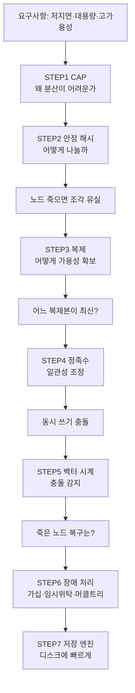

# 키-값 저장소 설계 — STEP별 정리 노트

> 『가상 면접 사례로 배우는 대규모 시스템 설계 기초』 6장 학습 노트
> 설계를 시작하기 전에 알아야 할 개념을 STEP 순서대로 정리한다.

---

## 이 노트의 목적

`put(key, value)` / `get(key)` 두 연산만 지원하는 저장소지만,
**단일 서버 → 분산 시스템**으로 확장하는 순간 아래 개념들이 전부 필요해진다.

각 STEP은 *기능 추가*가 아니라 **"앞 단계가 만든 문제를 푸는 다음 결정"** 이다.

---

## 왜 단일 서버 → 분산 시스템으로 가야 하는가

설계는 가장 단순한 형태, 즉 **한 대의 서버 메모리 위 해시 테이블**에서 출발한다.
`put`은 `map[key]=value`, `get`은 `map[key]` 반환으로 끝나니 빠르고 구현도 간단하다.
문제는 이 구조가 quest06이 요구하는 **대용량·고가용성·고확장성·저지연**을 **하나도 만족하지 못한다**는 것이다.

### 단일 서버의 3가지 벽

| 벽           | 무엇이 막히나                                            | quest06 요구사항과 충돌        |
| ----------- | -------------------------------------------------- | ----------------------- |
| **용량**      | 모든 데이터가 **한 서버 메모리/디스크** 안에 들어가야 함                 | "큰 데이터를 저장할 수 있어야 한다" ❌ |
| **가용성(장애)** | 서버 한 대가 죽으면 **데이터 전체 소실 + 서비스 중단** (단일 장애점, SPOF)  | "장애가 있더라도 빨리 응답" ❌      |
| **처리량/확장성** | 한 서버가 받는 트래픽·연산에 상한 → **수직 확장(스펙업)만 가능하고 한계·비용 큼** | "트래픽에 따라 자동 증설/삭제" ❌    |

### 임시방편으로는 한계를 못 넘는다

- **데이터 압축** / **자주 쓰는 데이터만 메모리, 나머지는 디스크** 같은 기법으로 용량은 잠시 버틸 수 있다.
- 하지만 **데이터가 한 대 용량을 넘어서는 순간**, 그리고 **그 한 대가 죽는 순간**의 문제는 근본적으로 해결되지 않는다.

### 결론: 수평 확장(분산)이 유일한 답

> 한 대를 키우는 **수직 확장**이 아니라, **여러 대에 데이터를 나눠 담고(분산) + 복제(중복 저장)** 하는
> **수평 확장**으로 가야 용량·가용성·확장성을 동시에 얻을 수 있다.

그런데 데이터를 여러 서버에 나누고 복제하는 순간 **새로운 문제들**이 줄줄이 따라온다 —
"어떻게 나눌까(STEP 2)", "노드가 죽으면(STEP 3)", "어느 복제본이 최신인가(STEP 4·5)", "장애를 어떻게 복구하나(STEP 6)".
**이 연쇄가 곧 아래 설계 로드맵**이며, 그 출발점에서 만나는 첫 번째 벽이 **CAP 정리(STEP 1)** 다.

---

## STEP 목록

| STEP | 주제 | 핵심 키워드 | 푸는 문제 |
|:---:|------|-----------|----------|
| [STEP 1](01_STEP1_CAP_분산기초.md) | 분산 기초 | CAP, CP vs AP | 왜 분산이 어려운가 |
| [STEP 2](02_STEP2_데이터분산_안정해시.md) | 데이터 분산 | 안정 해시, 가상 노드 | 여러 서버에 어떻게 나누나 |
| [STEP 3](03_STEP3_데이터복제.md) | 데이터 복제 | 복제 계수 N, 다중 DC | 가용성을 어떻게 확보하나 |
| [STEP 4](04_STEP4_일관성_정족수.md) | 일관성 | 정족수 N·W·R, 최종 일관성 | 복제본을 어떻게 맞추나 |
| [STEP 5](05_STEP5_충돌해소_벡터시계.md) | 비일관성 해소 | 벡터 시계 | 충돌을 어떻게 처리하나 |
| [STEP 6](06_STEP6_장애처리.md) | 장애 처리 | 가십, 임시위탁, 머클트리 | 장애를 어떻게 감지·복구하나 |
| [STEP 7](07_STEP7_저장엔진.md) | 저장 엔진 | LSM, SSTable, Bloom Filter | 디스크에 어떻게 빠르게 저장하나 |

---

## 학습 우선순위

1. **먼저** STEP 1(CAP)을 확실히 잡고 → "우리 저장소는 **AP 시스템(Dynamo 스타일)**"이라 방향을 정한다.
2. **가장 많이 투자**: STEP 2(안정 해시) + STEP 4(정족수). 설계·면접의 핵심.
3. 레퍼런스 시스템:
   - **아마존 Dynamo** 논문 — 이 장의 원본 모델
   - **Apache Cassandra** — 안정 해시 + 정족수 + SSTable
   - **Redis** — 단일 노드 관점 비교용
