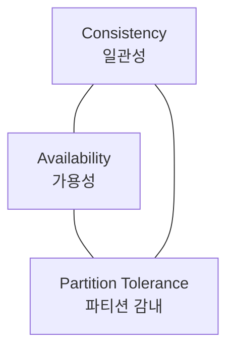
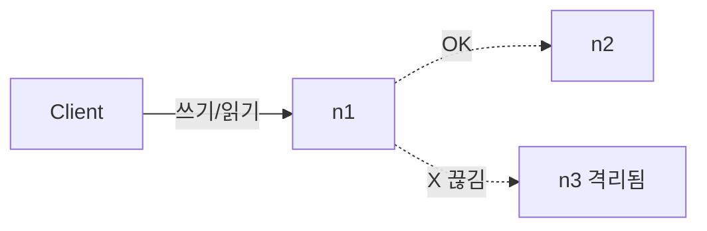

# STEP 1. 분산 기초 — 왜 분산이 어려운가 (CAP)

> 설계의 모든 트레이드오프가 여기서 출발한다. 먼저 입장(AP/CP)을 정해야 다음 결정이 흔들리지 않는다.

---

## 1. 출발점: 단일 서버 키-값 저장소

가장 단순한 구현 = **메모리 위 해시 테이블**.

```
put(key, value)  →  map[key] = value
get(key)         →  return map[key]
```

빠르고 간단하지만 한계가 명확하다.

| 한계      | 내용                                |
| ------- | --------------------------------- |
| **용량**  | 모든 데이터가 한 서버 메모리에 들어가야 함 → 대용량 불가 |
| **장애**  | 서버 한 대 죽으면 전부 사라짐 (단일 장애점, SPOF)  |
| **처리량** | 한 서버가 받는 트래픽에 한계                  |

개선책(데이터 압축 / 자주 쓰는 데이터만 메모리 + 나머지 디스크)으로 버텨도
**결국 한 대로는 부족** → **분산(여러 서버에 분산 저장)** 이 필요해진다.

> 그리고 분산을 하는 순간 **CAP 정리**라는 벽을 만난다.

---

## 2. CAP 정리

> 분산 시스템은 아래 세 가지를 **동시에 만족할 수 없다.** 셋 중 둘만 가능.



| 항목           | 의미                                     |
| ------------ | -------------------------------------- |
| **C** 일관성    | 모든 클라이언트가 **언제 접근하든 같은(최신) 데이터**를 본다   |
| **A** 가용성    | 일부 노드에 장애가 나도 **모든 요청이 응답**을 받는다       |
| **P** 파티션 감내 | 노드 간 **통신이 끊겨도(네트워크 분할)** 시스템이 계속 동작한다 |

### 핵심: 분산 시스템에서 P는 선택이 아니라 필수

네트워크 장애는 **반드시 일어난다.** 따라서 실제 선택은 **"P를 포기"가 아니라**
**네트워크 분할이 일어났을 때 C와 A 중 무엇을 포기하느냐** 이다.

---

## 3. CP vs AP — 분할 상황에서의 선택

서버 n1, n2, n3에 데이터를 복제했는데 **n3과의 통신이 끊긴 상황**을 가정.



| 선택              | 동작                                            | 포기하는 것   | 적합한 예               |
| --------------- | --------------------------------------------- | -------- | ------------------- |
| **CP** (일관성 우선) | n3에 쓸 수 없으니 **쓰기를 막음**(에러 반환) → 낡은 데이터 노출 방지  | 가용성      | 은행 잔고, 재고 차감        |
| **AP** (가용성 우선) | n3이 낡은 데이터를 줄 수 있어도 **계속 읽기/쓰기 허용**, 복구 후 동기화 | 일관성(일시적) | 장바구니, SNS 피드, 좋아요 수 |

### 이 설계의 입장: **AP 시스템 (Dynamo 스타일)**

quest06의 요구사항이 **"높은 가용성 + 낮은 지연 + 일관성 수준 조정 가능"** 이므로,
기본적으로 **AP**를 택하고, **정족수(STEP 4)로 일관성 강도를 조절**한다.

---

## 4. (보너스) PACELC — CAP의 확장

CAP은 "분할(P)이 일어났을 때"만 말한다. 현실에선 **평상시(분할 없을 때)도 트레이드오프**가 있다.

> **P**artition일 때 → **A** vs **C**
> **E**lse(평상시) → **L**atency(지연) vs **C**onsistency(일관성)

- 강한 일관성을 유지하려면 복제본 동기화에 시간이 걸려 **지연 증가**.
- 평상시에도 "빠른 응답 vs 항상 최신값"을 골라야 한다 → STEP 4의 정족수가 이 손잡이.

---

## ✅ STEP 1 체크리스트

- [ ] 단일 서버의 3가지 한계(용량·장애·처리량)를 설명할 수 있다
- [ ] CAP의 C/A/P를 각각 한 줄로 정의할 수 있다
- [ ] "분산에선 P가 필수, 실제론 C와 A 중 선택"임을 안다
- [ ] CP/AP 예시를 각각 들 수 있다
- [ ] 우리 저장소가 왜 **AP**인지 요구사항과 연결해 설명할 수 있다

---

## 💬 예상 면접 질문

**Q1. CAP 정리를 설명하고, "셋 중 둘만 고른다"는 말이 실제로 무슨 의미인지 말해보세요.**
> C·A·P를 정의한 뒤, 분산 시스템에서 **P(네트워크 분할)는 반드시 일어나므로 선택지가 아님**을 짚는다. 따라서 실제 선택은 "셋 중 둘"이 아니라 **분할이 일어났을 때 C와 A 중 무엇을 포기하느냐**다.

**Q2. CP 시스템과 AP 시스템의 차이를 예시와 함께 설명하세요.**
> CP: 분할 시 일관성을 위해 쓰기를 막음(에러) — 은행 잔고·재고. AP: 일관성을 잠시 희생하고 응답 유지 후 복구 — 장바구니·SNS 피드. 핵심은 **"낡은 데이터를 보여줄 바엔 거부 vs 일단 응답"** 의 트레이드오프.

**Q3. 이번에 설계할 키-값 저장소는 CP/AP 중 무엇이며, 왜인가요?**
> **AP(Dynamo 스타일).** quest06이 "높은 가용성·낮은 지연·일관성 수준 조정 가능"을 요구하므로 기본은 AP로 가고, **정족수(N·W·R)로 일관성 강도를 조절**한다고 연결한다.

**Q4. 단일 서버 캐시로 충분하지 않은 이유는?**
> 용량(한 서버 메모리 한계)·가용성(SPOF)·처리량(트래픽 상한). 압축/디스크 분리로 잠깐 버텨도 근본 한계는 분산으로만 해결된다.

**Q5. (심화) CAP의 한계와 PACELC는 무엇을 보완하나요?**
> CAP은 "분할 발생 시"만 다룬다. PACELC는 **평상시(Else)에도 Latency vs Consistency 트레이드오프가 있음**을 추가로 설명한다 — 강한 일관성을 위해 복제본을 동기화하면 평상시에도 지연이 늘어난다.

➡️ 다음: [STEP 2 — 데이터 분산(안정 해시)](02_STEP2_데이터분산_안정해시.md)
