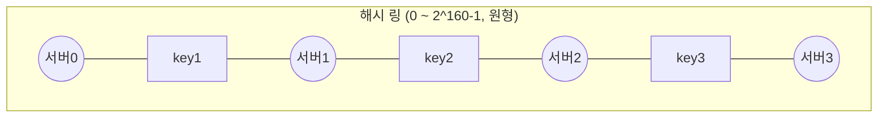
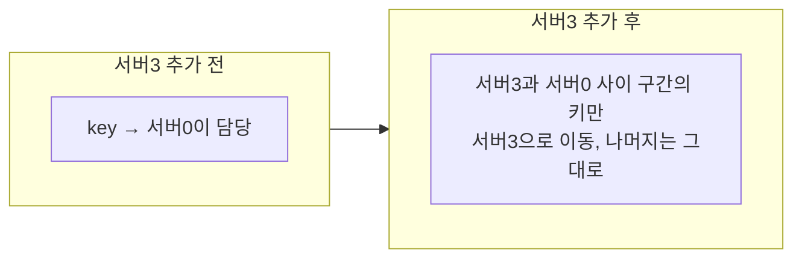
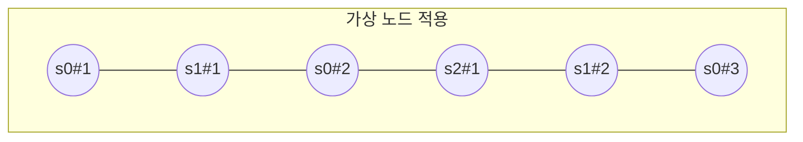

# STEP 2. 데이터 분산 — 어떻게 여러 서버에 나누나 (안정 해시)

> 이 장에서 **가장 중요한 개념.** 규모 확장성(자동 서버 증설/삭제) 요구사항을 직접 해결한다.

---

## 1. 문제: 키를 어느 서버에 둘 것인가

데이터가 한 서버에 안 들어가니 N개 서버에 나눠 담아야 한다(=**파티셔닝**). 두 가지를 동시에 만족해야 한다.

1. **고르게 분산** — 특정 서버에 쏠리지 않게
2. **노드 추가/삭제 시 이동 최소화** — 확장할 때 데이터가 통째로 재배치되면 안 됨

---

## 2. 단순 해시(modulo)의 문제

```
서버번호 = hash(key) % N      (N = 서버 수)
```

서버 4대일 때는 잘 동작한다. 하지만 **서버 한 대가 죽어 N이 4→3으로 바뀌면**,
나누는 수가 바뀌므로 **거의 모든 키의 위치가 재계산(리밸런싱)**된다.

```
key=key0, hash=1000 →  1000 % 4 = 0   (서버0)
                       1000 % 3 = 1   (서버1)  ← 이동!
```

> 결과: 대규모 캐시 미스 폭풍 → 시스템 마비. **확장이 불가능.**

---

## 3. 해결: 안정 해시 (Consistent Hashing)

* 의문점 : 특정 서버에 집중되는 핫스팟이 발생하지않을까?

### 아이디어: 서버와 키를 **같은 해시 링(원)** 위에 배치



- 서버도, 키도 같은 해시 함수로 링 위 한 점에 매핑.
- 키는 링을 따라 **시계 방향으로 가장 먼저 만나는 서버**에 저장된다.

### 노드 추가/삭제 시 — k/n 개 키만 이동



> 서버 추가/삭제 시 **영향받는 키 = 평균 k/n개** (k=키 수, n=서버 수)
> 나머지 키는 위치 그대로 → **무중단 확장 가능.** ★


의문점 : 안정해시라해도 핫스팟의 문제를 해결할수있나?
안정해시만으로는 핫스팟을 완전히 해결 불가능하다

---

## 4. 문제점과 해결: 가상 노드 (Virtual Node)

### 기본 안정 해시의 두 가지 문제

1. **불균등한 파티션 크기** — 서버들이 링에 고르게 안 놓여 담당 구간이 들쭉날쭉
2. **불균등한 키 분포** — 특정 서버에 데이터 쏠림(hotspot)

### 해결: 서버 하나를 링 위 **여러 지점(가상 노드)** 으로 배치



- 서버0 → s0#1, s0#2, s0#3 ... 처럼 링 위 **여러 점**에 매핑.
- 가상 노드가 많을수록 데이터 분포가 **고르게** 된다(표준편차 감소).
- 실무에선 서버당 100~수백 개의 가상 노드 사용.

---

## 5. 안정 해시의 이점 정리

| 이점        | 설명                       |
| --------- | ------------------------ |
| 무중단 확장    | 서버 추가/삭제 시 **k/n 키만 이동** |
| 핫스팟 완화    | 가상 노드로 부하 고르게 분산         |
| 이기종 서버 지원 | 성능 좋은 서버에 가상 노드를 더 많이 할당 |

> 실제 사용처: **아마존 Dynamo, Cassandra, 디스코드, Akamai CDN** 등.

---

## ✅ STEP 2 체크리스트

- [ ] 단순 `hash % N`의 문제(서버 변동 시 대량 재배치)를 설명할 수 있다
- [ ] 안정 해시에서 키가 저장될 서버를 찾는 규칙(시계방향 최초 서버)을 안다
- [ ] 서버 추가/삭제 시 이동량이 **k/n** 임을 안다
- [ ] 가상 노드가 푸는 두 문제(파티션·키 불균등)를 설명할 수 있다

---

## 💬 예상 면접 질문

**Q1. `hash(key) % N` 방식의 문제는 무엇인가요?**
> 서버 수 N이 바뀌면(추가/장애) 나누는 수가 달라져 **거의 모든 키의 위치가 재계산**된다. 대규모 캐시 미스·데이터 재배치가 발생해 사실상 확장이 불가능하다.

**Q2. 안정 해시는 이 문제를 어떻게 해결하나요?**
> 서버와 키를 **같은 해시 링** 위에 올리고, 키는 **시계 방향 첫 서버**에 저장한다. 서버를 추가/삭제해도 **인접 구간의 키(평균 k/n개)만 이동**하고 나머지는 그대로라 무중단 확장이 가능하다.

**Q3. 서버를 추가할 때 데이터가 얼마나 이동하나요?**
> 평균 **k/n개** (k=전체 키 수, n=서버 수). 새 서버와 그 앞 서버 사이 구간의 키만 새 서버로 옮겨간다.

**Q4. 가상 노드(virtual node)는 왜 필요한가요?**
> 기본 안정 해시는 서버가 링에 고르게 안 놓여 **파티션 크기가 불균등**하고 **특정 서버에 키가 쏠린다(핫스팟)**. 서버 하나를 링 위 여러 지점에 매핑하면 분포가 고르게 되고, 가상 노드 수가 많을수록 표준편차가 줄어든다.

**Q5. 성능이 다른 이기종 서버는 어떻게 다루나요?**
> 성능 좋은 서버에 **가상 노드를 더 많이 할당**해 담당 키 비중을 늘린다. 안정 해시 + 가상 노드 구조의 부수적 이점.

**Q6. (심화) 가상 노드를 쓸 때 복제본 배치에서 주의할 점은?**
> 시계 방향 N개의 가상 노드가 **같은 물리 서버**일 수 있다. 복제본은 물리적으로 서로 다른 노드에 둬야 하므로, 이미 만난 물리 노드는 건너뛰고 골라야 한다. (→ STEP 3)

➡️ 이전: [STEP 1 — CAP](01_STEP1_CAP_분산기초.md) | 다음: [STEP 3 — 데이터 복제](03_STEP3_데이터복제.md)
