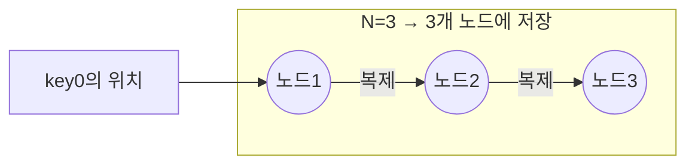
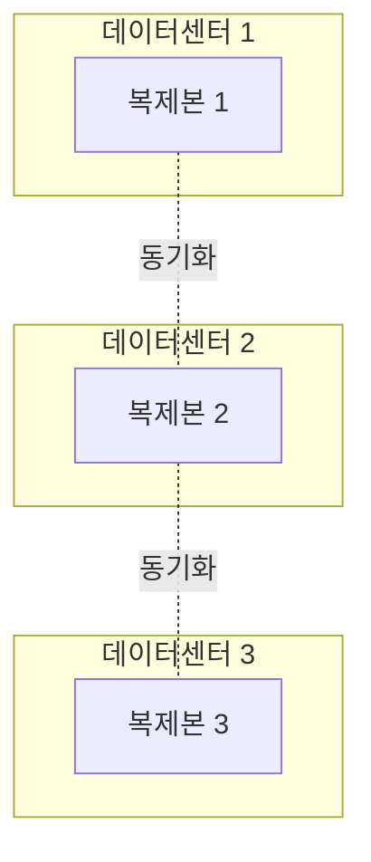

# STEP 3. 데이터 복제 — 어떻게 가용성을 확보하나

> 앞 단계가 만든 문제: **안정 해시로 키를 한 노드에 두면, 그 노드가 죽을 때 해당 데이터 조각이 통째로 사라진다.**
> 해결: 같은 데이터를 **여러 노드에 복제(replication)** 한다.

---

## 1. 복제 규칙: 시계 방향 N개 노드

키를 담당 노드 1곳에만 두지 않고, **안정 해시 링에서 시계 방향으로 만나는 N개 노드**에 복제한다.
(N = **복제 계수**, replication factor)

> 예) N=3 이면 key0은 링에서 처음 만나는 노드1, 그리고 이어지는 노드2·노드3에 함께 저장.

---

## 2. 주의: 가상 노드 때문에 물리 노드가 겹칠 수 있다

가상 노드를 쓰면, 시계 방향 N개의 **가상 노드**가 알고 보면 **같은 물리 서버**일 수 있다.

> 그래서 "시계 방향 N개"를 고를 때 **물리적으로 서로 다른 노드 N개**가 되도록 골라야 한다.
> (이미 만난 물리 노드는 건너뛴다.)

---

## 3. 데이터 센터 단위 장애 대비

복제본을 같은 데이터 센터(DC)에만 두면, **정전·네트워크 단절·자연재해**로 DC 전체가 죽을 때 다 잃는다.

➡️ 복제본을 **서로 다른 데이터 센터**에 분산 배치한다.

| 트레이드오프 | 내용                                               |
| ------ | ------------------------------------------------ |
| 장점     | DC 하나가 통째로 죽어도 데이터 보존 (높은 가용성)                   |
| 단점     | DC 간 네트워크 지연 → 복제 동기화 비용↑ (그래서 STEP 4에서 W/R로 조절) |

---

## 4. 복제가 낳은 새 문제 → STEP 4로 연결

복제본이 N개가 되는 순간 **"어느 복제본이 최신인가?"** 라는 문제가 생긴다.

- 쓰기를 모든 복제본에 동시에 반영하면 느리고(지연↑), 일부만 반영하면 복제본 간 값이 달라진다.
- **몇 개에 써야 '썼다'고 하고, 몇 개를 읽어야 '최신'이라 믿을지** 정해야 한다.

> 이 손잡이가 **정족수(Quorum) N·W·R** → STEP 4.

---

## ✅ STEP 3 체크리스트

- [ ] 복제 계수 N의 의미를 안다
- [ ] 안정 해시 링에서 복제본 N개를 고르는 규칙(시계방향, 물리 노드 중복 제외)을 안다
- [ ] 복제본을 여러 데이터 센터에 분산하는 이유를 안다
- [ ] 복제가 "어느 게 최신?" 문제를 낳고, 그게 정족수로 이어짐을 안다

---

## 💬 예상 면접 질문

**Q1. 데이터를 왜 복제하나요? 복제 계수 N은 무엇인가요?**
> 노드 하나가 죽으면 그 노드가 담당하던 데이터 조각이 통째로 사라지므로, **같은 데이터를 N개 노드에 복제**해 가용성·내구성을 확보한다. N은 복제본 개수(보통 3).

**Q2. 안정 해시 링에서 복제본 N개를 어떻게 고르나요?**
> 키가 저장될 첫 노드에서 **링을 따라 시계 방향으로 만나는 노드 N개**에 복제한다. 단, 가상 노드 때문에 **같은 물리 노드가 중복**될 수 있으므로, 이미 만난 물리 노드는 건너뛰고 **서로 다른 물리 노드 N개**를 고른다.

**Q3. 복제본을 같은 데이터 센터에 두면 안 되는 이유는?**
> 정전·네트워크 단절·자연재해로 **DC 전체가 죽으면 모든 복제본을 동시에 잃는다.** 그래서 복제본을 **서로 다른 데이터 센터**에 분산 배치한다.

**Q4. 복제본을 여러 DC에 두면 어떤 비용이 생기나요?**
> DC 간 네트워크 지연으로 **복제 동기화 비용·쓰기 지연이 증가**한다. 이 트레이드오프는 STEP 4의 W/R 정족수로 조절한다.

**Q5. 복제는 어떤 새로운 문제를 만드나요?**
> 복제본이 N개가 되면 **"어느 복제본이 최신인가"** 가 모호해진다. 모두에 동시에 쓰면 느리고, 일부만 쓰면 값이 갈린다. → 정족수(N·W·R)와 충돌 해소(벡터 시계)로 이어진다.

➡️ 이전: [STEP 2 — 안정 해시](02_STEP2_데이터분산_안정해시.md) | 다음: [STEP 4 — 일관성(정족수)](04_STEP4_일관성_정족수.md)
