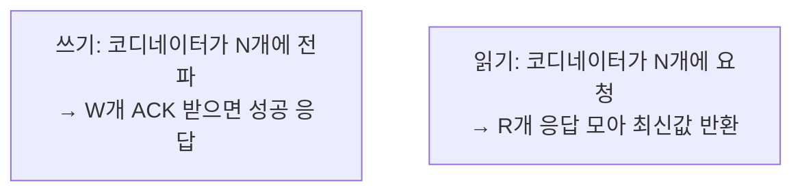

# STEP 4. 일관성 — 복제본을 어떻게 맞추나 (정족수)

> 앞 단계가 만든 문제: 복제본이 N개일 때 "어느 게 최신?". STEP 2와 함께 **설계의 핵심.**
> quest06의 **"일관성 수준 조정 가능"** 요구사항을 직접 해결한다.

---

## 1. 정족수 합의 (Quorum Consensus)

세 개의 숫자로 일관성과 지연을 조절한다.

|  기호   | 의미                                                |
| :---: | ------------------------------------------------- |
| **N** | 복제본 개수 (replication factor)                       |
| **W** | **쓰기 정족수** — 쓰기 작업이 **W개 노드의 확인(ACK)** 을 받아야 "성공" |
| **R** | **읽기 정족수** — 읽기 작업이 **R개 노드에서 응답**을 받아야 "성공"      |



> **코디네이터(coordinator)**: 클라이언트와 노드 사이의 프록시 역할. 쓰기/읽기를 복제본들에 전파하고 결과를 모은다.

---

## 2. 핵심 공식: W + R > N → 강한 일관성

쓴 노드 집합(W개)과 읽은 노드 집합(R개)이 **반드시 겹치면**, 읽기는 항상 최신 쓰기를 포함한 노드를 만난다.

```
W + R > N  ⟹  쓰기 집합 ∩ 읽기 집합 ≠ ∅  ⟹  최신값 보장
```

### 예시 (N = 3)

| 설정           | 성격            | 특징                                      |
| ------------ | ------------- | --------------------------------------- |
| **W=3, R=1** | 쓰기 느림 / 읽기 빠름 | 모든 복제본에 써야 성공. 읽기 최적화.                  |
| **W=1, R=3** | 쓰기 빠름 / 읽기 느림 | 빠른 쓰기. 읽기 최적화 필요한 경우엔 부적합.              |
| **W=2, R=2** | 균형            | W+R=4 > 3 → **강한 일관성 + 적당한 지연** (흔한 선택) |
| **W=1, R=1** | 둘 다 빠름        | W+R=2 ≤ 3 → 강한 일관성 **보장 안 됨**(최종 일관성)   |
|              |               |                                         |

> **운영자가 W, R 값을 바꿔 일관성↔지연 트레이드오프를 조절** = "일관성 수준 조정 가능".

---

## 3. 일관성 모델

| 모델 | 의미 | 예 |
|------|------|-----|
| **강한 일관성** (strong) | 항상 최신값. 옛 데이터를 절대 안 봄 | W+R>N |
| **약한 일관성** (weak) | 최신값 보장 안 함 | — |
| **최종 일관성** (eventual) | 일시적으로 값이 달라도 **시간이 지나면 모든 복제본이 수렴** | Dynamo, Cassandra 기본 |

### 이 설계의 선택: 최종 일관성 (AP 시스템)

- STEP 1에서 AP를 택했으므로 기본은 **최종 일관성**.
- 단, W/R을 키워 **강한 일관성에 가깝게 튜닝 가능**.
- 단점: 동시 쓰기로 복제본 값이 갈라질 수 있음 → **충돌 해소 필요** (STEP 5).

---

## 4. 정족수가 낳은 새 문제 → STEP 5로 연결

W=1처럼 느슨하게 두거나 네트워크 분할이 있으면,
**서로 다른 클라이언트가 같은 키에 동시에 다른 값을 쓰는 충돌**이 발생할 수 있다.

> "최종에 수렴한다"고 했는데, **어느 값으로 수렴할지** 어떻게 정하나?
> → **벡터 시계(Vector Clock)** 로 버전을 추적 → STEP 5.

---

## ✅ STEP 4 체크리스트

- [ ] N, W, R 각각의 의미를 말할 수 있다
- [ ] `W + R > N` 이 왜 강한 일관성을 보장하는지(집합 교집합) 설명할 수 있다
- [ ] W=3/R=1, W=1/R=3, W=2/R=2 각 설정의 성격을 안다
- [ ] 강한/약한/최종 일관성을 구분할 수 있다
- [ ] 코디네이터의 역할을 설명할 수 있다

---

## 💬 예상 면접 질문

**Q1. 정족수(Quorum)에서 N, W, R은 각각 무엇인가요?**
> N=복제본 수, W=쓰기 정족수(쓰기가 성공으로 인정받는 데 필요한 ACK 노드 수), R=읽기 정족수(읽기에 응답해야 하는 노드 수).

**Q2. `W + R > N` 이면 왜 강한 일관성이 보장되나요?**
> 쓴 노드 집합(W개)과 읽은 노드 집합(R개)이 **반드시 한 노드 이상에서 겹치기** 때문이다. 읽기는 항상 최신 쓰기를 가진 노드를 최소 하나 포함하므로 최신값을 볼 수 있다.

**Q3. N=3일 때 W=1, R=1로 두면 어떻게 되나요?**
> W+R=2 ≤ 3 이라 쓰기/읽기 집합이 안 겹칠 수 있어 **강한 일관성이 보장되지 않는다(최종 일관성).** 대신 쓰기·읽기 모두 빠르다.

**Q4. 읽기는 많고 쓰기는 적은 시스템이면 W·R을 어떻게 잡겠어요?**
> 읽기 지연을 줄이려면 **R을 작게(예: R=1), W를 크게(W=N)** 잡는다. 쓰기는 느려지지만 읽기가 빨라지고 `W+R>N`도 만족한다. 반대로 쓰기 중심이면 W를 작게 잡는다.

**Q5. "일관성 수준 조정 가능"이라는 요구사항을 어떻게 만족시키나요?**
> 운영자가 **W·R 값을 바꿔** 강한 일관성(W+R>N, 지연↑)과 빠른 응답(W+R≤N, 최종 일관성) 사이를 자유롭게 고를 수 있게 한다.

**Q6. 강한 일관성 / 최종 일관성의 차이는?**
> 강한 일관성은 항상 최신값을 보장(옛 데이터 안 봄). 최종 일관성은 일시적으로 값이 갈릴 수 있지만 **시간이 지나면 모든 복제본이 수렴**한다 — Dynamo·Cassandra의 기본 모델.

**Q7. 코디네이터(coordinator)는 무슨 역할인가요?**
> 클라이언트와 복제 노드 사이의 프록시. 쓰기/읽기를 N개 복제본에 전파하고, W/R개의 응답을 모아 성공 여부·최신값을 클라이언트에 돌려준다.

➡️ 이전: [STEP 3 — 복제](03_STEP3_데이터복제.md) | 다음: [STEP 5 — 충돌 해소(벡터 시계)](05_STEP5_충돌해소_벡터시계.md)
