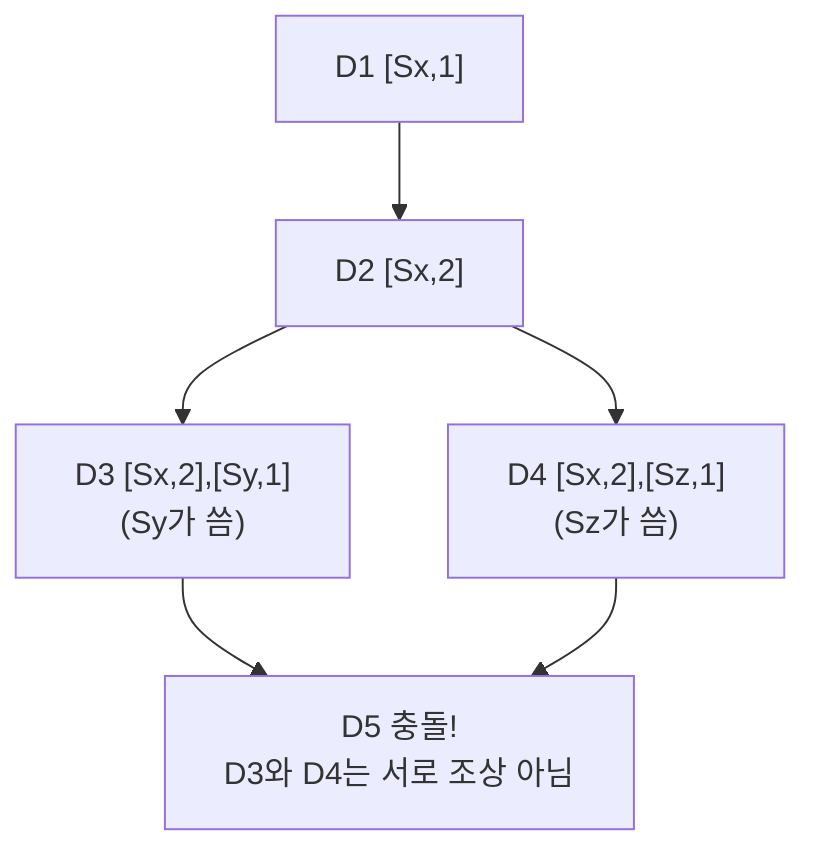

# STEP 5. 비일관성 해소 — 충돌을 어떻게 처리하나 (벡터 시계)

> 앞 단계가 만든 문제: 최종 일관성 + 동시 쓰기 → 같은 키에 **서로 다른 버전**이 생긴다.
> 어느 게 최신인지, 아니면 진짜 충돌인지 **판별**해야 한다.

---

## 1. 왜 "최신 타임스탬프"로는 부족한가

가장 단순한 방법은 "마지막에 쓴 게 이김"(**LWW**, Last-Write-Wins, 타임스탬프 비교).
하지만 분산 환경에서는 **서버 간 시계가 정확히 일치하지 않는다**(시계 어긋남, clock skew).

> 타임스탬프만 믿으면 **실제로는 나중에 쓴 값이 버려질 수 있다.** → 인과관계를 추적할 도구 필요.

---

## 2. 벡터 시계 (Vector Clock)

각 데이터 버전에 **`[서버: 카운터]` 쌍의 목록**을 붙여, "어떤 서버가 몇 번 갱신했는지" 기록한다.

```
D([Sx, 1])        Sx가 1번 갱신
D([Sx, 2])        Sx가 또 갱신 → Sx의 카운터 증가
D([Sx, 2], [Sy, 1])   Sy도 갱신에 참여
```

### 규칙

- 서버 Si가 데이터를 쓸 때:
  - `[Si, c]`가 이미 있으면 **카운터 c를 +1**
  - 없으면 `[Si, 1]` **새로 추가**



---

## 3. 충돌 판정

두 버전 X, Y를 비교:

| 관계 | 판정 | 처리 |
|------|------|------|
| X의 모든 카운터 ≤ Y의 카운터 | **X는 Y의 조상** (Y가 최신) | Y로 덮어씀 |
| 서로 ≤ 가 성립 안 함 | **충돌** (형제 버전) | **클라이언트가 해소** |

> **충돌 예시(D3 vs D4):** Sy와 Sz가 D2를 동시에 갱신 → 둘 다 D2의 자식이지만 서로의 조상은 아님 → 충돌.

---

## 4. 충돌은 누가 해소하나 → 클라이언트

저장소는 충돌을 **감지·보존**할 뿐, **합치는 책임은 클라이언트(애플리케이션)** 에 있다.

> 대표 사례 — **아마존 장바구니**: 두 기기에서 동시에 담은 상품이 충돌하면,
> 두 버전을 **합집합(merge)** 해서 둘 다 살린다. ("담은 상품이 사라지는 것보다 낫다")

---

## 5. 벡터 시계의 단점

| 단점 | 내용 |
|------|------|
| 클라이언트 복잡도↑ | 충돌 해소 로직을 클라이언트가 구현해야 함 |
| `[서버:카운터]` 목록이 길어짐 | 갱신 서버가 많아질수록 길이 증가 → **길이 제한(임계치 초과 시 오래된 쌍 제거)** 으로 완화 |

---

## ✅ STEP 5 체크리스트

- [ ] 타임스탬프(LWW)만으로 부족한 이유(시계 어긋남)를 안다
- [ ] 벡터 시계의 `[서버, 카운터]` 갱신 규칙을 안다
- [ ] 두 버전이 "조상 관계 vs 충돌"인지 판정할 수 있다
- [ ] 충돌 해소 책임이 클라이언트에 있음을 안다 (장바구니 예시)
- [ ] 벡터 시계의 단점 2가지를 안다

---

## 💬 예상 면접 질문

**Q1. 충돌 해소에 타임스탬프(Last-Write-Wins)를 쓰면 안 되는 이유는?**
> 분산 환경에서는 **서버 간 시계가 정확히 일치하지 않는다(clock skew).** 타임스탬프만 믿으면 실제로 나중에 쓴 값이 버려질 수 있다. 인과관계를 추적할 도구가 필요하다.

**Q2. 벡터 시계는 어떻게 동작하나요?**
> 각 버전에 `[서버, 카운터]` 쌍 목록을 붙인다. 서버 Si가 쓸 때 `[Si, c]`가 있으면 카운터를 +1, 없으면 `[Si, 1]`을 추가한다. 이 목록으로 버전 간 **조상 관계 또는 충돌**을 판별한다.

**Q3. 두 버전이 충돌인지 아닌지 어떻게 판정하나요?**
> X의 모든 카운터가 Y의 카운터보다 작거나 같으면 **X는 Y의 조상**(Y가 최신)이라 덮어쓴다. 어느 쪽도 다른 쪽의 조상이 아니면(서로 ≤ 불성립) **충돌(형제 버전)** 이다.

**Q4. 충돌은 누가 해소하나요?**
> 저장소는 충돌을 **감지·보존**만 하고, 합치는 책임은 **클라이언트(애플리케이션)** 에 있다. 예: 아마존 장바구니는 두 충돌 버전을 **합집합으로 머지**해 담은 상품이 사라지지 않게 한다.

**Q5. 벡터 시계의 단점과 완화책은?**
> ① 클라이언트가 충돌 해소 로직을 구현해야 해 복잡도가 올라간다. ② 갱신에 참여한 서버가 많아질수록 `[서버:카운터]` 목록이 길어진다 → **길이 임계치를 두고 오래된 쌍을 제거**해 완화한다.

➡️ 이전: [STEP 4 — 정족수](04_STEP4_일관성_정족수.md) | 다음: [STEP 6 — 장애 처리](06_STEP6_장애처리.md)
