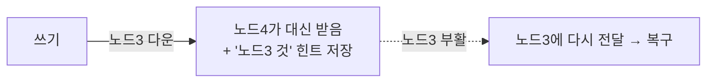
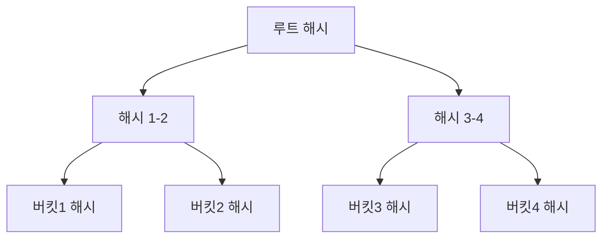

# STEP 6. 장애 처리 — 장애를 어떻게 감지·복구하나

> 앞 단계가 만든 문제: 노드는 반드시 죽는다. **죽은 걸 어떻게 알고(감지), 어떻게 복구하나.**
> 세 가지 도구: **가십 프로토콜 / 임시 위탁 / 머클 트리.**

---

## 1. 장애 감지 — 가십 프로토콜 (Gossip Protocol)

### 왜 단순 방법이 안 되나

- 한 서버가 "쟤 죽었다"고 단독 판단하면 **오판** 위험.
- 모든 서버가 모든 서버를 직접 핑(ping)하면 **트래픽 폭발(O(N²))**.

### 가십 방식: 소문 퍼뜨리듯 상태 전파

- 각 노드는 **멤버십 목록**(노드ID, heartbeat 카운터, 마지막 갱신 시각)을 가진다.
- 주기적으로 **무작위 노드**에게 자기 목록을 전달 → 받은 노드는 자기 것과 병합.
- 어떤 노드의 heartbeat가 **정해진 시간 동안 안 늘면** → 그 노드를 **장애로 표시**.
- 여러 노드가 "쟤 안 늘어"라고 합의하면 다운 확정 → **분산 합의로 오판 방지.**

---

## 2. 일시적 장애 — 느슨한 정족수 + 임시 위탁 (Hinted Handoff)

노드가 잠깐 죽거나 네트워크가 일시적으로 끊긴 경우.

| 방식 | 내용 |
|------|------|
| **엄격한 정족수** | 죽은 노드 때문에 W/R을 못 채우면 그냥 실패 |
| **느슨한 정족수(Sloppy Quorum)** | 죽은 노드 대신 **건강한 노드 중 W/R개**를 골라 처리 → 가용성 유지 |
| **임시 위탁(Hinted Handoff)** | 죽은 노드가 받았어야 할 쓰기를 **다른 노드가 임시 보관**하다가, 그 노드가 살아나면 **넘겨줘서 복구** |

> 데이터 일관성을 **희생하지 않으면서 가용성을 높이는** 핵심 기법.

---

## 3. 영구적 장애 — 머클 트리 (Merkle Tree, anti-entropy)

노드가 완전히 죽어 디스크 손실 등으로 **복제본 간 데이터가 영구적으로 어긋난** 경우, 동기화가 필요하다.
하지만 **전체 데이터를 다 비교하면 비효율적.** → 머클 트리로 **다른 부분만** 찾는다.

### 구조: 해시의 트리

- 잎(leaf) = 키 공간을 쪼갠 **버킷의 해시**, 상위 노드 = 자식 해시들의 해시.
- 두 복제본의 머클 트리를 **루트부터 비교**:
  - 루트 해시 같음 → **전체 동일**, 동기화 불필요.
  - 다르면 → **해시가 다른 자식 가지만 따라 내려가** 차이 나는 버킷만 찾음.
- 결과: **차이 나는 데이터만 골라 동기화** → 전송량·비교량 대폭 절감(O(log N) 수준 탐색).

---

## 4. 데이터 센터 장애 대비

정전·재해로 DC 전체가 죽을 수 있으므로, **여러 데이터 센터에 복제**(STEP 3)해 두면 한 DC가 죽어도 다른 DC에서 서비스 지속.

---

## ✅ STEP 6 체크리스트

- [ ] 가십 프로토콜이 장애 감지에서 푸는 문제(오판·트래픽)를 안다
- [ ] heartbeat 기반 장애 표시 흐름을 설명할 수 있다
- [ ] 느슨한 정족수 + 임시 위탁(Hinted Handoff)이 일시 장애를 어떻게 다루는지 안다
- [ ] 머클 트리로 복제본 차이를 효율적으로 찾는 원리를 설명할 수 있다

---

## 💬 예상 면접 질문

**Q1. 분산 환경에서 노드 장애를 어떻게 감지하나요?**
> **가십 프로토콜.** 각 노드가 멤버십 목록(노드ID·heartbeat·갱신시각)을 주기적으로 무작위 노드와 교환·병합한다. 어떤 노드의 heartbeat가 일정 시간 안 늘면 장애로 표시하고, 여러 노드가 합의하면 다운으로 확정한다.

**Q2. 모든 노드가 서로 직접 핑하면 안 되나요?**
> 그러면 트래픽이 **O(N²)** 로 폭발한다. 또 한 노드의 단독 판단은 오판 위험이 크다. 가십은 무작위 전파로 트래픽을 줄이고 분산 합의로 오판을 방지한다.

**Q3. 노드가 일시적으로 죽었을 때 쓰기를 어떻게 처리하나요?**
> **느슨한 정족수(Sloppy Quorum) + 임시 위탁(Hinted Handoff).** 죽은 노드 대신 건강한 노드가 쓰기를 받아 "원래 누구 것"이라는 힌트와 함께 임시 보관하다가, 그 노드가 살아나면 넘겨줘 복구한다. 가용성을 희생하지 않는다.

**Q4. 영구 장애로 복제본 간 데이터가 어긋났을 때 효율적으로 동기화하려면?**
> **머클 트리.** 키 공간을 버킷으로 나눠 해시 트리를 만들고, 두 복제본의 트리를 **루트부터 비교**한다. 루트가 같으면 전체 동일, 다르면 해시가 다른 가지만 따라 내려가 **차이 나는 버킷만** 찾아 동기화한다. 전체 비교 대신 O(log N) 수준 탐색.

**Q5. 머클 트리에서 루트 해시만 비교하면 무엇을 알 수 있나요?**
> 루트 해시가 같으면 두 복제본의 **전체 데이터가 동일**하다는 뜻이라 동기화가 불필요하다. 다를 때만 하위로 내려가며 차이를 좁힌다.

**Q6. 데이터 센터 전체가 죽는 상황은 어떻게 대비하나요?**
> 복제본을 **여러 데이터 센터에 분산**(STEP 3)해 한 DC가 죽어도 다른 DC에서 서비스를 지속한다.

➡️ 이전: [STEP 5 — 벡터 시계](05_STEP5_충돌해소_벡터시계.md) | 다음: [STEP 7 — 저장 엔진](07_STEP7_저장엔진.md)
