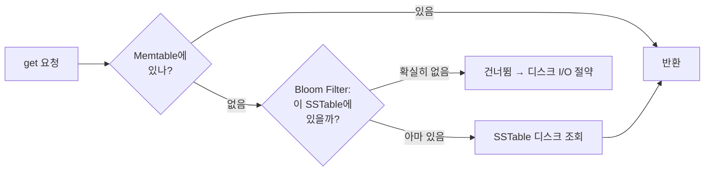
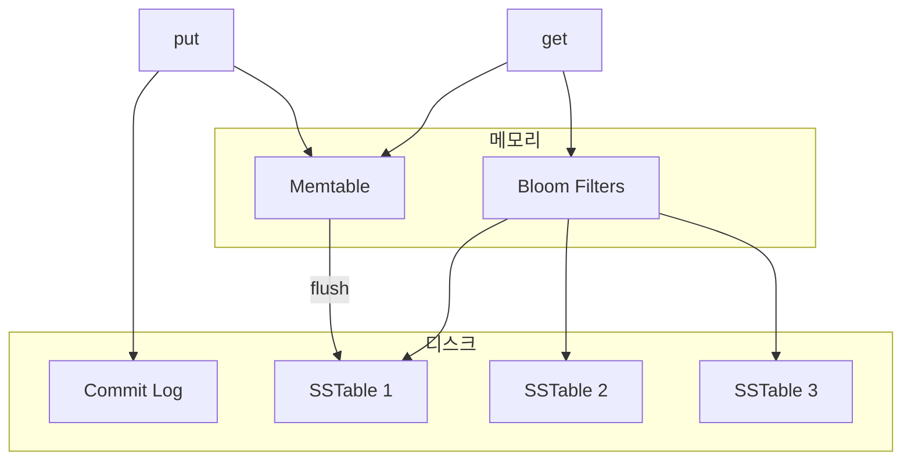

# STEP 7. 저장 엔진 — 디스크에 어떻게 빠르게 저장하나

> 지금까지는 "분산"을 다뤘다. 마지막으로 **노드 한 대 안에서** 쓰기/읽기를 빠르게 만드는 구조.
> quest06의 **"낮은 지연시간"** 을 단일 노드 레벨에서 해결한다. (LSM Tree 계열)

---

## 1. 쓰기 경로 (Write Path)

쓰기는 **순차 디스크 쓰기 + 메모리 버퍼**로 빠르게 처리한다.

| 단계 | 역할 |
|------|------|
| **1. Commit Log** | 쓰기를 **디스크 로그에 append**. 노드가 죽어도 Memtable 내용 복구 가능(내구성). |
| **2. Memtable** | **메모리 안의 정렬된 버퍼**. 실제 쓰기는 여기에 빠르게 들어감. |
| **3. SSTable** | Memtable이 **임계치만큼 차면** 디스크에 **정렬된 파일(Sorted String Table)** 로 flush. |

> 모든 쓰기가 **순차 I/O**(append, flush)라서 랜덤 쓰기보다 훨씬 빠르다. = **LSM Tree** 의 핵심 아이디어.

---

## 2. 읽기 경로 (Read Path)

데이터는 Memtable(메모리) 또는 여러 SSTable(디스크)에 흩어져 있다. 어디에 있는지 찾는 게 관건.

### Bloom Filter — "이 SSTable에 키가 있을까?"

- **확률적 자료구조.** "**확실히 없음**" 또는 "**아마 있음**"만 답한다.
- "없음"이면 그 SSTable은 **디스크를 안 읽고 건너뛴다** → 불필요한 디스크 I/O 제거.
- 거짓 양성(있다고 했는데 실제로 없음)은 가능, **거짓 음성은 없음** → 데이터를 놓치지 않는다.

> 효과: 키가 어느 SSTable에 있는지 메모리에서 빠르게 걸러내 **읽기 지연 대폭 감소.**

---

## 3. 전체 그림 — 한 노드의 저장 엔진

> 참고: SSTable이 쌓이면 주기적으로 **컴팩션(compaction)** 으로 병합·정리(삭제된 키 제거 등)한다.
> 이 구조를 쓰는 실제 엔진: **Cassandra, RocksDB, LevelDB, HBase.**

---

## 4. 마무리 — 전체 설계 한 장 요약

| 요구사항 | 해결 (STEP) |
|------|------|
| 대용량 저장 | 안정 해시 파티셔닝 (STEP 2) |
| 높은 가용성 | 복제 N + 다중 DC (STEP 3) |
| 일관성 조정 | 정족수 N·W·R (STEP 4) |
| 충돌 처리 | 벡터 시계 (STEP 5) |
| 장애 감지·복구 | 가십 · 임시위탁 · 머클트리 (STEP 6) |
| 낮은 지연(단일 노드) | LSM: Commit Log → Memtable → SSTable + Bloom Filter (STEP 7) |

---

## ✅ STEP 7 체크리스트

- [ ] 쓰기 경로 3단계(Commit Log → Memtable → SSTable)를 순서대로 말할 수 있다
- [ ] Commit Log가 왜 필요한지(내구성/복구) 안다
- [ ] 읽기 경로에서 Bloom Filter의 역할("확실히 없음"으로 디스크 I/O 절약)을 안다
- [ ] Bloom Filter에 거짓 양성은 있어도 거짓 음성은 없음을 안다
- [ ] 전체 설계를 요구사항-해결 매핑으로 설명할 수 있다

---

## 💬 예상 면접 질문

**Q1. 쓰기 경로(write path)를 설명하세요.**
> ① **Commit Log**에 append(내구성) → ② **Memtable**(메모리 정렬 버퍼)에 저장 → ③ Memtable이 임계치만큼 차면 **SSTable**(정렬된 디스크 파일)로 flush. 모든 쓰기가 순차 I/O라 빠르다(LSM Tree).

**Q2. Commit Log는 왜 필요한가요?**
> Memtable은 메모리에 있어 노드가 죽으면 사라진다. Commit Log에 먼저 append해 두면 **장애 후 Memtable을 재생(복구)** 할 수 있어 내구성을 보장한다.

**Q3. 읽기 경로(read path)에서 데이터를 어떻게 찾나요?**
> 먼저 Memtable을 확인하고, 없으면 여러 SSTable을 뒤진다. 이때 각 SSTable의 **Bloom Filter**로 "이 파일에 키가 있을 가능성"을 먼저 걸러 불필요한 디스크 조회를 건너뛴다.

**Q4. Bloom Filter는 무엇이고 왜 쓰나요?**
> 확률적 자료구조로 **"확실히 없음" 또는 "아마 있음"** 만 답한다. "없음"이면 그 SSTable을 디스크 읽지 않고 건너뛰어 **읽기 지연을 크게 줄인다.** 거짓 양성은 있어도 **거짓 음성은 없어** 데이터를 놓치지 않는다.

**Q5. SSTable이 계속 쌓이면 어떻게 관리하나요?**
> 주기적으로 **컴팩션(compaction)** 으로 여러 SSTable을 병합·정리한다. 중복·삭제된 키를 제거해 파일 수와 읽기 비용을 줄인다.

**Q6. 이 구조(LSM)가 쓰기에 빠른 이유는?**
> 디스크에 랜덤 쓰기 대신 **순차 append(Commit Log) + 순차 flush(SSTable)** 만 하기 때문이다. 랜덤 I/O를 피해 처리량이 높다. Cassandra·RocksDB·LevelDB·HBase가 이 구조를 쓴다.

**Q7. (종합) 전체 설계를 요구사항 기준으로 1분 안에 요약해보세요.**
> 대용량→안정 해시 파티셔닝, 가용성→복제 N + 다중 DC, 일관성 조정→정족수 N·W·R, 충돌→벡터 시계, 장애→가십·임시위탁·머클트리, 단일 노드 저지연→LSM(Commit Log→Memtable→SSTable + Bloom Filter).

➡️ 이전: [STEP 6 — 장애 처리](06_STEP6_장애처리.md) | 처음: [인덱스](00_인덱스.md)
