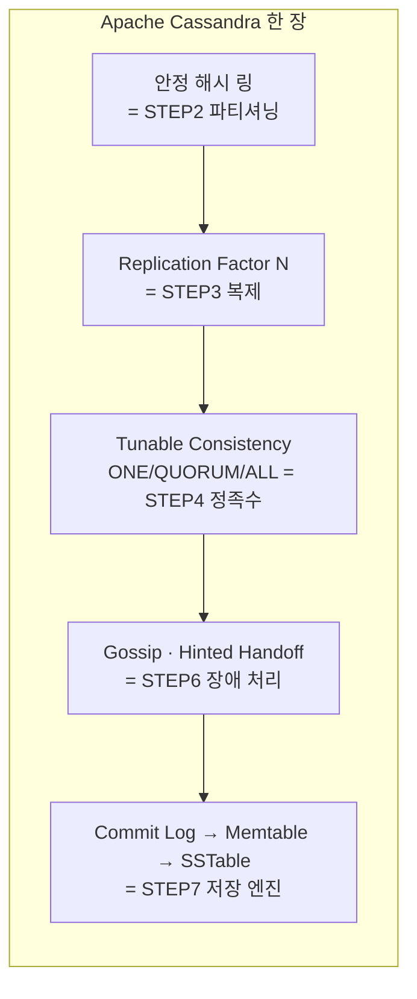
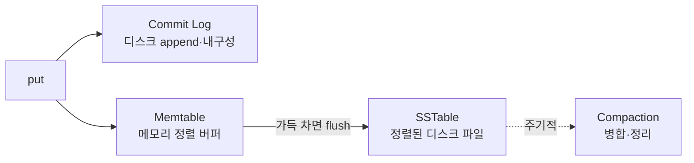
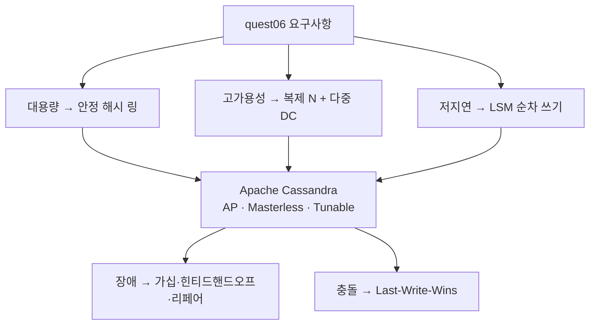

# 사례 연구. Apache Cassandra — 우리가 설계한 저장소의 실물

> STEP 1~7에서 *개념으로* 쌓은 키-값 저장소를 **실제 제품 한 개**로 묶어 본다.
> Cassandra는 quest06의 요구사항(대용량·고가용성·고확장성·저지연)을 거의 그대로 구현한 **AP 스타일 분산 저장소**다.
> 즉, 우리가 STEP별로 푼 문제들의 **정답지**에 가깝다.

---

## 1. 카산드라란 — 두 논문의 결합

페이스북이 메시징 저장을 위해 만들었고, 이후 아파치 오픈소스가 된 **분산 NoSQL 저장소**다.
핵심은 **서로 다른 두 논문의 아이디어를 합쳤다**는 것.

| 출처 | 가져온 것 | 우리 STEP |
|------|-----------|-----------|
| **Amazon Dynamo** | 분산 구조 — 안정 해시, 복제, 정족수, 가십 | STEP 2·3·4·6 |
| **Google Bigtable** | 저장 구조 — 컬럼 패밀리, LSM(SSTable) | STEP 7 |

> 그래서 이 장에서 배운 거의 모든 개념이 카산드라 안에 들어 있다. 따로 외울 게 아니라 **STEP을 복습하면 카산드라가 보인다.**

---

## 2. STEP ↔ 카산드라 매핑 (이 노트의 핵심)

| STEP | 챕터 개념 | 카산드라 구현 |
|:---:|------|------|
| 1 | CAP — AP 선택 | 기본 **AP**(가용성 우선), 일관성은 요청별로 조절 |
| 2 | 안정 해시 파티셔닝 | **해시 링 + 가상 노드(vnode)**, 파티셔너가 키→토큰 매핑 |
| 3 | 복제 계수 N, 다중 DC | **Replication Factor**, `NetworkTopologyStrategy`로 DC별 복제 |
| 4 | 정족수 N·W·R | **Tunable Consistency** (`ONE`·`QUORUM`·`ALL`) |
| 5 | 충돌 해소 | **Last-Write-Wins** (타임스탬프 기준) — 벡터 시계 대신 단순화 |
| 6 | 가십·임시위탁·머클트리 | **Gossip · Hinted Handoff · Anti-Entropy Repair(머클트리)** 모두 동일 명칭 |
| 7 | LSM·SSTable·Bloom Filter | **Commit Log → Memtable → SSTable + Bloom Filter** 그대로 |

> 한 줄 요약: **STEP 5(충돌 해소)만 다르고**, 나머지는 우리가 배운 그대로다.
> Dynamo는 벡터 시계로 충돌을 *보존*하지만, 카산드라는 **타임스탬프 최신값 승리(LWW)** 로 단순화했다.

---

## 3. 구조적 특징 4가지

### ① 마스터가 없다 (Masterless / P2P)
모든 노드가 동등하다. 마스터-슬레이브가 아니라 **링 위의 모든 노드가 같은 역할**을 한다.
→ **단일 장애점(SPOF) 없음.** 아무 노드나 요청을 받아 *코디네이터*가 되어 처리한다. (STEP 6의 비중앙 집중)

### ② 조정 가능한 일관성 (Tunable Consistency)
요청마다 일관성 수준을 고를 수 있다. = STEP 4의 N·W·R을 **런타임에 선택**.

| 수준 | 의미 | 성향 |
|------|------|------|
| `ONE` | 1개 노드만 응답하면 OK | 빠름·약한 일관성 |
| `QUORUM` | 과반수(N/2+1) 응답 | 균형 (W+R>N 만족) |
| `ALL` | 모든 복제본 응답 | 강한 일관성·느림 |

> `W(QUORUM) + R(QUORUM) > N` 이면 **읽기에서 최신값을 보장**한다. (STEP 4의 정족수 부등식)

### ③ 쓰기에 최적화 (LSM Tree)
= STEP 7 그대로. 랜덤 쓰기 대신 **순차 I/O**만 한다.

→ 시계열, 로그, 메시지, IoT처럼 **쓰기 집약적(write-heavy)** 워크로드에 강하다.

### ④ 선형 확장성 (Linear Scalability)
노드를 추가하면 처리량이 **거의 비례해서** 증가한다. 가상 노드 덕분에 새 노드가 들어오면 데이터가 자동으로 재분배된다. (STEP 2의 안정 해시 효과)

---

## 4. 언제 쓰나 — 적합 / 부적합

| ✅ 적합 | ❌ 부적합 |
|--------|----------|
| 쓰기가 매우 많음 (로그·시계열·IoT·메시지) | 복잡한 JOIN·트랜잭션 필요 |
| 무중단 고가용성 필수 | 항상 강한 일관성 필요 (금융 정산 등) |
| 데이터가 폭발적으로 증가 | 데이터가 적음 (오버 엔지니어링) |
| 다중 DC·지역 분산 | 임의의 조건 검색이 잦음 (RDBMS·검색엔진이 나음) |

> 면접 포인트: "Cassandra는 **쿼리를 먼저 정하고 테이블을 설계**한다(query-first)." JOIN이 없으니 조회 패턴에 맞춰 데이터를 미리 비정규화해 둔다.

---

## 5. 한 장 정리

---

## ✅ 체크리스트

- [ ] 카산드라가 **Dynamo(분산) + Bigtable(저장)** 의 결합임을 안다
- [ ] STEP 2·3·4·6·7이 카산드라의 어느 기능에 대응하는지 매핑할 수 있다
- [ ] **Masterless(SPOF 없음)** 구조와 코디네이터 개념을 설명할 수 있다
- [ ] Tunable Consistency(`ONE`/`QUORUM`/`ALL`)가 STEP 4 정족수임을 안다
- [ ] 카산드라가 충돌을 **벡터 시계가 아닌 LWW**로 처리함을 안다(STEP 5 차이)
- [ ] write-heavy에 강하고 JOIN/트랜잭션에 약한 이유를 안다

---

## 💬 예상 면접 질문

**Q1. 카산드라를 한마디로 설명하면?**
> Dynamo의 **분산 구조**(안정 해시·복제·정족수·가십)와 Bigtable의 **저장 구조**(LSM·SSTable)를 합친 **마스터 없는 AP형 분산 NoSQL**이다. 쓰기에 최적화돼 있고 일관성을 요청별로 조절할 수 있다.

**Q2. 마스터가 없다는 게 왜 장점인가?**
> 마스터-슬레이브는 마스터가 죽으면 그 자체가 단일 장애점이 된다. 카산드라는 모든 노드가 동등해 아무 노드나 요청을 받아 **코디네이터**로 처리하므로 **SPOF가 없고**, 노드 추가/제거가 자유로워 선형 확장이 된다.

**Q3. Tunable Consistency가 무엇인가? 우리가 배운 무엇과 같나?**
> 요청마다 일관성 수준(`ONE`·`QUORUM`·`ALL`)을 고르는 기능으로, STEP 4의 **정족수 N·W·R을 런타임에 선택**하는 것이다. `QUORUM` 읽기·쓰기를 함께 쓰면 `W+R>N`이 성립해 최신값을 보장한다.

**Q4. 카산드라는 충돌을 어떻게 해결하나? Dynamo와 뭐가 다른가?**
> **Last-Write-Wins** — 타임스탬프가 가장 최신인 값을 채택한다. Dynamo는 벡터 시계로 충돌을 보존해 클라이언트가 병합하게 하지만, 카산드라는 단순한 LWW로 처리해 구현·운영이 간단한 대신 **동시 쓰기 중 일부가 덮어써질 수 있다.**

**Q5. 카산드라가 쓰기에 빠른 이유는?**
> LSM Tree 구조 — 모든 쓰기를 **Commit Log append(내구성) + Memtable(메모리) → SSTable flush** 로 처리해 **랜덤 쓰기 없이 순차 I/O만** 한다. 그래서 로그·시계열·IoT 같은 write-heavy 워크로드에 강하다.

**Q6. 어떤 경우에 카산드라를 쓰면 안 되나?**
> 복잡한 **JOIN·트랜잭션**이 필요하거나, 항상 **강한 일관성**이 필요한 금융 정산, 데이터가 적은 경우. 카산드라는 조회 패턴을 먼저 정하고 비정규화해 설계하므로 임의 조건 검색에는 부적합하다.

**Q7. 노드를 늘리면 성능이 어떻게 변하나?**
> 가상 노드 기반 안정 해시 덕에 새 노드가 데이터 일부를 자동으로 넘겨받아 **처리량이 거의 선형으로 증가**한다. 재분배 시 이동하는 데이터가 1/N 수준이라 운영 부담도 작다.

---

➡️ 이전: [STEP 7 — 저장 엔진](07_STEP7_저장엔진.md) | 처음: [인덱스](00_인덱스.md)
