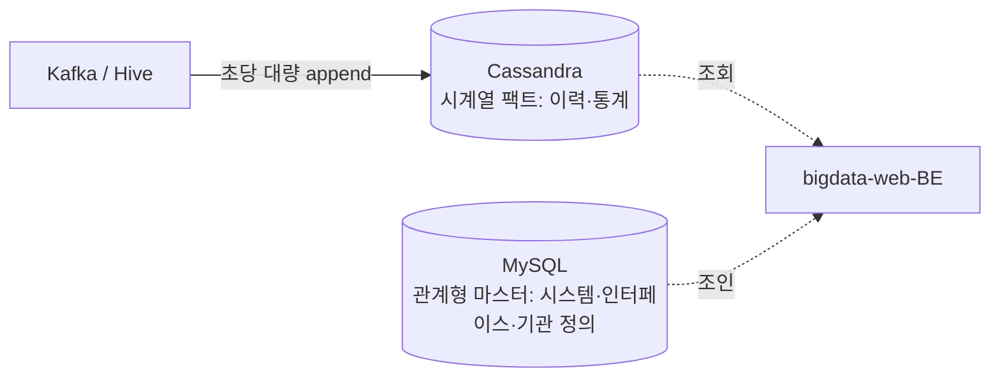
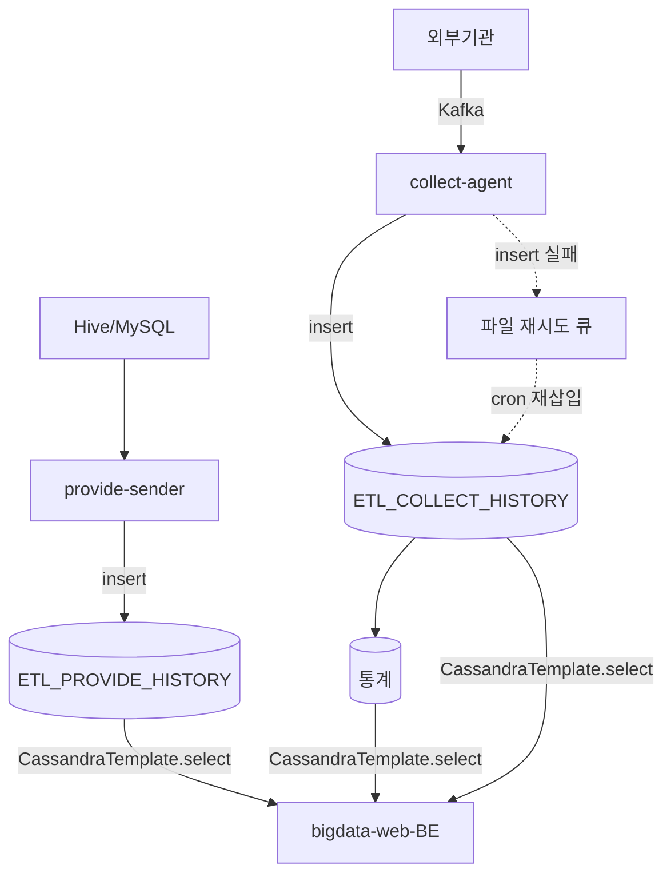

# 빅데이터 플랫폼 — Cassandra 이력·통계 저장소 설계문서

> **대상 시스템**: 빅데이터 플랫폼(수집·제공·통계 에이전트 + 조회 웹 BE)의 시계열 저장소
> **문서 성격**: 실제 운영된 Cassandra 저장소의 **설계문서** — 왜 도입했고, 어떻게 설계했으며, 무엇을 어떤 스키마·키로 저장하고 어떻게 활용했는가
---

## 0. 문서 개요

### 0.1 한 줄 요약

빅데이터 플랫폼은 외부기관 데이터가 인터페이스별로 **초당 대량 append** 되고, 이를 **시간축으로 조회·집계**한다. 이 성격 — *"쓰기 폭주를 견디며 시간축으로 조회·집계되는 로그성 데이터"* — 에 맞춰, 이력·통계 팩트 저장소를 **Apache Cassandra**로 설계했다. 관계형 마스터 데이터는 MySQL에 남긴 **폴리글랏** 구조다.

### 0.3 목차

|  장  | 제목                                |
| :-: | --------------------------------- |
|  1  | [왜 Cassandra였나](#1-왜-cassandra였나) |
|  2  | [아키텍처와 데이터 분산](#2-아키텍처와-데이터-분산)   |
|  3  | [데이터 모델 ★](#3-데이터-모델-)            |
|  4  | [복제·정족수·일관성](#4-복제정족수일관성)         |
|  5  | [장애 처리와 저장 엔진](#5-장애-처리와-저장-엔진)   |
|  6  | [활용 시나리오](#6-활용-시나리오)             |
|  7  | [운영 구성과 회고](#7-운영-구성과-회고)         |

---

## 1. 왜 Cassandra였나

### 1.1 도입 배경

이 프로젝트는 원래 **HBase**를 이력·통계 저장소로 사용했고, 이후 **Cassandra로 이관**했다.

### 1.2 데이터 성격이 저장소를 결정한다

| 데이터 특성                          | 요구되는 저장소 성질 |
| ------------------------------- | ----------- |
| 인터페이스별 초당 대량 append             | 고속 대량 쓰기    |
| "특정 날짜/시간대 이력", "이번 달 일별 통계" 조회 | 시간 범위 순차 스캔 |
| 장애 복구·재집계 시 반복 실행               | 멱등 재처리      |
| 국가기관 데이터량                       | 수평 확장·무중단   |
| 조인 불필요(팩트 데이터)                  | 비관계형        |

### 1.3 선택 이유

| 요구            | Cassandra가 적합했던 이유                                |
| ------------- | ------------------------------------------------- |
| **고속 대량 쓰기**  | 마스터리스 링의 높은 write throughput — `insert`가 곧 append |
| **시간 범위 조회**  | 파티션 키를 `(날짜,시)`로 잡으면 같은 시간대가 한 파티션에 모임            |
| **멱등 재처리**    | INSERT=UPSERT — 재집계·재시도를 중복 걱정 없이 반복              |
| **수평 확장·무중단** | 노드 증설로 선형 확장, 단일 장애점 없음                           |
| **집계 부담 최소화** | 사전집계를 계단식으로 쪼개 조회 시 무거운 연산 제거                     |

### 1.4 폴리글랏 — 무엇을 Cassandra에 안 담았나



> ⚠️ Cassandra는 조인·복잡 집계에 약하다. **조인이 필요한 마스터 데이터는 MySQL에 남긴다.**

### 1.5 CAP — AP 시스템

네트워크 파티션(P)은 피할 수 없으므로 일관성(C)과 가용성(A) 중 택일 → 빅데이터 플랫폼은 **AP**(장애 시에도 빨리 응답). 일관성은 포기가 아니라 **요청별로 조정**한다. Cassandra는 Amazon Dynamo 논문의 AP 키-값 저장소를 구현한 제품이다.

---

## 2. 아키텍처와 데이터 분산

### 2.1 전체 파이프라인



핵심: **"대량 append 되는 시계열 이력·통계는 Cassandra, 관계형 마스터는 MySQL"** 로 저장소를 역할 분리.

### 2.2 마스터리스 링과 코디네이터

Cassandra의 모든 노드는 동등하다(마스터 없음). 클라이언트가 **아무 노드**에 요청하면 그 노드가 **코디네이터**가 되어 토큰을 계산하고 담당 노드로 전달한다. 


> 애플리케이션은 **접속 노드 목록만** 관리하고 라우팅 코드를 두지 않는다.

### 2.3 데이터 분산 — 안정 해시를 토큰 링으로

| 책 5장 개념         | Cassandra 구현                                        |
| --------------- | --------------------------------------------------- |
| 해시 함수로 링에 배치    | **Murmur3Partitioner** (기본). 토큰 공간 `-2^63 ~ 2^63-1` |
| 시계방향 첫 노드가 담당   | 토큰 범위 소유 노드 = primary replica                       |
| 서버당 다수 가상 노드    | **`num_tokens = 256`** (vnode)                      |
| 노드 추가 시 k/n만 이동 | vnode가 여러 노드에서 분담 → 무중단 선형 확장                       |

```
토큰 = Murmur3( 파티션 키 )
예) Murmur3("20260702" + "14") → 토큰 t → 링 위 위치 → 담당 노드
```

> ⚠️ **안정 해시 로직은 애플리케이션 코드에 없다.** 이 프로젝트는 `insert`/`select`만 호출하고, 링·토큰·복제·라우팅은 클러스터가 내부 처리한다. 

---

## 3. 데이터 모델 ★

> 이 문서의 핵심. **무슨 데이터를, 어떤 스키마에, 어떤 키값으로, 어떤 파티션·파티션 키로 저장했는가.**

### 3.1 설계 원칙 — 쿼리 우선(Query-First)

Cassandra 스키마의 제1원칙은 **"각 테이블은 특정 조회 화면에 대응한다"**. 빅데이터 플랫폼의 조회는 항상 **"특정 날짜·시간대"** 로 들어오므로 파티션 키를 **시간축**으로 잡았다. 조회 패턴이 파티션 키를 결정한다.

### 3.2 무슨 데이터를 저장했나

**① 이력 테이블 (원본 팩트)**

| 테이블 | 내용 | 상태 코드 |
|---|---|---|
| `ETL_COLLECT_HISTORY` | 수집 이력. 인터페이스별 수집 결과, 건수·용량·Kafka offset·타임스탬프 | 성공 `S` / 실패 `F` |
| `ETL_PROVIDE_HISTORY` | 제공 이력. 이용기관별 제공 결과 | 실시간 `R` / 배치 `B` |

**② 통계 테이블 (계단식 사전집계, 10분 cron)**

```
ETL_COLLECT_HISTORY ─GROUP BY SUM─► HOURLY ─► DAILY ─► MONTHLY ─► YEARLY
```

각 단계는 **한 단계 아래 테이블**에서 `SUM(data_count, data_length)`를 GROUP BY로 읽어 상위에 insert. 수집은 `count+length` 둘 다, 제공은 `count`만. 수집 없던 인터페이스도 **count=0 버킷 선생성**(대시보드 빈칸 방지).

### 3.3 스키마 — `ETL_COLLECT_HISTORY` (수집 이력)

```sql
CREATE TABLE atm.etl_collect_history (
    collect_date   text,      -- ┐ 파티션 키 = 시간축 (Murmur3 → 담당 노드)
    collect_hour   text,      -- ┘
    system_code    text,      -- ┐
    interface_id   text,      -- │ 클러스터링 키
    data_type      text,      -- │ (파티션 안에서의 정렬·행 좌표)
    extract_id     text,      -- │
    process_status text,      -- ┘  S / F
    data_count     bigint,    -- ┐ 값(팩트)
    data_length    bigint,    -- │
    kafka_offset   bigint,    -- │
    error_message  text,      -- ┘ …(interface_name, inst_code/name, server_ip,
                              --     agent_id/name, 각종 timestamp 등)
    PRIMARY KEY ((collect_date, collect_hour),
                 system_code, interface_id, data_type, extract_id, process_status)
);
```

### 3.4 "어떤 키값으로" — 키 구조 해부

| 키 부분 | 컬럼 | 역할 |
|---|---|---|
| **파티션 키** | `(collect_date, collect_hour)` | Murmur3 해시 → 토큰 → **어느 노드**. 분산의 최소 단위 |
| **클러스터링 키** | `system_code, interface_id, data_type, extract_id, process_status` | 파티션 **안에서 행을 정렬**하는 좌표 |
| **값(data)** | `data_count, data_length, kafka_offset, error_message …` | 실제 팩트 |

```
"키값으로 어떻게 저장/조회했나"

put  = INSERT (= UPSERT)   동일 PK면 덮어쓰기. 재수집도 update 없이 같은 키 insert
get  = SELECT ... WHERE (collect_date, collect_hour) 및 모든 클러스터링 키를 등호 지정
       + ORDER BY extract_id DESC + LIMIT            (analysis §3.4)
```

> ✅ "2026-07-02 14시"를 조회하면 그 시간대 데이터가 **한 노드의 한 파티션에 모여** 순차로 읽힌다(조회 지역성).

### 3.5 `ETL_PROVIDE_HISTORY` (제공 이력)

| 구분 | 컬럼 |
|---|---|
| 파티션 키 | `(provide_date, provide_hour)` |
| 클러스터링 키 | `process_status, interface_data_id, provide_data_id, provide_type, use_inst_name, provide_start_timestamp, provide_history_id` |
| 값 | `data_count, error_message, inst_code/name, provide_data_name, …` (length 없음) |

### 3.6 어떤 파티션 — 롤업이 오를수록 시간 필드를 하나씩 뗀다

상위 단계일수록 데이터 밀도가 낮으므로 파티션 폭을 줄여 파티션당 로우 수를 균형 있게 유지한다.

| 테이블 | 파티션 키 | 클러스터링 키 |
|---|---|---|
| `COLLECT_HISTORY` | `(collect_date, collect_hour)` | system_code · interface_id · data_type · extract_id · process_status |
| `COLLECT_HOURLY_STATS` | `(stats_year, stats_month)` | stats_day · system_code · interface_id · data_type · stats_hour |
| `COLLECT_DAILY_STATS` | `(stats_year, stats_month)` | system_code · interface_id · data_type · stats_day |
| `COLLECT_MONTHLY_STATS` | `(stats_year)` | system_code · interface_id · data_type · stats_month |
| `COLLECT_YEARLY_STATS` | `(system_code)` | interface_id · data_type · stats_year |

```
파티션 키 진화:  (연·월) → (연·월) → (연) → (시스템코드)
                 └ 시간축을 하나씩 제거, 최상위는 조회 주체로 수렴
```

> 제공 통계는 조회 주체가 **이용기관**이라 상위 롤업 파티션 키가 `use_inst_name`으로 수렴한다(수집은 시간축).

### 3.7 왜 이 파티션 키인가

| 효과 | 원리 |
|---|---|
| **쓰기 분산** | 매 시각 새 `(날짜,시)` → 새 토큰 → 링 여러 노드로 쓰기 분산 → 핫스팟 완화 |
| **조회 지역성** | 같은 `(날짜,시)` = 같은 토큰 → 단일 파티션 순차 스캔 |

> ⚠️ **와이드 파티션 주의**: 연별 `system_code`처럼 **저카디널리티 파티션 키**는 링에 흩뿌려질 점이 적어 편중·비대 위험. 연별 통계는 데이터가 적어 영향이 제한적이나, 특정 시스템 쏠림 시 파티션이 커진다 → 모니터링 대상.

### 3.8 메타데이터 — 앱이 아니라 엔진이 관리

| 필요 기능 | Cassandra 대응 |
|---|---|
| 최신본 판정 | 셀 **WRITETIME** (microsecond, 자동) → LWW(§4.3) |
| 만료 | `USING TTL <초>` |
| 삭제 | 네이티브 tombstone → Compaction 물리 제거(§5) |
| 무결성 | SSTable 블록 CRC |

> 앱은 `key`·`value`만 신경 쓰고, 버전/타임스탬프/삭제 마커/체크섬은 엔진이 자동 관리한다.

---

## 4. 복제·정족수·일관성

### 4.1 복제 (RF)

- **복제 계수 RF=3** — 1차 노드 + 링 시계방향 다음 두 노드에 사본. 노드 2대 장애까지 생존.
- **배치 전략 `NetworkTopologyStrategy`** (DC/랙 인식). 빅데이터 플랫폼은 `dc1` 단일 DC.
- RF는 홀수(3,5)가 정석 — 정족수 계산이 깔끔.

### 4.2 정족수와 Consistency Level

정족수는 **RF 기준**: `QUORUM = floor(RF/2)+1` (RF=3 → 2). 강한 일관성 조건 **W+R>N**.

| 목적                 | 쓰기 CL | 읽기 CL | W+R>N | 특성 |
| ------------------ | -------------- | -------------- | :---: | -------- |
| 약한(캐시·세션)          | `ONE` | `ONE` | ❌ | 최고 성능 |
| **최종 (현 프로젝트 현행)** | `LOCAL_ONE` | `LOCAL_ONE` | ❌ | 지연↓·가용성↑ |
| 강한(정합성)            | `LOCAL_QUORUM` | `LOCAL_QUORUM` | ✅ | 최신값 보장 |

**빅데이터 플랫폼은 CL 미지정 → 기본 `LOCAL_ONE`** (로컬 DC 복제본 1개만 응답하면 성공). 대량 append 쓰기에 유리하나 약한 일관성 → 멱등 UPSERT로 수렴.

### 4.3 충돌 해결 — 벡터 시계 대신 LWW

Cassandra는 벡터 시계를 쓰지 않고 **셀 타임스탬프 기반 Last-Write-Wins**로 가장 높은 타임스탬프 셀만 채택한다. 단순·고성능이나 동시 쓰기 시 한쪽이 조용히 유실될 수 있음 → **멱등·로그성 데이터엔 적합**.

### 4.4 멱등 UPSERT — 복구 전략의 뿌리

INSERT=UPSERT라 재수집·재집계·재시도를 delete 없이 같은 키 insert로 안전하게 반복. `LOCAL_ONE`의 약한 일관성으로 생긴 일시적 불일치도 반복 재처리로 **수렴**한다.

---

## 5. 장애 처리와 저장 엔진

### 5.1 장애 처리 — 내장 + 앱 보강

| 역할 | Cassandra 기능 | 동작 |
|---|---|---|
| 감지 | Gossip | 노드끼리 주기적 상태 교환 → 다운 감지 |
| 임시 위탁 | Hinted Handoff | 담당 노드 다운 시 힌트 보관 → 복귀 후 전달 |
| 읽기 복구 | Read Repair | 읽을 때 복제본 불일치를 최신값으로 갱신 |
| 전면 동기화 | `nodetool repair` (Merkle Tree) | SSTable 차이 대조 |

**앱 레벨 보강 — 파일 기반 재시도**

```
insert 실패 → 로컬 파일 적재(유실 방지)
   ↓ @Scheduled cron (10분)
파일 파싱 → insert 재시도 (멱등 UPSERT라 중복 무해)
   ↓  성공: .success/   실패: .failed/
```

> ⚠️ Hinted Handoff는 코디네이터 생존 시에만 동작 → 전 복제본 도달 불가까지 막으려 앱 재시도 큐를 덧댔다. **재시도는 모든 쓰기 경로에 일관 적용이 원칙**

### 5.2 저장 엔진 — LSM

| 책 개념 | Cassandra | 역할 |
|---|---|---|
| WAL | CommitLog | 장애 복구용 순차 기록 |
| 정렬 메모리 | Memtable | 즉시 응답·정렬 |
| 불변 정렬 파일 | SSTable | 인덱스+데이터+블룸 |
| 없는 키 배제 | Bloom Filter | 읽기 최적화 |
| 병합·정리 | Compaction | tombstone·TTL 물리 제거 |

**쓰기 경로**: `CommitLog append → Memtable → (임계) SSTable flush → 주기 Compaction`. 모든 쓰기가 **순차 append** → "고속 대량 write throughput"의 정체. 

---

## 6. 활용 시나리오

| # | 시나리오 | 동작 |
|:-:|---|---|
| ① | **수집 이력 기록** | Kafka 소비 → 엔티티 빌드 → `insert`. 성공 S/실패 F, 재수집은 동일 PK UPSERT |
| ② | **제공 이력 기록** | 3개 지점(수신·배치 성공·배치 실패) 모두 순수 `insert`. 실시간 R/배치 B |
| ③ | **통계 롤업 (10분 cron)** | 한 단계 아래에서 `SUM … GROUP BY` → 상위 insert. 경계는 직전 1시간 재집계(멱등이라 안전) |
| ④ | **웹 조회 (bigdata-web-BE)** | 단건은 전 키 등호 지정. 범위는 **앱에서 파티션(월/시) 루프** 반복 조회 후 병합 |

> 관통 원칙: **쓰기는 무조건 insert, 무거운 집계는 미리 계산(롤업), 조회는 파티션 단위로.**
> Cassandra는 범위 쿼리·조인에 약해 → 사전집계로 조회 부담 제거, 긴 기간은 파티션 루프로 우회. 과거 `ALLOW FILTERING` 범위 쿼리를 파티션 루프로 리팩터링한 흔적이 코드에 있다.

---

## 7. 운영 구성과 회고
### 7.1 회고

**✅ 잘한 점**

- **시계열 모델링 정석** — 시간 파티션 + 계단식 사전집계로 쓰기 폭주와 조회 성능을 동시에 만족.
- **멱등 UPSERT 기반 복구** — 재집계·재시도·경계 보정을 안전하게 반복.
- **폴리글랏 분리** — 관계형 마스터(MySQL) ↔ 시계열 팩트(Cassandra).

**⚠️ 개선 포인트**

| 리스크 | 개선 방향 |
|---|---|
| CL 미지정(LOCAL_ONE) | 정합성 민감 조회는 **LOCAL_QUORUM** 상향 |
| CQL 문자열 결합(인젝션 소지) | **PreparedStatement 파라미터 바인딩** |
| 자격증명 평문 하드코딩 | **Secret 관리(Vault) 외부화** |
| 제공 경로 재시도 부재 | 재시도 **전 쓰기 경로 일관 적용** |
| 긴 기간 조회 = 파티션 루프 선형 증가 | 조회 상한·페이지네이션·캐시 |

### 7.2 종합 매핑 — 책 ↔ Cassandra ↔ 빅데이터 플랫폼

| 책 개념          | Cassandra              | 빅데이터 플랫폼 실사용           |
| ------------- | ---------------------- | ---------------------- |
| CAP → AP      | Dynamo 구현체             | 고속 쓰기·무중단 확장 선택        |
| 안정 해시 + vnode | Murmur3 토큰링·256        | **시간축 파티션 키** 분산       |
| 복제 N·정족수 NWR  | RF=3·Consistency Level | **LOCAL_ONE** (가용성 우선) |
| 벡터 시계         | LWW(셀 타임스탬프)           | 멱등 UPSERT로 수렴          |
| 가십·위탁·머클      | Gossip·Hint·Repair     | + 파일 기반 재시도            |
| LSM           | CommitLog·SSTable      | append 폭주 흡수           |
| 키/값·메타데이터     | PK(파티션+클러스터링)·엔진 관리    | 이력·통계 스키마              |

> **핵심 한 줄**: *"쓰기 폭주를 견디며 시간축으로 조회·집계되는 로그성 데이터"* 라는 데이터 성격이
> 파티션 키(시간축)·일관성(LOCAL_ONE)·집계(계단식 롤업)라는 **모든 설계 결정**을 이끌었다.

---

