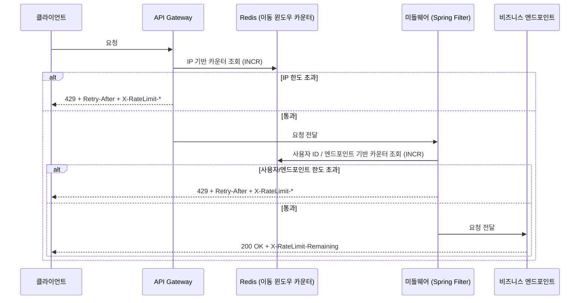
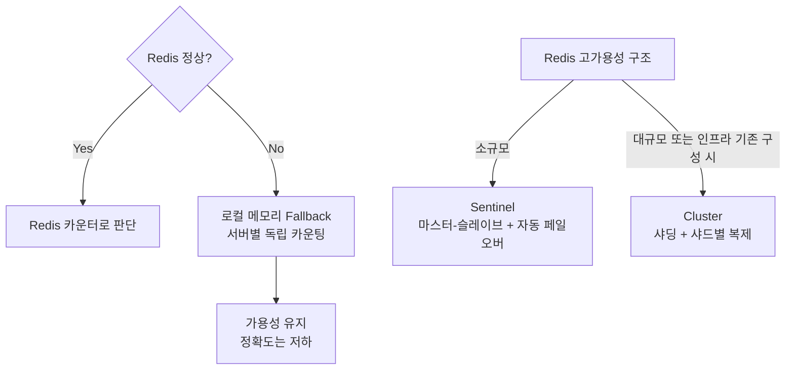

# Chapter 4 — 처리율 제한 장치 설계 (1차 설계)

## 목차

1. [왜 Rate Limiting이 필요한가](#1-왜-rate-limiting이-필요한가)
2. [요구사항 정리](#2-요구사항-정리)
3. [설계 시 고려할 사항](#3-설계-시-고려할-사항)
4. [설계 결정](#4-설계-결정)
5. [최종 아키텍처](#5-최종-아키텍처)
6. [병목 및 장애 가능 지점](#6-병목-및-장애-가능-지점)

> 사전지식 학습 문서: [사전지식-학습/](./사전지식-학습/)

---

## 1. 왜 Rate Limiting이 필요한가

Rate Limiter가 없는 API 서버는 다음 세 가지 문제에 노출된다.

| # | 이유 | 내용 |
|---|------|------|
| 1 | DoS 방어 | 의도적 공격으로 인한 스레드 풀 고갈 방지 |
| 2 | 비용 절감 | 클라우드 과금 제한, 3rd-party API 호출 비용 통제 |
| 3 | 서버 과부하 방지 | 봇·잘못된 클라이언트 패턴으로 인한 의도치 않은 과부하 차단 |

> DoS(의도적 공격)와 서버 과부하(비의도적 과다 요청)는 결이 다르지만 Rate Limiter로 동시에 방어할 수 있다.

---

## 2. 요구사항 정리

### 기능 요구사항
- 설정된 처리율을 초과하는 요청은 정확하게 제한한다
- 요청이 제한되었을 때 사용자에게 그 사실을 명확히 알린다

### 비기능 요구사항
- **낮은 응답시간**: HTTP 응답 시간에 나쁜 영향을 주면 안 됨
- **적은 메모리 사용**: 가능한 한 메모리를 적게 써야 함
- **분산 환경 지원**: 하나의 Rate Limiter를 여러 서버/프로세스가 공유 가능해야 함
- **높은 결함 감내성(Fault Tolerance)**: Rate Limiter에 장애가 생겨도 전체 시스템에 영향 없어야 함
- **유연한 규칙**: IP, 사용자 ID 등 다양한 기준의 제어 규칙 정의 가능
- **대규모 트래픽**: 대규모 요청을 처리할 수 있어야 함

---

## 3. 설계 시 고려할 사항

아래 다섯 가지 항목에 대한 결정이 필요하다. 각 항목의 선택은 사전지식 학습 후 [4. 설계 결정](#4-설계-결정)에서 다룬다.

1. **배치 위치** — Rate Limiter를 어디에 둘 것인가 (클라이언트 / 서버 / 미들웨어 / API Gateway)
2. **알고리즘** — 어떤 방식으로 요청을 제한할 것인가
3. **저장소** — 카운터를 어디에 저장할 것인가
4. **장애 처리** — Rate Limiter에 장애가 났을 때 어떻게 동작할 것인가
5. **사용자 알림** — 요청이 제한되었을 때 어떻게 알릴 것인가

---

## 4. 설계 결정

### 4-1. 알고리즘

**선택지**

| 알고리즘 | 정확도 | 메모리 | 버스트 허용 | 구현 복잡도 |
|---------|--------|--------|-----------|-----------|
| 고정 윈도 카운터 | 낮음 (경계 버스트) | 매우 적음 | O | 낮음 |
| 이동 윈도 로그 | 완벽 | 많음 | X | 중간 |
| 이동 윈도 카운터 | 높음 (근사치) | 적음 | X | 중간 |
| 토큰 버킷 | 중간 | 적음 | O | 낮음 |
| 누출 버킷 | 중간 | 적음 | X (일정 출력) | 낮음 |

**결론**: 이동 윈도우 카운터 (Sliding Window Counter)

**이유**:
- 정확하게 제한해야 하므로 경계 버스트 문제가 있는 고정 윈도우 카운터 제외
- 완벽한 정확도의 이동 윈도우 로그는 메모리를 많이 사용하므로 제외
- 토큰 버킷은 버스트를 허용하는 구조로, 명확한 제한이 필요한 요구사항과 충돌
- 누출 버킷은 버스트를 허용하지 않지만 큐 대기 시간으로 인해 낮은 응답시간 요구사항과 충돌
- 이동 윈도우 카운터는 오차율 0.003% 수준의 높은 정확도 + 적은 메모리 + 즉시 허용/차단

**포기한 것**: 완벽한 정확도 (근사치 방식이므로 극히 미세한 오차 존재)

---

### 4-2. 배치 위치

**선택지**

| 위치 | 제한 대상 | 재사용성 | 세밀한 제어 |
|------|---------|---------|-----------|
| API Gateway | IP, 전체 QPS | 높음 (여러 서비스 공유) | 낮음 |
| 미들웨어 | 사용자 ID, 엔드포인트별 | 낮음 (서비스별) | 높음 |
| API Gateway + 미들웨어 | IP + 사용자/엔드포인트 | 높음 | 높음 |

**결론**: API Gateway + 미들웨어 (2중 구조)

**이유**:
- 요구사항에 "다양한 형태의 제어 규칙(IP, 사용자 ID 등)을 정의할 수 있어야 한다"고 명시됨
- API Gateway만으로는 IP 기반 인프라 수준 제한만 가능 → 사용자 ID, 엔드포인트별 세밀한 제어 불가
- 미들웨어는 인증 이후 단계에서 동작하므로 사용자 정보 기반 세밀한 제한 가능
- 둘을 함께 쓰면 역할 분리: Gateway(IP/DDoS 1차 방어) + 미들웨어(비즈니스 정책 적용)

**포기한 것**: 운영 복잡도 증가 (두 레이어의 Rate Limit 규칙을 각각 관리해야 함)

---

### 4-3. 저장소

**선택지**

| 저장소 | 속도 | 분산 공유 | 원자적 연산 |
|--------|------|---------|-----------|
| 로컬 메모리 | 매우 빠름 | 불가 | O |
| RDB | 느림 (디스크 I/O) | 가능 | O |
| Redis | 빠름 (인메모리) | 가능 | O (INCR) |

**결론**: Redis (중앙 인메모리 저장소)

**이유**:
- RDB는 요청마다 디스크 I/O가 발생해 낮은 응답시간 요구사항을 충족할 수 없음
- 로컬 메모리는 서버별로 독립된 카운터를 가지므로 분산 환경에서 전체 요청 수 파악 불가
- Redis는 인메모리 기반으로 빠른 응답속도 보장 + 중앙 저장소로 여러 서버가 공유 가능
- INCR 명령어로 원자적 연산 지원 → 동시성 문제(Race Condition) 해결

**포기한 것**: Redis 자체가 단일 장애 지점(SPOF)이 될 수 있음 → 고가용성 구조(Sentinel/Cluster)로 보완 필요

---

### 4-4. 장애 처리 전략

**선택지**

| 전략 | 동작 | 우선시하는 것 | 위험 |
|------|------|-------------|------|
| Fail-open | Redis 장애 시 모든 요청 허용 | 가용성 | 요청 폭주 가능 |
| Fail-closed | Redis 장애 시 모든 요청 차단 | 안정성 | 서비스 중단 |
| Fail-open + Fallback | Redis 장애 시 로컬 카운터로 임시 제한 | 가용성 + 부분 제한 | 정확도 저하 |

**결론**: Fail-open + 로컬 메모리 Fallback

**이유**:
- 요구사항에 "높은 결함 감내성 — 제한 장치에 장애가 생겨도 전체 시스템에 영향 없어야 한다"고 명시
- Fail-closed는 Redis 장애 시 정상 사용자도 차단되어 서비스 중단 → 매출 손실, 요구사항 위반
- Rate Limiter는 메인 서비스를 보조하는 장치이므로 그 장애로 메인 서비스까지 멈추는 건 과한 대응
- Redis 장애 시 로컬 메모리로 임시 제한 → 정확도는 낮지만 아예 제한이 없는 것보다 안전

**포기한 것**: Redis 장애 시 정확한 분산 카운팅 불가 (로컬 Fallback은 서버별로 독립 카운팅)

---

### 4-5. 사용자 알림

**선택지**

| 방법 | 내용 |
|------|------|
| HTTP 429 + 최소 헤더 | 상태 코드만 반환 |
| HTTP 429 + 표준 헤더 | Retry-After, X-RateLimit-* 헤더 포함 |

**결론**: HTTP 429 + 표준 헤더 전체 (`Retry-After`, `X-RateLimit-Limit`, `X-RateLimit-Remaining`, `X-RateLimit-Reset`)

**이유**:
- `Retry-After`만으로는 차단된 후에야 클라이언트가 상황을 인지 가능
- `X-RateLimit-Remaining`을 모든 응답에 포함하면 클라이언트가 한도에 가까워질 때 스스로 요청 속도를 줄일 수 있음
- 불필요한 429 응답 자체를 줄일 수 있어 서버 부하 감소에도 기여

**포기한 것**: 헤더 관리 구현 복잡도 소폭 증가

---

## 5. 최종 아키텍처

### Redis 장애 시 대응

---

## 6. 병목 및 장애 가능 지점

| 지점 | 문제 | 대응 |
|------|------|------|
| Redis | 단일 장애 지점(SPOF) | Sentinel / Cluster로 고가용성 확보 |
| Redis | 모든 API 요청마다 네트워크 왕복 발생 | 인메모리 기반으로 최소화, Fallback으로 보완 |
| API Gateway | 트래픽 집중 시 병목 | 수평 확장 (Gateway 인스턴스 추가) |
| 로컬 Fallback | 서버별 독립 카운팅으로 정확도 저하 | Redis 복구 즉시 로컬 카운터 초기화 |
