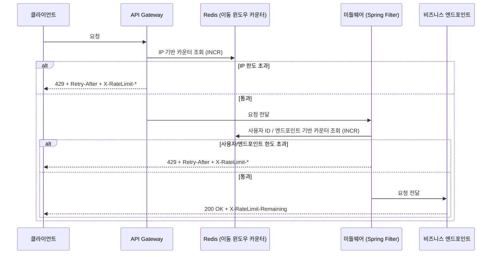
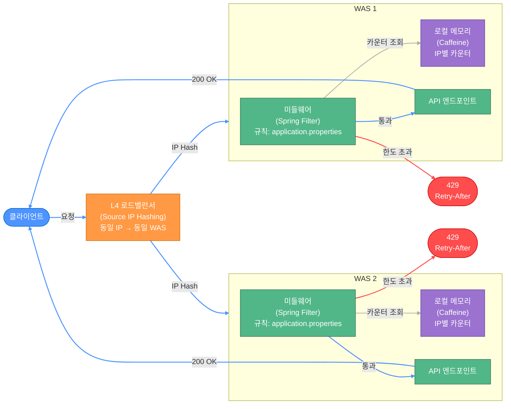
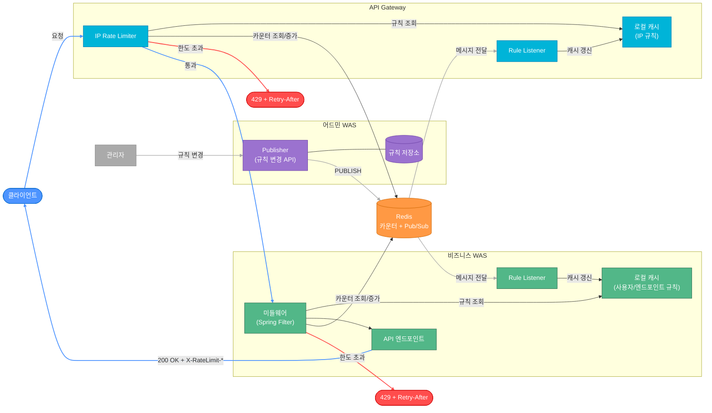

# Chapter 4 — 처리율 제한 장치 설계 (2차 보완 설계)

## 목차

1. [1주차 설계 요약](#1-1주차-설계-요약)
2. [책을 읽고 새로 알게 된 핵심 포인트](#2-책을-읽고-새로-알게-된-핵심-포인트)
3. [책의 설계가 더 나은 이유는 무엇인가](#3-책의-설계가-더-나은-이유는-무엇인가)
4. [책의 설계도 실제 운영 환경에서는 어떤 한계가 있을까](#4-책의-설계도-실제-운영-환경에서는-어떤-한계가-있을까)
5. [우리 서비스라면 다르게 설계할 부분은 무엇인가](#5-우리-서비스라면-다르게-설계할-부분은-무엇인가)
6. [보완된 최종 아키텍처](#6-보완된-최종-아키텍처)
7. [다음 설계 때 가져갈 교훈](#7-다음-설계-때-가져갈-교훈)

> 1주차 전체 설계 과정: [week1-initial-design.md](./week1-initial-design.md)

---

## 1. 1주차 설계 요약

### 핵심 결정 사항

| 항목 | 결정 | 포기한 것 |
|------|------|---------|
| 알고리즘 | 이동 윈도우 카운터 | 완벽한 정확도 (극미세 오차 존재) |
| 배치 위치 | API Gateway + 미들웨어 (2중 구조) | 운영 복잡도 증가 |
| 저장소 | Redis (중앙 인메모리) | Redis SPOF 위험 |
| 장애 처리 | Fail-open + 로컬 메모리 Fallback | Redis 장애 시 정확한 분산 카운팅 불가 |
| 사용자 알림 | HTTP 429 + 표준 헤더 전체 | 헤더 관리 구현 복잡도 소폭 증가 |

### 최종 아키텍처 (1주차)



---

## 2. 책을 읽고 새로 알게 된 핵심 포인트

> 1차 설계에서 놓쳤던 것과 책을 통해 새로 알게 된 내용을 함께 정리한다.

### 경성 vs 연성 처리율 제한

1차 설계에서 이동 윈도우 카운터를 선택했지만, 그것이 경성(Hard) 제한임을 명시적으로 인식하지 못했다.

| 구분 | 동작 | 대표 알고리즘 |
|------|------|-------------|
| 경성(Hard) | 한도를 절대 초과 불가, 초과 즉시 거부 | 이동 윈도우 카운터, 이동 윈도우 로그, 누출 버킷(출력 기준) |
| 연성(Soft) | 순간 버스트 의도적으로 허용 | 토큰 버킷 |

**알고리즘별 경성/연성 정리**

| 알고리즘 | 성격 | 비고 |
|---------|------|------|
| 토큰 버킷 | 연성 | 버킷에 쌓인 토큰만큼 순간 버스트 가능 (의도된 설계) |
| 누출 버킷 | 경성 (출력 기준) | 출력은 항상 일정 속도 — 버스트 없음. 내부적으로 FIFO 큐 사용 |
| 고정 윈도우 카운터 | 경성 (목표), 결함 있음 | 경계 버스트 문제 존재 — 의도치 않은 버스트가 가능한 결함 |
| 이동 윈도우 로그 | 경성 | 정확한 슬라이딩 윈도우, 버스트 불가 |
| 이동 윈도우 카운터 | 경성 | 근사치 방식이지만 버스트 허용이 아닌 정확한 제한이 목표 |

**경성/연성 선택 기준**

- 경성이 필요한 경우: 보안·과금 등 초과가 절대 허용되지 않는 API (로그인, 결제)
- 연성이 적합한 경우: 자연스러운 버스트가 발생하는 UX (앱 실행 시 여러 요청이 동시에 나가는 피드/추천 API)

**이 서비스의 선택**: 요구사항이 "설정된 처리율을 정확하게 제한"이므로 경성 → 이동 윈도우 카운터 유지

### 다양한 계층에서의 처리율 제한

1차 설계에서 API Gateway(IP 기준)와 미들웨어(사용자/엔드포인트 기준)로 2중 구조를 잡았지만, **L4 계층(TCP 연결 수 제한)** 이 빠져 있었다.

| 계층 | 위치 | 제한 기준 | 방어 대상 |
|------|------|---------|---------|
| L4 (전송) | 로드밸런서 | IP당 동시 TCP 연결 수 | Slowloris 등 연결 고갈 공격 |
| L3 (네트워크) | API Gateway | IP당 요청 수 | IP 기반 DDoS, 어뷰징 |
| L7 (애플리케이션) | 미들웨어 | 사용자 ID, 엔드포인트별 요청 수 | 비즈니스 정책 위반 |

- TCP 연결은 파일 디스크립터를 소비 — 연결만 열고 요청을 안 보내도 서버 자원을 고갈시킬 수 있음
- L4 제한은 HTTP 요청이 파싱되기 전 단계에서 동작하므로 미들웨어에서는 처리 불가, 로드밸런서에서 담당
- Nginx의 `limit_conn`, HAProxy의 connection limit 등으로 구현

### 처리율 제한 회피 방법 / 클라이언트 설계

1차 설계에서 서버 측 rate limiting만 고려했고, **클라이언트가 어떻게 동작해야 하는지**는 다루지 않았다.

**나쁜 클라이언트 패턴**: 429를 받자마자 즉시 재시도 반복 → 서버 부하 가중

**올바른 클라이언트 설계 원칙**

| 상황 | 대응 |
|------|------|
| 429 받기 전 | `X-RateLimit-Remaining` 읽고 한도에 가까워지면 스스로 속도 조절 |
| 429 받았을 때 | `Retry-After` 헤더 시점까지 대기 후 재시도 |
| 여러 클라이언트 동시 재시도 시 | 지수 백오프(Exponential Backoff) + Jitter로 재시도 시점 분산 |

**Thundering Herd**: API 전체(글로벌) 제한이 있을 때 주로 발생 — 수많은 클라이언트가 동시에 429를 받고 동시에 재시도하면 서버가 또 다시 과부하에 걸림. 특히 **팀 전체가 하나의 외부 API 키를 공유하는 경우** 대표적으로 발생.

```
재시도 대기 = 2^n + random(0, 1)초   // 지수 백오프 + Jitter
```

### 처리율 제한 규칙(Rule) 관리 구조

1차 설계에서 Redis에 카운터는 저장했지만, **"몇 개까지 허용하는지"라는 규칙 자체가 어디에 저장되는지** 정의하지 않았다.

규칙 예시:
```yaml
- 로그인 API: 사용자당 분당 5회
- 검색 API: IP당 초당 100회
- 결제 API: 사용자당 시간당 10회
```

**책의 규칙 관리 구조**:
```
규칙 파일(디스크) → 워커가 주기적으로 읽어서 → 미들웨어 로컬 캐시에 저장
                                                          ↓
요청 → 로컬 캐시에서 규칙 조회 (네트워크 없음) → Redis에서 카운터 조회 → 판단
```

- 규칙은 자주 바뀌지 않으므로 요청마다 Redis까지 가져올 필요 없음
- 로컬 캐시 조회는 네트워크 왕복이 없어 빠름
- Redis는 카운터 전용, 규칙은 로컬 캐시 — 역할 분리

| | 1차 설계 | 책의 설계 |
|--|---------|---------|
| 카운터 저장 | Redis ✓ | Redis ✓ |
| 규칙 저장 | 미정의 ✗ | 규칙 파일 → 워커 → 로컬 캐시 ✓ |

### Race Condition과 원자성 보장 (루아 스크립트 / Sorted Set)

1차 설계에서 Redis INCR이 원자적이라고 했지만, 이동 윈도우 카운터는 단순 INCR이 아니라 **조회→판단→증가** 시퀀스가 필요해 race condition이 생긴다.

**Race Condition 시나리오**:
```
요청 A: 카운터 조회 → 99 → 통과 판단
요청 B: 카운터 조회 → 99 → 통과 판단  ← A가 아직 업데이트 전
요청 A: 카운터 100으로 업데이트
요청 B: 카운터 100으로 업데이트
→ 101번째 요청까지 허용됨
```

**알고리즘별 해결 방식**:

| 알고리즘 | Redis 자료구조 | 원자성 보장 |
|---------|-------------|-----------|
| 이동 윈도우 로그 | Sorted Set (타임스탬프를 score로 저장, ZCOUNT로 범위 집계) | Lua 스크립트로 ZADD+ZCOUNT 묶기 |
| 이동 윈도우 카운터 | 단순 key-value | INCR 선행 후 초과 시 DECR 롤백 |

- Sorted Set은 이동 윈도우 로그에 자연스러운 자료구조 — 개별 요청 타임스탬프를 저장하고 ZCOUNT로 윈도우 내 요청 수를 한 번에 집계
- 이동 윈도우 **카운터**는 Sorted Set 불필요 — 이전/현재 윈도우 카운터 두 숫자만 저장. 겹치는 비율 계산은 애플리케이션에서 수행 후 INCR → 초과 시 DECR 롤백

---

## 3. 책의 설계가 더 나은 이유는 무엇인가

> 단순히 "책이 더 자세하다"가 아니라, 어떤 요구사항 또는 제약 조건을 더 잘 다루는지 구체적으로 적는다.

- **규칙 관리 구조 명시**: 1차 설계는 카운터 저장소(Redis)만 정의했고 규칙을 어디서 어떻게 가져오는지 정의하지 않았다. 책은 규칙 파일 → 워커 → 로컬 캐시 구조로 명확하게 분리해, 규칙 변경 시 재배포 없이 반영할 수 있고 요청 경로에서 불필요한 네트워크 왕복을 제거했다.
- **클라이언트 설계 포함**: 서버 측 rate limiting뿐 아니라 클라이언트가 어떻게 동작해야 하는지(헤더 활용, 지수 백오프 + Jitter)까지 다뤄 실제 운영 시나리오를 더 완결성 있게 커버한다.
- **계층별 제한 명시**: L3/L4/L7 각 계층에서의 역할을 명확히 구분해 단일 레이어 방어의 한계를 보완한다.

---

## 4. 책의 설계도 실제 운영 환경에서는 어떤 한계가 있을까

> 책의 설계를 정답으로 받아들이지 않고, 실제 환경에서 어떤 문제가 생길 수 있을지 비판적으로 생각해본다.

### 규칙 변경 전파 지연

책의 규칙 관리 구조(규칙 파일 → 워커 폴링 → 로컬 캐시)는 **워커 폴링 주기만큼 규칙 변경이 지연**된다.

- DDoS 공격 발생 시 긴급 차단 규칙을 추가해도 폴링 주기(예: 1분) 동안은 공격 트래픽이 통과할 수 있음
- 여러 서버가 각자 로컬 캐시를 가지므로 서버마다 다른 시점에 규칙이 적용되는 **일시적 불일치** 발생

**개선 방안**: Redis Pub/Sub으로 규칙 변경 시 즉시 모든 서버에 푸시 → 전파 지연 없이 로컬 캐시 유지

| 방식 | 일관성 | 성능 | 복잡도 |
|------|------|------|------|
| 로컬 캐시 + 폴링 (책) | 낮음 (지연 존재) | 빠름 | 낮음 |
| Redis 직접 조회 | 높음 | 요청마다 네트워크 왕복 추가 | 낮음 |
| Redis Pub/Sub 푸시 | 높음 (즉시 전파) | 빠름 | 높음 |

---

## 5-1. 우리 서비스 최종 아키텍처



## 5. 우리 서비스라면 다르게 설계할 부분은 무엇인가

> "우리 서비스"의 특성(트래픽 규모, 팀 규모, 기술 스택, 비즈니스 요구사항 등)을 고려했을 때 책과 다르게 선택할 부분이 있다면 이유와 함께 적는다.

**서비스 특성**: 소규모 트래픽, Spring Boot 기반

책의 설계는 대규모 트래픽을 전제로 한 구조라 그대로 적용하면 트래픽 대비 복잡도가 과도하게 높아진다.

| 항목 | 책의 설계 | 우리 서비스 | 이유 |
|------|---------|-----------|------|
| 규칙 저장 | 규칙 파일 → 워커 → 로컬 캐시 | Redis + 로컬 캐시 (TTL 30초) | 워커 인프라 불필요, TTL로 자동 갱신 |
| Redis 구성 | Cluster | Sentinel (단일 마스터 + HA) | 소규모 트래픽에 Cluster는 과함 |
| 배치 위치 | API Gateway + 미들웨어 | 미들웨어만 (Spring Filter) | 트래픽이 적어 Gateway 레이어 불필요 |

**규칙 변경 전파 방식**

- **TTL 방식 (기본)**: 로컬 캐시에 30초 TTL → 만료 시 Redis에서 자동 재조회. 구현 단순, 30초 지연 허용 가능한 경우 적합
- **Redis Pub/Sub (즉시 전파 필요 시)**: Admin API 호출 → Redis 채널에 변경 발행 → 모든 WAS 인스턴스가 구독하여 로컬 캐시 즉시 evict. WAS 간 직접 통신 없이 Redis를 브로커로 활용

TTL 방식으로 시작하고 즉시 전파가 필요해지면 Pub/Sub으로 전환하는 점진적 접근이 현실적이다.

---

## 6. 보완된 최종 아키텍처

> 2~5번 고민을 반영해서 달라진 아키텍처를 그린다. 1주차와 달라진 부분이 없다면 그 이유도 함께 적는다.

**1주차 대비 추가된 부분**
- 처리율 제한 규칙을 로컬 캐시에서 관리 (API Gateway, WAS 각각)
- 규칙 변경 시 Redis Pub/Sub으로 즉시 전파
- Race Condition 방지를 위한 루아 스크립트 적용



---

## 7. 다음 설계 때 가져갈 교훈

> 이번 챕터를 통해 앞으로의 설계에 반복 적용하고 싶은 원칙이나 체크포인트를 적는다.

### 알고리즘은 실행 환경과 함께 판단해야 하는 것 같다.
지금 회사 서비스에 누출 버킷도 괜찮은 선택이라고 생각했지만 Tomcat WAS에서는 누출 버킷 큐에 쌓인 요청들도 다 쓰레드를 점유하게 되기 때문에 오히려 쓰레드 풀 고갈을 야기할 수 있다.

### 클라이언트측도 고려해야 한다.
서버가 아무리 잘 설계되어 있다고 하더라도, 사용자 측에서 429응답을 동시에 받았다면, 제한 시간이 풀린 뒤에 또 수천,수만명의 사용자들이 동시 요청하게 될 수 있다. 
처리율 제한 기준에 따라 다르겠지만 API에 처리율 제한이 걸려있다면 또 대부분은 제한에 걸릴 것이므로, 이런 현상을 방지하기 위해서는 지수 백오프 + jitter로 사용자들이 요청하는 시간대를 의도적으로 분산시킬 수 있다.
