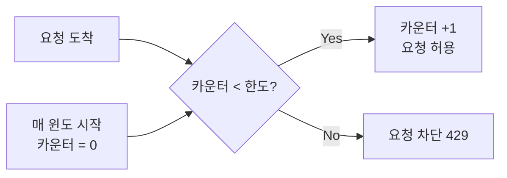
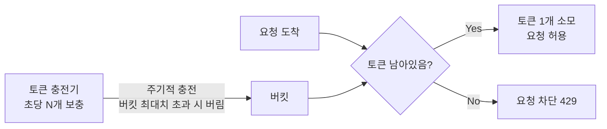

# Rate Limiting 알고리즘

## 왜 필요한가

"1분에 최대 N번 제한"이라는 같은 규칙도 어떤 시점을 기준으로 카운트하느냐에 따라 동작이 완전히 달라진다.
요구사항(정확도, 메모리, 처리 방식)에 따라 적합한 알고리즘이 다르기 때문에 여러 선택지를 이해해야 한다.

---

## 알고리즘별 동작 원리 및 비교

### ① 고정 윈도 카운터 (Fixed Window Counter)

시간을 고정된 구간으로 나누고, 구간마다 카운터를 초기화한다.



**문제점 — 경계 버스트(Boundary Burst)**:

```mermaid
gantt
    title 고정 윈도 경계 버스트 (한도: 5)
    dateFormat HH:mm:ss
    section 윈도 1 (12:00~12:01)
    요청 5번 허용 : 12:00:59, 1s
    section 윈도 2 (12:01~12:02)
    요청 5번 허용 : 12:01:00, 1s
```



2초 안에 10번 통과 → 의도한 제한의 2배

---

### ② 이동 윈도 로그 (Sliding Window Log)

요청마다 타임스탬프를 로그에 저장하고, 현재 시점 기준 1분 이내 로그 수로 제한한다.

```
요청이 올 때마다:
1. 타임스탬프 로그에 기록
2. "현재 - 1분" 이전 항목 제거
3. 남은 로그 수 > 한도면 차단
```

경계 버스트 문제 없음. 대신 **차단된 요청의 타임스탬프도 저장**해야 하므로 메모리 사용량이 높다.

---

### ③ 이동 윈도 카운터 (Sliding Window Counter)

고정 윈도 카운터의 메모리 효율 + 이동 윈도 로그의 정확도를 근사치로 결합.

이전 윈도와 현재 윈도의 카운터 2개만 저장하고, 비율로 추정한다.

```
추정치 = 현재 윈도 카운터 + 이전 윈도 카운터 × (1 - 현재 윈도 경과 비율)
```

예시 (한도: 10, 현재 12:01:15):

```mermaid
graph LR
    subgraph 이전 윈도 12:00~12:01
        P[카운터: 30개]
    end
    subgraph 현재 윈도 12:01~12:02
        C[카운터: 5개\n경과: 25%]
    end
    P -->|"30 × 75% = 22.5"| SUM
    C -->|"5"| SUM
    SUM["추정치 = 27.5개"]
```

오차율 약 0.003% 수준으로 실용적으로 정확하다.

---

### ④ 토큰 버킷 (Token Bucket)

버킷에 토큰이 일정 속도로 충전되고, 요청이 올 때마다 토큰을 소모한다.



- 버킷에 토큰이 쌓여있으면 **순간 버스트 허용** (버킷 크기까지)
- 고정 윈도와 달리 토큰이 조금씩 충전되므로 경계 버스트 없음
- 평소에 요청이 적었다면 토큰이 쌓여 한 번에 많은 요청을 보낼 수 있음

---

### ⑤ 누출 버킷 (Leaky Bucket)

요청이 큐에 쌓이고, 서버는 큐에서 일정 속도로만 꺼내 처리한다.

```
큐 크기: 5, 처리 속도: 초당 2개
요청 → 큐에 삽입 → 큐 가득 차면 새 요청 버림
서버: 큐에서 초당 2개씩 꺼내 처리
```

- 서버 처리 속도가 항상 일정 → 과부하 없음
- 트래픽 버스트 시 큐가 오래된 요청으로 채워져 **최신 요청이 버려짐**
- 큐 대기 시간만큼 **응답 레이턴시 증가**

---

## 알고리즘 비교

| 알고리즘 | 핵심 아이디어 | 장점 | 단점 |
|---------|-------------|------|------|
| 고정 윈도 카운터 | 시간 구간마다 카운터 리셋 | 구현 단순, 메모리 최소 | 경계 버스트 문제 |
| 이동 윈도 로그 | 요청마다 타임스탬프 저장 | 정확도 완벽 | 메모리 많이 사용 |
| 이동 윈도 카운터 | 이전+현재 카운터로 근사 | 정확도 높음, 메모리 적음 | 근사치 (미세 오차) |
| 토큰 버킷 | 토큰이 일정 속도로 충전 | 버스트 허용, 구현 단순 | 버스트 크기 제어 어려움 |
| 누출 버킷 | 큐에서 일정 속도로 처리 | 안정적 출력 속도 | 최신 요청 희생, 레이턴시 |

---

## 요구사항 기준 트레이드오프

> 설계 결정 단계에서 작성

## 이 챕터에서의 적용

> 설계 결정 단계에서 작성
