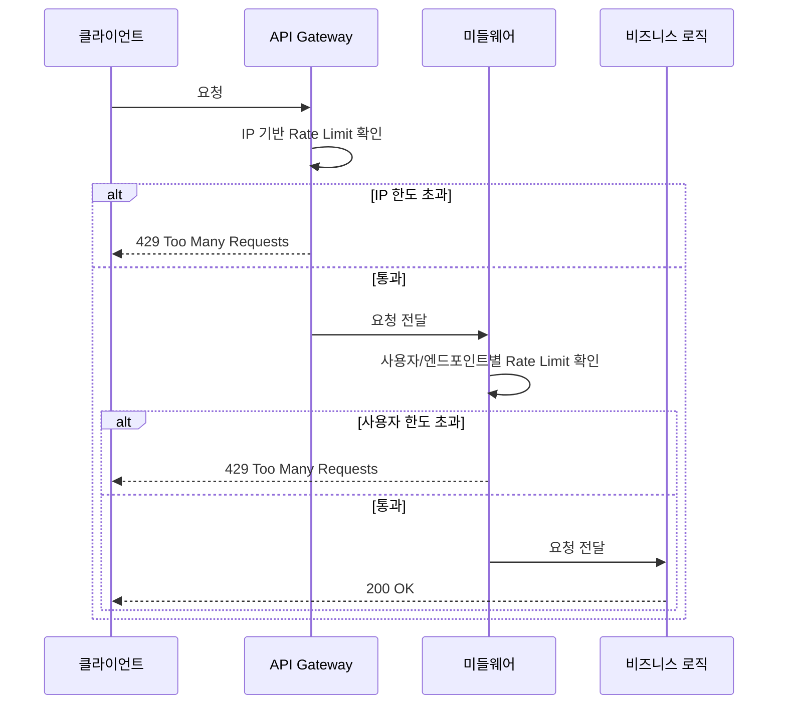

# Rate Limiter 배치 위치

## 왜 필요한가

Rate Limiter를 어디에 두느냐에 따라 제어할 수 있는 대상과 재사용성, 세밀함이 달라진다.
잘못된 위치에 두면 우회가 가능하거나 책임이 혼재된다.

---

## 선택지 비교

### 클라이언트 측
사용자가 직접 코드를 실행하기 때문에 역컴파일, 패킷 변조 등으로 우회 가능.
**신뢰할 수 없는 환경 → 제외**

### API Gateway
앱 서버 외부에 위치. 인증 이전 단계라 사용자 정보 없음.

제한 가능한 대상:
- IP 기반 제한
- 서비스 전체 QPS 제한

### 미들웨어 (앱 서버 내부)
앱 서버 안에서 비즈니스 로직 실행 전에 동작. 인증 이후 단계라 사용자 정보 있음.

제한 가능한 대상:
- 사용자 ID 기반 제한
- 엔드포인트별 세밀한 제한 (게시글 작성 하루 10번 등)
- 비즈니스 규칙 기반 제한

프레임워크별 구현체:
| 프레임워크 | 미들웨어 구현체 |
|-----------|--------------|
| Spring | Filter, Interceptor |
| Express.js | `app.use((req, res, next) => {...})` |
| Django | Middleware class |

### 비즈니스 로직
이미 DB 조회, 연산 등의 비용이 발생한 이후 → 제한 의미 없음. 책임 분리 원칙 위반.
**제외**

---

## 선택지 비교 표

| 위치 | 재사용성 | 세밀한 제어 | 제한 대상 |
|------|---------|-----------|---------|
| 클라이언트 | - | - | 우회 가능, 제외 |
| API Gateway | 높음 (여러 서비스 공유) | 낮음 | IP, 전체 QPS |
| 미들웨어 | 낮음 (서비스별) | 높음 | 사용자 ID, 엔드포인트별 |
| 비즈니스 로직 | - | - | 책임 혼재, 제외 |

---

## 2중 방어 패턴

API Gateway와 미들웨어를 함께 사용하면 역할을 분리한 2중 방어가 가능하다.

---

## 2중 방어 패턴을 쓰는 이유

API Gateway와 미들웨어는 제한 대상이 다르기 때문에 함께 쓰면 보완 관계가 된다.

- **API Gateway**: IP 기반으로 WAS 도달 자체를 원천 차단 → 악성 봇, DDoS 1차 방어
- **미들웨어**: 게이트웨이를 통과한 정상 요청에 비즈니스 정책 적용 → 게시물 하루 10개, 댓글 하루 20개 등 세밀한 제어

## 실제 제품 및 도구

| 구분 | 제품/도구 | 설명 |
|------|----------|------|
| API Gateway | Kong | 오픈소스, Rate Limiting 플러그인 제공 |
| API Gateway | AWS API Gateway | AWS 관리형, Rate Limiting 설정 가능 |
| API Gateway | Nginx | 웹서버 겸 리버스 프록시, `limit_req_zone`으로 Rate Limiting |
| API Gateway | Envoy | 마이크로서비스용 프록시, Istio와 함께 사용 |
| 미들웨어 라이브러리 | Bucket4j | Java, 토큰 버킷 기반 |
| 미들웨어 라이브러리 | Resilience4j | Java, Rate Limiter 모듈 포함 |
| 미들웨어 라이브러리 | express-rate-limit | Node.js |

## 요구사항 기준 트레이드오프

> 설계 결정 단계에서 작성

## 이 챕터에서의 적용

> 설계 결정 단계에서 작성
