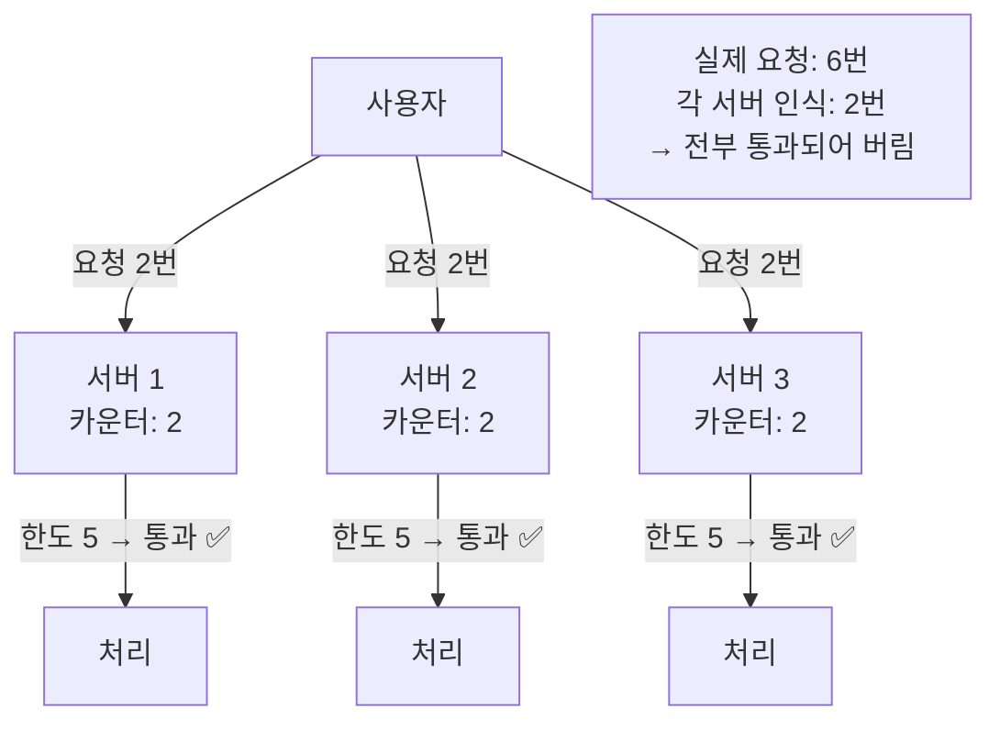
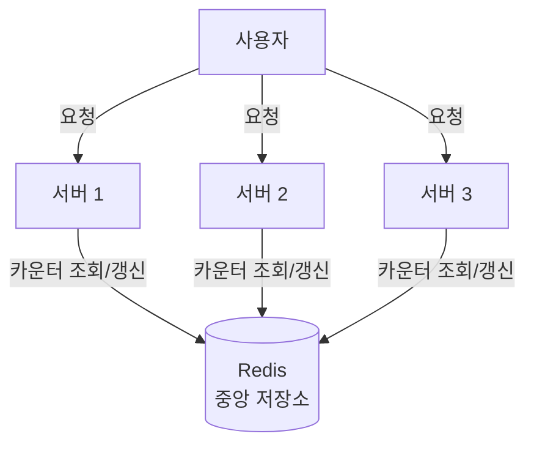
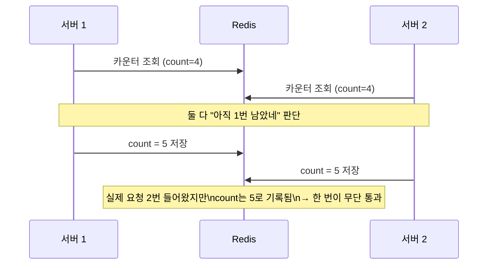
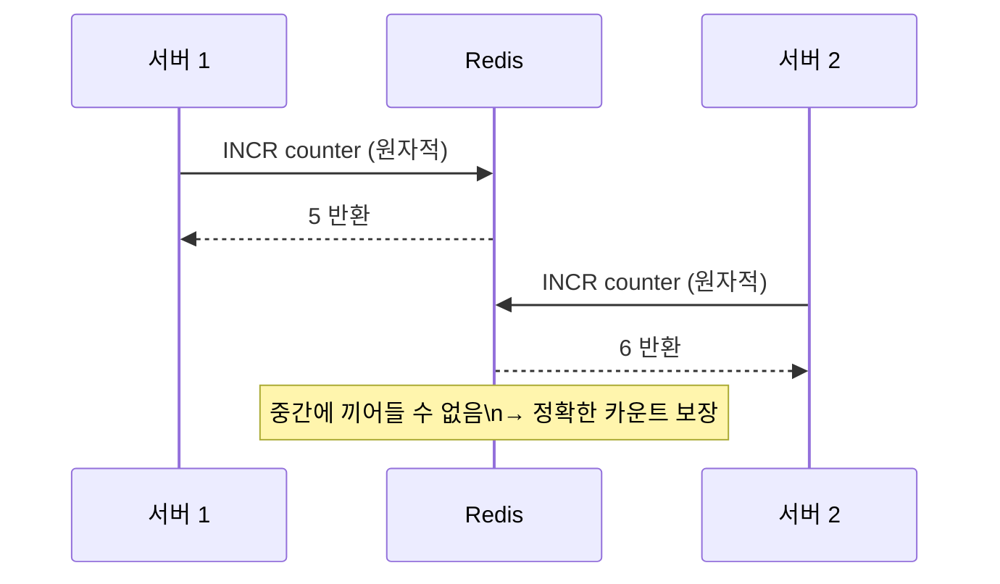

# 저장소 선택

## 왜 필요한가

Rate Limiter는 모든 API 요청마다 카운터를 조회하고 갱신한다.
분산 환경에서 여러 서버가 같은 카운터를 공유해야 하기 때문에 저장소 선택이 핵심 설계 결정이다.

---

## 로컬 메모리의 문제

각 서버가 자기 서버에 온 요청만 카운트하면 전체 요청 수를 알 수 없다.

---

## 중앙 저장소 구조

모든 서버가 하나의 Redis를 공유하므로 전체 요청 수를 정확히 파악할 수 있다.

---

## 선택지 비교

| 저장소 | 속도 | 이유 | 분산 공유 |
|--------|------|------|---------|
| 로컬 메모리 | 매우 빠름 | 네트워크 없음 | 불가 |
| 관계형 DB (MySQL 등) | 느림 | 요청마다 디스크 I/O 발생 | 가능 |
| Redis (인메모리) | 빠름 | 메모리 기반, 네트워크만 | 가능 |

Rate Limiter는 모든 API 요청마다 카운터를 조회+갱신하므로 빈도가 매우 높다.
RDB는 매 요청마다 디스크 I/O가 발생해 응답시간 요구사항을 맞추기 어렵다.
→ **Redis 선택**

---

## 동시성 문제와 원자적 연산

### 문제: Race Condition

### 해결: 원자적 연산

Redis의 `INCR` 명령어는 조회 + 증가를 단일 연산으로 처리한다.

Lua 스크립트를 사용하면 여러 Redis 명령을 원자적으로 묶어 실행할 수도 있다.

---

## 요구사항 기준 트레이드오프

> 설계 결정 단계에서 작성

## 이 챕터에서의 적용

> 설계 결정 단계에서 작성
