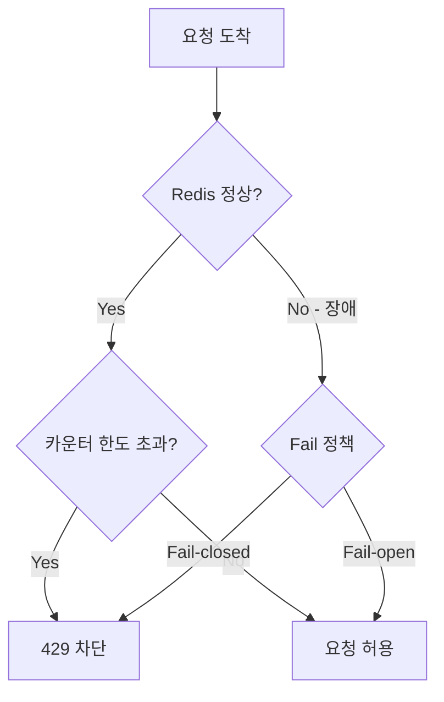
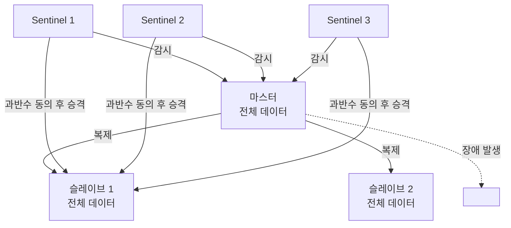
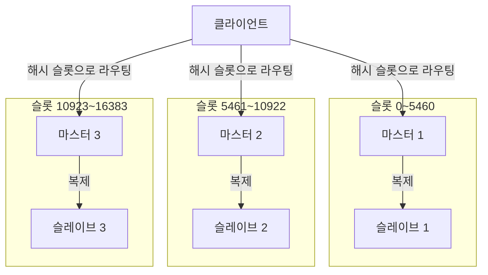

# 장애 처리 전략 (Fault Tolerance)

## 왜 필요한가

Rate Limiter는 Redis에 의존한다. Redis에 장애가 생겼을 때 어떻게 동작할지 정책이 없으면 전체 서비스가 영향을 받을 수 있다.

---

## Fail-open vs Fail-closed

| 전략 | 동작 | 우선시하는 것 | 위험 |
|------|------|-------------|------|
| **Fail-open** | Redis 장애 시 Rate Limiting 건너뜀 → 모든 요청 허용 | 서비스 가용성 | 제한 없이 요청 폭주 가능 |
| **Fail-closed** | Redis 장애 시 모든 요청 차단 | 서버 안정성 | 멀쩡한 서비스가 중단됨 |

**실제 서비스에서는 Fail-open이 일반적** — Rate Limiter는 메인 서비스를 보조하는 장치이기 때문에, 그 장치의 장애로 메인 서비스까지 멈추는 건 과한 대응이다. 매출 손실이 더 크다.

---

## Redis 장애 확률 줄이기 — 고가용성 구조

### Redis Sentinel

마스터 1대 + 슬레이브 N대 구조. 외부 Sentinel 프로세스들이 마스터를 감시하다가 장애 감지 시 슬레이브를 마스터로 자동 승격한다.

- 마스터 1대가 전체 데이터 보유
- 데이터 양이 적고 장애 복구만 필요할 때 적합

### Redis Cluster

데이터를 여러 마스터 노드에 샤딩. 각 마스터는 16,384개 해시 슬롯 중 일부를 담당하며, 각자 슬레이브를 보유한다. 노드들끼리 서로 감시하며 페일오버 (외부 Sentinel 불필요).

- 샤딩(데이터 분산) + 샤드별 복제(고가용성)를 동시에 제공
- Sentinel 개념을 내부적으로 포함하는 구조
- 대규모 트래픽, 수평 확장이 필요할 때 적합

| | Sentinel | Cluster |
|--|---------|---------|
| 데이터 분산 | X | O |
| 고가용성 | O | O |
| 페일오버 주체 | 외부 Sentinel 프로세스 | 노드 간 자체 처리 |
| 적합한 상황 | 소규모, 장애복구만 필요 | 대규모 트래픽, 수평 확장 |

### 로컬 메모리 Fallback

Redis 장애 시 각 서버의 로컬 카운터로 임시 제한. 정확도는 떨어지지만 아예 제한이 없는 것보다는 낫다.

---

## 요구사항 기준 트레이드오프

> 설계 결정 단계에서 작성

## 이 챕터에서의 적용

> 설계 결정 단계에서 작성
