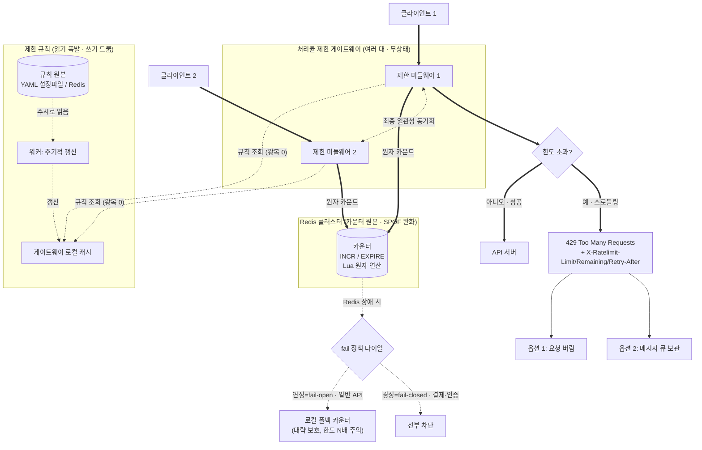

# [Ch.04] 처리율 제한 장치의 설계 — 윤유탁

> 1차 설계안 (책 해설을 읽기 전, 문제와 요구사항만 보고 설계)

## 문제

네트워크 시스템에서 **처리율 제한 장치(rate limiter)** 를 설계한다.
클라이언트/서비스가 보내는 트래픽의 처리율(rate)을 제어해서, 특정 기간 내 요청 횟수가
임계치를 넘으면 추가 요청을 막는다.

예) "초당 2회 이상 새 글 금지", "같은 IP로 하루 10계정 이상 생성 금지" 등.

두는 이유: DoS 방어 / 비용 절감 / 서버 과부하 방지.

## 설계 범위 (면접관과의 문답으로 확정한 가정)

- **서버 측** 처리율 제한 장치를 설계한다 (클라이언트 측 아님)
- 제어 기준은 **유연**해야 한다 (IP, 사용자 ID 등 다양한 throttling rule 정의 가능)
- **대규모 + 분산 환경**에서 동작해야 한다
- 요청이 제한되면 **사용자에게 그 사실을 알려야** 한다

## 요구사항

1. 설정된 처리율을 초과하는 요청은 **정확하게** 제한한다
2. **낮은 응답시간** — HTTP 응답시간에 나쁜 영향을 주면 안 된다
3. **메모리를 적게** 쓴다
4. **분산형 처리율 제한** — 하나의 제한 장치를 여러 서버/프로세스가 공유 가능해야 한다
5. **예외 처리** — 요청이 제한됐을 때 사용자에게 분명히 보여준다
6. **높은 결함 감내성** — 제한 장치에 장애가 생겨도 전체 시스템에 영향을 주면 안 된다

---

## 의사결정 및 고민할 것들

### 1. 처리율 제한 장치를 어디에 둘 것인가? (위치)
선택지
1. 클라이언트 측
2. API 서버 코드 안에 인라인
3. 서버 앞단의 독립된 컴포넌트 (미들웨어 / 게이트웨이)

1번은 안 됨. 클라이언트는 요청 위변조가 쉬워서 제한을 안정적으로 걸 장소가 못 됨. 악의적 클라이언트가 무시하면 끝.

2번도 안 됨. 거부할 요청조차 일단 서버까지 도달해야 검사가 됨. 막아야 할 부하가 이미 서버에 닿음. 제한 로직이 서버마다 박혀서 공유(4번)·장애 격리(6번)도 어려워짐.

3번이 최적. 서버 앞단에 처리율을 처리해주는 독립 컴포넌트(미들웨어/게이트웨이)를 둠. 부하가 서버에 닿기 전에 거름.

트레이드오프: 분리하면 홉이 하나 늘고 운영할 컴포넌트가 하나 더 생김. 대신 부하 격리 + 공유 + 장애 격리를 얻음. 요구사항상 남는 장사라 분리가 맞음.

---

### 2. 요청 수를 어떻게 세고 허용/거부를 판단? (제한 알고리즘)
구체 규칙: "한 사용자 분당 최대 5회"를 어떻게 구현할 것인가.

제일 단순한 건 사용자별 카운터 하나 두고 매 분 정각에 리셋(고정 윈도우). 근데 이건 윈도우 경계 버스트 문제가 있음. 1:00:30~2:00:30처럼 윈도우를 살짝 옮겨 1분을 잘라보면 한도의 2배가 통과될 수 있음.

→ 그래서 **슬라이딩 윈도우**. 고정 크기(1분) 윈도우가 매 순간 "지금 기준 직전 60초"로 움직이면서 셈. 한 번에 쏘든 걸쳐 쏘든 1분 총량만 지켜지므로 경계 문제 없음.

근데 "정확히" 슬라이딩하려면 각 요청의 타임스탬프를 다 들고 있어야 함(카운터 숫자 하나로는 오래된 요청 만료를 못 함). 공격자가 1분에 수천 번 쏘면 그 타임스탬프를 다 저장 → 메모리 폭발. 요구사항 3번(메모리 적게)이랑 충돌.

**해결: 시간을 버킷으로 쪼개고 버킷마다 카운트만 센다.** 저장하는 게 "요청 수천 개 시각"이 아니라 "고정 개수 버킷 카운터"라 메모리가 확 줄어듦.

버킷을 몇 개로 쪼갤지가 다이얼:
- 잘게(1초 60버킷): 슬라이딩 거의 정확. 대신 사용자 1명당 카운터 60개 × 수백만 명 → 메모리 60배
- 굵게(2버킷, "직전 1분" + "현재 1분"): 메모리 최소. 대신 직전 버킷을 겹침 비율로만 반영 → "직전 1분 안에서 요청이 균등 분포했다"는 가정이 깔림. 트래픽이 한쪽에 쏠리면 과대/과소평가 오차 발생

**결정: 기본은 굵게(2버킷). 추정식 = `현재 윈도우 수 + 직전 윈도우 수 × 겹치는 비율`.**

근거: 대부분 도메인에서 완전 정확한 제한은 필요 없음. 1~2개 더/덜 통과돼도 사용자도 체감 못 함. 잘게의 유일한 장점이 정확도인데 그게 안 중요하니, 60배 메모리를 낼 이유가 없음. 균등분포 가정 오차는 감수.

단, **버킷 개수는 튜닝 다이얼로 남김.** 정확도가 진짜 중요한 도메인(과금/결제 한도 등)이면 버킷을 잘게 쪼개 정밀도↑. = 메모리 vs 정확도를 도메인이 고르게. (6장에서 일관성을 "요청 단위 옵션 + 기본값 안전하게"로 뺀 거랑 같은 패턴.)

버스트 스무딩(고정 처리율로 고르게 흘려보내기) 같은 다른 요구는 현재 요구사항에 없어서 슬라이딩 윈도우로 충분. 그런 요구가 생기면 다른 알고리즘 계열 검토.

---

### 3. 카운터(버킷)를 어디에 저장하나?
선택지
1. 관계형 DB(디스크)
2. 제한 장치 프로세스 자신의 로컬 메모리
3. 별도의 빠른 외부 저장소 (Redis)

1번은 안 됨. 검사는 모든 요청마다 일어나는데 매번 디스크 read/write면 느림. 요구사항 2번(낮은 응답시간) 위반.

2번은 빠른데, 제한 장치가 여러 대로 늘어나면(요구사항 4번) A서버가 센 카운트를 B서버가 모름. 상태가 안 공유됨.

3번이 답. **Redis** 같은 인메모리 외부 저장소. 필요한 성질이랑 정확히 맞음:
- 인메모리라 빠름 → 요구사항 2번. 매 요청 검사해도 디스크 안 탐
- 외부 공유 저장소 → 요구사항 4번. 제한 장치 여러 대여도 다 같은 Redis를 봐서 카운트가 한 군데로 모임 (2번의 "안 공유됨" 해결)
- TTL/만료 지원 → 윈도우 지나면 버킷이 알아서 사라짐. 직접 청소 불필요 → 요구사항 3번에도 도움

---

### 4. 분산 환경 동기화 / 경쟁 조건
요구사항 4번(여러 제한 장치가 공유)은 두 조각의 문제임.

**(1) 동기화** — 제한 장치가 여러 대면 A가 센 카운트를 B가 모름. 웹 계층이 무상태라 같은 클라이언트의 다음 요청이 다른 제한 장치로 갈 수 있음. sticky session(같은 클라는 항상 같은 제한 장치로)으로 풀 수도 있지만 확장성·유연성이 나빠 비추.
→ 결정 3에서 이미 해결됨. 상태를 Redis 한 곳에 모았으니 모든 제한 장치가 같은 카운트를 봄.

**(2) 경쟁 조건** — 검사는 사실 3단계: ① 카운터 읽기 → ② 한도 검사 → ③ 증가시켜 쓰기. 같은 사용자 요청 2개가 거의 동시에 오면 둘 다 ①에서 같은 옛 값(4)을 읽고 둘 다 통과시켜 5로 씀. 실제론 6개 통과(한도 5인데!), 카운터는 5, 진짜는 6이어야 함. 카운트가 적게 잡혀 한도를 넘김.
- 버그의 핵심 = ①(읽기)과 ③(쓰기) **사이의 틈**. 그 틈에 다른 요청이 끼어들어 옛 값을 읽음. → 이 틈을 없애야(원자성).

선택지
- A. 락(lock): 그 카운터 건드리는 동안 한 요청만 통과, 나머지는 대기. 확실하지만 요청이 직렬화돼 느려짐(요구사항 2번 위반). 분산 락은 구현도 복잡.
- B. 연산을 저장소 안으로: 읽기-검사-증가를 Redis가 한 단위로 통째 실행. Redis는 명령을 한 번에 하나씩 처리(단일 스레드)하므로 그 사이 끼어들 틈이 없음. 증가 명령이 증가된 새 값을 원자적으로 돌려주면 그 값으로 한도 검사(동시 요청도 각각 5, 6 받아 안 헷갈림). 또는 읽기+검사+증가를 한 덩어리 스크립트로 보내 통째 실행.

**결정: B.** 락처럼 남을 막아 세우는 게 아니라 저장소의 "한 번에 하나씩" 성질에 올라타는 거라 블로킹 없음 → 맞음 + 빠름(요구사항 2번) 둘 다 잡음.

---

### 5. 제한에 걸린 요청은 어떻게 응답/처리하나?
요구사항 5번(제한됐을 때 사용자에게 분명히 보여주기).

**상태 코드: `429 Too Many Requests`.** "요청을 너무 많이 보냈음"의 표준 코드.

**정보는 HTTP 응답 헤더에 실어 보냄.** 막기만 하면 클라가 답답하니, 협조할 수단을 줌:
- `X-Ratelimit-Limit` — 윈도우당 보낼 수 있는 총 요청 수(한도)
- `X-Ratelimit-Remaining` — 현재 윈도우에 남은 요청 수
- `X-Ratelimit-Retry-After` — 차단 안 당하려면 몇 초 뒤 재시도해야 하는지
→ 똑똑한 클라는 remaining 보고 속도 줄이고, 걸리면 retry-after만큼 기다렸다 재시도.

**무조건 버리느냐 — 아님.** 두 옵션:
- 옵션 1: 그냥 버림 (429 던지고 끝)
- 옵션 2: 메시지 큐에 보관했다가 나중에 처리 (유실되면 안 되는 요청, 예: 과부하로 한도에 걸린 주문)
요청 성격에 따라 고름.

---

### 6. 제한 규칙은 어떻게 정의·저장·갱신하나?
설계 범위의 "유연한 throttling rule" 요구. 예: 로그인 분당 5회, 마케팅 메시지 하루 5개, 친구 추가 하루 150회.

규칙과 카운터는 성격이 정반대임:
- 카운터: 매 요청마다 값이 바뀜. 항상 최신·공유 필수 → Redis 직접.
- 규칙: 매 요청마다 읽히지만 값은 거의 안 바뀜(관리자가 가끔 수정). 읽기 폭발, 쓰기 드묾, 조금 옛날이어도 무해.

**결정: 원본은 Redis(또는 설정 저장소)에 두고, 게이트웨이는 로컬 캐시 + 주기적 갱신으로 읽는다.**
1. 원본(source of truth)은 Redis. 관리자는 여기서 규칙 수정 → 게이트웨이 재시작 없이 변경.
2. 각 게이트웨이가 규칙을 자기 로컬 메모리에 복사본으로 보유.
3. 백그라운드 워커가 몇 초마다 Redis에서 규칙을 다시 읽어 로컬 복사본 갱신.
4. 매 요청은 로컬 메모리에서 규칙 조회 → 네트워크 왕복 0.

근거:
- 요구사항 2번 — 핫 패스에서 Redis 왕복 제거. 로컬 조회는 사실상 공짜.
- 유연한 변경 유지 — 규칙 바꾸면 다음 갱신 주기(몇 초) 내 전 게이트웨이로 전파. 재시작 불필요.
- 대가 — 변경이 갱신 주기만큼 늦게 반영. 근데 규칙은 거의 안 바뀌고 몇 초 옛날이어도 무해라 OK. (카운터였으면 절대 안 됨.)

핵심: "읽기 폭발 + 쓰기 드묾 + 약간 stale 허용" = 로컬 캐싱의 교과서적 조건. 카운터와 정반대 성격이라 저장 전략도 정반대.

---

### 7. 제한 장치나 Redis가 죽으면? (결함 감내성)
요구사항 6번(제한 장치 장애가 전체 시스템에 영향 X). 설계하다 보니 Redis가 모든 것의 중심(카운터+규칙 원본)이 돼서 새 약점이 됨.

**(1) Redis가 죽으면? — fail-open vs fail-closed**
- fail-closed(다 막음): Redis 노드 하나 죽음 → 모든 게이트웨이가 카운터 못 읽음 → 모든 요청 429 거부 → 정상 사용자까지 차단 → API 전체 먹통. = Redis 하나 죽은 게 전체 장애로 번짐. 요구사항 6번이 금지하는 바로 그 상황.
- fail-open(다 통과): 제한 기능은 잠깐 꺼지지만 API는 살아있음.

**결정: 기본 fail-open.** 근거 = 요구사항 6번. 처리율 제한 장치는 API를 보호하는 보조 장치인데, 보조 장치가 죽었다고 본체까지 죽이면 안 됨("안전벨트 고장 났다고 차 폭파").
- 단, 이건 "가용성 잃는 게 나쁘냐 vs 보호 잃는 게 나쁘냐"의 판단 문제. 제한 못 지키는 게 치명적인 도메인(결제 한도, 보안 인증 시도)이면 fail-closed가 옳을 수 있음. 이 장의 요구사항은 가용성에 무게.

**중간 지대 채택: graceful degradation.** Redis 죽으면 "다 통과" 대신 게이트웨이가 자기 로컬 메모리 카운터로 임시 대체(부정확하지만 대략적 보호 유지). 하드 의존을 소프트 의존으로 바꿈.

**(2) Redis SPOF 줄이기:** Redis를 클러스터로 구성/복제. 한 노드 죽어도 다른 노드가 받게. (6장 "SPOF 만들지 마라" 원칙 그대로.)

---

## 요구사항 → 기술 매핑

| 요구사항 | 기술/결정 |
|---|---|
| 1. 처리율 초과 정확히 제한 | 슬라이딩 윈도우 (버킷 카운터) |
| 2. 낮은 응답시간 | 인메모리 Redis 카운터 + 규칙 로컬 캐시(핫패스 왕복 0) + 원자 연산(락 회피) |
| 3. 메모리 적게 | 타임스탬프 낱개 저장 대신 버킷 카운터 + 버킷 굵게(2버킷) + TTL 자동 만료 |
| 4. 분산형(여러 제한 장치 공유) | 상태를 Redis 한 곳에 모음(동기화) + 저장소 원자 연산(경쟁 조건) |
| 5. 예외 처리(사용자 통지) | 429 + X-Ratelimit-* 헤더(Limit/Remaining/Retry-After), 필요시 메시지 큐 |
| 6. 높은 결함 감내성 | fail-open + 로컬 폴백 카운터(graceful degradation) + Redis 클러스터 |
| 위치(설계 범위) | 서버 앞단 독립 미들웨어/게이트웨이 |
| 유연한 규칙(설계 범위) | 규칙 원본 Redis + 게이트웨이 로컬 캐시 주기 갱신 |

---

## 병목 / 장애 지점 / 토론하고 싶은 것

1. **모든 요청이 Redis를 때린다.** 검사를 매 요청마다 하는데 그게 전부 Redis로 감. 게이트웨이는 여러 대로 늘려도 Redis는 한 곳에 몰림. 트래픽이 커지면 여기가 병목 아닐까? Redis 클러스터로 분산한다 쳐도, 같은 사용자/IP 카운터는 같은 키라 한 노드에 쏠림(핫 키). 게이트웨이만 늘려선 안 풀리는 문제 같음.

2. **fail-open의 타이밍이 하필.** Redis가 DoS 공격 한복판에서 죽으면? fail-open이라 다 통과시키는데 — 보호가 가장 필요한 순간에 보호가 꺼짐. 로컬 폴백 카운터가 있긴 한데 그게 완벽히 메워주나? 평상시엔 가용성 위해 fail-open이 맞는데, 공격 중에는 그 선택이 정확히 독이 되는 역설. 상태에 따라 fail 정책을 바꿔야 하나?

3. **로컬 폴백 카운터의 함정.** Redis 죽어서 게이트웨이마다 자기 로컬 카운터로 제한하면, 게이트웨이가 10대일 때 "분당 5회" 제한이 사용자한텐 실제로 분당 50회로 보임(각 게이트웨이가 자기 것만 세니까). 즉 폴백이 "대략적 보호 유지"라지만 실효 한도가 게이트웨이 수만큼 뻥튀기됨. 부정확한 정도가 생각보다 큼.

---
---

# 2차 보완 (책 4장 학습 후)

> 1차 설계를 책 해설과 대조하고 보완. 핵심 발견: 이번엔 "내가 막힌 데 = 책이 깊게 판 데"가 아니라 **그 반대**였음. 1차에서 찜찜하다고 남긴 토론거리들이 정작 책은 안 푼 지점이었음.

## 한 줄 요약

1차는 책의 **이동 윈도 카운터** 노선을 거의 그대로 재발명했고(공식·헤더 이름까지 일치), 1차에서 "자신 없음/토론하고 싶음"으로 남긴 3가지(Redis 핫 키 / fail-open 역설 / 폴백 뻥튀기)는 **책이 다루지 않은, 1차가 책보다 깊었던 지점**이었음.

---

## 1. 1차가 맞춘 것 (책 용어로 매핑 — 모르고 재발명한 것 포함)

거의 다 맞췄음. 책 용어로 매핑하면:

| 1차에서 내가 한 것 | 책 용어 / 위치 | 비고 |
|---|---|---|
| 슬라이딩 윈도우, 추정식 `현재 + 직전×겹침비율` | **이동 윈도 카운터(sliding window counter)** | 공식이 글자 그대로 일치. 모르고 재발명 |
| "정확히 슬라이딩하려면 타임스탬프 다 들고 있어야 함 → 메모리 폭발" | **이동 윈도 로그(sliding window log)의 단점** | 책도 이 알고리즘을 거쳐 카운터로 넘어감. 전개 순서까지 똑같음 |
| 균등분포 가정 오차 감수 | 책: "직전 시간대 균등분포 가정 → 다소 느슨" | 책은 + Cloudflare 40억 요청 중 0.003%만 오차라는 실측 제시 |
| 읽기-검사-증가를 "한 덩어리 스크립트로 통째 실행" | **Lua script** (락 대안) | 이름만 몰랐지 개념 정확. 책은 + sorted set도 제시 |
| 카운터 읽기-증가 원자성 = INCR 류 | 책: Redis **INCR / EXPIRE** | TTL 자동 만료도 1차에서 맞춤 |
| sticky session "확장성·유연성 나빠 비추" | 책: 거의 같은 문장 | 중앙 Redis로 동기화도 동일 |
| `429` + `X-Ratelimit-Limit/Remaining/Retry-After` | 책: 헤더 3개 이름까지 일치 | 큐 보관 옵션(주문 예시)도 동일 |
| 규칙 원본 + 게이트웨이 로컬 캐시 + 워커 주기 갱신 | 책: "규칙은 디스크 설정파일, 워커가 수시로 읽어 캐시" | 거의 동일. **차이는 아래 2번 참고** |

특히 **이동 윈도 카운터 공식을 책 안 보고 도출한 것**, **읽기-검사-증가를 스크립트로 통째 보낸 게 Lua script였던 것**이 가장 정확하게 맞은 지점. 그리고 **버킷 개수를 튜닝 다이얼로 일반화한 건 책보다 추상화가 한 단계 위**였음 — 책은 이동 윈도 카운터를 2버킷 고정으로만 설명함.

규칙 저장의 사소한 차이: 나는 원본을 **Redis**에 뒀는데, 책은 원본을 **디스크의 설정 파일(YAML, Lyft ratelimit 예시)** 에 둠. 둘 다 "원본 따로 + 로컬 캐시 + 워커 갱신" 구조는 같음. 어차피 규칙은 읽기 폭발·쓰기 드묾이라 원본이 디스크든 Redis든 핫 패스엔 영향 없음.

---

## 2. 1차에 아예 없던 거 (책이 추가한 것)

- **알고리즘 4종을 안 봄** — 토큰 버킷, 누출 버킷, 고정 윈도 카운터, 이동 윈도 로그. 나는 이동 윈도 카운터로 직행함. 단, **1차에서 "버스트 스무딩 요구 생기면 다른 알고리즘 계열 검토"라고 예고한 게 정확히 토큰/누출 버킷**이었고, 책도 마무리에서 "깜짝 세일로 트래픽 급증 시엔 토큰 버킷이 적합"이라 함 → 예고가 적중. 알고리즘별 핵심:
  - **토큰 버킷**: 버킷에 토큰 주기적 충전, 요청마다 1개 소비. 남은 토큰 있으면 버스트도 통과 → **짧게 몰리는 트래픽 처리에 강함.** (아마존·스트라이프)
  - **누출 버킷**: FIFO 큐, **고정 처리율로 흘려보냄** → 안정적 출력이 필요할 때. 대신 버스트 때 오래된 요청이 쌓여 최신 요청이 버려짐. (쇼피파이)
  - **고정 윈도 카운터**: 1차에서 내가 "윈도 경계 버스트로 2배 통과" 문제로 버린 그 방식. 책도 같은 단점 지적.
- **성능 최적화** — (1) 에지 서버: 여러 데이터센터에서 멀리 떨어진 사용자 지연 줄임. (2) **최종 일관성 모델로 제한 장치 간 동기화** ← 이게 내 토론거리 1번이랑 정면으로 연결됨(4번 참고).
- **모니터링** — 채택한 알고리즘·규칙이 효과적인지 데이터를 모아 확인. 규칙이 빡빡하면 완화, 트래픽 패턴 바뀌면 알고리즘 교체. 1차에 없던 운영 관점.
- **다양한 계층의 제한** — 나는 L7(HTTP)만 봄. 책은 L3(IP, iptables)에서도 제한 가능하다고 언급.
- **제한 회피하는 클라이언트 설계** — 클라 캐시로 호출 줄이기, 백오프 둔 재시도 등. 막는 쪽뿐 아니라 걸리는 쪽 설계도 언급.

---

## 3. 책도 답 안 준, 1차의 날카로웠던 지점

1차 끝에 남긴 토론거리 3개를 책이 어떻게 다루나 봤더니 — **거의 다 책이 안 다룬 지점이었음.** 이게 이번 챕터의 진짜 수확.

1. **Redis 핫 키 병목** ("같은 사용자/IP는 같은 키라 한 노드에 쏠림, 게이트웨이만 늘려선 안 풀림") → **책은 정면으로 안 다룸.** 성능 최적화에서 에지 서버(지연)와 최종 일관성(동기화 부담)만 건드리지, 키 샤딩/핫 키는 침묵. 책보다 내가 깊었음.

2. **fail-open이 DoS 한복판에 보호를 끄는 역설** → 제일 큰 발견. **책은 요구사항에 "높은 결함 감내성"을 적어놓고, 본문에서 Redis가 죽으면 어떻게 되는지를 사실상 안 다룸.** fail-open/closed 판단도, graceful degradation도 본문엔 없음. 책이 결함 감내성을 짚는 건 마무리의 **경성/연성(hard/soft) 제한** 한 줄뿐 — 근데 이게 보완의 열쇠가 됨(아래 5번).

3. **로컬 폴백 카운터 한도 뻥튀기**(게이트웨이 N대 → 실효 한도 N배) → 책 안 다룸. 내 고유 발견.

---

## 4. 보완: Redis 핫 키 — 강한 일관성(내 선택) vs 최종 일관성(책)

토론거리 1번에 대해 책이 던지는 해법은 **최종 일관성(eventual consistency) 모델로 제한 장치 간 동기화**. 이게 내 1차 선택과 정면으로 트레이드오프가 갈림. **내 결정이 틀린 게 아니라, 무엇을 1순위로 보느냐의 축이 다른 것.**

| | 내 1차 (강한 일관성) | 책 (최종 일관성) |
|---|---|---|
| 방식 | 매 요청 Redis 원자 INCR, 한 곳에서 강하게 셈 | 노드가 로컬에서 세고 비동기로 느슨하게 맞춤 |
| **1순위로 보는 것** | **정확성** (요구사항 1번) | **규모 / 지연** |
| 한도 | 정확히 지켜짐 | 살짝 샐 수 있음 |
| 대가 | 모든 요청이 Redis를 때림 → **핫 키 병목** | 정확성 일부 포기 (어차피 오차 0.003%급) |

**판단: 책의 교환을 받아들임.** 대부분 도메인에서 한도가 1~2개 새는 건 무해하고, 그 대가로 핫 키 병목이 풀림. 단 이건 알고리즘 2번에서 "정확도 vs 메모리를 도메인이 고르게"라고 한 거랑 같은 결: **정확성이 진짜 치명적인 도메인(과금·결제 한도)이면 강한 일관성을 유지하고 핫 키는 키 샤딩으로 따로 푼다.** = 일관성 강도를 도메인이 고르는 다이얼.

(주의: 이 "느슨하게 센다"는 내 토론거리 3번 폴백 뻥튀기랑 표면이 비슷하지만 다름. 폴백은 Redis가 *죽었을 때* 어쩔 수 없이 노드별로 세는 장애 상황이고, 여기 최종 일관성은 *평상시* 의도적으로 동기화를 느슨하게 해 부하를 줄이는 정상 운영 전략임. 전자는 N배 뻥튀기가 사고, 후자는 동기화 주기를 짧게 잡아 오차를 통제함.)

---

## 5. 보완: fail-open 역설 — 경성/연성(hard/soft) 제한으로 일반화

토론거리 2번. 책의 **경성/연성 제한**이 내 fail 정책 고민과 사실 같은 한 축이었음:

- **경성(hard)**: 임계치를 절대 못 넘음 ≈ **fail-closed**(장치 죽으면 다 막아 임계치 사수)
- **연성(soft)**: 잠시는 넘어도 됨 ≈ **fail-open**(장치 죽으면 통과시켜 잠시 한도 초과 허용)

그럼 "평상시 vs DoS 중" 역설이 이렇게 번역됨:

> **fail 정책 = 경성/연성을 도메인(또는 상태)별로 고르는 다이얼.**
> - 가용성이 우선인 일반 API → 연성 = fail-open (장치 장애가 본체를 죽이면 안 됨, 요구사항 6번)
> - 정확성이 치명적인 도메인(결제 한도·인증 시도) → 경성 = fail-closed
> - "DoS 한복판" 같은 상태 변화 → 상태를 감지해 일시적으로 경성으로 전환하는 것도 가능

알고리즘 2번의 버킷 개수, 4번의 일관성 강도와 **완전히 같은 패턴**: 핵심 트레이드오프를 하나의 다이얼로 빼고 기본값만 안전하게 두는 것. 1차 땐 fail-open/closed를 "둘 중 뭐가 맞나"로만 봤는데, 책의 hard/soft 어휘를 얻고 나니 **둘은 한 스펙트럼의 양 끝이고 도메인이 고르는 것**으로 정리됨.

---

## 최종 구조

책 그림 4-13(상세 설계)을 기반으로, 내 2차 보완(최종 일관성 동기화 · Redis 클러스터 · fail 정책 다이얼 · 로컬 폴백)까지 얹은 구조. **굵은 화살표 = 핫 패스(매 요청), 점선 = 백그라운드/장애 경로.**

> **REDIS를 클러스터로**, **미들웨어 간 최종 일관성 동기화**, **Redis 장애 시 fail 정책 다이얼 + 로컬 폴백**

---

## 6. 다음 설계 때 가져갈 교훈

1. **재발명은 나쁘지 않다.** 이동 윈도 카운터 공식·Lua script를 이름 모르고 도출함 — 요구사항에서 출발해 트레이드오프를 따지면 정설에 수렴함. 용어를 몰라도 추론이 맞으면 됨.
2. **내가 찜찜한 지점이 책보다 깊을 수도 있다.** 1차의 토론거리 3개가 책 미답 영역이었음. 책을 정답지로만 보지 말 것 — 책도 요구사항(결함 감내성)을 적어놓고 본문에서 안 푸는 구멍이 있음.
3. **반복되는 메타 패턴 = "핵심 트레이드오프를 다이얼로 빼고 기본값을 안전하게."** 버킷 개수(메모리↔정확도), 일관성 강도(정확성↔규모), fail 정책=hard/soft(정확성↔가용성) — 전부 같은 모양. 이걸 ch06 일관성 옵션 때부터 봤음. 앞으로 설계할 때 "이 결정도 다이얼로 뺄 수 있나?"를 먼저 물어볼 것.
4. **운영 관점(모니터링)을 1차에 빠뜨림.** 다음엔 "설치 후 효과를 어떻게 측정하나"를 처음부터 넣을 것.

---

## 요구사항 → 기술 최종 매핑표 (2차)

| 요구사항 | 1차 결정 | 2차 보완 |
|---|---|---|
| 1. 처리율 초과 정확히 제한 | 이동 윈도 카운터(2버킷) | 동일. 정확성 진짜 중요하면 버킷 잘게 / 강한 일관성 유지 |
| 2. 낮은 응답시간 | Redis 카운터 + 규칙 로컬 캐시 + 원자 연산 | 동일 + 에지 서버(지역 지연), Lua script로 원자성 |
| 3. 메모리 적게 | 버킷 카운터 + 2버킷 + TTL | 동일 (이동 윈도 로그 대신 카운터 = 책과 동일 선택) |
| 4. 분산형 | Redis 중앙집중 + 원자 연산 | + **최종 일관성으로 동기화(핫 키 병목 완화)** ← 일관성 강도는 도메인 다이얼 |
| 5. 예외 처리 | 429 + X-Ratelimit-* 헤더 + 큐 옵션 | 동일 (책과 헤더까지 일치) |
| 6. 높은 결함 감내성 | fail-open + 로컬 폴백 + Redis 클러스터 | + **fail 정책 = 경성/연성 다이얼**(도메인/상태별), 모니터링으로 효과 측정 |
| 위치 | 서버 앞단 미들웨어/게이트웨이 | 동일 (= 책의 API 게이트웨이) |
| 유연한 규칙 | 규칙 원본 + 로컬 캐시 주기 갱신 | 동일. 책은 원본을 디스크 YAML에, 나는 Redis에 (핫패스 영향 없음) |

---

## 의문점

- **핫 키 본질은 안 풀림.** 최종 일관성으로 동기화 부하는 줄여도, "같은 키는 한 노드"라는 샤딩의 본질적 핫 키는 그대로. 강한 일관성이 필요한 도메인에선 결국 키를 더 잘게 쪼개거나(`user:123:shard:0~9` 후 합산) 별도 처리해야 할 듯. 책은 여기까지 안 감.
- **상태 기반 fail 전환의 트리거.** "DoS 감지 시 경성으로 전환"이 말은 쉬운데, 무엇을 보고 공격이라 판단하나? 그 판단 자체가 또 다른 처리율 측정이라 순환 같음. 이건 더 파볼 거리.
