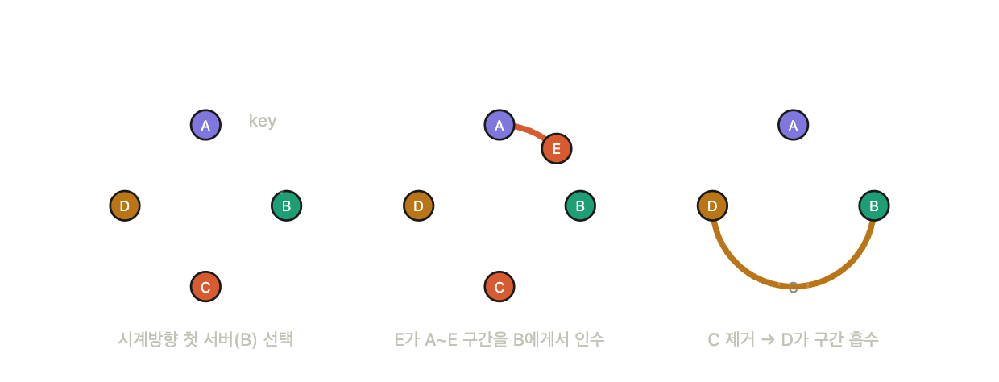
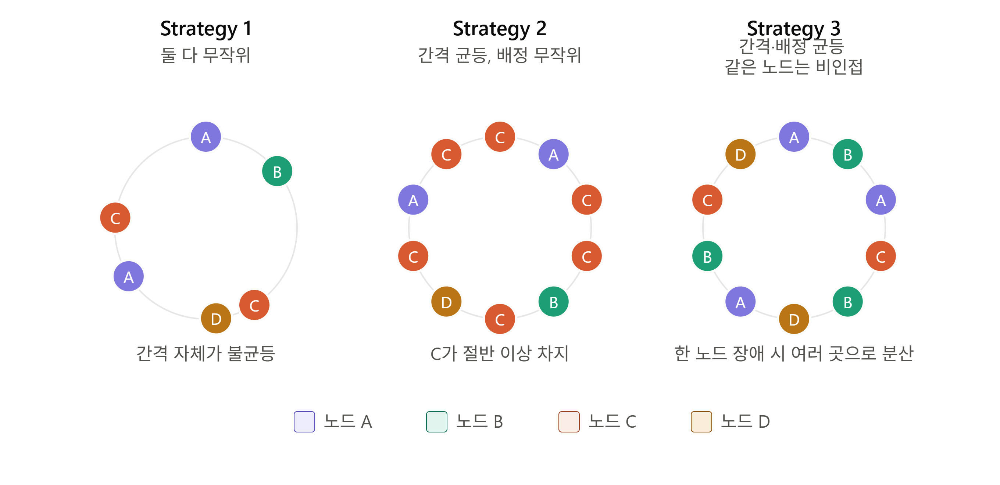

# 수평적 확장, 그리고 해시의 한계

시스템 설계를 진행하다 보면, 트래픽 증가에 대응하기 위한 수평적 확장은 빠질 수 없는 선택지가 된다.

수평적 확장에서 핵심은 **어떤 서버에 어떤 데이터를 저장할지** 결정하는 것인데, 일반적으로 해시 함수를 사용한다.

```java
serverIndex = hash(key) % N
```

문제는 서버가 추가되거나 삭제될 때 서버 수(N)가 바뀌면서, **기존 대부분의 키가 전혀 다른 서버를 가리키게 된다.** 즉 데이터가 있는 곳과 찾는 곳이 달라져 대규모 캐시 미스로 이어진다.

책에서는 이를 해결하기 위한 방법으로 안정 해시를 소개한다.

---

# 안정 해시 도입

일반 해시는 서버 수가 바뀌면 대부분의 키가 재배치되지만, 안정 해시는 키가 균등하게 분포되어 있다는 가정 하에 평균 k/n개만 재배치된다. (k: 키의 개수, n: 서버 수)

## 해시 공간

SHA-1 기준 해시 공간은 `0 ~ 2¹⁶⁰-1` 의 범위를 가진다.

!image.png

안정 해시는 이 공간의 양 끝을 이어붙여 링으로 만든다. x0과 xn이 같은 지점에서 만나게 된다.

!image.png

## 일반 해시와의 차이점

|  | 일반 해시 | 안정 해시 |
| --- | --- | --- |
`serverIndex` | hash(key) % N | 링에서 hash(key) 기준 시계 방향 첫 번째 서버 |
| **저장 공간** | 가변: 0 ~ N-1 | 고정: 0 ~ 2¹⁶⁰-1 |
| **서버 변경 시** | 저장 공간 전체 재정의 → 대부분 키 영향 | 저장 공간 고정 → 근처 키만 영향 |
| **재배치 키 수** | 대부분 | 평균 k/n개 (균등 분포 가정) |

## 서버 조회/추가/삭제


조회: 키가 생기면 시계방향으로 가장 가까운 서버(B)가 해당 키를 담당한다.

추가: 새 서버 E가 A와 B 사이에 추가되면, 원래 B가 담당하던 구간 중 A~E 부분을 E가 담당한다.

삭제: C가 없어지면, 시계방향 다음 서버인 D가 B~D 전체 구간을 담당한다.

## 두가지 부하 불균형 문제 발생

### 서버제거 시 파티션 급증

A 서버가 제거되면 해당 서버가 담당하던 공간을 시계 방향 다음 서버가 담당하게 된다. (순간적으로 두 배가 됨)

### 키의 균등 분포 어려움

서버가 링 위에 균등하게 배치된다는 보장이 없어, 서버마다 담당하는 키 개수가 크게 다를 수 있다.

→ 둘 다 부하 불균형이라는 공통적인 문제이지만, 전자는 서버 변경 이벤트 순간에 급격히 발생하고, 후자는 평소에도 존재하는 문제다.

---


# 가상노드를 통한 보완

가상노드(Virtual Node)는 서버 하나를 링 위에 여러 지점에 매핑하는 방식이다. 
예를 들어 서버 A가 실제로는 1개지만, A0, A1, A2, A3... 처럼 여러 개의 가상 노드로 나뉘어 링 곳곳에 흩뿌려진다.

실제 서버 3대 (A, B, C)
→ 가상노드 적용 시: A0, B0, C0, A1, B1, C1, A2, B2, C2 ... (링 위에 분산)

### 어떻게 두 가지 문제를 동시에 해결하는가?

1. **키의 균등 분포 어려움 해결**

가상노드가 많아질수록 통계적으로 각 서버가 담당하는 구간의 총합이 비슷해진다.
노드 수가 적을 때는 운에 따라 특정 서버가 넓은 구간을 차지할 수 있지만, 노드 수가 많아지면 평균으로 수렴한다.

2) **서버 제거 시 파티션 급증 완화**

실제 서버 하나가 빠져도, 그 서버에 속한 여러 개의 가상노드가 여러 개의 서로 다른 서버로 나뉘어 재배치된다.
즉 부하가 인접한 서버 하나에 몰리는 게 아니라 여러 서버에 고르게 분산된다.

| 항목 | 가상노드 적음 | 가상노드 많음 |
| --- | --- | --- |
| 부하 분산 | 불균등할 가능성 큼 | 균등해짐 |
| 메타데이터(노드 위치 정보) | 적음 | 많아짐 → 저장/조회 비용 증가 |
| 재배치 시 영향 범위 | 넓음(서버당) | 여러 서버로 잘게 분산 |

→ 가상노드 개수는 부하 균등성과 메타데이터 관리 비용 사이의 **트레이드오프로 결정**한다.


---

# 실무 적용 사례 — Amazon Dynamo(2007) 논문 참고
> 여기서 다루는 건 AWS의 매니지드 서비스 DynamoDB가 아니라, 2007년 아마존이 내부적으로 만든 분산 스토리지 시스템 Dynamo 논문 이다.


Dynamo 논문에서는 안정 해시 + 가상 노드를 사용하여 전략을 바꿔가며 문제를 해결한다.

### Strategy 1의 문제

노드 A가 가상노드 T개를 갖는다고 했을때, Strategy 1은 링 위 **무작위** 지점에 배치하는 가장 단순한 가상노드 적용 방식이다.
문제는 토큰 위치가 무작위이다 보니 담당 구간의 경계도 무작위라 새 노드가 합류하면, 그 노드의 토큰 근처를 담당하던 기존 노드들이 "이 범위에 해당하는 데이터가 뭔지" 알아내기 위해 **로컬 디스크를 통째로 스캔**해야 했다. 경계가 미리 정해진 파일 단위가 아니라 임의의 숫자라서, 인덱스만 보고 바로 찾을 수 없었기 때문이다.

- 트래픽이 몰리는 시즌엔, 새 노드 하나 준비시키는 데 거의 **하루**가 걸림
- 노드 추가/삭제마다 키 범위가 바뀌어 해당 범위의 **머클 트리를 처음부터 재계산**해야 함
- 담당 범위가 계속 무작위로 바뀌다 보니, **"지금 전체 데이터가 어디에 있는지" 한 번에 통째로 찍어둘 방법이 없음** → 백업 작업이 비효율적

→ 근본 원인: 노드를 어디에 둘지 정하는 것(배치)과, 그 결과로 구간이 어떻게 나뉠지(파티셔닝)가 분리되지 않았다.

### Strategy 2의 문제

Strategy 1의 근본 원인을 풀기 위해, 해시 공간을 미리 **Q개의 균등한 파티션**으로 고정해두고, 노드에게는 그중 일부를 무작위로 배정하는 방식으로 바꿨다. (파티셔닝과 배치를 분리)
이 덕분에 파티션을 **파일 단위**로 저장할 수 있게 되어, 스캔 없이 파일 전송만으로 재배치가 가능해졌다 — Strategy 1의 스캔 문제는 해결.
하지만 **"어떤 파티션을 누가 가질지"는 여전히 무작위**였다. 그 결과:

- 특정 노드가 여러 파티션을 몰아 받는 **쏠림 현상** 발생 가능

→ 파티션 "크기"는 균등해졌지만, "개수 배정"에 대한 규칙이 없었던 게 한계.

### Strategy 3 — 최종 채택

Strategy 2에 아래 조건을 추가했다.
노드 수가 S일 때, 모든 노드가 정확히 **Q/S개씩** 파티션을 담당하도록 강제한다.

결과:

- 부하가 가장 균등해짐 (Strategy 1/2/3 중 로드밸런싱 효율 1위)
- 각 노드가 유지해야 할 정보가 Strategy 1 대비 **1000배 감소**

## 참고 자료

- [Amazon Dynamo 논문 원문 (Cornell CS5414)](https://www.cs.cornell.edu/courses/cs5414/2017fa/papers/dynamo.pdf)
- [Amazon's Dynamo를 읽고 나서 - 2. Consistent Hashing / Virtual Nodes (binaryflavor.com)](https://binaryflavor.com/amazons-dynamo%EB%A5%BC-%EC%9D%BD%EA%B3%A0-%EB%82%98%EC%84%9C-2.-consistent-hashing-/-virtual-nodes/)
