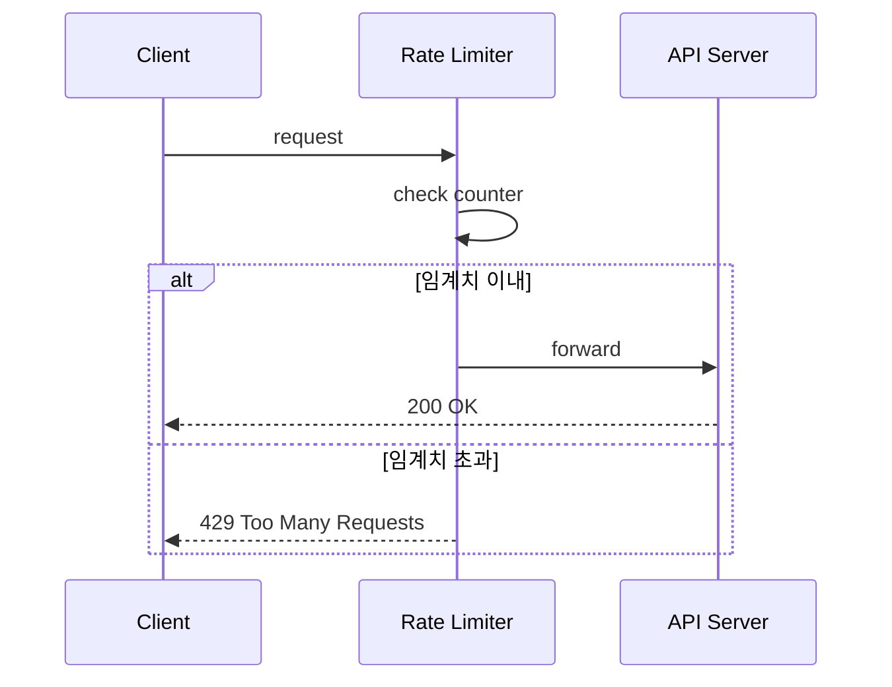
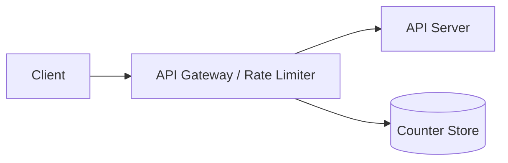

# [4장] 처리율 제한 장치 설계 — 1차 설계안 (Week 1)

> 책 해설(2단계 이후)을 보기 전에, 문제와 요구사항만 보고 직접 설계한다.
> 목적은 완성도가 아니라 **"왜 이렇게 설계했는지 설명할 수 있는 상태"**.
>
> - 작성자:
> - 작성일:
> - 참고: `4장_처리율_제한_장치의_설계.md` (문제 + 요구사항)

---

## 1. 요구사항 정리

> 4장 요구사항을 내 말로 다시 해석해본다. 무엇을 중요하게 봤는지 표시.

### 기능 요구사항
- [ ] 설정된 처리율을 초과하는 요청은 정확히 제한한다.
- [ ] 요청이 제한되면 사용자에게 명확히 알린다(예: HTTP 429).
- [ ]

### 비기능 요구사항
- [ ] 낮은 응답시간 (HTTP 응답에 영향 최소화)
- [ ] 적은 메모리 사용
- [ ] 분산 환경 지원 (여러 서버/프로세스가 제한 상태 공유)
- [ ] 높은 결함 감내성 (제한 장치 장애가 전체 시스템에 전파되지 않음)

### 내가 추가로 정한 가정 / 범위
> 예: 제한 기준(IP / userId / API Key), 제한 단위(초당/분당), 독립 서비스 vs 코드 내장 등

-

---

## 2. 핵심 API / 기능 흐름

> 요청이 들어와서 통과/차단되기까지의 흐름.

### 처리 흐름
1.
2.
3.

### 제한 정책
- 제한 대상(누구를?):
- 제한 기준(무엇을?):
- 초과 시 동작(어떻게?): 429 / 큐잉 / 지연 / 차단

---

## 3. 데이터 저장 구조

> 카운터/상태를 어디에, 어떤 형태로 저장할지. (예: Redis key 설계, TTL)

- 저장소 선택:
- 키 설계(예: `rate:{userId}:{window}`):
- 값/만료(TTL):

---

## 4. 전체 아키텍처

> 처리율 제한 장치를 어디에 둘 것인가? (클라이언트 / 서버 / 미들웨어·API 게이트웨이)

- 배치 위치:
- 선택 이유:

---

## 5. 병목 / 장애 가능 지점

> 트래픽이 10배 늘면? 분산 환경에서 깨지는 부분은? 단일 장애 지점은?

- 병목 지점:
- 단일 장애 지점(SPOF):
- 동시성 문제(동시 요청 카운팅 정확성):

---

## 6. 이 구조를 선택한 이유

> 다른 대안과 비교했을 때 왜 이 구조인가.

-

---

## 7. 고민한 트레이드오프

> 무엇을 얻고 무엇을 포기했는가.

| 선택 | 장점 | 포기/한계 |
| --- | --- | --- |
|  |  |  |

- 예) 제한 장치 장애 시 **fail-open**(통과) vs **fail-close**(차단) — 선택과 이유:

---

## (선택) 모의면접 대비 — 예상 질문 메모

> 리뷰 때 받을 만한 질문에 미리 답을 준비해둔다.

- 트래픽이 늘면 어디가 먼저 병목이 될까?
- Redis 장애가 나면 제한 정책은 어떻게 동작하나?
- 분산 환경에서 카운트 정합성은 어떻게 보장하나?
- 이 구조의 단일 장애 지점은?
