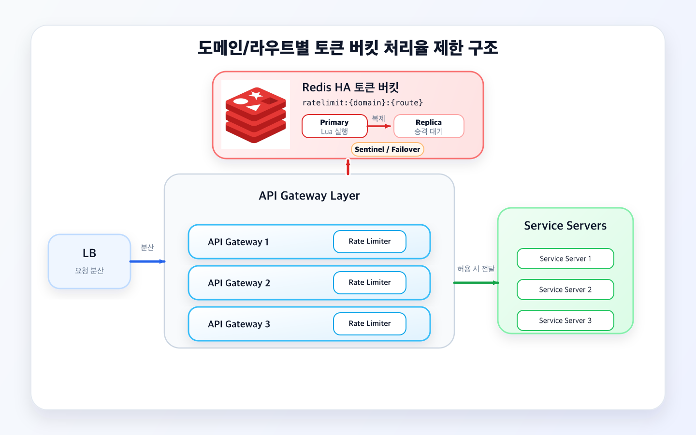
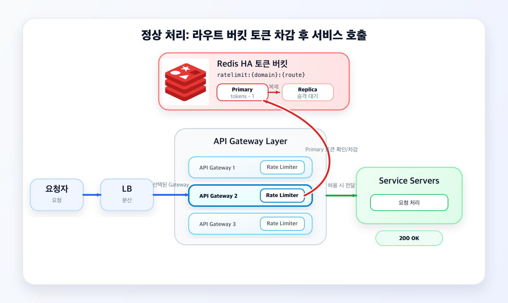
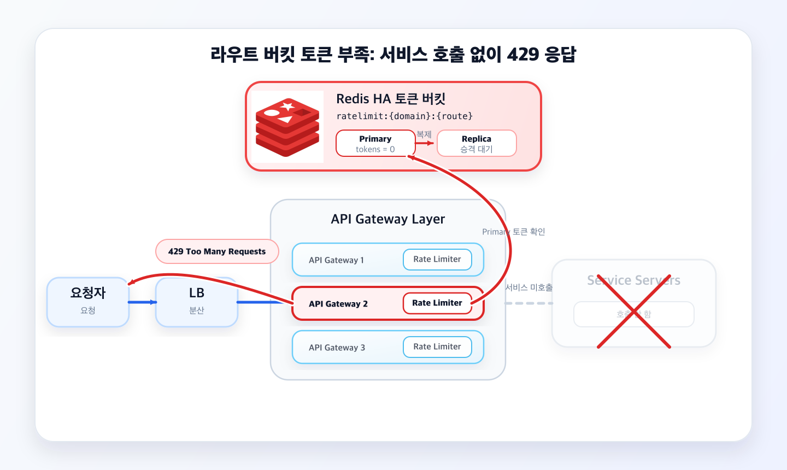

# chapter04-week2-design
## 처리율 제한 장치 설계

### 요구사항
- 설정된 처리율 초과 요청 정확히 제한
- 낮은 응답시간 (이 장치가 http 응답시간 영향주면 안됨)
- 가능한 적은 메모리 사용
- 분산형 처리율 제한 (하나 장치로 여러 분산된 서버나 프로세스에서 공유 가능해야한다)
- 요청 제한 시 사용자에게 분명히 제한되었음을 알려줘야함
- 높은 결함 감내성 (제한장치 장애 발생해도 전체 시스템 영향 주면 안된다)

### 설계 요약
- 제한 단위: 기본은 도메인/라우트 단위
- 비용이 큰 일부 URI 패턴은 별도 버킷으로 분리
- URI 전용 정책에 매칭되면 해당 URI 버킷 토큰을 차감하고, 매칭되지 않으면 기본 라우트 버킷 토큰을 차감
- Redis 구성: Primary/Replica + Sentinel/Managed Failover
- 토큰 차감 Lua Script는 Primary에서 실행하고 Replica는 복제/승격 대기

##### 설정값
- 기본 라우트 버킷의 최대 토큰 수
- 기본 라우트 버킷의 주기당 생성할 토큰 수
- 별도 관리할 URI 패턴 목록
- URI 패턴별 최대 토큰 수 / 주기당 생성할 토큰 수

#### 구조 초안


##### 정상 처리


##### 토큰 부족 응답 (429)


> 처리율 제한 초과는 `409 Conflict`가 아니라 `429 Too Many Requests`로 응답한다.
> 현재 설계는 클라이언트별 버킷이 아니라 도메인/라우트별 버킷을 사용한다. 모든 클라이언트 요청이 같은 라우트 버킷을 공유한다.

#### 제한 키 선택 규칙
요청 URI를 그대로 키로 쓰지 않고, 라우팅 결과로 나온 정규화된 패턴을 사용한다.

예를 들어 `/orders/123`, `/orders/456`은 서로 다른 키가 아니라 `/orders/{orderId}` 같은 하나의 패턴으로 묶는다.

1. API Gateway가 요청을 라우트 패턴으로 정규화한다.
2. 정규화된 URI 패턴이 별도 제한 정책에 있으면 URI 전용 버킷 키를 사용한다.
3. 별도 제한 정책에 없으면 기본 라우트 버킷 키를 사용한다.
4. 선택된 버킷 키를 Redis Lua Script에 넘겨 토큰을 확인/차감한다.

``` text
GET /reports/{reportId}/export  -> ratelimit:uri:api.example.com:GET:/reports/{reportId}/export
GET /orders/{orderId}           -> ratelimit:route:api.example.com:GET:/orders/{orderId}
```

Redis에 키가 존재하는지로 URI 전용 버킷 여부를 판단하지 않는다. 첫 요청이거나 TTL 만료로 키가 없을 수도 있기 때문에, 별도 관리 대상 여부는 정책 설정에서 판단하고 Redis 키는 없으면 초기화한다.

``` lua
-- KEYS[1]: 선택된 버킷 키 이름 (예: "ratelimit:uri:api.example.com:GET:/reports/{reportId}/export")
-- ARGV[1]: 버킷의 최대 토큰 용량 (Max Capacity)
-- ARGV[2]: 초당 토큰 충전 속도 (Refill Rate per second)
-- ARGV[3]: 현재 요청에서 소비할 토큰 수 (보통 1)
-- ARGV[4]: 현재 시간 (Unix Timestamp, 초 단위)

local key = KEYS[1]
local capacity = tonumber(ARGV[1])
local refill_rate = tonumber(ARGV[2])
local requested = tonumber(ARGV[3])
local now = tonumber(ARGV[4])

-- 레디스에서 기존 버킷 데이터 가져오기
local data = redis.call('HMGET', key, 'tokens', 'last_updated')
local tokens = tonumber(data[1])
local last_updated = tonumber(data[2])

-- 기존 데이터가 없으면 초기화
if not tokens then
    tokens = capacity
    last_updated = now
else
    -- 경과 시간 계산 및 토큰 충전
    local elapsed = now - last_updated
    if elapsed > 0 then
        tokens = math.min(capacity, tokens + (elapsed * refill_rate))
        last_updated = now
    end
end

-- 토큰이 충분한지 확인
if tokens >= requested then
    tokens = tokens - requested
    -- 업데이트된 상태 저장 및 만료 시간 설정 (예: 1시간)
    redis.call('HMSET', key, 'tokens', tokens, 'last_updated', last_updated)
    redis.call('EXPIRE', key, 3600)
    return 1 -- 요청 승인 (Allowed)
else
    -- 토큰이 부족하면 저장만 업데이트하고 거절
    redis.call('HMSET', key, 'tokens', tokens, 'last_updated', last_updated)
    return 0 -- 요청 거절 (Rate Limited)
end

```

#### Redis 토큰 버킷 구조도

